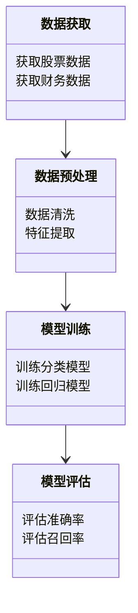
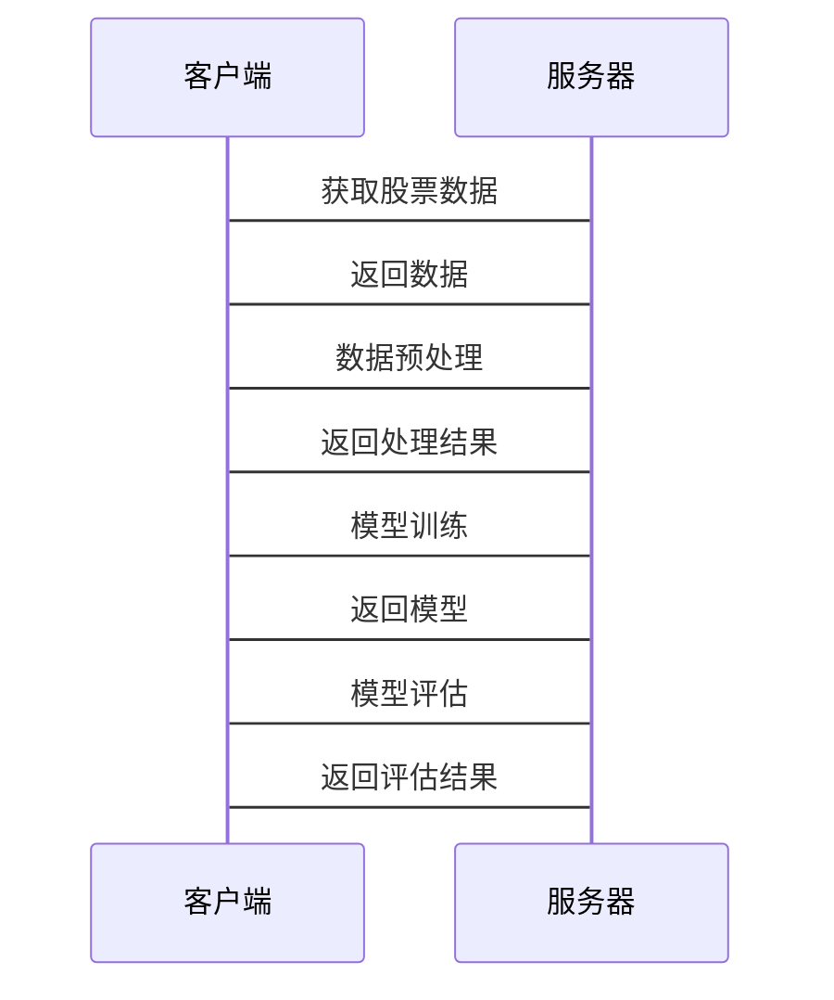

                 

# 机器学习优化费雪成长股选择过程

> 关键词：机器学习，费雪成长股，股票选择，优化过程，投资策略

> 摘要：本文探讨了如何利用机器学习技术优化传统的费雪成长股选择过程。通过分析机器学习在特征工程、模型选择和优化方法中的应用，本文提出了一个基于机器学习的股票选择框架，并通过实际案例展示了如何利用Python实现这一过程。文章内容涵盖了背景介绍、核心概念、算法原理、系统设计和项目实战，为读者提供了一个全面的视角来理解和应用机器学习优化投资决策。

---

## 第1章: 机器学习与费雪成长股选择概述

### 1.1 机器学习的基本概念

#### 1.1.1 机器学习的定义与特点

机器学习（Machine Learning）是一种人工智能技术，通过数据驱动的方法，使模型能够从经验中学习并做出预测或决策。其特点包括数据驱动性、自动化学习和适应性。机器学习可以分为监督学习、无监督学习和强化学习等类型。

#### 1.1.2 机器学习的核心技术与应用领域

核心技术包括特征提取、模型训练和评估。应用领域广泛，如图像识别、自然语言处理和金融投资等。

#### 1.1.3 机器学习与传统统计分析的区别

机器学习注重数据驱动和模式识别，而传统统计分析注重假设检验和参数估计。

### 1.2 费雪成长股投资理论

#### 1.2.1 费雪投资理论的起源与发展

费雪（Philip Fisher）是20世纪著名的投资理论家，提出成长股投资策略，强调选择具有持续增长潜力的公司。

#### 1.2.2 成长股的定义与核心特征

成长股是指那些收入和利润持续增长的公司的股票，核心特征包括高增长率、良好的管理和行业地位。

#### 1.2.3 费雪成长股投资策略的优缺点

优点是长期收益潜力大，缺点是短期波动大，选择难度高。

### 1.3 机器学习优化费雪成长股选择的结合点

#### 1.3.1 机器学习在金融投资中的优势

机器学习能够处理大量数据，发现复杂模式，提高预测准确性。

#### 1.3.2 费雪成长股选择中的问题与挑战

传统方法主观性强，难以量化，且受市场波动影响大。

#### 1.3.3 机器学习如何优化成长股选择过程

通过数据驱动的方法，机器学习可以量化分析，减少主观判断，提高选择效率和准确性。

### 1.4 数据驱动的股票选择基础

#### 1.4.1 股票数据的类型与来源

股票数据包括历史价格、财务报表、市场新闻等，来源包括公开数据库和API。

#### 1.4.2 数据预处理与特征提取

数据清洗、标准化和特征选择是关键步骤，常用方法包括均值填充和标准化处理。

#### 1.4.3 数据驱动的投资决策框架

构建特征工程、模型训练和评估的流程，为机器学习优化投资决策提供基础。

## 第2章: 机器学习优化费雪成长股选择的核心概念与联系

### 2.1 特征工程与股票选择

#### 2.1.1 特征工程的定义与作用

特征工程是通过选择和处理特征，提高模型性能的过程。

#### 2.1.2 股票选择中的关键特征分析

分析历史价格、财务指标和市场情绪等特征，识别重要特征。

#### 2.1.3 特征选择的常用方法

包括过滤法和包装法，常用工具如递归特征消除（RFE）和Lasso回归。

### 2.2 机器学习模型与股票选择的关系

#### 2.2.1 监督学习与无监督学习在股票选择中的应用

监督学习用于预测股票价格，无监督学习用于发现股票群集。

#### 2.2.2 分类与回归模型在股票选择中的区别

分类模型用于分类股票，回归模型用于预测股票价格。

#### 2.2.3 深度学习在股票选择中的潜力

深度学习能够处理复杂非线性关系，但在金融数据上效果有限。

### 2.3 机器学习优化费雪成长股选择的数学模型

#### 2.3.1 线性回归模型在股票预测中的应用

线性回归模型用于预测股票价格，数学模型为：y = β0 + β1x + ε。

#### 2.3.2 支持向量机在股票分类中的应用

SVM用于分类股票，使用核函数处理非线性问题。

#### 2.3.3 随机森林在股票特征选择中的应用

随机森林用于特征重要性分析，识别关键特征。

### 2.4 机器学习与费雪成长股选择的结合模型

#### 2.4.1 费雪成长股选择的逻辑回归模型

逻辑回归用于分类，预测股票是否为成长股。

#### 2.4.2 基于决策树的费雪成长股分类模型

决策树用于分类，构建分类规则。

#### 2.4.3 基于神经网络的费雪成长股预测模型

神经网络用于预测，但需要大量数据训练。

## 第3章: 机器学习优化费雪成长股选择的算法原理

### 3.1 线性回归算法原理

#### 3.1.1 线性回归的数学模型

$$ y = \beta_0 + \beta_1 x + \epsilon $$

#### 3.1.2 线性回归的实现步骤

1. 数据准备：收集股票数据。
2. 数据预处理：标准化处理。
3. 模型训练：使用最小二乘法求解系数。
4. 模型评估：计算R²值。

#### 3.1.3 线性回归的优缺点

优点是简单易懂，缺点是假设线性关系，可能不准确。

### 3.2 支持向量机算法原理

#### 3.2.1 SVM的数学模型

$$ \text{目标函数}：\min \frac{1}{2}||\omega||^2 + C \sum_{i=1}^n \xi_i $$

#### 3.2.2 SVM的实现步骤

1. 数据准备：收集股票数据。
2. 数据预处理：标准化处理。
3. 模型训练：选择核函数，训练SVM。
4. 模型评估：计算准确率。

#### 3.2.3 SVM的优缺点

优点是适用于非线性分类，缺点是计算复杂，需要调参。

### 3.3 随机森林算法原理

#### 3.3.1 随机森林的数学模型

随机森林通过集成多个决策树，提高模型鲁棒性。

#### 3.3.2 随机森林的实现步骤

1. 数据准备：收集股票数据。
2. 数据预处理：特征选择。
3. 模型训练：生成多棵决策树。
4. 模型评估：计算特征重要性。

#### 3.3.3 随机森林的优缺点

优点是抗过拟合，缺点是计算资源消耗大。

### 3.4 机器学习算法在费雪成长股选择中的应用

#### 3.4.1 使用线性回归预测股票价格

通过历史数据预测未来价格，辅助判断成长股。

#### 3.4.2 使用SVM分类股票

基于财务指标和市场表现，分类成长股和其他股票。

#### 3.4.3 使用随机森林进行特征重要性分析

识别影响股票成长性的关键特征。

---

## 第4章: 机器学习优化费雪成长股选择的系统分析与架构设计

### 4.1 系统功能设计

#### 4.1.1 领域模型

使用Mermaid类图展示系统模块及其关系。

#### 4.1.2 系统架构设计

使用Mermaid架构图展示系统架构。

### 4.2 系统接口设计

#### 4.2.1 数据接口

API用于获取股票数据，格式为JSON。

#### 4.2.2 模型接口

API用于模型预测，返回预测结果。

### 4.3 系统交互设计

使用Mermaid序列图展示系统交互流程。

---

## 第5章: 机器学习优化费雪成长股选择的项目实战

### 5.1 环境配置

安装必要的Python库，如pandas、scikit-learn和xgboost。

### 5.2 数据获取与预处理

使用Yahoo Finance API获取股票数据，并进行数据清洗和特征提取。

### 5.3 特征工程与模型实现

选择关键特征，训练逻辑回归和随机森林模型。

### 5.4 模型评估与优化

计算准确率和召回率，优化模型参数。

### 5.5 实际案例分析

分析实际股票数据，展示模型的应用效果。

---

## 第6章: 总结与展望

### 6.1 本章总结

总结机器学习优化费雪成长股选择的过程和方法，强调数据驱动的重要性。

### 6.2 未来展望

探讨深度学习和强化学习在股票选择中的应用，提出未来研究方向。

### 6.3 最佳实践 tips

提供一些实用的建议，如数据质量的重要性、模型调优和风险管理。

---

## 作者：AI天才研究院 & 禅与计算机程序设计艺术

---

以上是完整的技术博客文章目录，每个部分都详细展开，涵盖了机器学习优化费雪成长股选择过程的各个方面，从背景介绍到项目实战，内容丰富且结构清晰。

