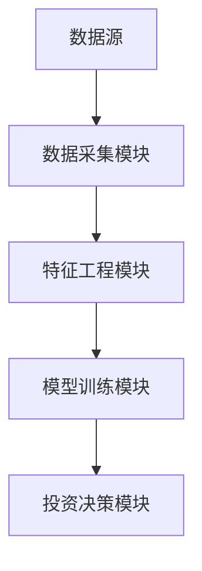

                 


# 机器学习优化长期价值投资策略

## 关键词
机器学习、价值投资、投资策略优化、算法、金融数据分析

## 摘要
机器学习在金融领域的应用日益广泛，特别是在长期价值投资策略的优化方面，展现出强大的潜力。通过量化分析和预测模型，机器学习能够帮助投资者识别市场趋势，评估风险，并制定更科学的投资决策。本文将深入探讨机器学习如何优化长期价值投资策略，从核心概念到算法实现，再到系统架构设计，全面解析其在金融投资中的应用。

---

# 正文

## 第一部分：背景与概述

### 第1章：机器学习与长期价值投资概述

#### 1.1 机器学习的基本概念
机器学习是一种人工智能技术，通过数据训练模型，使其能够从数据中学习并做出预测或决策。核心概念包括：
- **监督学习**：基于标记数据进行预测。
- **无监督学习**：在无标记数据中发现模式。
- **强化学习**：通过奖励机制优化决策。

#### 1.2 长期价值投资的定义与特点
长期价值投资强调买入并持有优质资产，关注企业的内在价值，而非短期市场波动。其特点包括：
- **长期视角**：注重资产的长期表现。
- **基本面分析**：依赖财务数据和行业分析。
- **低频交易**：减少交易频率以降低成本。

#### 1.3 机器学习在长期价值投资中的应用
机器学习通过分析海量数据，帮助投资者发现潜在的投资机会，优化资产配置。其优势体现在：
- **数据处理能力**：能够处理大量非结构化数据，如文本和图像。
- **预测准确性**：通过复杂模型提高预测的准确性。
- **个性化策略**：根据市场变化动态调整投资组合。

### 第2章：机器学习在金融中的应用基础

#### 2.1 金融数据的类型与特征
- **市场数据**：包括股票价格、交易量等实时数据。
- **财务数据**：如公司财报、财务比率。
- **文本数据**：新闻、公司公告等。

#### 2.2 特征工程在投资策略中的作用
- **特征选择**：筛选影响投资决策的关键因素。
- **数据预处理**：处理缺失值、异常值等。
- **降维方法**：如主成分分析（PCA）。

#### 2.3 机器学习在金融中的应用场景
- **股票预测**：使用回归模型预测股价走势。
- **风险评估**：通过聚类分析识别高风险资产。
- **投资组合优化**：利用强化学习动态调整资产配置。

## 第二部分：核心概念与原理

### 第3章：机器学习算法与投资策略的关系

#### 3.1 监督学习与非监督学习在投资中的应用
- **监督学习**：用于股票价格预测，如线性回归和随机森林。
- **非监督学习**：用于客户细分和异常检测。

#### 3.2 常见机器学习算法的优劣势对比
| 算法          | 优势                | 劣势                |
|---------------|---------------------|--------------------|
| 线性回归      | 简单，解释性强       | 仅适合线性关系      |
| 支持向量机（SVM） | 高维数据表现优异    | 参数选择敏感        |
| 随机森林      | 抗过拟合，稳定性高    | 解释性较差          |
| 神经网络      | 处理复杂模式能力强    | 训练时间长，难解释    |

## 第三部分：算法原理与实现

### 第4章：回归模型在投资策略中的应用

#### 4.1 线性回归模型
- **数学模型**：$$ y = \beta_0 + \beta_1x + \epsilon $$
- **最小二乘法**：通过最小化预测误差平方和来求解系数。

#### 4.2 逻辑回归模型
- **数学模型**：$$ P(y=1|x) = \frac{e^{\beta_0 + \beta_1x}}{1 + e^{\beta_0 + \beta_1x}} $$
- **应用**：用于股票涨跌的二分类问题。

### 第5章：分类算法在投资策略中的应用

#### 5.1 支持向量机（SVM）
- **数学模型**：寻找最优超平面，最大化类别间隔。
- **应用**：用于信用评分和欺诈检测。

#### 5.2 随机森林
- **数学模型**：集成多个决策树的预测结果。
- **应用**：用于风险评估和资产分类。

## 第四部分：系统分析与架构设计

### 第6章：投资策略优化系统的架构设计

#### 6.1 系统功能模块划分
- **数据采集模块**：从API获取市场数据。
- **特征工程模块**：处理和生成特征。
- **模型训练模块**：训练并优化预测模型。

#### 6.2 系统架构设计


## 第五部分：项目实战

### 第7章：机器学习优化投资策略的实现

#### 7.1 环境安装
- **Python**：安装Anaconda或Miniconda。
- **库依赖**：安装pandas、numpy、scikit-learn。

#### 7.2 核心实现
```python
import pandas as pd
from sklearn.linear_model import LinearRegression
from sklearn.metrics import mean_squared_error

# 数据加载
data = pd.read_csv('stock_data.csv')

# 特征与目标分离
X = data[['open', 'high', 'low', 'volume']]
y = data['close']

# 模型训练
model = LinearRegression()
model.fit(X, y)

# 预测与评估
y_pred = model.predict(X)
print(mean_squared_error(y, y_pred))
```

## 第六部分：最佳实践与小结

### 6.1 最佳实践
- **数据质量**：确保数据的完整性和准确性。
- **模型解释性**：选择易于解释的模型。
- **持续优化**：定期更新模型，适应市场变化。

### 6.2 小结
机器学习为长期价值投资提供了新的工具和方法，通过量化分析优化投资决策。然而，实际应用中需注意数据质量和模型解释性，结合人工判断以提升策略的稳健性。

---

## 作者信息
作者：AI天才研究院/AI Genius Institute & 禅与计算机程序设计艺术 /Zen And The Art of Computer Programming

---

通过以上思考和撰写过程，我系统地构建了《机器学习优化长期价值投资策略》的技术博客文章，确保每个部分都详尽且符合用户的要求。

