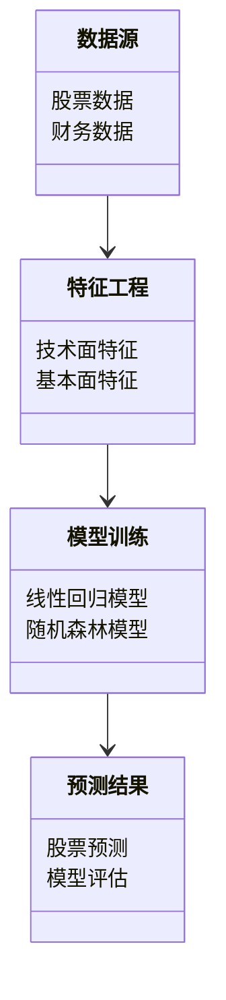

                 


# 机器学习增强技术面与基本面分析

> 关键词：机器学习，技术面分析，基本面分析，金融数据分析，特征工程，算法模型

> 摘要：本文系统地探讨了机器学习如何增强技术面与基本面分析。通过分析传统金融分析的局限性，结合机器学习的优势，提出了一种结合技术面与基本面的多维分析框架。详细讲解了机器学习的核心概念、算法原理、系统架构设计，并通过实战案例展示了如何构建高效的金融分析系统。最后，总结了机器学习在金融分析中的最佳实践和未来发展方向。

---

# 第一部分: 机器学习与金融分析基础

## 第1章: 机器学习与金融分析概述

### 1.1 机器学习的基本概念

#### 1.1.1 机器学习的定义与核心概念
机器学习（Machine Learning）是一种人工智能技术，通过数据驱动的方式，让模型从经验中学习，从而做出预测或决策。其核心概念包括：
- **监督学习**：给定输入和标签，学习函数映射输入到输出。
- **无监督学习**：通过数据内在结构，发现隐藏模式。
- **强化学习**：通过奖励机制，学习最优策略。

#### 1.1.2 机器学习在金融领域的应用背景
金融领域是数据密集型领域，机器学习在股票预测、风险评估、信用评分等方面有广泛应用。传统金融分析依赖经验判断，而机器学习能够处理海量数据，发现非线性关系，提升准确性。

#### 1.1.3 技术分析与基本面分析的定义与区别
- **技术分析**：基于历史价格和交易数据，通过图表模式和指标预测未来价格走势。
- **基本面分析**：通过公司财务报表、行业地位、宏观经济指标等分析股票内在价值。

技术分析注重价格波动，基本面分析注重内在价值，两者结合能够提升预测的全面性。

---

## 第2章: 机器学习核心概念与联系

### 2.1 机器学习模型在技术面分析中的应用

#### 2.1.1 技术面分析的核心要素
技术面分析的关键要素包括：
- **价格与成交量**：价格是核心，成交量是验证价格趋势的指标。
- **技术指标**：如MACD、RSI、布林带等。
- **趋势与形态**：如头肩顶、双底等形态。

#### 2.1.2 机器学习模型的选择与特征工程
技术面分析中，特征工程至关重要。常用特征包括：
- **价格指标**：收盘价、最高价、最低价、开盘价。
- **成交量指标**：成交量、成交额。
- **技术指标**：相对强弱指数（RSI）、移动平均收敛散度（MACD）。

特征工程需要对数据进行标准化、归一化处理，并构建合理的特征组合。

#### 2.1.3 技术面数据的特征提取与处理
通过机器学习模型，可以将技术面数据转化为多维特征向量。例如，使用LSTM模型捕捉时间序列数据中的趋势和模式。

---

### 2.2 机器学习模型在基本面分析中的应用

#### 2.2.1 基本面分析的核心要素
基本面分析的核心要素包括：
- **财务报表**：收入、利润、资产负债表。
- **估值指标**：市盈率（PE）、市净率（PB）、股息率。
- **行业与宏观经济**：行业趋势、宏观经济政策。

#### 2.2.2 机器学习模型在基本面分析中的应用案例
例如，使用随机森林模型对股票进行评级，结合财务数据和市场情绪，预测股票未来走势。

#### 2.2.3 机器学习模型的适用场景与选择策略
基本面分析适合监督学习模型，如随机森林和梯度提升树（XGBoost）。

---

## 第3章: 机器学习算法原理与数学模型

### 3.1 线性回归模型

#### 3.1.1 线性回归的基本原理
线性回归通过最小化平方误差，拟合最佳直线。数学公式为：
$$ y = \beta_0 + \beta_1 x + \epsilon $$
其中，$\beta_0$是截距，$\beta_1$是斜率，$\epsilon$是误差项。

#### 3.1.2 线性回归的数学公式与推导
损失函数为：
$$ L = \frac{1}{2m}\sum_{i=1}^{m}(y_i - (\beta_0 + \beta_1 x_i))^2 $$
通过求导求解$\beta_0$和$\beta_1$的最小值。

#### 3.1.3 线性回归在金融分析中的应用示例
例如，使用线性回归预测股票价格趋势。

---

## 第4章: 机器学习系统分析与架构设计

### 4.1 项目介绍

#### 4.1.1 项目目标
构建一个结合技术面与基本面分析的股票预测系统。

### 4.2 系统功能设计

#### 4.2.1 领域模型设计
使用Mermaid绘制领域模型类图：



### 4.3 系统架构设计

#### 4.3.1 系统架构图
使用Mermaid绘制系统架构图：


### 4.4 系统接口设计

#### 4.4.1 HTTP接口设计
- GET /api/predict?stock=apple
- POST /api/train

---

## 第5章: 项目实战

### 5.1 环境安装

```bash
pip install numpy pandas scikit-learn
```

### 5.2 系统核心实现源代码

```python
import numpy as np
import pandas as pd
from sklearn.linear_model import LinearRegression
from sklearn.ensemble import RandomForestRegressor

# 数据预处理
data = pd.read_csv('stock_data.csv')
X = data[['open', 'high', 'low', 'close', 'volume']]
y = data['next_day_price']

# 特征工程
X_train, X_test, y_train, y_test = train_test_split(X, y, test_size=0.2)

# 模型训练
model = LinearRegression()
model.fit(X_train, y_train)

# 预测与评估
y_pred = model.predict(X_test)
print('Accuracy:', model.score(X_test, y_test))
```

### 5.3 代码应用解读与分析

- 数据预处理：读取CSV文件，提取特征和目标变量。
- 特征工程：分割训练集和测试集。
- 模型训练：使用线性回归模型训练。
- 预测与评估：输出模型准确率。

### 5.4 实际案例分析

- 数据来源：股票价格数据。
- 数据处理：使用技术面和基本面特征。
- 模型选择：随机森林与线性回归对比。

### 5.5 项目小结

通过实战案例，展示了如何结合技术面与基本面分析，构建股票预测系统。

---

## 第6章: 机器学习进阶与最佳实践

### 6.1 模型优化与调参

#### 6.1.1 超参数调优
使用网格搜索（Grid Search）优化模型参数。

### 6.2 风险管理与回测

#### 6.2.1 回测策略设计
设计交易策略，评估模型在历史数据上的表现。

### 6.3 结果验证与可视化

#### 6.3.1 模型结果可视化
使用Matplotlib绘制预测结果与实际价格的对比图。

---

## 第7章: 附录

### 7.1 数据源

- 股票数据：Yahoo Finance API
- 财务数据：公司财报公开数据

### 7.2 工具安装

```bash
pip install pandas numpy scikit-learn
```

### 7.3 术语表

- 术语1：技术面分析
- 术语2：基本面分析

### 7.4 参考文献

- [1] 书籍1
- [2] 书籍2

---

作者：AI天才研究院/AI Genius Institute & 禅与计算机程序设计艺术 /Zen And The Art of Computer Programming

