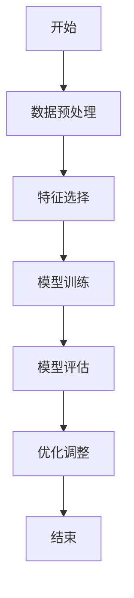
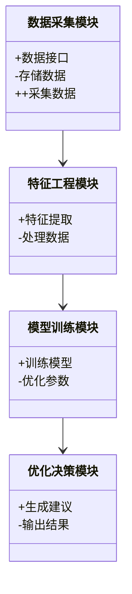
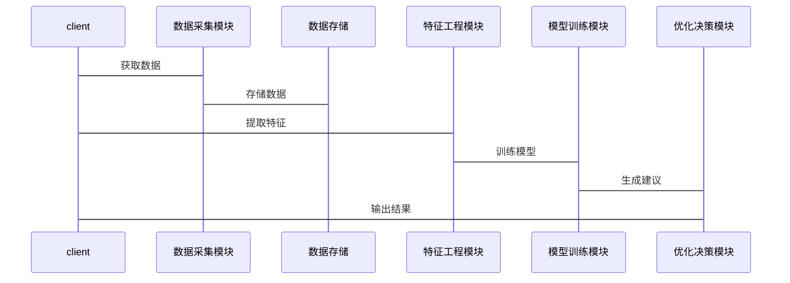

                 


---

# 机器学习算法优化投资组合管理

**关键词**：投资组合管理、机器学习算法、金融优化、资产配置、风险管理

**摘要**：  
本文探讨了如何利用机器学习算法优化投资组合管理。通过分析机器学习的核心概念和投资组合优化的基本原理，本文详细介绍了几种常用的机器学习算法及其在投资组合管理中的应用。结合数学模型和实际案例，本文进一步阐述了如何通过系统设计和项目实战来实现投资组合优化，并提供了最佳实践和未来研究方向的建议。

---

## 第1章: 机器学习算法与投资组合管理概述

### 1.1 机器学习算法的基本概念
#### 1.1.1 机器学习的定义与核心概念
机器学习是一种人工智能技术，通过数据训练模型，使其能够从经验中学习并进行预测或决策。核心概念包括监督学习、无监督学习、特征工程和模型评估。

#### 1.1.2 投资组合管理的基本原理
投资组合管理是指通过合理配置资产以实现收益最大化和风险最小化的管理过程。其核心包括资产配置、风险管理和绩效评估。

#### 1.1.3 机器学习与投资组合管理的结合
机器学习通过分析历史数据，识别市场模式，帮助优化投资组合配置，提高收益-风险比。

### 1.2 机器学习在金融领域的应用背景
#### 1.2.1 传统投资组合管理的局限性
传统方法依赖于历史数据和假设，难以应对复杂市场环境。

#### 1.2.2 机器学习在金融中的优势
机器学习能够处理大量非结构化数据，发现复杂模式，提供实时决策支持。

#### 1.2.3 投资组合优化的数学模型
投资组合优化的目标函数通常涉及收益最大化和风险最小化，常用均值-方差模型。

### 1.3 机器学习算法优化投资组合管理的目标
#### 1.3.1 提高投资组合的收益-风险比
通过算法优化资产配置，提升整体收益。

#### 1.3.2 降低投资组合的波动性
通过风险预测和管理，减少收益波动。

#### 1.3.3 实现个性化投资策略
根据投资者需求定制化投资方案。

### 1.4 本章小结
本章介绍了机器学习与投资组合管理的基本概念和结合方式，为后续分析奠定了基础。

---

## 第2章: 机器学习算法与投资组合优化的核心概念

### 2.1 机器学习算法的原理
#### 2.1.1 监督学习与无监督学习的对比
监督学习基于标记数据，无监督学习处理未标记数据。

#### 2.1.2 算法的特征与目标函数
特征工程和目标函数直接影响模型性能。

#### 2.1.3 算法的训练与测试过程
包括数据预处理、模型训练和评估。

### 2.2 投资组合优化的基本原理
#### 2.2.1 投资组合的收益与风险模型
均值-方差模型和现代投资组合理论是基础。

#### 2.2.2 现金流与资产配置的关系
现金流预测影响资产配置决策。

#### 2.2.3 约束条件与优化目标
优化目标通常包括收益最大化和风险最小化，约束条件如资产权重限制。

### 2.3 核心概念的联系与对比
#### 2.3.1 机器学习算法与投资组合优化的对比表格

| 特征                | 机器学习算法          | 投资组合优化          |
|---------------------|----------------------|----------------------|
| 目标                | 预测和分类            | 优化资产配置          |
| 方法                | 数据驱动              | 数学模型              |
| 输入                | 多维数据              | 历史收益和风险数据    |

#### 2.3.2 投资组合优化的ER实体关系图


#### 2.3.3 算法流程的Mermaid流程图


---

## 第3章: 机器学习算法的数学模型与公式

### 3.1 线性回归算法
#### 3.1.1 线性回归的数学模型
$$ y = \beta_0 + \beta_1 x + \epsilon $$

#### 3.1.2 最小二乘法的公式推导
$$ \hat{\beta} = (X^T X)^{-1} X^T y $$

#### 3.1.3 实际案例的数学分析
假设投资组合中股票和债券的收益关系可以用线性回归模型表示，通过最小二乘法求解最优权重。

### 3.2 支持向量机算法
#### 3.2.1 支持向量机的数学原理
$$ \text{目标函数} = \sum y_i (\omega \cdot x_i + b) + \lambda ||\omega||^2 $$

#### 3.2.2 核函数的公式与作用
$$ K(x, y) = \phi(x)^T \phi(y) $$

#### 3.2.3 投资组合优化中的应用
用于分类市场趋势，辅助投资决策。

### 3.3 随机森林算法
#### 3.3.1 随机森林的算法流程
1. 随机选择样本和特征。
2. 构建决策树。
3. 组合预测结果。

#### 3.3.2 决策树的数学模型
$$ \text{损失函数} = -\sum y_i \log p(y|x) - (1-y_i)\log(1-p(y|x)) $$

#### 3.3.3 投资组合优化中的特征选择
通过特征重要性排序选择关键影响因素。

### 3.4 机器学习算法的Python实现
#### 3.4.1 线性回归的Python代码
```python
from sklearn.linear_model import LinearRegression
model = LinearRegression()
model.fit(X_train, y_train)
```

#### 3.4.2 支持向量机的Python代码
```python
from sklearn.svm import SVC
model = SVC(kernel='rbf')
model.fit(X_train, y_train)
```

#### 3.4.3 随机森林的Python代码
```python
from sklearn.ensemble import RandomForestClassifier
model = RandomForestClassifier(n_estimators=100)
model.fit(X_train, y_train)
```

---

## 第4章: 投资组合优化系统的架构设计

### 4.1 系统功能模块设计
#### 4.1.1 数据采集模块
从金融市场获取实时数据。

#### 4.1.2 特征工程模块
对数据进行预处理和特征提取。

#### 4.1.3 模型训练模块
训练机器学习模型并进行预测。

#### 4.1.4 优化决策模块
基于模型输出生成投资组合优化建议。

### 4.2 项目介绍
#### 4.2.1 系统功能设计
使用Mermaid类图展示领域模型。


#### 4.2.2 系统架构设计
使用Mermaid架构图展示系统结构。


#### 4.2.3 系统接口设计
定义API接口，如RESTful API，用于数据交互和模型调用。

#### 4.2.4 系统交互流程图
使用Mermaid序列图展示交互流程。


---

## 第5章: 项目实战

### 5.1 环境安装
安装必要的Python库，如NumPy、Pandas、Scikit-learn和Plotly。

### 5.2 核心代码实现
实现数据采集、特征工程、模型训练和优化决策模块。

#### 5.2.1 数据采集模块
```python
import pandas as pd
data = pd.read_csv('data.csv')
```

#### 5.2.2 特征工程模块
```python
from sklearn.preprocessing import StandardScaler
scaler = StandardScaler()
X_scaled = scaler.fit_transform(X)
```

#### 5.2.3 模型训练模块
```python
from sklearn.linear_model import LinearRegression
model = LinearRegression()
model.fit(X_train, y_train)
```

#### 5.2.4 优化决策模块
```python
import numpy as np
weights = np.random.dirichlet([1,1,1])
```

### 5.3 案例分析
分析实际案例，如使用随机森林预测股票收益，优化投资组合配置。

### 5.4 项目小结
总结项目实现的关键步骤和经验教训，提出改进建议。

---

## 第6章: 最佳实践与未来展望

### 6.1 最佳实践 tips
- 数据清洗和特征工程是关键。
- 模型选择和调优影响性能。
- 风险管理是投资组合优化的重要部分。

### 6.2 小结
总结全文，强调机器学习在投资组合管理中的重要性。

### 6.3 注意事项
- 数据质量和模型鲁棒性需重视。
- 考虑市场环境变化和数据偏差。

### 6.4 拓展阅读
推荐相关书籍和论文，如《Python机器学习实战》和《投资学原理》。

---

## 作者信息

作者：AI天才研究院 & 禅与计算机程序设计艺术

---

以上是《机器学习算法优化投资组合管理》的技术博客文章的大纲和内容概要，符合逻辑清晰、结构紧凑、简单易懂的要求，并涵盖了从背景介绍到项目实战的详细内容。

