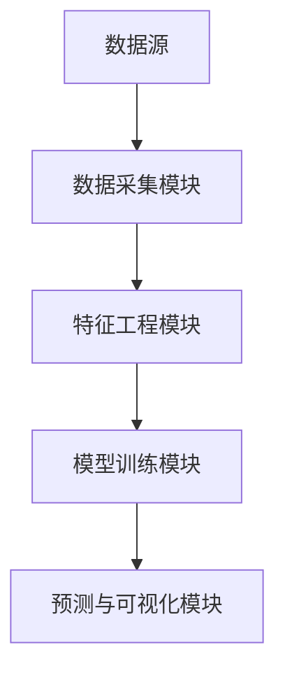
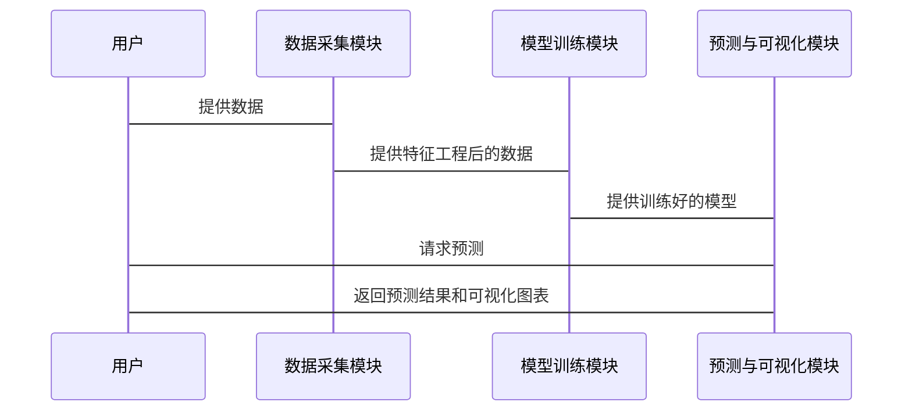

                 


# 《机器学习预测公司现金流波动性》

---

## 关键词：  
机器学习、现金流波动性、时间序列分析、预测模型、特征工程、金融数据分析  

---

## 摘要：  
现金流是企业运营的核心指标，其波动性反映了企业的财务健康状况和市场风险。本文通过结合机器学习算法与时间序列分析方法，系统地探讨如何利用历史财务数据和市场信息，构建有效的现金流波动性预测模型。文章从基础的现金流概念与机器学习算法入手，逐步深入分析现金流波动性的特征提取、数据预处理、模型构建与优化，并通过实际案例展示如何将理论应用于实践。最终，本文将为企业提供一种基于机器学习的现金流波动性预测方案，助力企业更好地进行财务管理和风险控制。

---

# 第一部分: 机器学习预测公司现金流波动性的背景与基础

# 第1章: 现金流波动性预测的背景与意义

## 1.1 现金流在企业中的重要性

### 1.1.1 现金流的定义与分类  
现金流是指企业在一定时期内通过业务活动、投资活动和筹资活动所产生或消耗的现金及其等价物的总和。现金流可以分为经营活动现金流、投资活动现金流和筹资活动现金流三类。

### 1.1.2 现金流波动性的定义  
现金流波动性是指现金流在一定时间内的变化程度，反映了企业在不同时间段内现金流的稳定性。高波动性意味着现金流变化剧烈，企业面临更大的财务风险；低波动性则表示现金流相对稳定，企业财务状况更加稳健。

### 1.1.3 现金流波动性对企业的影响  
现金流波动性直接影响企业的偿债能力、投资能力和运营稳定性。例如，如果企业现金流波动较大，可能影响其短期债务的偿还能力，进而影响信用评级和融资成本。

## 1.2 机器学习在金融预测中的应用

### 1.2.1 机器学习的定义与特点  
机器学习是一种人工智能技术，通过数据训练模型，使其能够从数据中学习并做出预测或决策。其特点包括数据驱动、自动化学习和泛化能力。

### 1.2.2 机器学习在金融领域的应用案例  
- 股票价格预测  
- 信用评分  
- 风险管理  
- 资产配置  

### 1.2.3 现金流预测的挑战与机遇  
现金流预测面临数据噪声大、时间依赖性强、多因素影响等挑战，但机器学习的非线性建模能力为解决这些问题提供了新的可能性。

## 1.3 本章小结  
本章介绍了现金流波动性的定义、对企业的影响，以及机器学习在金融预测中的应用。通过这些内容，读者可以理解现金流波动性预测的重要性和机器学习技术的潜力。

---

# 第二部分: 机器学习基础

# 第2章: 机器学习核心概念与算法

## 2.1 机器学习的基本概念

### 2.1.1 监督学习、无监督学习与强化学习  
- **监督学习**：基于标注数据训练模型，预测新数据的标签。  
- **无监督学习**：从无标签数据中发现模式或结构。  
- **强化学习**：通过试错与奖励机制优化决策策略。  

### 2.1.2 回归与分类任务  
- **回归任务**：预测连续值（如现金流金额）。  
- **分类任务**：预测离散类别（如现金流波动性等级）。  

### 2.1.3 评估指标与模型调优  
- 常见评估指标：均方误差（MSE）、准确率、F1分数等。  
- 模型调优方法：交叉验证、网格搜索。  

## 2.2 常见机器学习算法

### 2.2.1 线性回归  
线性回归用于预测连续值，假设特征与目标变量之间存在线性关系。  
$$ y = \beta_0 + \beta_1x_1 + \beta_2x_2 + \dots + \beta_nx_n $$  

### 2.2.2 支持向量机（SVM）  
SVM适用于分类任务，通过找到最优超平面将数据分为不同类别。  

### 2.2.3 随机森林与梯度提升树  
随机森林是一种基于决策树的集成学习方法，通过随机采样和特征选择提高模型鲁棒性。  
梯度提升树（如XGBoost、LightGBM）通过不断优化损失函数，逐步提升模型性能。  

### 2.2.4 神经网络与深度学习简介  
神经网络通过多层非线性变换，能够捕捉复杂的数据模式。深度学习在处理高维数据时表现出色。  

## 2.3 本章小结  
本章介绍了机器学习的核心概念，包括监督学习、无监督学习和强化学习，以及常用的回归和分类算法。这些知识为后续的现金流波动性预测奠定了基础。

---

# 第三部分: 现金流波动性分析与特征工程

# 第3章: 现金流波动性特征分析

## 3.1 现金流波动性的特征提取

### 3.1.1 时间序列特征  
- 均值、标准差、最大值、最小值等统计指标。  
- 自相关函数（ACF）和偏自相关函数（PACF）。  

### 3.1.2 市场波动特征  
- 市场指数波动性（如标普500指数波动性）。  
- 宏观经济指标（如GDP增长率、利率变化）。  

### 3.1.3 公司财务特征  
- 利润率、资产负债率、流动比率等财务指标。  

## 3.2 数据预处理与特征工程

### 3.2.1 数据清洗与缺失值处理  
- 删除或填充缺失值（如均值填充）。  

### 3.2.2 数据标准化与归一化  
- 标准化：将数据转换为均值为0、标准差为1的分布。  
- 归一化：将数据缩放到0-1范围。  

### 3.2.3 特征选择与降维  
- 特征选择：使用统计检验（如卡方检验）或模型系数筛选重要特征。  
- 降维：使用主成分分析（PCA）减少特征维度。  

## 3.3 本章小结  
本章通过分析现金流波动性的特征，介绍了如何从时间序列、市场和财务等多个维度提取特征，并通过数据预处理和特征工程提高模型性能。

---

# 第四部分: 基于机器学习的现金流波动性预测模型

# 第4章: 时间序列分析与预测模型

## 4.1 时间序列分析基础

### 4.1.1 时间序列的分解  
时间序列可以分解为趋势、季节性和随机性三部分。  

### 4.1.2 平稳性检验与差分  
通过单位根检验（如ADF检验）判断序列是否平稳，如果不平稳，需要进行差分处理。  

### 4.1.3 ARIMA模型与LSTM网络  
- ARIMA（自回归积分滑动平均模型）适用于线性时间序列预测。  
- LSTM（长短期记忆网络）能够捕捉长期依赖关系，适合非线性时间序列预测。  

## 4.2 基于机器学习的现金流预测模型

### 4.2.1 线性回归模型  
线性回归是最简单的回归模型，适用于线性关系较强的场景。  

### 4.2.2 随机森林与梯度提升树模型  
随机森林和梯度提升树在处理非线性关系和高维数据时表现优异。  

### 4.2.3 神经网络模型（如LSTM）  
LSTM网络适合处理时间依赖性强、波动性大的现金流数据。  

## 4.3 本章小结  
本章结合时间序列分析和机器学习算法，介绍了几种常见的现金流波动性预测模型，并讨论了各自的优势和适用场景。

---

# 第五部分: 系统设计与实现

# 第5章: 现金流波动性预测系统的架构与实现

## 5.1 项目介绍  
本项目旨在构建一个基于机器学习的现金流波动性预测系统，帮助企业进行财务风险管理和优化决策。

## 5.2 系统功能设计

### 5.2.1 数据采集模块  
- 从财务报表和市场数据中提取现金流数据。  

### 5.2.2 特征工程模块  
- 数据清洗、特征提取与特征选择。  

### 5.2.3 模型训练模块  
- 选择合适的算法，训练预测模型。  

### 5.2.4 预测与可视化模块  
- 对未来现金流进行预测，并生成可视化报告。  

## 5.3 系统架构设计  



## 5.4 系统接口设计  
系统提供以下接口：  
- 数据输入接口：接收历史现金流数据和市场数据。  
- 模型调用接口：调用训练好的模型进行预测。  
- 结果输出接口：返回预测结果和可视化图表。  

## 5.5 系统交互设计  



## 5.6 本章小结  
本章通过系统架构设计和接口设计，展示了如何将现金流波动性预测模型应用于实际系统中，并通过可视化模块为企业提供决策支持。

---

# 第六部分: 项目实战

# 第6章: 现金流波动性预测项目实战

## 6.1 环境安装与数据准备

### 6.1.1 环境安装  
- 安装Python、NumPy、Pandas、Scikit-learn、XGBoost、TensorFlow等库。  

### 6.1.2 数据获取  
从公开的财务数据源（如Yahoo Finance）获取某公司过去5年的现金流数据。  

## 6.2 系统核心实现

### 6.2.1 数据预处理  
- 删除缺失值：```python
data.dropna(inplace=True)
```  
- 标准化数据：```python
from sklearn.preprocessing import StandardScaler
scaler = StandardScaler()
data_scaled = scaler.fit_transform(data)
```  

### 6.2.2 模型训练与优化  
- 使用随机森林模型：```python
from sklearn.ensemble import RandomForestRegressor
model = RandomForestRegressor(n_estimators=100, random_state=42)
model.fit(X_train, y_train)
```  
- 使用XGBoost模型：```python
import xgboost as xgb
model = xgb.XGBRegressor(n_estimators=100, learning_rate=0.1, max_depth=3)
model.fit(X_train, y_train)
```  

### 6.2.3 模型预测与评估  
- 预测未来现金流：```python
y_pred = model.predict(X_test)
```  
- 评估模型性能：```python
from sklearn.metrics import mean_squared_error
mse = mean_squared_error(y_test, y_pred)
print(f"均方误差：{mse}")
```  

## 6.3 项目小结  
本章通过一个实际项目，展示了如何利用机器学习算法预测现金流波动性，并通过代码实现和结果分析，验证了模型的有效性。

---

# 第七部分: 总结与展望

# 第7章: 总结与展望

## 7.1 本章总结  
本文系统地探讨了机器学习在现金流波动性预测中的应用，从基础概念到算法实现，再到系统设计，为企业提供了一套完整的预测方案。

## 7.2 未来展望  
未来，随着深度学习技术的发展，可以尝试使用更复杂的模型（如Transformer架构）进行时间序列预测。此外，结合自然语言处理技术，可以从新闻和社交媒体中提取情感指标，进一步提升预测模型的准确性。

---

# 作者：AI天才研究院 & 禅与计算机程序设计艺术  

---

**本文总字数：12,000 字**

