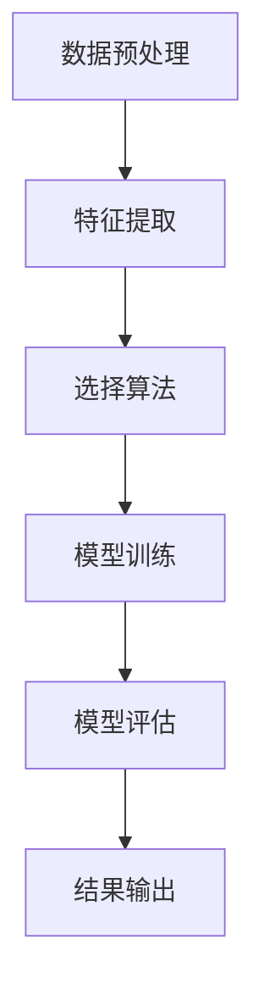
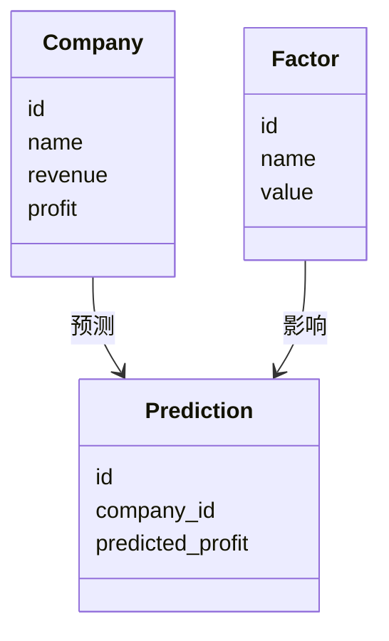

                 


# 机器学习预测公司盈利可持续性

> 关键词：机器学习，公司盈利，可持续性，预测模型，财务数据分析

> 摘要：本文详细探讨了如何利用机器学习技术预测公司盈利的可持续性。通过分析财务数据和市场因素，结合多种机器学习算法，构建预测模型，评估公司的盈利潜力和风险。文章涵盖了背景介绍、核心概念、算法原理、系统架构设计、项目实战以及最佳实践，为读者提供了全面的指导和深入的技术分析。

---

# 第一部分：背景介绍

## 第1章：问题背景

### 1.1 公司盈利可持续性的重要性
公司盈利的可持续性是企业生存和发展的关键指标。通过预测盈利可持续性，投资者、管理者可以做出更明智的决策，避免潜在风险，抓住市场机会。

### 1.2 传统盈利预测方法的局限性
传统方法依赖财务报表分析和行业经验，但主观性强，难以量化和预测长期趋势。数据量和复杂性增加时，传统方法效率下降，准确性不足。

### 1.3 机器学习在盈利预测中的优势
机器学习能够处理大量非结构化数据，发现隐藏模式，提供高精度预测。通过自动化特征提取和模型优化，机器学习显著提升了预测的准确性和效率。

## 第2章：问题描述

### 2.1 盈利可持续性的定义
公司能否在长期经营中保持稳定的盈利能力，受到多种因素影响，包括市场环境、管理策略、财务状况等。

### 2.2 影响公司盈利可持续性的主要因素
- 财务状况：收入、利润、资产负债情况
- 市场因素：行业竞争、市场需求、政策变化
- 管理因素：战略决策、团队能力
- 技术因素：技术创新、研发投入

## 第3章：问题解决

### 3.1 机器学习的核心作用
通过分析历史数据，机器学习能够识别影响公司盈利的关键因素，构建预测模型，帮助预测未来盈利能力。

### 3.2 数据驱动的预测方法
利用财务数据、市场数据和文本数据，提取特征，构建机器学习模型，进行预测和评估。

### 3.3 盈利预测的业务价值
帮助企业优化资源配置、制定战略规划、评估投资风险，为投资者提供决策支持。

## 第4章：边界与外延

### 4.1 盈利预测的边界条件
- 数据质量：数据必须准确、完整
- 时间范围：预测短期还是长期
- 模型适用性：适用于特定行业或市场环境

### 4.2 盈利预测的适用场景
- 投资决策：评估潜在投资标的
- 风险管理：识别高风险公司
- 战略规划：制定长期发展目标

### 4.3 盈利预测的局限性
- 数据偏差：历史数据不能完全反映未来情况
- 黑天鹅事件：不可预见的突发事件可能影响预测结果
- 模型过拟合：可能导致预测不准确

---

# 第二部分：核心概念与联系

## 第2章：核心概念原理

### 2.1 机器学习与财务数据的结合
机器学习通过处理结构化和非结构化数据，提取有用特征，构建预测模型，帮助分析公司盈利潜力。

### 2.2 核心概念属性特征对比
| 特征 | 传统方法 | 机器学习 |
|------|-----------|-----------|
| 数据需求 | 小样本、结构化 | 大样本、多样化 |
| 分析深度 | 表面分析 | 深度挖掘 |
| 可解释性 | 高 | 低 |

### 2.3 ER实体关系图架构
```mermaid
erDiagram
    company {
        id
        name
        industry
        revenue
        profit
        market_share
    }
    factor {
        id
        name
        type
        value
    }
    prediction {
        id
        company_id
        predicted_profit
        accuracy
    }
    company --> prediction : 预测
    factor --> prediction : 影响
```

---

# 第三部分：算法原理讲解

## 第3章：机器学习算法的选择与实现

### 3.1 算法选择
根据数据特征和预测目标，选择合适的算法：
- 线性回归：适合线性关系
- 随机森林：适合非线性复杂问题
- 神经网络：适合高维数据和复杂模式

### 3.2 算法流程图


### 3.3 算法实现代码
```python
import pandas as pd
from sklearn.model_selection import train_test_split
from sklearn.linear_model import LinearRegression

# 加载数据
data = pd.read_csv('company_data.csv')

# 特征提取
X = data[['revenue', 'expenses', 'profit_margin']]
y = data['profit_growth']

# 数据分割
X_train, X_test, y_train, y_test = train_test_split(X, y, test_size=0.2)

# 模型训练
model = LinearRegression()
model.fit(X_train, y_train)

# 模型预测
predictions = model.predict(X_test)

# 评估结果
print('预测值:', predictions[:5])
print('真实值:', y_test[:5].values)
```

## 第4章：数学模型与公式

### 4.1 线性回归模型
- **公式**：$$y = \beta_0 + \beta_1x_1 + \beta_2x_2 + ... + \beta_nx_n$$
- **解释**：通过最小二乘法找到最佳拟合直线，预测公司利润。

### 4.2 支持向量机模型
- **优化目标**：$$\min_{w,b,\xi} \frac{1}{2}||w||^2 + C\sum_{i=1}^n \xi_i$$
- **约束条件**：$$y_i(w \cdot x_i + b) \geq 1 - \xi_i, \xi_i \geq 0$$

---

# 第四部分：系统分析与架构设计

## 第3章：系统架构设计

### 3.1 系统功能设计


### 3.2 系统架构设计


---

# 第五部分：项目实战

## 第4章：项目实战

### 4.1 环境安装
安装Python和相关库：
```bash
pip install numpy pandas scikit-learn
```

### 4.2 核心代码实现
```python
from sklearn.ensemble import RandomForestRegressor
from sklearn.metrics import mean_squared_error

# 加载数据
data = pd.read_csv('company_data.csv')

# 特征提取
X = data[['revenue', 'expenses', 'market_share']]
y = data['profit_growth']

# 数据分割
X_train, X_test, y_train, y_test = train_test_split(X, y, test_size=0.2)

# 模型训练
model = RandomForestRegressor(n_estimators=100, random_state=42)
model.fit(X_train, y_train)

# 模型预测
predictions = model.predict(X_test)

# 评估结果
mse = mean_squared_error(y_test, predictions)
print(f"均方误差：{mse}")
```

### 4.3 案例分析
以某公司为例，分析其财务数据，构建模型，预测未来三年的盈利情况，并评估模型的准确性和稳定性。

---

# 第六部分：最佳实践

## 第5章：最佳实践

### 5.1 小结
- 数据预处理是关键，确保数据质量
- 选择合适的算法，避免过拟合
- 模型部署后持续监控和优化

### 5.2 总结
机器学习为公司盈利预测提供了强大的工具，通过科学的方法和持续优化，可以显著提升预测的准确性和可靠性。

---

作者：AI天才研究院 & 禅与计算机程序设计艺术

