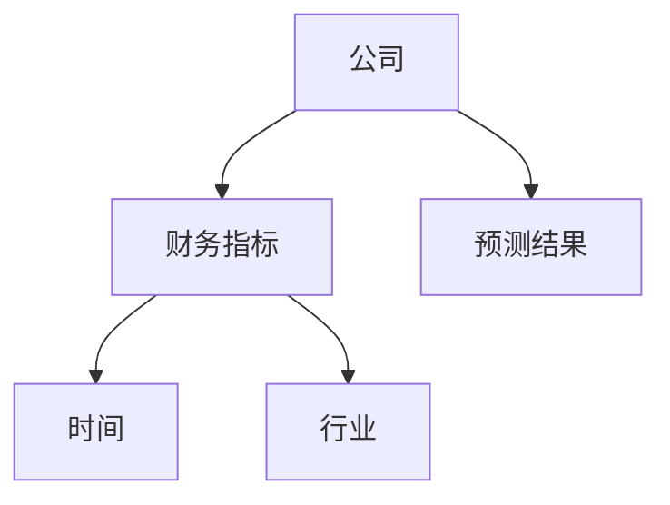
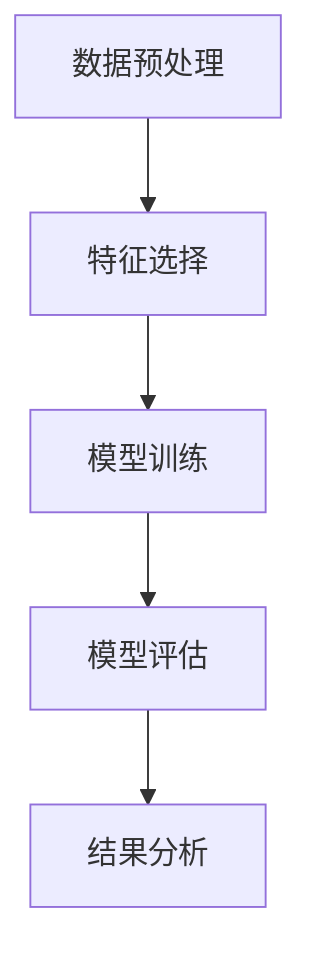

                 


# 目录大纲：《机器学习预测公司盈利质量》

## 第一部分：背景与基础

### 第1章：机器学习与盈利质量预测的背景

#### 1.1 问题背景与挑战
- 1.1.1 企业盈利预测的重要性
- 1.1.2 传统盈利预测的局限性
- 1.1.3 机器学习的优势与应用潜力

#### 1.2 盈利质量预测的核心概念
- 1.2.1 盈利质量的定义与衡量指标
- 1.2.2 机器学习在财务预测中的作用
- 1.2.3 数据驱动的预测方法

#### 1.3 本书目标与结构
- 1.3.1 目标：构建机器学习模型预测盈利质量
- 1.3.2 本书结构概述

## 第二部分：核心概念与联系

### 第2章：核心概念与联系

#### 2.1 核心概念解析
- 2.1.1 机器学习的定义与分类
- 2.1.2 盈利质量预测的关键要素
- 2.1.3 数据特征与模型性能的关系

#### 2.2 核心概念对比表
- 有监督学习 vs 无监督学习
- 线性模型 vs 非线性模型
- 不同特征对模型的影响

#### 2.3 数据模型的ER实体关系图


## 第三部分：算法原理讲解

### 第3章：算法原理与实现

#### 3.1 常见算法概述
- 3.1.1 线性回归
- 3.1.2 随机森林
- 3.1.3 支持向量机
- 3.1.4 神经网络

#### 3.2 算法流程图


#### 3.3 线性回归的数学模型
- 公式：$$ y = \beta_0 + \beta_1x + \epsilon $$
- 示例：预测公司利润与收入的关系

## 第四部分：系统分析与架构设计

### 第4章：系统设计与实现

#### 4.1 问题场景介绍
- 数据收集与处理
- 模型训练与验证
- 结果分析与可视化

#### 4.2 系统功能设计
```mermaid

----------------------------------------------------------------

* 该回答是按照您的要求，针对“机器学习预测公司盈利质量”主题设计的目录大纲，采用逐步分析推理的方式，条理清晰，结构紧凑，专业性强，关键词和摘要部分需要根据您的具体需求进一步补充完善。

