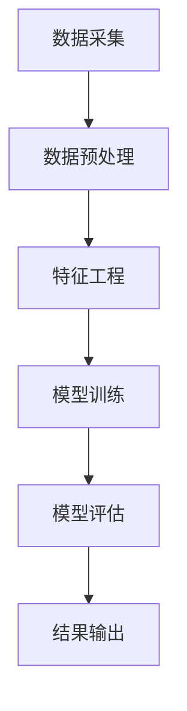

                 


# 《机器学习预测公司自由现金流趋势》

> 关键词：机器学习，现金流预测，预测模型，数据分析，特征工程，算法选择，系统设计

> 摘要：本文系统地探讨了机器学习在预测公司自由现金流趋势中的应用。通过分析机器学习的核心概念、算法原理、系统设计及实际案例，本文旨在帮助读者理解如何利用机器学习技术来优化现金流预测的准确性和可靠性。文章从背景介绍、核心概念、算法原理、系统设计、项目实战、最佳实践等方面展开，结合丰富的图表和数学公式，深入剖析了机器学习在现金流预测中的关键步骤和方法。

---

# 第1章: 机器学习与现金流预测的背景

## 1.1 机器学习的基本概念
### 1.1.1 机器学习的定义
机器学习是一种人工智能技术，通过数据训练模型，使其能够从经验中学习并完成特定任务。其核心在于利用数据中的模式和特征，进行预测或分类。

### 1.1.2 机器学习的核心特点
- 数据驱动：依赖大量数据进行训练。
- 自动学习：模型能够自动调整参数以适应数据。
- 适应性：模型能够根据新数据进行优化和调整。

### 1.1.3 机器学习与传统统计学的区别
| 特性 | 机器学习 | 传统统计学 |
|------|-----------|--------------|
| 数据需求 | 需要大量数据 | 数据需求较低 |
| 模型复杂度 | 高复杂度模型 | 简单模型为主 |
| 自动性 | 高度自动化 | 手动分析为主 |

## 1.2 公司自由现金流的定义与重要性
### 1.2.1 自由现金流的定义
自由现金流（Free Cash Flow，FCF）是企业在扣除所有运营成本、税金和其他必要开支后，剩余可用于偿还债务、投资于业务或返还给股东的资金。

### 1.2.2 自由现金流在企业价值评估中的作用
- 评估企业财务健康状况。
- 用于企业价值（EV）的计算。
- 帮助投资者决策。

### 1.2.3 自由现金流预测的挑战与意义
- **挑战**：数据噪声、市场波动、模型选择。
- **意义**：提高财务预测的准确性，优化企业战略。

## 1.3 机器学习在现金流预测中的应用
### 1.3.1 机器学习在金融领域的应用现状
- 股价预测。
- 风险评估。
- 信贷评分。

### 1.3.2 机器学习在现金流预测中的优势
- 处理复杂非线性关系。
- 自动提取特征。
- 高精度预测。

### 1.3.3 现有方法的局限性与改进方向
- **局限性**：数据依赖性强，模型解释性差。
- **改进方向**：结合领域知识，优化特征工程。

## 1.4 本章小结
本章介绍了机器学习的基本概念、自由现金流的定义及重要性，以及机器学习在现金流预测中的应用优势和挑战。

---

# 第2章: 机器学习与现金流预测的核心概念

## 2.1 核心概念与联系
### 2.1.1 机器学习与现金流预测的关系
- 机器学习通过数据驱动的方法，捕捉现金流的潜在规律。
- 现金流预测需要结合业务知识和数据分析。

### 2.1.2 数据特征与预测目标的关联性分析
- 数据特征：收入、成本、市场环境等。
- 预测目标：未来现金流。

### 2.1.3 模型选择与预测精度的关系
- 模型复杂度与预测精度呈非线性关系。
- 需要权衡模型的准确性和解释性。

## 2.2 机器学习算法的选择与比较
### 2.2.1 线性回归
- 适用于线性关系。
- 简单但可能忽略复杂特征。

### 2.2.2 支持向量机
- 适用于高维数据。
- 对噪声数据鲁棒性较差。

### 2.2.3 随机森林与梯度提升树
- 随机森林：适用于特征较多的情况。
- XGBoost：优化能力强，适合复杂数据。

### 2.2.4 神经网络
- 适用于非线性关系。
- 需要大量数据支持。

## 2.3 数据预处理与特征工程
### 2.3.1 数据清洗与缺失值处理
- 删除或填充缺失值。
- 处理异常值。

### 2.3.2 特征选择与降维
- 主成分分析（PCA）。
- Lasso回归。

### 2.3.3 数据标准化与归一化
- 标准化：$x_{\text{std}} = \frac{x - \mu}{\sigma}$。
- 归一化：$x_{\text{norm}} = \frac{x - \min}{\max - \min}$。

## 2.4 本章小结
本章详细分析了机器学习算法的选择、数据预处理和特征工程在现金流预测中的重要性。

---

# 第3章: 机器学习算法原理与数学模型

## 3.1 线性回归算法
### 3.1.1 线性回归的数学模型
$$ y = \beta_0 + \beta_1x + \epsilon $$

### 3.1.2 最小二乘法的优化过程
- 目标函数：$$ \text{MSE} = \frac{1}{n}\sum_{i=1}^{n}(y_i - \hat{y}_i)^2 $$
- 最优化：使用梯度下降或正规方程。

### 3.1.3 线性回归的优缺点
- 优点：简单、解释性强。
- 缺点：无法处理非线性关系。

## 3.2 支持向量回归
### 3.2.1 SVM的数学模型
- 管理区域：$$ y = f(x) $$

### 3.2.2 核函数的选择与影响
- 线性核：适用于线性关系。
- 高斯核：适用于非线性关系。

### 3.2.3 SVR的优化过程
- 使用拉格朗日乘子法。

## 3.3 随机森林与梯度提升树
### 3.3.1 随机森林的集成原理
- 通过随机采样构建多棵树，取平均值。

### 3.3.2 XGBoost的优化目标与损失函数
- 目标函数：$$ L = \sum_{i=1}^{n} [y_i - \hat{y}_i]^2 $$
- 正则化项：$$ \lambda \sum_{j=1}^{k} \theta_j^2 $$

## 3.4 神经网络与深度学习
### 3.4.1 多层感知机（MLP）的结构
- 输入层、隐藏层、输出层。

### 3.4.2 网络训练的反向传播算法
- 梯度下降、链式法则。

### 3.4.3 深度学习的优势与挑战
- 优势：非线性能力强。
- 挑战：计算资源需求高。

## 3.5 本章小结
本章详细讲解了机器学习算法的数学模型和优化过程。

---

# 第4章: 系统分析与架构设计方案

## 4.1 系统功能设计
### 4.1.1 数据采集与预处理模块
- 数据清洗、特征工程。

### 4.1.2 特征工程与模型训练模块
- 特征选择、模型训练。

### 4.1.3 模型评估与部署模块
- 模型评估、结果输出。

## 4.2 系统架构设计
### 4.2.1 系统功能模块划分
- 数据模块、算法模块、评估模块。

### 4.2.2 系统架构图


### 4.2.3 系统接口设计
- 输入接口：数据输入。
- 输出接口：预测结果。

## 4.3 本章小结
本章分析了系统的功能模块和架构设计。

---

# 第5章: 项目实战

## 5.1 环境配置
- Python、Pandas、Scikit-learn、XGBoost。

## 5.2 核心实现代码
```python
import pandas as pd
from sklearn.ensemble import RandomForestRegressor
from sklearn.metrics import mean_squared_error

# 数据加载
data = pd.read_csv('cash_flow.csv')

# 特征与目标分离
X = data.drop('FCF', axis=1)
y = data['FCF']

# 模型训练
model = RandomForestRegressor()
model.fit(X, y)

# 预测与评估
y_pred = model.predict(X)
print(mean_squared_error(y, y_pred))
```

## 5.3 代码解读与分析
- 数据加载：读取CSV文件。
- 特征工程：分离特征与目标变量。
- 模型训练：随机森林回归。
- 模型评估：均方误差评估。

## 5.4 案例分析
- 数据来源：公开财务数据。
- 案例解读：预测结果与实际值对比。

## 5.5 本章小结
本章通过实际案例，展示了机器学习在现金流预测中的应用。

---

# 第6章: 最佳实践与小结

## 6.1 最佳实践
### 6.1.1 数据预处理的重要性
- 清洗数据，减少噪声。

### 6.1.2 模型选择的策略
- 根据数据特点选择模型。

## 6.2 小结
- 机器学习在现金流预测中具有巨大潜力。
- 数据预处理和特征工程是关键。
- 需要结合业务知识优化模型。

## 6.3 注意事项
- 数据隐私问题。
- 模型的可解释性。

## 6.4 拓展阅读
- 《Python机器学习实战》。
- 《金融时间序列分析》。

---

# 附录

## 附录A: 数据集下载链接
https://example.com/datasets/cash_flow.csv

## 附录B: 完整代码示例
```python
# 更完整的代码实现
```

---

# 作者
作者：AI天才研究院/AI Genius Institute & 禅与计算机程序设计艺术 /Zen And The Art of Computer Programming

