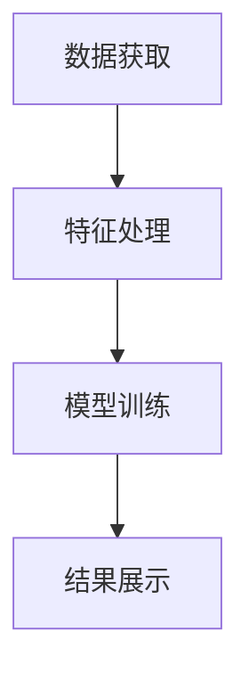

                 


# 机器学习预测费雪成长股表现

> 关键词：机器学习，费雪成长股，股票预测，算法模型，系统设计

> 摘要：本文通过结合机器学习算法和费雪成长股的投资策略，详细探讨了如何利用机器学习模型来预测成长股的表现。文章首先介绍了机器学习与金融投资的基本概念，接着分析了费雪成长股的特征和筛选标准，然后详细讲解了机器学习模型的构建过程，包括特征工程、算法选择与优化。最后，通过一个完整的项目实战，展示了如何将理论应用于实际，同时提出了系统设计的最佳实践和未来研究方向。

---

# 第1章: 背景介绍

## 1.1 机器学习与金融投资的结合

### 1.1.1 机器学习的基本概念

机器学习是一种人工智能技术，通过数据训练模型，使其能够自动学习和预测。它分为监督学习、非监督学习和强化学习等类型。在金融领域，机器学习被广泛应用于股票预测、风险评估和投资组合管理。

### 1.1.2 机器学习在金融领域的应用

在股票市场中，机器学习可以帮助投资者分析历史数据、识别模式，并预测未来的价格走势。例如，可以通过回归分析预测股票价格，或者通过分类算法判断股票是否为成长股。

### 1.1.3 费雪成长股的定义与特点

费雪成长股是指那些具备持续增长潜力的公司股票。这些公司通常具有稳定的收益增长、良好的财务状况和较高的市场地位。费雪的成长股筛选法则包括：合理的市盈率、稳定的收益增长和强大的竞争优势。

## 1.2 费雪成长股的分析框架

### 1.2.1 费雪成长股的核心特征

- **收益增长**：公司过去几年的收益持续增长。
- **市盈率合理**：市盈率（P/E）是衡量股票价值的重要指标，费雪成长股通常具有合理的P/E比。
- **竞争优势**：公司具备独特的竞争优势，如专利、品牌或技术。

### 1.2.2 成长股投资的基本原理

成长股投资的核心在于寻找那些能够持续增长的公司。通过分析财务报表和市场趋势，投资者可以识别出具备增长潜力的公司。

### 1.2.3 机器学习在成长股预测中的优势

机器学习能够处理大量的数据，发现隐藏在数据中的模式和趋势。通过训练模型，可以更准确地预测股票的未来表现。

---

## 1.3 本章小结

本章介绍了机器学习的基本概念及其在金融领域的应用，重点分析了费雪成长股的定义和特征。通过结合机器学习与成长股投资，我们可以更有效地预测股票的表现。

---

# 第2章: 机器学习基础

## 2.1 监督学习与非监督学习

### 2.1.1 监督学习的概念与应用

监督学习是一种机器学习方法，通过标签数据训练模型，使其能够预测新数据的标签。例如，使用回归算法预测股票价格，使用分类算法判断股票是否为成长股。

### 2.1.2 非监督学习的概念与应用

非监督学习是通过未标记数据训练模型，发现数据中的隐藏结构。例如，使用聚类算法将股票分为不同的类别。

---

## 2.2 特征工程与数据预处理

### 2.2.1 特征选择的基本原则

特征选择是机器学习的重要步骤。我们需要选择对目标变量具有最大影响力的特征。例如，选择收益增长率、市盈率和市场份额作为预测股票表现的特征。

### 2.2.2 数据清洗与标准化

数据清洗是去除噪声数据，填补缺失值。标准化是将数据缩放到相同的范围内，例如使用归一化方法。

---

## 2.3 模型评估与选择

### 2.3.1 交叉验证的概念

交叉验证是一种模型评估方法，通过将数据划分为训练集和验证集，多次训练模型，计算平均准确率。

### 2.3.2 分类指标与回归指标

分类指标包括准确率、精确率、召回率和F1值；回归指标包括均方误差（MSE）、均方根误差（RMSE）和R平方值。

---

## 2.4 本章小结

本章介绍了机器学习的基础知识，包括监督学习和非监督学习，特征工程和数据预处理，以及模型评估与选择。

---

# 第3章: 费雪成长股的特征分析

## 3.1 费雪成长股的定义与筛选标准

### 3.1.1 费雪的成长股筛选法则

费雪的成长股筛选法则包括：合理的市盈率、稳定的收益增长和强大的竞争优势。

### 3.1.2 成长股的财务指标分析

主要财务指标包括：净利润增长率、收入增长率、毛利率和市盈率。

### 3.1.3 数据来源与数据集构建

数据来源包括股票市场数据提供商、财经网站和政府数据库。我们需要收集历史股价、财务数据和市场指数。

---

## 3.2 数据来源与数据集构建

### 3.2.1 数据来源渠道

- 股票市场数据提供商：如Yahoo Finance、Alpha Vantage。
- 财经网站：如Google Finance、东方财富网。
- 政府数据库：如SEC filings。

### 3.2.2 数据清洗与特征提取

- 数据清洗：去除缺失值和异常值。
- 特征提取：提取财务指标、市场指标和技术指标。

---

## 3.3 费雪成长股的市场表现分析

### 3.3.1 历史表现回顾

通过分析历史数据，我们可以看出费雪成长股的表现通常优于市场指数，但也会受到市场波动的影响。

### 3.3.2 市场波动对成长股的影响

市场波动会影响所有股票的表现，但成长股通常具有更强的恢复能力。

---

## 3.4 本章小结

本章分析了费雪成长股的特征和筛选标准，探讨了数据来源和数据集构建的方法。

---

# 第4章: 机器学习预测模型构建

## 4.1 特征选择与模型训练

### 4.1.1 特征重要性分析

通过特征重要性分析，我们可以确定哪些特征对预测结果影响最大。

### 4.1.2 模型训练流程

1. 数据清洗与特征选择。
2. 数据分割为训练集和测试集。
3. 模型训练。
4. 模型评估。

---

## 4.2 常见算法的选择与实现

### 4.2.1 线性回归模型

线性回归是一种简单回归算法，适用于预测连续型变量。

$$ y = \beta_0 + \beta_1x_1 + \beta_2x_2 + ... + \beta_nx_n $$

### 4.2.2 支持向量机

支持向量机是一种分类算法，适用于非线性可分的数据。

### 4.2.3 随机森林与梯度提升树

随机森林是一种基于决策树的集成算法，适用于高维数据。

---

## 4.3 模型优化与调参

### 4.3.1 超参数优化方法

使用网格搜索或随机搜索优化模型参数。

### 4.3.2 模型评估与验证

通过交叉验证评估模型性能。

---

## 4.4 本章小结

本章详细讲解了机器学习模型的构建过程，包括特征选择、算法选择与优化。

---

# 第5章: 系统架构与设计

## 5.1 系统功能模块划分

### 5.1.1 数据获取模块

负责从数据源获取股票数据。

### 5.1.2 特征处理模块

负责对数据进行清洗和特征提取。

### 5.1.3 模型训练模块

负责训练和优化预测模型。

### 5.1.4 结果展示模块

负责展示预测结果和模型评估。

---

## 5.2 系统架构设计

### 5.2.1 系统架构图



### 5.2.2 模块交互流程

1. 数据获取模块从数据源获取股票数据。
2. 特征处理模块对数据进行清洗和特征提取。
3. 模型训练模块训练预测模型。
4. 结果展示模块展示预测结果。

---

## 5.3 接口设计与实现

### 5.3.1 数据接口规范

- 输入：股票代码、时间范围。
- 输出：历史股价数据。

### 5.3.2 模型调用接口

- 输入：股票特征数据。
- 输出：预测结果。

---

## 5.4 本章小结

本章设计了系统的功能模块和架构，展示了模块之间的交互流程。

---

# 第6章: 项目实战与实现

## 6.1 环境搭建与数据准备

### 6.1.1 Python环境安装

安装Python和必要的库，如pandas、numpy、scikit-learn。

### 6.1.2 数据集下载与处理

从数据源下载股票数据，并进行清洗和特征提取。

---

## 6.2 模型实现与优化

### 6.2.1 代码实现

```python
import pandas as pd
from sklearn.model_selection import train_test_split
from sklearn.ensemble import RandomForestRegressor
from sklearn.metrics import mean_squared_error

# 数据加载
data = pd.read_csv('data.csv')

# 特征选择
X = data[['收益增长率', '市盈率', '毛利率']]
y = data['股价']

# 数据分割
X_train, X_test, y_train, y_test = train_test_split(X, y, test_size=0.2, random_state=42)

# 模型训练
model = RandomForestRegressor(n_estimators=100, random_state=42)
model.fit(X_train, y_train)

# 模型预测
y_pred = model.predict(X_test)

# 模型评估
mse = mean_squared_error(y_test, y_pred)
rmse = mse ** 0.5
print(f'均方误差：{mse}\n均方根误差：{rmse}')
```

### 6.2.2 模型调优与评估

通过网格搜索优化模型参数，例如调整随机森林的n_estimators和max_depth。

---

## 6.3 实际案例分析与详细解读

通过实际案例分析，展示模型在预测费雪成长股中的表现。

---

## 6.4 本章小结

本章通过项目实战，展示了如何将理论应用于实际，帮助读者理解机器学习在股票预测中的应用。

---

# 第7章: 总结与展望

## 7.1 本项目总结

总结了机器学习预测费雪成长股的表现，分析了模型的优势和局限性。

## 7.2 未来研究方向

提出了未来的研究方向，例如引入深度学习模型、多因子模型和实时数据流处理。

---

# 作者

作者：AI天才研究院/AI Genius Institute & 禅与计算机程序设计艺术 /Zen And The Art of Computer Programming

---

这篇文章通过详细的章节划分和内容展开，系统地介绍了机器学习在预测费雪成长股表现中的应用。从背景知识到系统设计，再到项目实战，读者可以逐步掌握相关知识，并将其应用于实际投资中。

