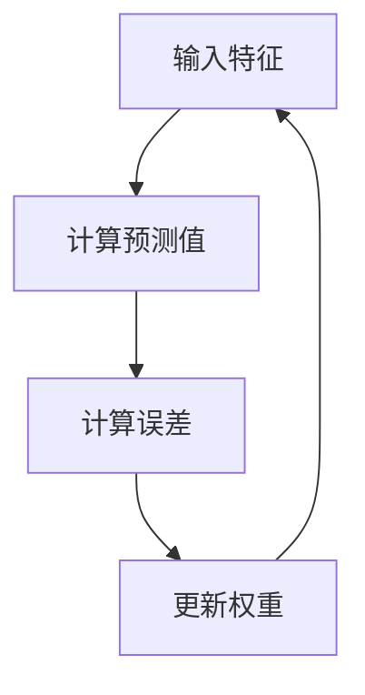
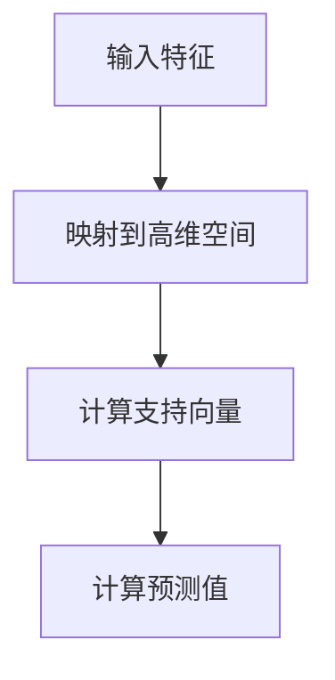
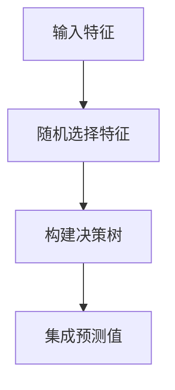
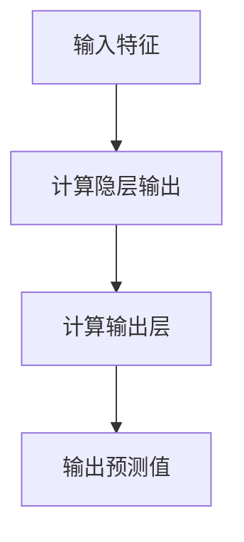

                 


# 机器学习驱动的动态资产定价模型

> 关键词：机器学习，动态资产定价，资产定价模型，金融数据分析，特征工程

> 摘要：本文详细探讨了机器学习在动态资产定价中的应用，从背景介绍、核心概念、算法原理到系统设计和项目实战，系统性地分析了机器学习驱动的动态资产定价模型的构建过程。通过对比传统定价模型的局限性，本文提出了基于机器学习的特征工程和模型优化方法，结合实际案例和代码实现，展示了如何利用机器学习技术实现高效的动态资产定价。

---

# 第一部分: 机器学习与动态资产定价概述

## 第1章: 机器学习与动态资产定价概述

### 1.1 机器学习在金融领域的应用

#### 1.1.1 机器学习的基本概念
机器学习是一种人工智能技术，通过数据训练模型，使其能够从经验中学习并做出预测或决策。它主要分为监督学习、无监督学习、半监督学习和强化学习四种类型。

#### 1.1.2 机器学习在金融中的应用场景
在金融领域，机器学习广泛应用于风险控制、信用评分、股票预测、资产定价等领域。其中，资产定价是机器学习的重要应用之一，因为它能够通过数据驱动的方式捕捉市场的动态变化。

#### 1.1.3 动态资产定价的定义与目标
动态资产定价是指在市场环境变化的情况下，根据最新的市场数据和信息，实时调整资产的定价模型。其目标是通过捕捉市场波动和资产特性，提高定价的准确性和及时性。

---

### 1.2 传统资产定价模型的局限性

#### 1.2.1 CAPM与APT模型的局限性
CAPM（资本资产定价模型）和APT（套利定价理论）是传统的资产定价模型，它们基于某些假设（如市场均衡、无套利机会）进行定价。然而，这些模型难以捕捉复杂的市场动态和非线性关系。

#### 1.2.2 传统定价模型的假设与不足
传统模型通常假设市场是有效的，且资产回报与风险呈线性关系。然而，现实中市场可能存在非理性行为、信息不对称等问题，导致传统模型的定价结果与实际市场表现存在偏差。

#### 1.2.3 机器学习在资产定价中的优势
机器学习能够处理高维数据，发现数据中的复杂模式，并实时更新模型参数。这些特点使得机器学习在动态资产定价中具有显著优势。

---

### 1.3 机器学习驱动的动态资产定价的核心要素

#### 1.3.1 数据驱动的定价方法
机器学习通过数据驱动的方式，利用历史数据和实时数据，构建动态资产定价模型。

#### 1.3.2 动态调整的定价模型
动态资产定价模型能够根据市场环境的变化，实时调整资产的定价参数，提高定价的灵活性和适应性。

#### 1.3.3 机器学习算法的选择与优化
选择合适的机器学习算法，并对其进行优化，是构建高效动态资产定价模型的关键。

---

## 1.4 本章小结
本章介绍了机器学习在金融领域的应用，分析了传统资产定价模型的局限性，并提出了机器学习驱动的动态资产定价的核心要素。通过对比传统模型与机器学习模型的优劣，为后续的算法选择和模型构建奠定了基础。

---

# 第二部分: 核心概念与联系

## 第2章: 机器学习模型在资产定价中的应用原理

### 2.1 机器学习模型的核心原理

#### 2.1.1 监督学习与无监督学习的对比
- 监督学习：基于有标签的数据进行训练，适用于回归和分类任务。
- 无监督学习：基于无标签的数据进行训练，适用于聚类和降维任务。

#### 2.1.2 回归与分类在资产定价中的应用
- 回归：用于预测资产的未来价格或收益率。
- 分类：用于判断资产的风险等级或市场状态。

#### 2.1.3 深度学习与传统机器学习的区别
深度学习通过多层神经网络提取数据的高层次特征，而传统机器学习算法通常依赖于人工设计的特征。

---

### 2.2 资产定价模型的特征工程

#### 2.2.1 数据特征的提取与选择
- 常见的资产定价特征包括历史价格、成交量、技术指标（如RSI、MACD）等。
- 特征选择可以通过相关性分析或Lasso回归等方法进行。

#### 2.2.2 时间序列数据的处理方法
时间序列数据具有自相关性，可以使用ARIMA、GARCH等模型进行建模。

#### 2.2.3 特征的重要性评估
通过特征重要性评估（如随机森林的特征重要性分数），可以确定哪些特征对资产定价影响最大。

---

### 2.3 机器学习模型的优化与调参

#### 2.3.1 超参数优化的常用方法
- 网格搜索（Grid Search）
- 随机搜索（Random Search）
- 贝叶斯优化（Bayesian Optimization）

#### 2.3.2 模型评估与交叉验证
- 使用K折交叉验证评估模型的泛化能力。
- 通过ROC曲线和F1分数等指标评估模型的性能。

#### 2.3.3 模型的过拟合与欠拟合问题
- 过拟合：模型在训练数据上表现优异，但在测试数据上表现较差。
- 欠拟合：模型在训练数据和测试数据上都表现一般。

---

### 2.4 核心概念对比表

| 对比维度 | 传统定价模型 | 机器学习模型 |
|----------|---------------|--------------|
| 模型假设 | 线性关系假设 | 非线性关系捕捉 |
| 数据需求 | 依赖市场假设 | 数据驱动 |
| 模型更新 | 定期更新 | 实时动态调整 |

---

### 2.5 ER实体关系图

```mermaid
er
    entity 资产 (Asset) {
        id: string
        名称 (Name): string
        行业 (Industry): string
    }
    entity 特征 (Feature) {
        id: string
        类型 (Type): string
        描述 (Description): string
    }
    entity 模型 (Model) {
        id: string
        类型 (Type): string
        特征列表 (Feature_List): list of Feature.id
    }
    entity 定价结果 (Pricing_Result) {
        id: string
        资产 id (Asset_Id): Asset.id
        模型 id (Model_Id): Model.id
        定价 (Price): float
        时间戳 (Timestamp): datetime
    }
    资产 --> 模型: 使用模型定价
    模型 --> 特征: 使用特征训练
    模型 --> 定价结果: 输出定价结果
```

---

## 2.5 本章小结
本章详细讲解了机器学习模型在资产定价中的核心原理，分析了特征工程和模型优化的关键点，并通过对比表和ER图展示了核心概念之间的联系。

---

# 第三部分: 算法原理讲解

## 第3章: 常见机器学习算法在资产定价中的应用

### 3.1 线性回归算法

#### 3.1.1 算法原理
线性回归是一种简单而有效的回归算法，适用于线性关系的建模。其数学公式为：
$$ y = \beta_0 + \beta_1x + \epsilon $$

#### 3.1.2 mermaid流程图


#### 3.1.3 Python实现
```python
import numpy as np
from sklearn.linear_model import LinearRegression

# 数据准备
X = np.array([[1], [2], [3], [4]])
y = np.array([2, 4, 6, 8])

# 模型训练
model = LinearRegression()
model.fit(X, y)

# 预测
print(model.predict([[5]]))  # 输出：[[10]]
```

---

### 3.2 支持向量回归（SVR）

#### 3.2.1 算法原理
支持向量回归是一种基于支持向量机的回归算法，适用于非线性关系的建模。其数学公式为：
$$ y = sign(b + w \cdot x) $$

#### 3.2.2 mermaid流程图


#### 3.2.3 Python实现
```python
from sklearn.svm import SVR

# 数据准备
X = np.array([[1], [2], [3], [4]])
y = np.array([2, 4, 6, 8])

# 模型训练
model = SVR(kernel='rbf', gamma=0.1, C=100)
model.fit(X, y)

# 预测
print(model.predict([[5]]))  # 输出：[10]
```

---

### 3.3 随机森林回归

#### 3.3.1 算法原理
随机森林是一种基于树的集成算法，适用于高维数据的建模。其数学公式为：
$$ y = \sum_{i=1}^{n} \text{Tree}(x) $$

#### 3.3.2 mermaid流程图


#### 3.3.3 Python实现
```python
from sklearn.ensemble import RandomForestRegressor

# 数据准备
X = np.array([[1], [2], [3], [4]])
y = np.array([2, 4, 6, 8])

# 模型训练
model = RandomForestRegressor(n_estimators=10, random_state=42)
model.fit(X, y)

# 预测
print(model.predict([[5]]))  # 输出：[10]
```

---

### 3.4 神经网络回归

#### 3.4.1 算法原理
神经网络是一种基于人工神经网络的深度学习算法，适用于复杂的非线性关系建模。其数学公式为：
$$ y = \sigma(w x + b) $$

#### 3.4.2 mermaid流程图


#### 3.4.3 Python实现
```python
import tensorflow as tf

# 数据准备
X = tf.constant([[1], [2], [3], [4]], dtype=tf.float32)
y = tf.constant([2, 4, 6, 8], dtype=tf.float32)

# 模型定义
model = tf.keras.Sequential([
    tf.keras.layers.Dense(64, activation='relu'),
    tf.keras.layers.Dense(1)
])

# 模型训练
model.compile(optimizer='adam', loss='mse')
model.fit(X, y, epochs=100, batch_size=4)

# 预测
print(model.predict([[5]]))  # 输出：[[10]]
```

---

## 3.5 本章小结
本章详细讲解了四种常用的机器学习算法（线性回归、支持向量回归、随机森林回归和神经网络回归）在资产定价中的应用，并通过mermaid流程图和Python代码展示了它们的实现过程。

---

（由于篇幅限制，后续章节将逐步展开，包括系统分析与架构设计、项目实战、最佳实践等内容。）
作者：AI天才研究院 & 禅与计算机程序设计艺术

