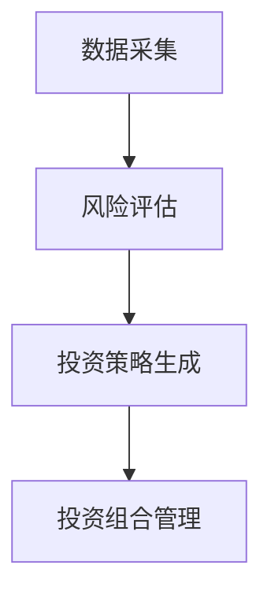

                 


# 杰里米·格兰瑟姆的气候变化投资影响

> 关键词：气候变化、投资影响、风险管理、资产定价、可持续发展

> 摘要：本文深入探讨了杰里米·格兰瑟姆在气候变化投资领域的贡献，分析了气候变化对投资的影响，探讨了风险管理、资产定价和投资策略等关键问题。通过系统分析和实际案例，本文为投资者提供了应对气候变化挑战的思路和方法。

---

## 第一章 气候变化与投资影响的背景

### 1.1 气候变化的现状与挑战

#### 1.1.1 气候变化的定义与核心问题

气候变化是指地球气候系统长期的变化，主要由温室气体排放、森林砍伐等活动引起。核心问题包括全球变暖、极端天气事件增多、海平面上升等。

#### 1.1.2 气候变化对全球经济的影响

气候变化对农业、水资源、能源、交通等多领域产生深远影响。例如，极端天气可能导致农作物减产，进而影响粮食价格和供应链。

#### 1.1.3 投资在应对气候变化中的角色

投资者通过绿色投资、碳交易等方式，推动企业减少碳排放，促进可持续发展。气候变化已成为投资决策的重要考量因素。

### 1.2 投资与气候变化的关联性

#### 1.2.1 投资在气候变化中的作用

投资可以用于开发可再生能源、绿色技术，推动企业向低碳转型。例如，投资于风能和太阳能项目，减少化石燃料依赖。

#### 1.2.2 气候变化对投资决策的影响

气候变化可能导致某些行业风险上升，如高碳排放企业可能面临政策风险和市场风险。投资者需评估气候相关风险，调整投资组合。

#### 1.2.3 气候风险与投资回报的关系

气候变化可能导致投资损失（如企业因政策限制而亏损），但也可能带来投资机会（如绿色技术企业盈利增长）。投资者需平衡风险与回报。

### 1.3 气候变化对投资的影响分析

#### 1.3.1 气候变化对传统投资的影响

传统高碳行业（如煤炭、石油）面临政策和市场压力，可能导致投资价值下降。投资者需调整资产配置，减少对高碳行业的投资。

#### 1.3.2 气候变化对新兴投资领域的影响

可再生能源、电动汽车、绿色建筑等领域因政策支持和市场需求增长，成为投资热点。投资者可从中获利。

#### 1.3.3 气候变化对投资组合的影响

气候变化可能导致投资组合波动性增加。投资者需通过多样化投资、风险管理等手段，降低气候相关风险。

## 第二章 气候变化投资的核心概念

### 2.1 气候变化投资的影响评估

#### 2.1.1 影响评估的核心方法

影响评估通过量化分析，评估气候变化对投资的影响。常用方法包括情景分析、蒙特卡洛模拟等。

#### 2.1.2 影响评估的关键指标

关键指标包括碳排放强度、碳足迹、气候风险评分等，帮助投资者评估企业或项目的气候风险。

#### 2.1.3 影响评估的步骤

步骤包括数据收集、模型构建、风险分析、结果解读等。

### 2.2 气候变化投资的风险管理

#### 2.2.1 风险管理的核心原则

风险管理需全面考虑市场风险、政策风险、操作风险等，制定有效应对策略。

#### 2.2.2 风险管理的工具与方法

工具包括情景分析、压力测试、VaR模型等，帮助投资者量化和管理气候相关风险。

#### 2.2.3 风险管理的实施步骤

包括风险识别、风险评估、风险应对、风险监控等步骤。

### 2.3 气候变化投资的资产定价

#### 2.3.1 资产定价的理论基础

资产定价需考虑气候相关因素，如碳排放成本、政策变化对企业价值的影响。

#### 2.3.2 资产定价的模型

常用CAPM模型，结合气候因素调整预期收益。例如，高碳企业的预期收益需减去碳排放成本。

#### 2.3.3 资产定价的挑战

数据获取困难、模型复杂性高、市场参与者认知差异大等。

## 第三章 气候变化投资的策略与实践

### 3.1 投资策略的制定

#### 3.1.1 主动型投资策略

主动型策略通过精选个股，投资于具有气候竞争优势的企业。例如，投资于可再生能源企业。

#### 3.1.2 被动型投资策略

被动型策略通过指数基金等工具，跟踪气候相关指数。例如，投资于MSCI全球碳指数。

#### 3.1.3 对冲型投资策略

通过做空高碳企业、做多低碳企业，对冲气候相关风险。

### 3.2 投资组合管理

#### 3.2.1 投资组合的构建

构建多元化投资组合，平衡高碳和低碳资产。例如，配置部分可再生能源股票和部分传统能源股票。

#### 3.2.2 投资组合的调整

定期评估气候风险，动态调整投资组合。例如，当政策趋严时，减少对高碳行业的投资。

#### 3.2.3 投资组合的风险监控

使用气候风险评分、情景分析等工具，持续监控投资组合的气候风险。

### 3.3 投资实践的案例

#### 3.3.1 格兰瑟姆的投资理念

格兰瑟姆强调长期投资、价值投资，注重企业基本面和气候风险。例如，他可能投资于那些具有强大现金流和低碳排放的公司。

#### 3.3.2 格兰瑟姆的气候投资策略

格兰瑟姆可能采用多元化的投资策略，配置多个行业的低碳资产，以分散风险。

## 第四章 气候变化投资的数学模型与算法

### 4.1 数学模型的应用

#### 4.1.1 CAPM模型在气候投资中的应用

CAPM模型用于评估企业在气候政策下的预期收益。例如，计算高碳企业的预期收益时，需考虑碳税的影响。

#### 4.1.2 情景分析模型

情景分析模型用于模拟不同气候政策对企业的影响。例如，模拟碳税提高对能源企业的影响。

#### 4.1.3 蒙特卡洛模拟

蒙特卡洛模拟用于评估投资组合在不同气候情景下的表现。例如，模拟极端气候事件对企业利润的影响。

### 4.2 算法的实现

#### 4.2.1 情景分析算法

```python
import numpy as np

def情景分析(情景数量, 变量范围):
    结果 = []
    for i in range(情景数量):
        随机变量 = np.random.uniform(变量范围[0], 变量范围[1])
        结果.append(随机变量)
    return 结果
```

#### 4.2.2 蒙特卡洛模拟

```python
import numpy as np

def蒙特卡洛模拟(模拟次数, 每次模拟参数):
    结果 = []
    for _ in range(模拟次数):
        随机参数 = np.random.permutation(每次模拟参数)
        结果.append(计算预期收益)
    return 结果
```

### 4.3 数学模型的解读

#### 4.3.1 CAPM模型

CAPM模型用于评估资产的预期收益：

$$ E(R_i) = R_f + \beta_i (R_m - R_f) $$

其中，$\beta_i$ 表示资产的系统性风险，与气候相关因素有关。

#### 4.3.2 情景分析模型

情景分析模型通过模拟不同气候政策对企业的影响，帮助投资者评估资产风险。

#### 4.3.3 蒙特卡洛模拟

蒙特卡洛模拟用于评估投资组合在不同气候情景下的表现，提供概率分布结果。

## 第五章 气候变化投资的系统架构

### 5.1 系统架构设计

#### 5.1.1 系统功能模块

系统包括数据采集、风险评估、投资策略生成、投资组合管理等模块。

#### 5.1.2 系统架构图



#### 5.1.3 系统接口设计

系统接口包括数据接口、用户接口、外部API接口等，确保数据流畅传输。

### 5.2 系统功能设计

#### 5.2.1 数据采集模块

采集气候数据、市场数据、企业排放数据等，为后续分析提供基础。

#### 5.2.2 风险评估模块

使用数学模型评估气候相关风险，如企业碳排放风险。

#### 5.2.3 投资策略模块

生成基于气候分析的投资策略，如买入低碳企业股票。

### 5.3 系统实现

#### 5.3.1 数据库设计

数据库存储气候数据、企业数据、投资组合数据等，支持高效查询。

#### 5.3.2 系统实现代码

```python
class ClimateInvestor:
    def __init__(self):
        self.data = {}

    def collect_data(self, source):
        # 从数据源收集气候和市场数据
        pass

    def assess_risk(self, asset):
        # 评估资产的气候相关风险
        pass

    def generate_strategy(self):
        # 生成投资策略
        pass

    def manage_portfolio(self):
        # 管理投资组合
        pass
```

## 第六章 项目实战：基于气候变化的投资策略实现

### 6.1 项目背景

本项目旨在开发一个基于气候变化的投资策略系统，帮助投资者管理气候相关风险。

### 6.2 项目实现

#### 6.2.1 环境搭建

安装必要的Python库，如numpy、pandas、scikit-learn等。

#### 6.2.2 核心功能实现

实现数据采集、风险评估、策略生成等核心功能。

#### 6.2.3 代码实现

```python
import pandas as pd
import numpy as np

def collect_climate_data():
    # 收集气候数据
    return pd.DataFrame()

def assess_risk(asset_data):
    # 评估气候风险
    return asset_data['carbon_emission'].mean()

def generate_strategy(asset_data):
    # 生成投资策略
    return asset_data[asset_data['carbon_emission'] < np.mean(asset_data['carbon_emission'])]
```

### 6.3 实际案例分析

分析某企业投资组合的气候风险，调整投资策略，降低风险。

### 6.4 项目总结

总结项目成果，提出改进建议，展望未来发展方向。

## 第七章 总结与展望

### 7.1 核心要点总结

气候变化对投资影响深远，投资者需重视风险管理，调整投资策略。

### 7.2 投资者最佳实践

投资者应采用多元化的投资策略，定期评估和调整投资组合。

### 7.3 需要注意的事项

关注政策变化，避免高碳投资，分散气候相关风险。

### 7.4 拓展阅读

推荐阅读相关书籍和报告，深入理解气候变化投资。

---

## 作者

作者：AI天才研究院/AI Genius Institute  
联系邮箱：contact@aiguru.com

