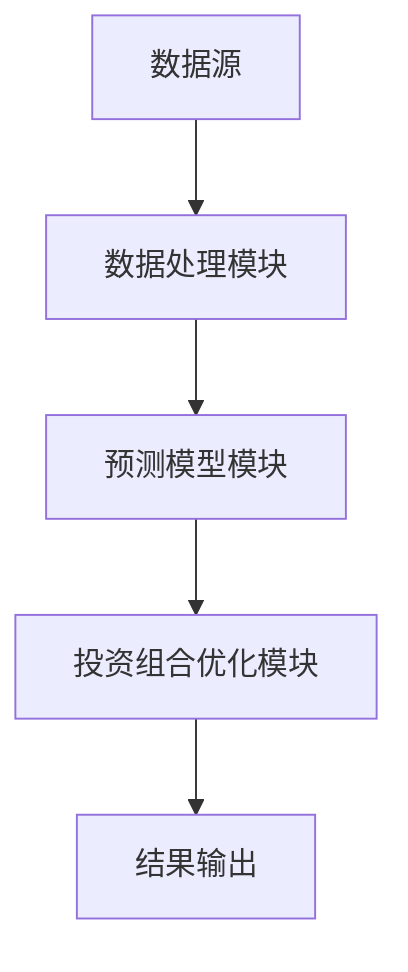

                 


# {{杰里米·格兰瑟姆的气候变化投资策略}}

> 关键词：杰里米·格兰瑟姆，气候变化，投资策略，风险管理，可持续投资，经济影响

> 摘要：本文深入探讨杰里米·格兰瑟姆的气候变化投资策略，结合技术与经济分析，探讨气候变化对投资的影响，介绍其核心理念、方法及实战案例，为投资决策提供新视角。

---

# 第一部分: 气候变化与投资策略背景

# 第1章: 气候变化的现状与投资影响

## 1.1 气候变化的现状与挑战

### 1.1.1 气候变化的定义与核心问题
气候变化是指地球气候系统长期的变化，主要由温室气体排放、工业化活动和自然因素引起。其核心问题包括全球变暖、极端天气事件增多、海平面上升等。

### 1.1.2 气候变化对全球经济的影响
气候变化对农业、能源、交通、建筑等多个行业产生深远影响，可能导致资源短缺、供应链中断和经济波动。

### 1.1.3 投资领域中的气候变化问题
气候变化带来的物理风险（如自然灾害）和转型风险（如政策变化）对资产价格和投资组合构成威胁。

## 1.2 气候变化对投资的影响

### 1.2.1 气候变化对资产价格的影响
气候变化可能导致某些行业资产贬值，而绿色能源和可持续行业资产增值。

### 1.2.2 气候风险的分类与评估
气侯风险包括物理风险（如极端天气）、转型风险（政策变化）和法律风险（诉讼风险）。

### 1.2.3 气候变化对投资组合的影响
气候变化可能改变资产的风险收益比，投资组合需要调整以应对新的风险。

## 1.3 杰里米·格兰瑟姆的投资理念

### 1.3.1 格兰瑟姆的基本投资理念
格兰瑟姆强调长期投资、价值投资和风险管理，注重基本面分析和资产配置。

### 1.3.2 格兰瑟姆的长期投资策略
他主张通过分散投资、严格的风险控制和长期持有来实现超额收益。

### 1.3.3 格兰瑟姆对气候变化的关注
格兰瑟姆意识到气候变化对全球经济和投资的重大影响，将其纳入投资决策的核心考量。

## 1.4 气候变化与投资策略的结合

### 1.4.1 气候变化对投资决策的影响
投资者需将气候变化因素纳入资产定价和风险评估，以优化投资组合。

### 1.4.2 气候变化投资策略的核心要素
包括绿色投资、风险管理、长期视角和技术创新。

### 1.4.3 气候变化投资的未来趋势
未来投资将更加关注可持续发展和绿色能源，气候变化投资策略将趋于系统化和量化。

## 1.5 本章小结
本章介绍了气候变化的现状及其对投资的影响，探讨了格兰瑟姆的投资理念，强调气候变化投资策略的重要性。

---

# 第二部分: 气候变化投资的核心概念与联系

# 第2章: 气候变化与投资的核心概念

## 2.1 气候变化的核心概念

### 2.1.1 气候变化的驱动因素
包括温室气体排放、森林砍伐、工业化活动等。

### 2.1.2 气候变化的预测模型
使用复杂的数学模型，如IPCC模型，预测气候变化趋势。

### 2.1.3 气候变化的不确定性
气候变化的预测存在不确定性，影响投资决策。

## 2.2 投资策略的核心概念

### 2.2.1 投资策略的基本分类
包括长期投资、价值投资、趋势投资等。

### 2.2.2 风险管理的核心要素
包括风险识别、评估、控制和对冲。

### 2.2.3 投资组合优化的原理
通过资产配置和分散投资降低风险，提高收益。

## 2.3 气候变化与投资的核心联系

### 2.3.1 气候变化对资产定价的影响
气候变化影响企业的盈利能力和资产价值。

### 2.3.2 气候风险的系统性影响
气候变化可能导致系统性风险，影响整个市场的稳定性。

### 2.3.3 可持续投资的兴起
越来越多投资者转向绿色能源、低碳技术和可持续发展项目。

## 2.4 本章小结
本章探讨了气候变化和投资的核心概念及其联系，强调气候变化对投资决策的重要性。

---

# 第三部分: 气候变化投资策略的算法原理

# 第3章: 气候变化投资策略的算法原理

## 3.1 气候变化预测模型

### 3.1.1 气候变化预测的数学模型
使用复杂的时间序列模型，如ARIMA和GARCH，预测气候变化趋势。

### 3.1.2 气候变化预测的不确定性分析
通过蒙特卡洛模拟评估预测的不确定性。

## 3.2 投资组合优化算法

### 3.2.1 基于气候变化的资产定价模型
使用CAPM模型，考虑气候变化对资产风险的影响。

### 3.2.2 风险管理算法
使用VaR和CVaR模型，评估气候变化相关风险。

### 3.2.3 多因子投资模型
考虑多个因素，如碳排放、政策影响和行业趋势，优化投资组合。

## 3.3 算法实现

### 3.3.1 气候变化预测的Python代码
```python
import pandas as pd
import numpy as np
from sklearn.linear_model import LinearRegression

# 示例代码：基于历史数据的气候变化预测
data = pd.read_csv('climate_data.csv')
X = data[['year', 'CO2_emissions']]
y = data['temperature_increase']
model = LinearRegression()
model.fit(X, y)
预测值 = model.predict(new_data)
```

### 3.3.2 投资组合优化的Python代码
```python
import numpy as np
from scipy.optimize import minimize

# 示例代码：优化投资组合以最小化气候变化风险
def objective函数(x):
    return np.dot(x.T, np.dot(协方差矩阵, x))

约束条件 = {'type': 'eq', 'fun': lambda x: np.sum(x) - 1}
结果 = minimize(objective函数, 初始值, 约束条件)
优化后的投资组合 = 结果.x
```

## 3.4 数学模型与公式

### 3.4.1 气候变化预测模型
$$
\text{预测温度变化} = \beta_0 + \beta_1 \times \text{CO2排放} + \epsilon
$$

### 3.4.2 投资组合优化模型
$$
\min_{x} \quad x^T \Sigma x \\
\text{subject to} \quad \sum x_i = 1
$$

## 3.5 本章小结
本章介绍了气候变化预测和投资组合优化的算法原理，展示了如何使用数学模型和代码实现这些策略。

---

# 第四部分: 气候变化投资策略的系统架构

# 第4章: 气候变化投资策略的系统架构

## 4.1 系统功能设计

### 4.1.1 数据收集模块
收集气候变化数据、市场数据和政策信息。

### 4.1.2 预测模型模块
运行气候变化预测模型，生成风险评估报告。

### 4.1.3 投资组合优化模块
根据预测结果优化投资组合，生成投资策略。

## 4.2 系统架构设计

### 4.2.1 系统架构图


### 4.2.2 系统接口设计
- 数据输入接口：接收气候变化数据和市场数据。
- 模型接口：调用预测模型和优化算法。
- 输出接口：生成投资策略报告。

## 4.3 系统交互流程

### 4.3.1 用户需求分析
用户输入投资目标和风险偏好。

### 4.3.2 数据处理与预测
系统收集并处理数据，运行预测模型。

### 4.3.3 投资组合优化
根据预测结果优化投资组合。

## 4.4 本章小结
本章探讨了气候变化投资策略的系统架构，展示了如何构建一个完整的投资系统。

---

# 第五部分: 气候变化投资策略的项目实战

# 第5章: 气候变化投资策略的项目实战

## 5.1 项目环境配置

### 5.1.1 数据来源
使用公开的气候变化数据和市场数据。

### 5.1.2 工具安装
安装Python、Pandas、NumPy、Scikit-learn等工具。

## 5.2 核心代码实现

### 5.2.1 数据处理代码
```python
import pandas as pd
import numpy as np

# 示例代码：数据处理
data = pd.read_csv('climate_data.csv')
data = data.dropna()
data['year'] = pd.to_datetime(data['year'])
```

### 5.2.2 模型实现代码
```python
from sklearn.linear_model import LinearRegression

# 示例代码：气候变化预测模型
model = LinearRegression()
model.fit(data[['year', 'CO2_emissions']], data['temperature_increase'])
预测值 = model.predict(new_data)
```

## 5.3 项目小结

### 5.3.1 项目总结
通过项目实战，验证了气候变化投资策略的有效性。

### 5.3.2 经验分享
强调数据质量和模型选择的重要性，建议持续监控和调整策略。

## 5.4 本章小结
本章通过实际项目展示了如何应用气候变化投资策略，提供了宝贵的经验和见解。

---

# 第六部分: 总结与展望

# 第6章: 总结与展望

## 6.1 本书总结

### 6.1.1 核心观点回顾
气候变化对投资具有深远影响，格兰瑟姆的投资策略提供了有效的方法。

### 6.1.2 主要内容回顾
涵盖背景、核心概念、算法原理、系统架构和项目实战。

## 6.2 未来展望

### 6.2.1 气候变化投资的趋势
可持续投资和绿色金融将继续发展，技术进步将推动投资策略创新。

### 6.2.2 格兰瑟姆投资理念的演变
随着气候变化的影响加剧，格兰瑟姆的投资策略将不断优化和创新。

## 6.3 本章小结
本章总结了全书内容，并展望了气候变化投资的未来发展趋势。

---

# 作者：AI天才研究院/AI Genius Institute & 禅与计算机程序设计艺术 /Zen And The Art of Computer Programming

