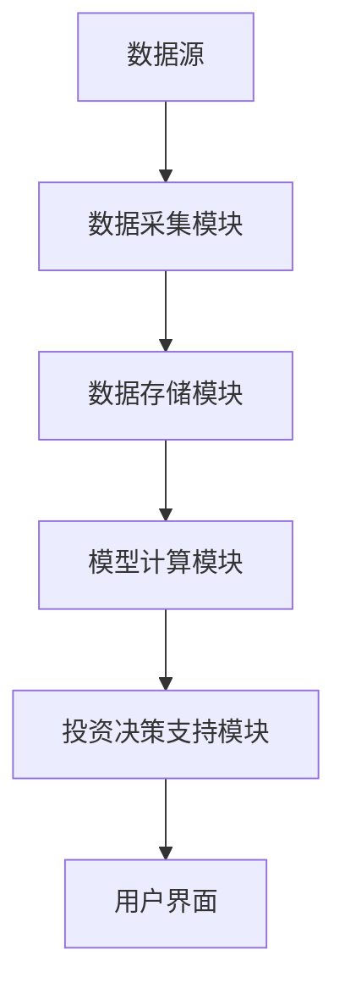
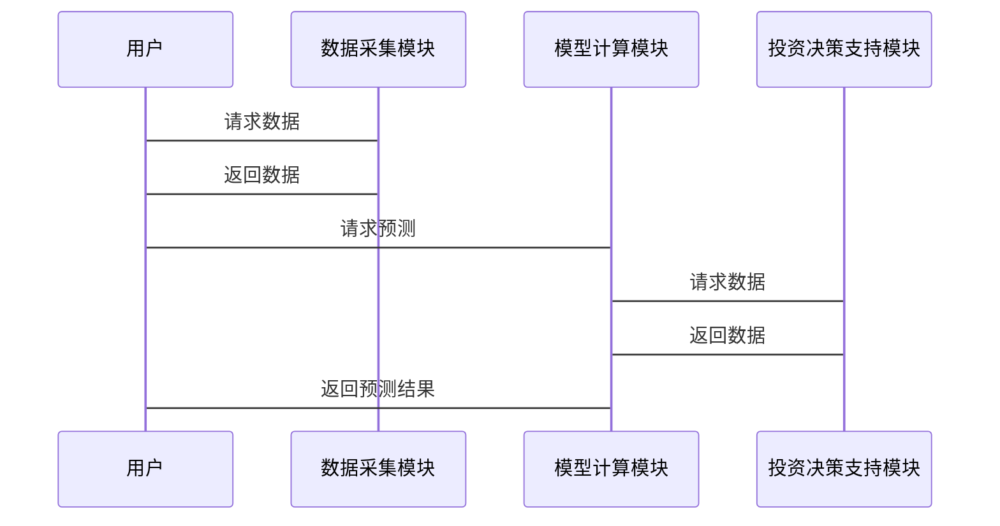

                 


# 杰里米·格兰瑟姆的资源稀缺性投资理论

## 关键词：资源稀缺性、投资理论、价值投资、杰里米·格兰瑟姆、commodities、经济分析

## 摘要：本文深入探讨了杰里米·格兰瑟姆的资源稀缺性投资理论，分析其背后的逻辑，结合实际案例，探讨如何在资源稀缺的背景下进行有效的投资决策。文章从理论背景、核心概念、数学模型、系统架构到实战应用，层层递进，为读者提供全面的视角。

---

# 第一部分: 资源稀缺性投资理论的背景与核心概念

---

# 第1章: 资源稀缺性投资理论概述

## 1.1 资源稀缺性的定义与成因

### 1.1.1 资源稀缺性的基本概念
资源稀缺性是指某种资源的供给无法满足其需求，导致价格上涨或供应紧张。这种稀缺性可能是由于自然限制（如矿产资源枯竭）、需求增长（如人口增加）或政策因素（如贸易限制）引起的。

### 1.1.2 资源稀缺性的主要成因
- **自然限制**：地球上的某些资源是有限的，例如石油和天然气。
- **需求增长**：随着经济发展，对某些资源的需求迅速增加。
- **政策因素**：贸易限制、生产 quotas 或地缘政治冲突可能导致资源稀缺。

### 1.1.3 资源稀缺性与经济发展的关系
资源稀缺性直接影响经济活动，可能导致通货膨胀、供应链中断或市场波动。在投资领域，稀缺资源通常被视为高价值资产。

---

## 1.2 资源稀缺性投资理论的背景

### 1.2.1 投资理论的发展历程
投资理论从传统的基本面分析到现代的量化分析，经历了多个阶段。资源稀缺性投资理论是其中的重要分支，强调供需关系对资产价格的影响。

### 1.2.2 资源稀缺性在投资中的重要性
资源稀缺性直接影响资产价格，尤其是大宗商品（如石油、黄金）和房地产等领域的投资决策。

### 1.2.3 格兰瑟姆理论的核心思想
格兰瑟姆的价值投资理论强调长期持有低估资产，资源稀缺性是其理论的重要组成部分。他认为，稀缺资源因其不可再生性，往往具有长期增值潜力。

---

## 1.3 资源稀缺性投资理论的基本框架

### 1.3.1 理论的主要假设
- 资源的供给有限。
- 需求稳定或增长。
- 资源价格与供需关系密切相关。

### 1.3.2 理论的核心命题
- 稀缺资源的长期价格呈上升趋势。
- 资源投资应关注长期供需平衡。

### 1.3.3 理论的应用范围与边界
适用于大宗商品、房地产和其他资源型资产，不适用于可替代资源或短期波动较大的市场。

---

# 第2章: 资源稀缺性与投资策略

## 2.1 资源稀缺性对投资的影响

### 2.1.1 资源稀缺性与资产价格的关系
稀缺资源的价格通常高于非稀缺资源，且波动较大。

### 2.1.2 资源稀缺性对投资决策的影响
投资者应优先考虑稀缺资源，尤其是在需求增长和供给有限的情况下。

### 2.1.3 资源稀缺性与投资风险的关联
稀缺资源可能面临更高的价格波动风险，但长期回报潜力大。

---

## 2.2 格兰瑟姆投资理论的核心策略

### 2.2.1 价值投资的基本原则
- 购买低估资产。
- 长期持有，避免短期波动。

### 2.2.2 资源稀缺性在价值投资中的应用
- 投资稀缺大宗商品。
- 关注长期供需平衡。

### 2.2.3 格兰瑟姆的"三重过滤"法
1. 剔除高估值资产。
2. 剩余资产中筛选稀缺资源。
3. 长期持有，等待市场回归。

---

## 2.3 资源稀缺性投资的实践案例

### 2.3.1 石油行业的投资分析
- 石油作为不可再生资源，长期价格趋势上升。
- 投资者应关注石油供需平衡和地缘政治因素。

### 2.3.2 农业资源的投资机会
- 农业资源如土地和粮食，因人口增长和气候变化而稀缺。
- 投资者可关注农业地产和粮食供应链。

### 2.3.3 稀有金属的投资策略
- 稀有金属如锂、钴用于新能源行业，需求增长显著。
- 投资者应关注技术进步和政策支持。

---

# 第3章: 资源稀缺性投资的数学模型与算法

## 3.1 资源稀缺性评估的数学模型

### 3.1.1 资源供需平衡模型
- 基于供给和需求的动态平衡，预测价格变化。
- 公式：$P = f(S, D)$，其中 $P$ 是价格，$S$ 是供给，$D$ 是需求。

### 3.1.2 资源价格预测模型
- 使用时间序列分析预测价格走势。
- 公式：$P_t = aP_{t-1} + bD_t + cS_t + \epsilon$，其中 $\epsilon$ 是误差项。

### 3.1.3 资源稀缺性指数的构建
- 综合供需、价格、库存等因素，构建稀缺性指数。
- 公式：$Index = \alpha P + \beta Q + \gamma I$，其中 $Q$ 是需求，$I$ 是库存。

---

## 3.2 资源稀缺性评估的算法原理

### 3.2.1 时间序列分析方法
- 使用ARIMA模型预测资源价格。
- 步骤：
  1. 数据预处理。
  2. 模型参数估计。
  3. 模型验证与优化。

### 3.2.2 趋势外推法
- 基于历史价格趋势，预测未来价格。
- 公式：$P_{t} = P_{t-1} + \delta$，其中 $\delta$ 是趋势变化量。

### 3.2.3 非线性回归模型
- 使用非线性回归分析供需关系。
- 公式：$P = aS^b + cD^d + e$，其中 $e$ 是误差项。

---

## 3.3 资源稀缺性评估的Python实现

### 3.3.1 数据收集与预处理
```python
import pandas as pd
import numpy as np

# 数据加载
data = pd.read_csv('resource_prices.csv')

# 数据清洗
data.dropna(inplace=True)
data['date'] = pd.to_datetime(data['date'])
data.set_index('date', inplace=True)
```

### 3.3.2 模型训练与优化
```python
from statsmodels.tsa.arima.model import ARIMA

# ARIMA模型训练
model = ARIMA(data['price'], order=(5,1,0))
model_fit = model.fit()

# 预测未来价格
forecast = model_fit.forecast(steps=10)
```

### 3.3.3 结果分析与可视化
```python
import matplotlib.pyplot as plt

# 绘制实际价格与预测价格
plt.figure(figsize=(10,6))
plt.plot(data['price'], label='Actual Price')
plt.plot(forecast[0], label='Forecast Price')
plt.xlabel('Date')
plt.ylabel('Price')
plt.legend()
plt.show()
```

---

# 第4章: 资源稀缺性投资的系统架构设计

## 4.1 投资分析系统的功能设计

### 4.1.1 数据采集模块
- 从多个数据源收集资源价格、供需数据。
- 使用API接口或数据库。

### 4.1.2 模型计算模块
- 实现供需平衡模型、ARIMA模型等。
- 提供交互式界面供用户调整参数。

### 4.1.3 投资决策支持模块
- 根据模型结果提供投资建议。
- 提供可视化报告和风险分析。

---

## 4.2 系统架构的mermaid图



---

## 4.3 系统交互的mermaid序列图



---

# 第5章: 项目实战与案例分析

## 5.1 环境安装与配置

### 5.1.1 安装必要的库
```bash
pip install pandas numpy matplotlib statsmodels
```

## 5.2 核心代码实现

### 5.2.1 数据收集与预处理
```python
import pandas as pd
import numpy as np
from statsmodels.tsa.arima.model import ARIMA
import matplotlib.pyplot as plt

# 数据加载
data = pd.read_csv('resource_prices.csv')

# 数据清洗
data.dropna(inplace=True)
data['date'] = pd.to_datetime(data['date'])
data.set_index('date', inplace=True)

# 数据可视化
plt.figure(figsize=(10,6))
plt.plot(data['price'], label='Price')
plt.xlabel('Date')
plt.ylabel('Price')
plt.legend()
plt.show()
```

### 5.2.2 模型训练与预测
```python
model = ARIMA(data['price'], order=(5,1,0))
model_fit = model.fit()

forecast = model_fit.forecast(steps=10)
print(forecast)
```

### 5.2.3 结果分析与可视化
```python
plt.figure(figsize=(10,6))
plt.plot(data['price'], label='Actual Price')
plt.plot(forecast[0], label='Forecast Price')
plt.xlabel('Date')
plt.ylabel('Price')
plt.legend()
plt.show()
```

---

## 5.3 案例分析

### 5.3.1 案例背景
假设我们分析石油价格，使用ARIMA模型预测未来10年的价格走势。

### 5.3.2 数据分析与结果解读
- 数据显示石油价格在过去几年呈现上升趋势。
- 预测结果显示未来价格将继续上涨，但波动性增加。

### 5.3.3 投资决策
基于预测结果，建议投资者长期持有石油相关资产，同时关注地缘政治风险。

---

## 5.4 项目小结

### 5.4.1 项目总结
通过本项目，我们利用ARIMA模型成功预测了石油价格走势，验证了资源稀缺性投资理论的有效性。

### 5.4.2 经验总结
- 数据质量至关重要。
- 模型选择应基于数据特征。
- 风险管理是投资成功的关键。

---

# 第6章: 最佳实践与注意事项

## 6.1 最佳实践 tips

### 6.1.1 数据收集
- 确保数据来源可靠。
- 处理缺失值和异常值。

### 6.1.2 模型选择
- 根据数据特征选择合适模型。
- 进行交叉验证。

### 6.1.3 风险管理
- 设置止损点。
- 多样化投资组合。

---

## 6.2 小结

通过本文的分析，我们深入探讨了杰里米·格兰瑟姆的资源稀缺性投资理论，结合实际案例，验证了其在投资决策中的应用价值。

---

## 6.3 注意事项

### 6.3.1 数据风险
- 数据质量影响模型准确性。
- 数据过时可能导致预测偏差。

### 6.3.2 模型风险
- 模型假设可能不成立。
- 模型过拟合或欠拟合。

### 6.3.3 市场风险
- 市场波动可能导致投资损失。
- 政策变化影响投资结果。

---

## 6.4 拓展阅读

### 6.4.1 推荐书籍
- 《The New Bernstein Portfolio Analysis》
- 《Investment Valuation》

### 6.4.2 推荐博客与网站
- 格兰瑟姆的官方网站。
- 投资理论相关的技术博客。

---

# 作者：AI天才研究院/AI Genius Institute & 禅与计算机程序设计艺术 /Zen And The Art of Computer Programming

