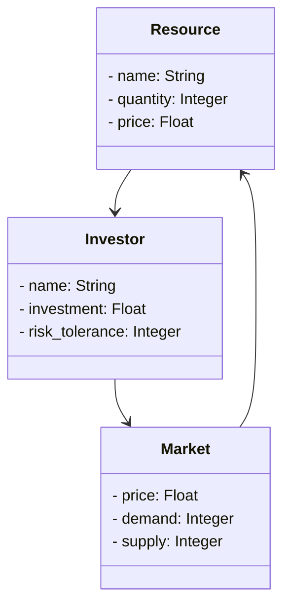

                 


# 杰里米·格兰瑟姆的资源稀缺性投资理论

> 关键词：资源稀缺性，投资理论，杰里米·格兰瑟姆，经济学，数学模型

> 摘要：本文深入探讨了杰里米·格兰瑟姆提出的资源稀缺性投资理论，从理论背景、核心概念、数学模型到实际应用，系统地分析了该理论在投资决策中的重要性及其对经济发展的影响。文章结合具体案例，详细阐述了资源稀缺性评估的方法、投资策略的选择以及系统的架构设计，为投资者提供了理论依据和实践指导。

---

## 第一章: 资源稀缺性投资理论的背景与基础

### 1.1 资源稀缺性的概念与问题背景

资源稀缺性是经济学中的一个基本概念，指的是相对于人类需求而言，某些资源的数量有限。这种稀缺性不仅体现在自然资源（如石油、矿产）上，也体现在人力资本、技术等无形资源上。随着全球人口的增长和经济发展，资源稀缺性问题日益突出，成为影响投资决策的重要因素。

#### 问题背景
资源稀缺性问题的根源在于供需失衡。当资源供给无法满足市场需求时，价格会上涨，从而影响相关行业的 profitability 和经济整体的稳定性。这种稀缺性不仅影响消费者，还直接影响投资者的决策。

#### 问题描述
资源稀缺性问题可以分为两类：绝对稀缺性和相对稀缺性。绝对稀缺性指资源的总量有限，无法满足需求；相对稀缺性则指由于技术进步或政策变化导致的短期供需失衡。

#### 与传统投资理论的区别
传统投资理论主要关注市场波动、公司财务状况等因素，而资源稀缺性投资理论将资源的供给与需求关系作为核心变量，强调通过稀缺性评估来优化投资组合。

---

### 1.2 资源稀缺性投资理论的提出

#### 核心思想
杰里米·格兰瑟姆提出，资源稀缺性是投资决策中的关键因素。他认为，资源的稀缺性决定了其价格走势和投资价值，投资者应重点关注那些稀缺性较高的资源，以获得超额收益。

#### 理论基础
资源稀缺性投资理论建立在经济学和金融学的基础上，结合了市场供需理论和资产定价模型。格兰瑟姆通过分析资源的供给弹性、需求弹性和市场预期，提出了一个综合的评估框架。

---

## 第二章: 资源稀缺性投资理论的核心概念与联系

### 2.1 核心概念的定义与属性

#### 资源稀缺性的核心要素
- **供给量**：资源的总量和可开采量。
- **需求量**：市场对资源的需求强度。
- **价格弹性**：价格变化对供需的影响程度。

#### 投资行为的关键特征
- **风险偏好**：投资者对风险的容忍程度。
- **投资 horizon**：投资的时间跨度。
- **市场预期**：投资者对未来价格走势的预测。

#### 市场供需关系的动态平衡
资源稀缺性与市场供需关系密切相关。当资源稀缺时，价格上涨，需求减少；供给增加，价格下降。这种动态平衡是资源稀缺性投资理论的核心。

---

### 2.2 核心概念的对比分析

#### 资源稀缺性与资源丰富性的对比
- **稀缺性**：资源供给不足，价格高。
- **丰富性**：资源供给过剩，价格低。

#### 不同类型资源的稀缺性特征
- **可再生资源**：如水资源，具有较强的恢复能力，但过度使用可能导致局部稀缺。
- **不可再生资源**：如矿产资源，一旦耗尽，无法再生。

#### 投资行为与资源稀缺性的关系
投资者通常会根据资源的稀缺性调整投资策略。稀缺性高的资源往往被视为优质资产，具有较高的投资价值。

---

## 第三章: 资源稀缺性投资理论的数学模型与公式

### 3.1 资源稀缺性评估的数学模型

#### 基本公式
$$ S = \frac{R}{D} $$
其中，S 表示资源稀缺性指数，R 表示资源总量，D 表示需求总量。

#### 模型的扩展
$$ S' = S \times (1 + \alpha) $$
其中，α 表示资源稀缺性加剧的系数。

### 3.2 投资收益的数学公式

#### 基本公式
$$ R = P \times Q $$
其中，R 表示投资收益，P 表示价格，Q 表示数量。

#### 资源稀缺性对收益的影响
$$ R' = R \times (1 + \beta) $$
其中，β 表示资源稀缺性对收益的增强系数。

---

## 第四章: 资源稀缺性投资理论在投资行为中的应用

### 4.1 投资行为的分析框架

#### 资源稀缺性与投资决策的关系
资源稀缺性影响投资者对资源的需求评估和价格预期。稀缺性高的资源通常被视为长期投资的优质标的。

#### 投资者行为的特征
- **短期投资者**：关注价格波动，追求短期收益。
- **长期投资者**：关注资源的稀缺性，注重长期价值。

---

## 第五章: 资源稀缺性投资理论的系统分析与架构设计

### 5.1 系统功能设计

#### 领域模型（Mermaid 类图）


### 5.2 系统架构设计

#### 系统架构（Mermaid 架构图）
```mermaid
container 资源评估系统 {
    ResourceEvaluator
    InvestorBehaviorAnalyzer
    MarketAnalyzer
}
```

---

## 第六章: 资源稀缺性投资理论的项目实战

### 6.1 环境安装

#### 系统环境
- 操作系统：Linux
- 开发工具：Python 3.10，Jupyter Notebook
- 数据库：MySQL

### 6.2 核心代码实现

#### 资源稀缺性评估代码
```python
def calculate_scarcity(resource_total, demand):
    scarcity_index = resource_total / demand
    return scarcity_index

resource_total = 1000
demand = 800
scarce

