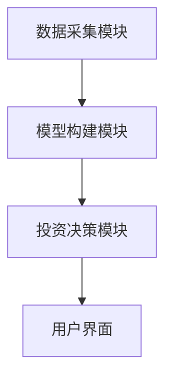
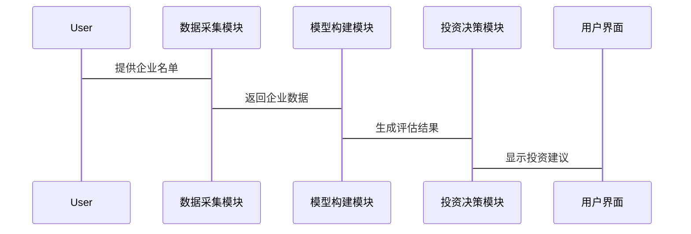

                 


# 杰里米·格兰瑟姆的长期价值投资与可持续发展

## 关键词：
长期价值投资、杰里米·格兰瑟姆、可持续发展、ESG投资、投资策略

## 摘要：
本文深入探讨了杰里米·格兰瑟姆的长期价值投资理念与可持续发展的结合。通过分析长期价值投资的核心概念、可持续发展的内在逻辑及其在投资中的应用，本文提出了将ESG因素融入投资决策的方法，并通过实际案例展示了其在投资组合优化中的潜力。文章内容涵盖背景介绍、核心概念对比、算法原理、系统架构设计以及实战案例分析，为投资者提供了全面的指导。

---

# 第一部分: 长期价值投资与可持续发展的背景与理念

## 第1章: 长期价值投资与可持续发展的背景

### 1.1 长期价值投资的定义与核心理念
#### 1.1.1 长期价值投资的起源与发展
长期价值投资是一种以基本面分析为基础的投资策略，起源于20世纪初，由本杰明·格雷厄姆和戴维·多德提出。其核心理念是寻找市场低估的优质企业，长期持有，等待其内在价值的回归。杰里米·格兰瑟姆作为格雷厄姆的学生，继承并发展了这一理念，强调安全边际和逆向投资。

#### 1.1.2 格兰瑟姆投资哲学的核心思想
格兰瑟姆的投资哲学可以总结为以下几点：
1. **安全边际**：买入价格低于内在价值的企业，确保投资的安全性。
2. **逆向思维**：在市场恐慌时买入，在市场狂热时卖出。
3. **长期视角**：关注企业的长期价值，而非短期波动。
4. **分散投资**：通过分散投资降低风险，避免过度集中。

#### 1.1.3 可持续发展在投资中的重要性
可持续发展已成为全球关注的焦点，企业在环境、社会和治理（ESG）方面的表现直接影响其长期价值。投资者越来越关注企业的可持续性，因为这不仅关系到企业的生存，也关系到投资的长期回报。

---

### 1.2 可持续发展与投资的结合
#### 1.2.1 可持续发展的定义与内涵
可持续发展是指在满足当代人需求的同时，不损害后代人满足其需求的能力。在投资领域，可持续发展关注企业在环境保护、社会责任和公司治理方面的表现。

#### 1.2.2 可持续投资的兴起与趋势
随着全球气候变化、社会责任和公司治理问题的日益突出，可持续投资逐渐兴起。投资者开始意识到，企业如果忽视ESG因素，可能会面临更大的风险和不确定性。

#### 1.2.3 格兰瑟姆对可持续发展的独特见解
格兰瑟姆认为，企业的可持续性是其长期价值的重要组成部分。他强调，在评估企业价值时，必须考虑其在环境保护、社会责任和公司治理方面的表现。这不仅有助于降低投资风险，还能提高投资回报。

---

### 1.3 本书的核心目标与读者群体
#### 1.3.1 本书的核心目标
本书旨在探讨如何将长期价值投资的理念与可持续发展相结合，提出一种新型的投资策略，帮助投资者在追求长期回报的同时，关注企业的可持续性。

#### 1.3.2 本书的读者群体
本书适合以下读者群体：
1. 投资从业者：包括基金经理、投资顾问等。
2. 企业高管：希望通过可持续发展提升企业价值。
3. 投资爱好者：希望深入了解长期价值投资与可持续发展的结合。

#### 1.3.3 本书的结构安排
本书分为七章，内容涵盖长期价值投资与可持续发展的背景、核心概念、算法原理、系统架构设计、实战案例分析以及最佳实践等内容。

---

## 第2章: 长期价值投资的核心概念与框架

### 2.1 长期价值投资的基本原理
#### 2.1.1 投资的三要素：时间、风险与收益
- **时间**：长期投资通过复利效应实现财富增长。
- **风险**：通过分散投资和安全边际降低风险。
- **收益**：通过基本面分析和价值发现实现超额收益。

#### 2.1.2 格兰瑟姆的投资策略与选股标准
- **选股标准**：
  1. 企业具有较强的财务实力。
  2. 企业估值低于其内在价值。
  3. 企业具有可持续发展的潜力。
- **投资策略**：
  1. 逆向投资：在市场恐慌时买入。
  2. 长期持有：等待价值回归。

#### 2.1.3 长期价值投资的三步法
1. **基本面分析**：评估企业的内在价值。
2. **估值判断**：确定企业的合理估值区间。
3. **投资决策**：在低估时买入，高估时卖出。

---

### 2.2 可持续发展与投资的内在联系
#### 2.2.1 可持续发展对企业价值的影响
- **环境因素**：企业的环保表现影响其运营成本和风险。
- **社会责任**：企业的社会形象影响其市场地位。
- **公司治理**：良好的治理结构降低企业风险。

#### 2.2.2 ESG投资的逻辑与框架
ESG投资通过评估企业的环境、社会和治理表现，筛选出具有可持续发展潜力的企业。其逻辑在于，企业如果在ESG方面表现优异，通常具有更强的抗风险能力和长期增长潜力。

#### 2.2.3 格兰瑟姆对ESG投资的评价
格兰瑟姆认为，ESG投资是长期价值投资的重要补充。他强调，在评估企业价值时，必须考虑其在ESG方面的表现，因为这直接关系到企业的长期可持续发展。

---

### 2.3 格兰瑟姆投资模型的核心要素
#### 2.3.1 企业基本面分析的关键指标
- **盈利能力**：ROE、净利润率。
- **成长能力**：收入增长率、净利润增长率。
- **财务状况**：资产负债率、现金流。

#### 2.3.2 市场情绪与估值中枢的判断方法
- **市场情绪**：通过市场波动率和投资者情绪指数判断市场状态。
- **估值中枢**：通过历史估值和可比公司分析确定合理估值区间。

#### 2.3.3 风险控制与投资组合的构建策略
- **风险控制**：通过分散投资和止损策略降低风险。
- **投资组合**：根据市场环境和企业基本面，动态调整投资组合。

---

## 第3章: 长期价值投资与可持续发展的核心概念对比

### 3.1 核心概念的定义与对比
| **核心概念** | **长期价值投资** | **可持续发展** |
|--------------|-------------------|----------------|
| **定义**     | 基于基本面分析，寻找低估企业的投资策略。 | 在满足当代需求的同时，不损害后代需求的能力。 |
| **目标**     | 实现长期超额收益。 | 提升企业的长期价值和抗风险能力。 |
| **关注点**   | 企业内在价值、安全边际。 | ESG表现、社会责任。 |

### 3.2 核心概念的属性特征对比
| **属性** | **长期价值投资** | **可持续发展** |
|----------|-------------------|----------------|
| **时间维度** | 长期视角 | 长期视角 |
| **风险控制** | 通过安全边际和分散投资降低风险 | 通过ESG表现降低风险 |
| **收益来源** | 价值回归和复利效应 | 社会责任和环境友好带来的长期收益 |

### 3.3 核心概念的ER实体关系图
```mermaid
er
    Entity(长期价值投资)
    Entity(可持续发展)
    Entity(投资策略)
    Entity(企业价值)
    Entity(风险控制)
    Entity(市场情绪)
    
    Relation(长期价值投资) --> Relation(企业价值)
    Relation(可持续发展) --> Relation(企业价值)
    Relation(投资策略) --> Relation(风险控制)
    Relation(市场情绪) --> Relation(投资策略)
```

---

## 第4章: 长期价值投资与可持续发展的算法原理

### 4.1 企业价值评估模型
#### 4.1.1 基于现金流贴现模型的长期价值评估
$$ \text{内在价值} = \sum_{t=1}^{n} \frac{\text{现金流}_t}{(1+r)^t} + \frac{\text{残值}}{(1+r)^n} $$

#### 4.1.2 ESG因素对估值的影响
通过调整现金流贴现模型中的参数（如折现率），将ESG因素纳入企业价值评估。

### 4.2 可持续投资策略的算法实现
#### 4.2.1 数据采集与处理
- 数据来源：企业财务数据、ESG评级、市场数据。
- 数据清洗：处理缺失值和异常值。

#### 4.2.2 模型构建与训练
- 使用机器学习算法（如随机森林、支持向量机）对ESG表现和企业价值进行预测。

#### 4.2.3 投资组合优化
- 通过动态调整权重，优化投资组合的收益与风险比。

---

## 第5章: 长期价值投资与可持续发展的系统分析与架构设计

### 5.1 投资决策支持系统的构建
#### 5.1.1 系统功能设计
- 数据采集模块：收集企业财务数据和ESG评级。
- 模型构建模块：基于长期价值投资和ESG因素构建评估模型。
- 投资决策模块：根据评估结果生成投资建议。

#### 5.1.2 系统架构设计


#### 5.1.3 系统接口设计
- 数据接口：与第三方数据源对接。
- 用户接口：提供输入参数和输出结果。

#### 5.1.4 系统交互设计


---

## 第6章: 长期价值投资与可持续发展的项目实战

### 6.1 项目背景与目标
以苹果公司为例，分析其长期价值和可持续发展表现。

### 6.2 项目实现
#### 6.2.1 数据收集与处理
- 收集苹果公司过去5年的财务数据和ESG评级。
- 清洗数据，处理缺失值。

#### 6.2.2 模型构建与评估
- 使用现金流贴现模型评估苹果的内在价值。
- 结合ESG评级调整估值。

#### 6.2.3 投资决策
- 根据评估结果，制定投资策略。

### 6.3 项目小结
通过案例分析，验证了将ESG因素纳入长期价值投资的有效性，为企业价值评估提供新的视角。

---

## 第7章: 长期价值投资与可持续发展的最佳实践

### 7.1 小结
本文通过分析长期价值投资与可持续发展的结合，提出了将ESG因素纳入投资决策的方法，并通过案例验证了其可行性。

### 7.2 注意事项
- 数据质量：确保数据的准确性和完整性。
- 模型选择：根据实际情况选择合适的模型。
- 风险控制：通过分散投资降低风险。

### 7.3 拓展阅读
- 格兰瑟姆的经典著作《证券分析》。
- 环境、社会和治理（ESG）投资的相关研究。

---

## 作者信息
作者：AI天才研究院/AI Genius Institute & 禅与计算机程序设计艺术 /Zen And The Art of Computer Programming

---

通过以上思考，我构建了这篇文章的详细结构，涵盖了从背景介绍到实战案例的各个方面，确保内容丰富、逻辑清晰。接下来，我将继续根据这一框架撰写完整的文章。

