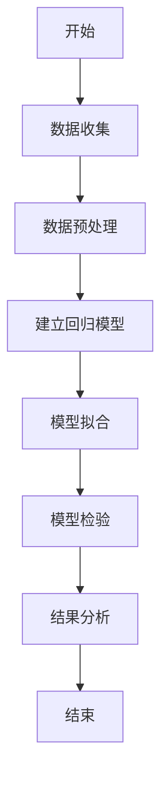
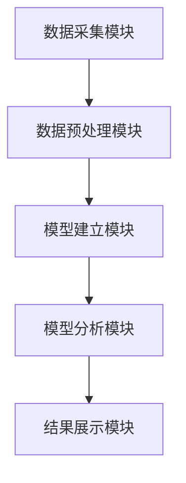
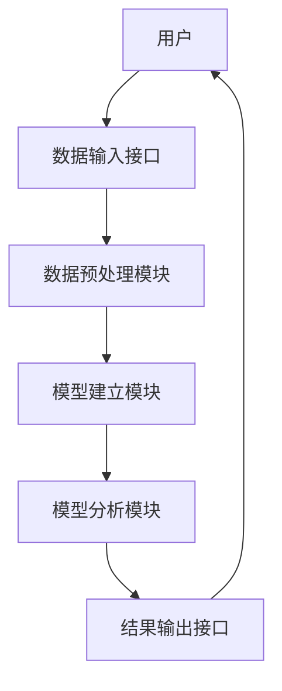

                 


# 杰里米格兰瑟姆的均值回归理论

## 关键词：均值回归，投资分析，资产定价，风险评估，杰里米格兰瑟姆，回归分析

## 摘要：  
杰里米·格兰瑟姆的均值回归理论是统计学和投资分析中的一个重要概念。本文将从均值回归的基本概念出发，详细探讨其数学模型、在投资分析中的应用、系统架构设计以及项目实战案例。通过理论与实践相结合的方式，深入剖析均值回归的原理和实际应用，帮助读者更好地理解和应用这一理论。

---

## 第1章：均值回归理论的背景介绍

### 1.1 均值回归的基本概念  
均值回归（Mean Reversion）是一种统计学原理，认为任何偏离长期趋势的现象最终都会回归到其均值或长期平均水平。这一理论在投资分析、经济预测和风险管理等领域得到了广泛应用。  

#### 1.1.1 什么是均值回归  
均值回归的核心思想是：  
1. **短期波动**：数据在短期内可能偏离均值。  
2. **长期趋势**：数据在长期趋势下会回归到其均值附近。  

例如，在股票市场中，某只股票的价格可能在短期内因市场情绪或新闻影响而大幅波动，但长期来看，其价格会回归到其内在价值。

#### 1.1.2 均值回归的核心假设  
均值回归基于以下假设：  
- 数据具有某种长期趋势或均值。  
- 短期偏离均值的现象是暂时的，最终会回归到均值附近。  
- 数据的波动性可以通过统计方法进行建模和预测。  

#### 1.1.3 均值回归与其他统计方法的区别  
与简单线性回归不同，均值回归关注的是数据围绕均值的波动，而非数据与某一变量的线性关系。例如，均值回归可以用于预测资产价格的短期偏离是否会回归到长期趋势。

### 1.2 杰里米·格兰瑟姆的贡献  
杰里米·格兰瑟姆（Jeremy Grantham）是均值回归理论的重要倡导者之一。他将均值回归应用于投资分析，尤其是资产定价和风险管理领域。  

#### 1.2.1 格兰瑟姆的学术背景  
格兰瑟姆是英国著名的统计学家和投资专家，他的工作为均值回归理论在投资领域的应用奠定了基础。

#### 1.2.2 格兰瑟姆对均值回归理论的贡献  
格兰瑟姆提出了均值回归在资产定价中的应用模型，特别是在分析资产价格波动性和风险时，均值回归理论成为一种重要的工具。

#### 1.2.3 均值回归在投资分析中的应用  
均值回归理论在投资分析中的应用包括：  
- 资产定价模型：预测资产价格是否偏离其长期均值。  
- 风险管理：识别资产价格的短期波动，并制定相应的投资策略。  

---

## 第2章：均值回归的数学模型与算法原理

### 2.1 均值回归的线性模型  
均值回归的数学模型可以用线性回归的形式表示。  

#### 2.1.1 线性回归的基本公式  
均值回归的线性模型可以表示为：  
$$ y = \beta_0 + \beta_1x + \epsilon $$  
其中：  
- \( y \) 是因变量（如资产价格）。  
- \( x \) 是自变量（如时间）。  
- \( \beta_0 \) 是截距项。  
- \( \beta_1 \) 是回归系数。  
- \( \epsilon \) 是误差项。  

#### 2.1.2 残差分析  
残差分析用于评估模型的拟合优度。残差是观测值与预测值之间的差异：  
$$ \hat{y}_i = \beta_0 + \beta_1x_i $$  
$$ e_i = y_i - \hat{y}_i $$  

### 2.2 均值回归的假设检验  
均值回归的假设检验用于验证模型的显著性。  

#### 2.2.1 t检验  
t检验用于检验回归系数是否显著：  
$$ t = \frac{\hat{\beta}_1}{SE(\hat{\beta}_1)} $$  
其中，\( SE(\hat{\beta}_1) \) 是回归系数的标准误差。

#### 2.2.2 F检验  
F检验用于检验整个模型的显著性：  
$$ F = \frac{SSR / k}{SSE / (n - k - 1)} $$  
其中，\( SSR \) 是回归平方和，\( SSE \) 是误差平方和，\( k \) 是回归模型的参数个数，\( n \) 是样本数量。

#### 2.2.3 R平方值的解释  
R平方值衡量模型的拟合优度：  
$$ R^2 = \frac{SSR}{SST} $$  
其中，\( SST \) 是总平方和。

### 2.3 均值回归的流程图  
以下是一个均值回归的流程图：  


---

## 第3章：均值回归在投资分析中的应用

### 3.1 资产定价模型  
均值回归在资产定价中的应用包括：  
- **CAPM模型**：均值回归用于预测资产的预期收益。  
- **资产价格偏离均值的预测**：通过回归分析，预测资产价格是否偏离其长期均值。

#### 3.1.1 均值回归与CAPM模型  
CAPM模型假设资产的预期收益与市场收益相关。均值回归可以用于预测资产价格偏离市场均值的情况。

#### 3.1.2 均值回归在资产定价中的应用实例  
假设我们有一个资产的历史价格数据，我们可以通过均值回归模型预测其未来的价格趋势。

### 3.2 风险评估与投资组合优化  
均值回归在风险评估中的应用包括：  
- 识别资产价格的短期波动性。  
- 评估资产价格的回归风险。  

#### 3.2.1 风险评估  
通过均值回归模型，我们可以评估资产价格的短期波动性，并制定相应的风险管理策略。

#### 3.2.2 投资组合优化  
均值回归可以帮助投资者优化投资组合，降低短期波动性风险。

---

## 第4章：系统分析与架构设计

### 4.1 系统功能设计  
均值回归分析系统的功能包括：  
- 数据采集：收集资产价格数据。  
- 数据预处理：清洗和转换数据。  
- 模型建立：建立均值回归模型。  
- 模型分析：评估模型的显著性和拟合优度。  
- 结果展示：可视化分析结果。

#### 4.1.1 系统功能模块  
- 数据采集模块：从数据库或API获取数据。  
- 数据预处理模块：清洗和转换数据。  
- 模型建立模块：建立均值回归模型。  
- 模型分析模块：评估模型的显著性和拟合优度。  
- 结果展示模块：可视化分析结果。

#### 4.1.2 系统架构图  


### 4.2 接口设计与交互流程  
#### 4.2.1 系统接口设计  
- 数据输入接口：接收资产价格数据。  
- 模型参数配置接口：配置回归模型的参数。  
- 结果输出接口：输出模型分析结果。  

#### 4.2.2 系统交互流程图  


---

## 第5章：项目实战

### 5.1 环境安装与数据收集  
#### 5.1.1 环境安装  
- 安装Python和相关库：`numpy`, `pandas`, `scipy`, `matplotlib`。

#### 5.1.2 数据收集  
从Yahoo Finance获取某只股票的历史价格数据。

### 5.2 均值回归模型实现  
#### 5.2.1 数据预处理  
- 数据清洗：处理缺失值。  
- 数据转换：将数据转换为时间序列格式。

#### 5.2.2 模型实现  
使用Python代码实现均值回归模型。

```python
import numpy as np
import pandas as pd
import matplotlib.pyplot as plt
from statsmodels import regression, stats

# 数据预处理
data = pd.read_csv('stock_prices.csv')
data['date'] = pd.to_datetime(data['date'])
data.set_index('date', inplace=True)

# 建立均值回归模型
y = data['price']
x = np.arange(len(y))

# 线性回归模型
X = sm.add_constant(x)
model = regression.linear_model.OLS(y, X)
results = model.fit()

# 输出回归结果
print(results.summary())

# 可视化分析
plt.plot(x, y, label='Actual Price')
plt.plot(x, results.predict(X), label='Predicted Price')
plt.xlabel('Time')
plt.ylabel('Price')
plt.legend()
plt.show()
```

---

## 第6章：总结与最佳实践

### 6.1 总结  
杰里米·格兰瑟姆的均值回归理论在投资分析中具有重要意义。通过均值回归模型，投资者可以更好地理解资产价格的波动性，并制定相应的投资策略。

### 6.2 最佳实践  
- **数据质量**：确保数据的完整性和准确性。  
- **模型验证**：通过假设检验验证模型的显著性。  
- **风险管理**：基于均值回归模型，制定风险管理策略。  

### 6.3 拓展阅读  
- 《投资学》：深入理解资产定价模型。  
- 《统计学习习》：掌握均值回归的数学原理。  

---

## 作者：AI天才研究院/AI Genius Institute & 禅与计算机程序设计艺术 /Zen And The Art of Computer Programming

