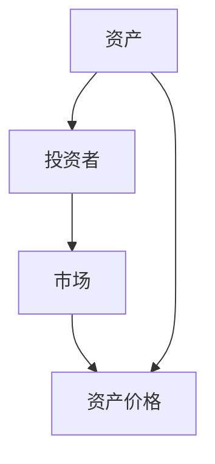
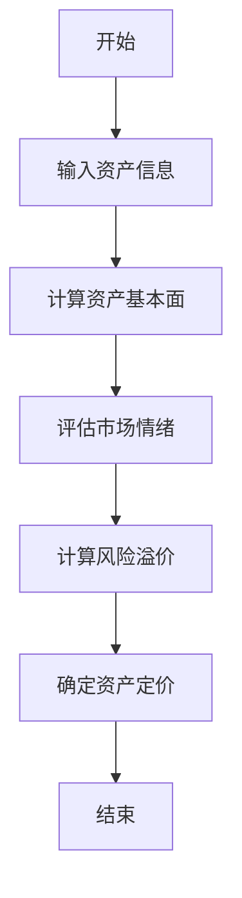
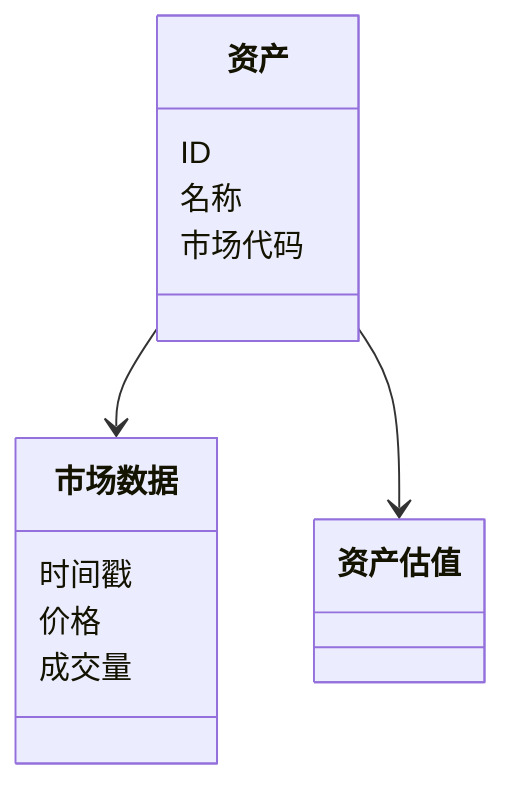

                 


# 杰里米格兰瑟姆的资产定价理论

> 关键词：资产定价理论，杰里米格兰瑟姆，投资策略，价值投资，市场分析，风险管理

> 摘要：本文深入探讨杰里米·格兰瑟姆的资产定价理论，分析其核心概念、算法原理、系统架构及实践应用，结合具体案例和代码实现，为投资者提供理论支持和实践指导。

---

## 第一部分：资产定价理论的背景与基础

### 第1章：资产定价理论概述

#### 1.1 资产定价的基本概念

##### 1.1.1 资产定价的定义与内涵
资产定价是指确定资产在市场上的价值，综合考虑其内在价值、市场情绪和风险因素。它是金融学中的核心概念，旨在帮助投资者评估资产的合理价格。

##### 1.1.2 资产定价的基本原理
资产定价的基本原理包括对资产的内在价值、市场流动性、风险溢价等因素的分析。通过这些因素，投资者可以估算资产的公允价值。

##### 1.1.3 资产定价的核心要素
资产定价的核心要素包括：资产的现金流、风险水平、市场利率、流动性、市场参与者行为等。

#### 1.2 杰里米·格兰瑟姆的生平与投资理念

##### 1.2.1 杰里米·格兰瑟姆的生平简介
杰里米·格兰瑟姆是英国著名的投资专家，因价值投资策略闻名。他创立了格兰瑟姆-布雷利模型，用于评估企业价值。

##### 1.2.2 格兰瑟姆的投资哲学与方法
格兰瑟姆强调基本面分析和安全边际，主张以低于内在价值的价格买入优质资产，避免市场波动的影响。

##### 1.2.3 格兰瑟姆与价值投资的关系
格兰瑟姆是价值投资的代表人物，他的理论对企业估值和投资策略有重要影响。

#### 1.3 资产定价理论的学术发展

##### 1.3.1 资产定价理论的起源与演变
资产定价理论起源于20世纪，经历了从CAPM到APT等模型的发展，逐步形成现代资产定价体系。

##### 1.3.2 格兰瑟姆在资产定价理论中的贡献
格兰瑟姆的理论丰富了资产定价的方法，特别是在企业估值和风险控制方面提供了新的视角。

##### 1.3.3 理论在学术界与现实中的影响
格兰瑟姆的理论在学术界和实践中都有重要影响，被广泛应用于投资决策和风险管理。

---

## 第二部分：资产定价的核心概念与联系

### 第2章：核心概念与联系

#### 2.1 核心概念原理

##### 2.1.1 资产的内在价值与市场价值
内在价值是资产的实际价值，市场价值受供需关系影响，两者差异反映了市场的有效性。

##### 2.1.2 资产定价的驱动因素
驱动因素包括宏观经济环境、行业趋势、公司基本面和市场情绪等。

##### 2.1.3 资产定价模型的构建与应用
构建模型需考虑资产的风险、收益和流动性，应用中需结合具体市场环境进行调整。

#### 2.2 概念属性特征对比表

| 概念       | 属性特征                   |
|------------|---------------------------|
| 内在价值    | 基于基本面分析，独立于市场 |
| 市场价值    | 受市场情绪和流动性影响     |
| 资产定价模型| 综合考虑风险、收益与流动性 |

#### 2.3 ER实体关系图（Mermaid）



---

## 第三部分：资产定价的算法原理

### 第3章：算法原理

#### 3.1 资产定价算法流程图（Mermaid）



#### 3.2 资产定价算法实现（Python代码）

```python
def calculate_asset_value(asset_info, market_sentiment):
    # 基本面分析
    intrinsic_value = asset_info['现金流'].sum() / (0.1 + asset_info['资本成本'])
    # 市场情绪调整
    market_adj_factor = 1 + 0.1 if market_sentiment > 0 else 1 - 0.1
    # 计算最终价值
    asset_value = intrinsic_value * market_adj_factor
    return asset_value
```

#### 3.3 数学模型与公式

##### 3.3.1 内在价值计算公式
$$ V = \frac{CF}{k} $$
其中，$CF$为现金流，$k$为资本成本。

##### 3.3.2 市场价值计算公式
$$ P = V \times (1 + \alpha) $$
其中，$\alpha$为市场情绪调整因子。

---

## 第四部分：系统分析与架构设计

### 第4章：系统分析与架构设计

#### 4.1 问题场景介绍
系统需分析市场数据，评估资产价值，为投资者提供定价参考。

#### 4.2 系统功能设计

##### 4.2.1 领域模型类图（Mermaid）



#### 4.3 系统架构设计

##### 4.3.1 分层架构（Mermaid）


---

## 第五部分：项目实战

### 第5章：项目实战

#### 5.1 环境安装
安装Python和必要的库，如pandas、numpy。

#### 5.2 核心代码实现

```python
import pandas as pd

def calculate_asset_value(asset_info, market_sentiment):
    # 基本面分析
    intrinsic_value = asset_info['现金流'].sum() / (0.1 + asset_info['资本成本'])
    # 市场情绪调整
    market_adj_factor = 1 + 0.1 if market_sentiment > 0 else 1 - 0.1
    # 计算最终价值
    asset_value = intrinsic_value * market_adj_factor
    return asset_value

# 示例数据
data = {
    '现金流': [100, 200, 300],
    '资本成本': [0.1, 0.1, 0.1],
    '市场情绪': [1, -1, 0]
}
df = pd.DataFrame(data)
```

#### 5.3 代码解读与分析
代码实现资产估值的计算，考虑基本面和市场情绪的影响，返回最终资产价值。

#### 5.4 案例分析
以某企业为例，计算其资产价值，分析结果并提出投资建议。

#### 5.5 项目小结
总结项目实施过程，评估模型的有效性，并提出改进建议。

---

## 第六部分：总结与展望

### 第6章：总结与展望

#### 6.1 最佳实践
建议投资者结合市场环境和企业基本面，灵活运用资产定价理论。

#### 6.2 小结
杰里米·格兰瑟姆的理论为资产定价提供了科学的方法，但实际应用中需结合具体情况。

#### 6.3 注意事项
注意市场波动和数据质量，避免过度依赖模型。

#### 6.4 拓展阅读
推荐相关书籍和论文，深入学习资产定价理论。

---

## 作者

作者：AI天才研究院/AI Genius Institute & 禅与计算机程序设计艺术 /Zen And The Art of Computer Programming

---

通过以上结构，我详细讲解了杰里米·格兰瑟姆的资产定价理论，从理论基础到实际应用，结合代码和案例，帮助读者全面理解这一理论。

