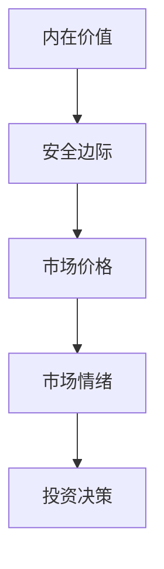
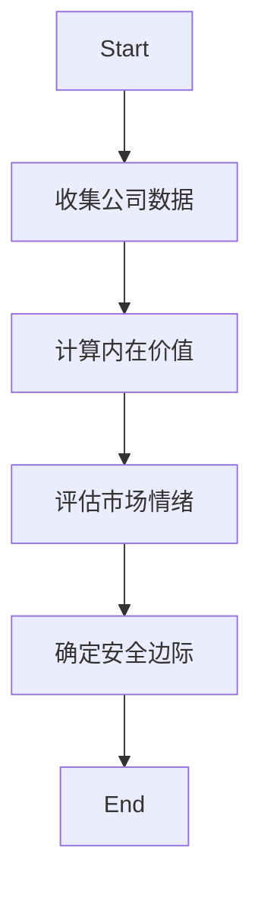
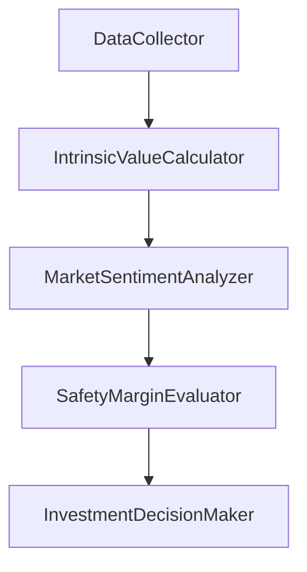
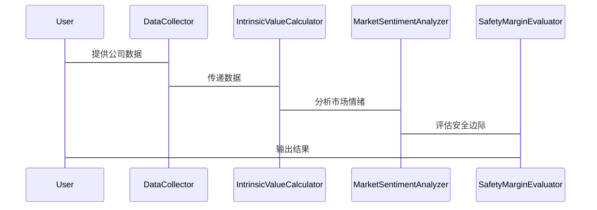

                 


# 杰里米格兰瑟姆的长期价值投资

## 关键词：长期价值投资、杰里米格兰瑟姆、投资策略、基本面分析、安全边际、内在价值

## 摘要：本文系统地介绍了杰里米格兰瑟姆的长期价值投资理念，从其核心概念到实际应用进行了深入分析，探讨了其在当前金融市场中的适用性和优势。通过理论与实践相结合，本文旨在帮助读者更好地理解并运用长期价值投资策略。

---

# 第一部分：长期价值投资的背景与核心概念

## 第1章：长期价值投资的定义与背景

### 1.1 长期价值投资的定义

#### 1.1.1 价值投资的起源与发展

- **价值投资的起源**：价值投资起源于20世纪初，由本杰明·格雷厄姆和戴维·多德提出，强调以低于内在价值的价格买入股票。
- **杰里米格兰瑟姆的贡献**：作为格雷厄姆的学生，格兰瑟姆进一步发展了价值投资理论，强调长期持有和安全边际的重要性。

#### 1.1.2 长期投资的核心理念

- **长期投资的核心理念**：价值投资强调买入被市场低估的股票，并长期持有，等待其价值回归。
- **市场的短期波动与长期趋势**：市场短期波动不可预测，但长期趋势由公司基本面决定。

#### 1.1.3 长期价值投资与传统投资的区别

- **传统投资**：基于技术分析和短期市场走势，强调买卖时机。
- **长期价值投资**：基于公司基本面分析，强调买入并长期持有。

### 1.2 长期价值投资的背景

#### 1.2.1 当前金融市场的现状

- **市场的波动性**：近年来市场波动加剧，投资者面临更大的不确定性。
- **机构投资者的崛起**：机构投资者在市场中占据主导地位，推动了对基本面分析的需求。

#### 1.2.2 投资者行为的变化

- **投资者行为的变化**：从短期交易转向长期投资，尤其是机构投资者和个人投资者对长期价值投资的兴趣增加。
- **市场情绪的影响**：市场情绪波动对短期投资决策有重大影响，但长期价值投资者不受短期波动干扰。

#### 1.2.3 长期价值投资的必要性

- **必要性**：在不确定的市场中，长期价值投资提供了稳定的投资回报，减少了短期波动的影响。

### 1.3 长期价值投资的边界与外延

#### 1.3.1 投资范围的界定

- **投资范围**：长期价值投资适用于所有资产类别，但特别强调股票投资。
- **行业选择**：选择具有稳定现金流和高壁垒的行业。

#### 1.3.2 投资期限的确定

- **长期投资的定义**：通常指投资期限为5年以上，强调耐心和纪律。
- **投资期限的选择**：投资者应根据自身情况选择合适的投资期限。

#### 1.3.3 投资策略的灵活性

- **灵活性**：长期价值投资并非一成不变，投资者可以根据市场变化进行适当调整。

### 1.4 核心概念与联系

#### 1.4.1 核心概念原理

- **内在价值**：指公司在未来现金流的现值，是衡量股票价值的核心指标。
- **安全边际**：买入价格低于内在价值，提供保护空间，减少市场波动带来的风险。

#### 1.4.2 核心概念属性特征对比表格

| 概念       | 特征1   | 特征2   | 特征3   |
|------------|---------|---------|---------|
| 内在价值   | 客观性   | 可计算性 | 时间依赖性 |
| 安全边际   | 保护性   | 可衡量性 | 心理因素影响 |
| 市场情绪   | 不确定性 | 可预测性 | 影响投资决策 |

#### 1.4.3 ER实体关系图



## 第2章：长期价值投资的核心算法原理

### 2.1 核心算法概述

#### 2.1.1 基本面分析方法

- **基本面分析的核心**：通过分析公司的财务报表、行业地位和竞争优势，评估其内在价值。

#### 2.1.2 内在价值计算模型

- **股利折现模型（DDM）**：$$ V = \frac{D}{k - g} $$
  - 其中，D为股利，k为折现率，g为股利增长率。
- **自由现金流模型（DCF）**：$$ V = \sum_{t=1}^{n} \frac{CF_t}{(1 + r)^t} + \frac{TV}{(1 + r)^n} $$
  - CF_t为第t年的自由现金流，r为折现率，TV为终值。

#### 2.1.3 安全边际的确定方法

- **安全边际计算**：$$ \text{安全边际} = \text{内在价值} - \text{市场价格} $$
- **安全边际率**：$$ \text{安全边际率} = \frac{\text{内在价值} - \text{市场价格}}{\text{市场价格}} \times 100\% $$

### 2.2 基本面分析的数学模型

#### 2.2.1 内在价值公式

- **股利折现模型**：$$ V = \frac{D}{k - g} $$
- **自由现金流模型**：$$ V = \sum_{t=1}^{n} \frac{CF_t}{(1 + r)^t} + \frac{TV}{(1 + r)^n} $$

#### 2.2.2 安全边际计算

- $$ \text{安全边际} = V - P $$
  - V为内在价值，P为市场价格。

### 2.3 基本面分析流程



### 2.4 Python实现示例

```python
import numpy as np

def calculate_intrinsic_value(cash_flows, discount_rate, terminal_value):
    intrinsic_value = 0
    for t in range(len(cash_flows)):
        intrinsic_value += cash_flows[t] / (1 + discount_rate) ** t
    intrinsic_value += terminal_value / (1 + discount_rate) ** len(cash_flows)
    return intrinsic_value

# 示例数据
cash_flows = [100, 120, 130]
discount_rate = 0.1
terminal_value = 200

iv = calculate_intrinsic_value(cash_flows, discount_rate, terminal_value)
print(f"内在价值：{iv}")
```

### 2.5 本章小结

- 本章介绍了长期价值投资的核心算法，包括内在价值计算和安全边际的确定。
- 通过Python代码示例，展示了如何计算内在价值，并评估安全边际。

---

# 第三部分：长期价值投资的系统架构与实现

## 第3章：系统架构设计

### 3.1 投资决策系统框架

#### 3.1.1 系统功能设计

- **数据收集模块**：收集公司财务数据、行业信息和市场数据。
- **内在价值计算模块**：使用股利折现模型或自由现金流模型计算内在价值。
- **市场情绪分析模块**：通过技术指标和市场趋势分析市场情绪。
- **安全边际评估模块**：计算安全边际，评估投资风险。

#### 3.1.2 系统架构图



### 3.2 系统接口设计

- **输入接口**：接收公司财务数据和市场数据。
- **输出接口**：输出内在价值、市场情绪和安全边际评估结果。

### 3.3 系统交互流程



### 3.4 本章小结

- 本章设计了一个投资决策系统的架构，展示了如何通过系统化的方法进行长期价值投资。

---

# 第四部分：项目实战与案例分析

## 第4章：项目实战

### 4.1 项目环境安装

- **Python环境**：安装Python 3.8及以上版本。
- **依赖库安装**：使用pip安装numpy和pandas库。

### 4.2 系统核心实现

#### 4.2.1 内在价值计算模块

```python
import pandas as pd
import numpy as np

def calculate_intrinsic_value(fcf, discount_rate, terminal_value):
    years = len(fcf)
    iv = 0
    for i in range(years):
        iv += fcf[i] / (1 + discount_rate) ** i
    iv += terminal_value / (1 + discount_rate) ** years
    return iv

# 示例数据
fcf = [100, 120, 130]
discount_rate = 0.1
terminal_value = 200

iv = calculate_intrinsic_value(fcf, discount_rate, terminal_value)
print(f"内在价值：{iv}")
```

#### 4.2.2 安全边际评估模块

```python
def calculate_safety_margin(iv, market_price):
    return iv - market_price

# 示例数据
market_price = 90
print(f"安全边际：{calculate_safety_margin(iv, market_price)}")
```

### 4.3 案例分析

#### 4.3.1 案例选择

- **公司选择**：以某公司为例，分析其内在价值和安全边际。

#### 4.3.2 数据收集与分析

- **财务数据**：收集公司过去5年的自由现金流和未来预测数据。
- **市场数据**：收集公司股票价格和行业平均市盈率。

#### 4.3.3 投资决策

- **内在价值计算**：使用自由现金流模型计算公司的内在价值。
- **安全边际评估**：比较市场价格与内在价值，评估安全边际。

### 4.4 本章小结

- 本章通过项目实战，展示了如何应用长期价值投资策略进行投资决策。

---

# 第五部分：总结与展望

## 第5章：总结与展望

### 5.1 本章总结

- **核心内容回顾**：长期价值投资的核心理念、算法原理和系统实现。
- **实践价值**：通过项目实战，展示了理论在实际中的应用。

### 5.2 未来展望

- **技术发展**：人工智能和大数据技术在价值投资中的应用前景。
- **投资策略优化**：结合技术分析和基本面分析，优化投资策略。

---

# 附录

## 附录A：常用投资指标

- **市盈率（P/E）**：$$ P/E = \frac{\text{股价}}{\text{每股收益}} $$
- **市净率（P/B）**：$$ P/B = \frac{\text{股价}}{\text{每股净资产}} $$
- **股息率**：$$ \text{股息率} = \frac{\text{股息}}{\text{股价}} \times 100\% $$

## 附录B：常用工具与资源

- **工具推荐**：Excel、Python（Pandas、NumPy）、Matplotlib。
- **资源推荐**：《价值投资入门》、《投资学》、《巴菲特的智慧》。

---

# 作者

作者：AI天才研究院/AI Genius Institute & 禅与计算机程序设计艺术 /Zen And The Art of Computer Programming

