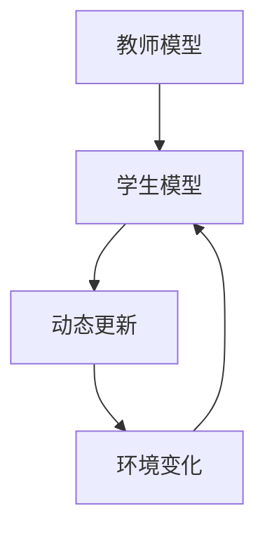
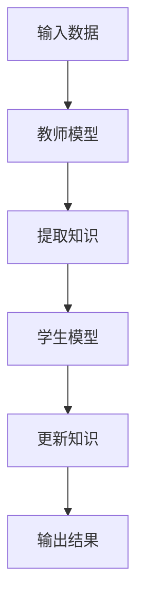
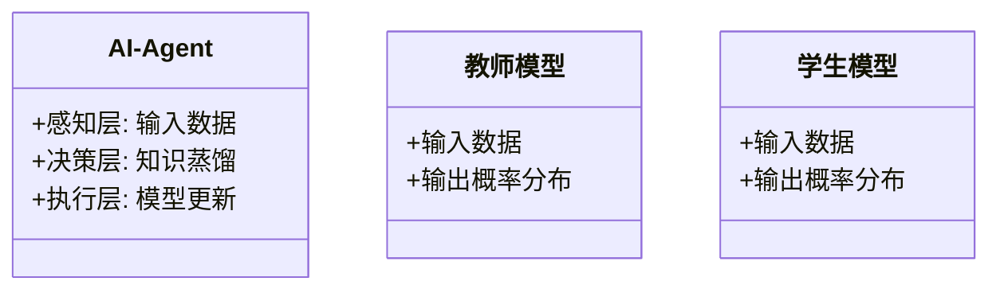
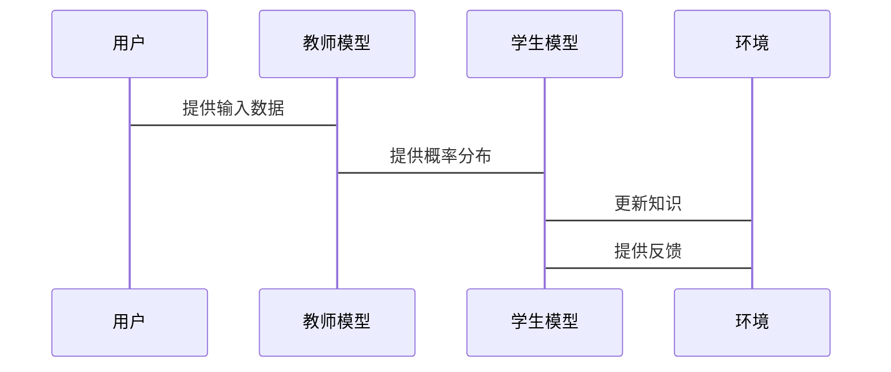

                 


# 《构建AI Agent的动态知识蒸馏机制》

## 关键词：知识蒸馏，AI Agent，动态更新，机器学习，深度学习

## 摘要：  
知识蒸馏是一种有效的技术，用于将大型模型的知识迁移到较小的模型中。动态知识蒸馏在AI Agent中尤为重要，因为它允许模型在动态环境中不断更新和适应。本文将详细探讨动态知识蒸馏的核心概念、算法原理、系统架构，并通过实际案例展示其在AI Agent中的应用。  

---

## 第一部分：AI Agent与知识蒸馏基础

### 第1章：知识蒸馏机制概述

#### 1.1 知识蒸馏的基本概念  
知识蒸馏是一种技术，通过将大型模型（教师模型）的知识迁移到较小的模型（学生模型）中，提升小模型的性能。教师模型通常是一个复杂的模型，而学生模型则是一个简单的模型，通过蒸馏过程，学生模型能够学习到教师模型的知识。  

#### 1.2 动态环境下的知识蒸馏  
在动态环境中，数据、任务或模型本身可能会发生变化。动态知识蒸馏需要模型能够实时更新，以适应这些变化。这使得动态知识蒸馏在实时AI应用中尤为重要，例如自动驾驶、智能客服等领域。  

#### 1.3 AI Agent的基本知识  
AI Agent是一种能够感知环境、做出决策并采取行动的智能体。它通常由感知层、决策层和执行层组成。AI Agent需要能够快速适应环境的变化，而动态知识蒸馏为其提供了高效的知识更新机制。  

---

### 第2章：动态知识蒸馏的核心概念

#### 2.1 动态知识蒸馏的定义与特点  
动态知识蒸馏是一种动态更新知识的机制，能够在模型运行过程中实时更新其知识库。与静态知识蒸馏相比，动态蒸馏更注重实时性和适应性。  

#### 2.2 动态知识蒸馏的核心目标  
动态知识蒸馏的目标是在动态环境中保持模型的性能，同时减少对教师模型的依赖。通过动态更新，模型能够快速适应新的数据和任务。  

#### 2.3 动态知识蒸馏的关键步骤  
1. 数据收集与预处理：从动态环境中收集数据，并进行清洗和预处理。  
2. 知识提取：从教师模型中提取知识，例如概率分布或特征表示。  
3. 动态更新：根据新数据更新学生模型的知识。  
4. 性能评估：评估模型在更新后的性能，并进行调整。  

---

### 第3章：知识蒸馏的核心概念与联系

#### 3.1 静态知识蒸馏与动态知识蒸馏的对比  
| 特性          | 静态知识蒸馏              | 动态知识蒸馏              |  
|---------------|--------------------------|--------------------------|  
| 知识更新频率  | 一次性或周期性            | 实时更新                  |  
| 适应性        | 较低                     | 较高                     |  
| 适用场景      | 稳定环境                 | 动态环境                 |  

#### 3.2 动态知识蒸馏的核心属性  
动态知识蒸馏的核心属性包括：  
1. 实时性：能够快速响应环境的变化。  
2. 灵活性：能够适应多种任务和数据。  
3. 高效性：能够在有限的计算资源下完成更新。  

#### 3.3 动态知识蒸馏的实体关系图  


---

### 第4章：算法原理与数学模型

#### 4.1 知识蒸馏的数学模型  
知识蒸馏的核心是通过损失函数将教师模型的概率分布迁移到学生模型中。损失函数通常包括两部分：  
1. 知识蒸馏损失：衡量学生模型预测与教师模型预测的差异。  
2. 交叉熵损失：衡量学生模型预测与真实标签的差异。  

损失函数可以表示为：  
$$ L = \alpha L_{KL} + (1-\alpha) L_{CE} $$  
其中，$L_{KL}$ 是KL散度，$L_{CE}$ 是交叉熵损失，$\alpha$ 是平衡系数。  

#### 4.2 动态知识蒸馏的算法流程  


#### 4.3 代码实现示例  
以下是一个简单的知识蒸馏代码示例：  
```python
import tensorflow as tf
from tensorflow import keras

# 定义教师模型
teacher_model = keras.Sequential([
    keras.layers.Dense(128, activation='relu'),
    keras.layers.Dense(10, activation='softmax')
])

# 定义学生模型
student_model = keras.Sequential([
    keras.layers.Dense(64, activation='relu'),
    keras.layers.Dense(10, activation='softmax')
])

# 定义损失函数
alpha = 0.5
loss_fn = keras.losses.KLDivergence() * alpha + keras.losses.SparseCategoricalCrossentropy() * (1-alpha)

# 编译模型
teacher_model.compile(optimizer='adam', loss='sparse_categorical_crossentropy')
student_model.compile(optimizer='adam', loss=loss_fn)

# 训练模型
teacher_model.fit(x_train, y_train, epochs=10)
student_model.fit(x_train, y_train, epochs=10)
```

---

## 第五章：系统架构与实现方案

### 5.1 系统架构设计  
AI Agent的动态知识蒸馏系统架构通常包括以下部分：  
1. **感知层**：负责数据的采集和预处理。  
2. **决策层**：负责知识的提取和蒸馏。  
3. **执行层**：负责模型的更新和输出。  

系统架构图如下：  


### 5.2 接口设计与交互流程  


---

## 第六章：项目实战与案例分析

### 6.1 项目环境配置  
需要安装以下库：  
- TensorFlow  
- Keras  
- Mermaid 图形库  

### 6.2 核心代码实现  
以下是一个动态知识蒸馏的Python代码示例：  
```python
import tensorflow as tf
from tensorflow import keras
import numpy as np

# 定义教师模型
class TeacherModel(keras.Model):
    def __init__(self):
        super(TeacherModel, self).__init__()
        self.dense1 = keras.layers.Dense(128, activation='relu')
        self.dense2 = keras.layers.Dense(10, activation='softmax')

    def call(self, inputs):
        x = self.dense1(inputs)
        x = self.dense2(x)
        return x

# 定义学生模型
class StudentModel(keras.Model):
    def __init__(self):
        super(StudentModel, self).__init__()
        self.dense1 = keras.layers.Dense(64, activation='relu')
        self.dense2 = keras.layers.Dense(10, activation='softmax')

    def call(self, inputs):
        x = self.dense1(inputs)
        x = self.dense2(x)
        return x

# 定义损失函数
def loss_fn(y_true, y_pred, alpha=0.5):
    kl_loss = tf.reduce_mean(keras.losses.KLDivergence()(y_true, y_pred))
    ce_loss = tf.reduce_mean(keras.losses.SparseCategoricalCrossentropy()(y_true, y_pred))
    return alpha * kl_loss + (1 - alpha) * ce_loss

# 训练教师模型
teacher_model = TeacherModel()
teacher_model.compile(optimizer='adam', loss='sparse_categorical_crossentropy')
teacher_model.fit(x_train, y_train, epochs=10)

# 训练学生模型
student_model = StudentModel()
student_model.compile(optimizer='adam', loss=lambda y_true, y_pred: loss_fn(y_true, y_pred))
student_model.fit(x_train, y_train, epochs=10)
```

### 6.3 案例分析与详细解读  
通过上述代码示例，我们可以看到动态知识蒸馏的基本实现过程。教师模型和学生模型分别进行训练，损失函数结合了KL散度和交叉熵损失，以平衡知识蒸馏和分类任务。  

---

## 第七章：总结与展望

### 7.1 最佳实践 tips  
1. 在动态环境中，定期更新模型是关键。  
2. 根据任务需求调整损失函数的参数。  
3. 使用高效的优化算法，如Adam。  

### 7.2 小结  
动态知识蒸馏是一种高效的知识更新机制，能够帮助AI Agent在动态环境中保持高性能。通过本文的介绍，读者可以了解动态知识蒸馏的核心概念、算法原理和系统架构，并能够通过实际案例掌握其应用方法。  

### 7.3 未来的研究方向  
1. 研究更高效的动态知识蒸馏算法。  
2. 探讨动态知识蒸馏在多任务学习中的应用。  
3. 结合边缘计算，优化动态知识蒸馏的实时性。  

---

## 作者：AI天才研究院 & 禅与计算机程序设计艺术  

---

感谢您的阅读！希望本文能够帮助您更好地理解动态知识蒸馏机制，并在实际项目中取得成功！

