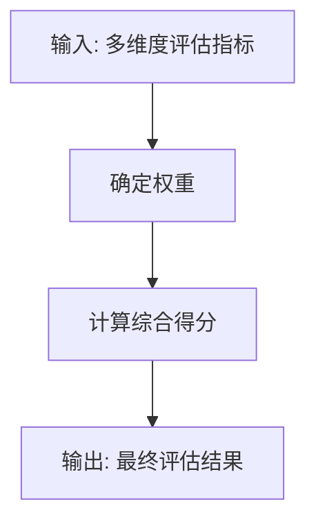
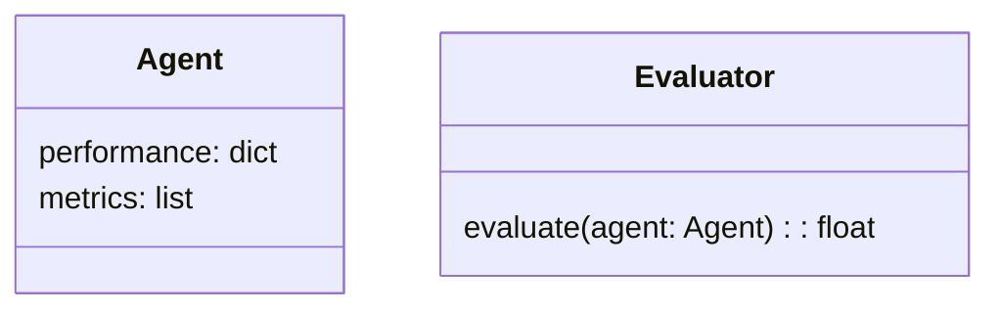
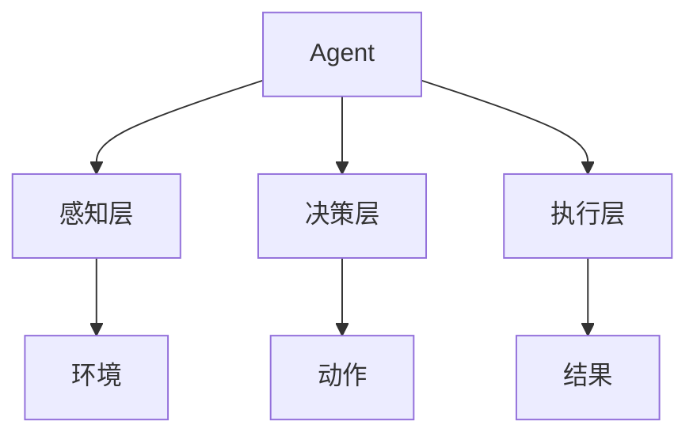
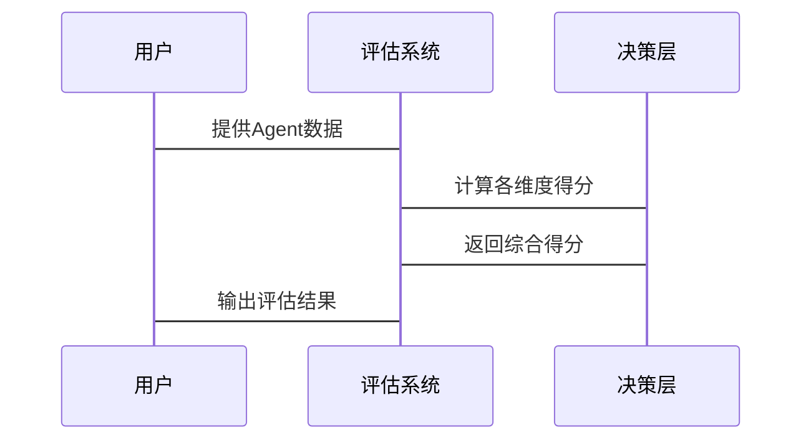

                 


# 构建AI Agent的多维度性能评估体系

> 关键词：AI Agent，性能评估，多维度评估，算法原理，系统架构

> 摘要：  
本文旨在构建一个全面的AI Agent性能评估体系，涵盖智能性、效率、稳定性、可解释性等多个维度。通过分析现有评估方法的不足，提出多维度评估指标，并结合实际案例，详细讲解评估体系的构建方法。文章从背景、核心概念、算法原理、系统架构到项目实战，层层递进，为读者提供系统化的解决方案。

---

# 第一章: 引言

## 1.1 问题背景与目标

### 1.1.1 AI Agent的定义与核心概念
AI Agent（智能体）是能够感知环境并采取行动以实现目标的实体。它具备以下核心特性：
- **自主性**：无需外部干预，自主决策。
- **反应性**：能够实时感知环境并做出反应。
- **目标导向**：通过行动实现预设目标。
- **学习能力**：通过经验改进性能。

### 1.1.2 当前AI Agent应用中的挑战
尽管AI Agent在多个领域展现出巨大潜力，但其性能评估仍存在以下问题：
- **单一性**：传统评估体系往往只关注单一维度，如准确率或响应时间。
- **复杂性**：AI Agent涉及多个性能维度，如何权衡这些维度是一个难题。
- **缺乏统一标准**：现有评估方法缺乏系统性，难以横向比较不同Agent的性能。

### 1.1.3 构建性能评估体系的必要性
为了全面衡量AI Agent的能力，我们需要一个多维度的评估体系，涵盖智能性、效率、稳定性、可解释性等维度，从而为优化和改进提供方向。

---

## 1.2 问题描述

### 1.2.1 AI Agent性能评估的核心目标
评估体系需要实现以下目标：
- **全面性**：覆盖多个性能维度。
- **可量化**：每个维度的评估结果能够量化。
- **可比较**：不同Agent的性能能够横向比较。

### 1.2.2 当前评估体系的不足
现有评估体系主要关注单一维度，例如：
- **准确率**：忽视了效率和可解释性。
- **响应时间**：忽视了智能性和稳定性。

### 1.2.3 多维度评估的必要性
通过多维度评估，可以全面了解AI Agent的优势和劣势，为实际应用提供可靠依据。

---

## 1.3 问题解决与边界

### 1.3.1 解决问题的主要思路
构建一个包含多个评估维度的体系，每个维度赋予不同的权重，综合计算得出最终评估结果。

### 1.3.2 评估体系的边界与外延
- **边界**：仅关注AI Agent本身的性能，不考虑环境的不可抗因素。
- **外延**：可扩展到不同应用场景下的评估维度。

### 1.3.3 核心要素与组成结构
评估体系由以下部分组成：
- **评估维度**：智能性、效率、稳定性、可解释性。
- **评估指标**：每个维度的具体量化指标。
- **权重分配**：各维度的权重。
- **评估方法**：综合计算的方法。

---

# 第二章: 核心概念与联系

## 2.1 核心概念原理

### 2.1.1 AI Agent的基本组成
AI Agent由感知层、决策层、执行层组成：
- **感知层**：收集环境信息。
- **决策层**：分析信息并制定策略。
- **执行层**：执行决策并反馈结果。

### 2.1.2 多维度性能的定义
多维度性能评估体系包含以下维度：
- **智能性**：Agent的决策能力。
- **效率**：完成任务的速度。
- **稳定性**：在复杂环境下的鲁棒性。
- **可解释性**：决策过程的透明性。

### 2.1.3 评估体系的构建逻辑
评估体系的构建逻辑包括：
1. 确定评估维度。
2. 设定每个维度的量化指标。
3. 确定各维度的权重。
4. 综合计算得出最终评估结果。

---

## 2.2 概念属性对比

### 2.2.1 表格形式的核心概念对比
| 维度     | 智能性 | 效率 | 稳定性 | 可解释性 |
|----------|--------|------|--------|----------|
| 定义     | 决策能力 | 速度 | 鲁棒性 | 透明性 |
| 评估指标 | 准确率 | 响应时间 | 错误率 | 解释性得分 |

### 2.2.2 ER实体关系图架构
```mermaid
erd
actor: 用户
agent: AI Agent
dimension: 评估维度
metric: 评估指标
weights: 权重
```

---

## 2.3 算法原理讲解

### 2.3.1 多目标优化算法的流程图


### 2.3.2 详细步骤与代码实现
```python
def calculate_performance(metrics, weights):
    return sum(m * w for m, w in zip(metrics, weights)) / sum(weights)
```

### 2.3.3 举例说明
假设AI Agent在智能性、效率、稳定性、可解释性四个维度上的得分为0.8、0.7、0.9、0.6，权重分别为0.4、0.3、0.2、0.1。计算综合得分为：
$$
综合得分 = 0.8 \times 0.4 + 0.7 \times 0.3 + 0.9 \times 0.2 + 0.6 \times 0.1 = 0.32 + 0.21 + 0.18 + 0.06 = 0.77
$$

---

# 第三章: 算法原理与数学模型

## 3.1 算法原理

### 3.1.1 多目标优化算法的数学模型
$$
f(x) = \sum_{i=1}^{n} w_i x_i
$$
其中，$w_i$ 是第 $i$ 个维度的权重，$x_i$ 是第 $i$ 个维度的评估指标。

### 3.1.2 权重分配方法
权重分配方法包括：
- **等权分配**：每个维度的权重相同。
- **专家评分法**：由专家根据经验确定权重。
- **层次分析法**：通过构建层次分析模型确定权重。

---

## 3.2 算法流程

### 3.2.1 详细步骤与代码实现
```python
def evaluate_agent(agent, weights):
    metrics = [calculate_metric(agent, dim) for dim in dimensions]
    return sum(m * w for m, w in zip(metrics, weights)) / sum(weights)
```

### 3.2.2 举例说明
假设权重为[0.4, 0.3, 0.2, 0.1]，计算综合得分的过程如前所述。

---

## 3.3 数学公式详细推导

### 3.3.1 综合得分计算公式
$$
综合得分 = \frac{\sum_{i=1}^{n} w_i x_i}{\sum_{i=1}^{n} w_i}
$$
其中，$w_i$ 是第 $i$ 个维度的权重，$x_i$ 是第 $i$ 个维度的评估指标。

---

# 第四章: 系统分析与架构设计

## 4.1 问题场景介绍

### 4.1.1 项目背景
本文构建的评估体系适用于多种AI Agent应用场景，如自动驾驶、智能客服等。

### 4.1.2 项目目标
构建一个全面、可量化、可比较的多维度性能评估体系。

### 4.1.3 核心需求
- 支持多种评估维度。
- 支持权重动态调整。
- 支持不同Agent的横向比较。

---

## 4.2 系统功能设计

### 4.2.1 领域模型设计


---

## 4.3 系统架构设计

### 4.3.1 系统架构图


---

## 4.4 系统接口设计

### 4.4.1 接口设计
- **输入接口**：接收Agent的感知数据。
- **输出接口**：输出评估结果。
- **控制接口**：动态调整权重。

---

## 4.5 系统交互设计

### 4.5.1 交互流程


---

# 第五章: 项目实战

## 5.1 环境配置

### 5.1.1 软件环境
- Python 3.8+
- 算法框架：scikit-learn

### 5.1.2 硬件环境
- CPU：Intel i7 或以上
- 内存：8GB 或以上

---

## 5.2 系统核心实现

### 5.2.1 核心代码实现
```python
def calculate_metric(agent, dimension):
    if dimension == '智能性':
        return agent.accuracy
    elif dimension == '效率':
        return agent.response_time
    elif dimension == '稳定性':
        return agent.error_rate
    elif dimension == '可解释性':
        return agent.explainability_score
```

### 5.2.2 代码应用解读与分析
- **输入**：AI Agent的各维度数据。
- **处理**：计算每个维度的得分并加权求和。
- **输出**：综合得分。

---

## 5.3 实际案例分析

### 5.3.1 案例背景
假设我们要评估两个AI Agent（Agent A和Agent B）在智能客服场景中的性能。

### 5.3.2 案例数据
| 维度     | 权重 | Agent A | Agent B |
|----------|------|----------|----------|
| 智能性   | 0.4  | 0.8      | 0.7      |
| 效率     | 0.3  | 0.7      | 0.8      |
| 稳定性   | 0.2  | 0.9      | 0.6      |
| 可解释性 | 0.1  | 0.6      | 0.5      |

### 5.3.3 计算结果
- Agent A的综合得分：
$$
0.8 \times 0.4 + 0.7 \times 0.3 + 0.9 \times 0.2 + 0.6 \times 0.1 = 0.32 + 0.21 + 0.18 + 0.06 = 0.77
$$
- Agent B的综合得分：
$$
0.7 \times 0.4 + 0.8 \times 0.3 + 0.6 \times 0.2 + 0.5 \times 0.1 = 0.28 + 0.24 + 0.12 + 0.05 = 0.69
$$

---

## 5.4 项目小结

通过案例分析可以看出，Agent A在综合性能上优于Agent B，尤其是在智能性和稳定性方面表现突出。

---

# 第六章: 总结与展望

## 6.1 核心结论
本文构建了一个全面的AI Agent多维度性能评估体系，涵盖智能性、效率、稳定性、可解释性等多个维度，并提出了权重分配和综合得分计算方法。

## 6.2 展望
未来的研究方向包括：
- **动态权重调整**：根据应用场景自动调整权重。
- **自适应评估体系**：动态适应Agent的性能变化。
- **多模态评估**：引入更多维度，如情感分析、用户体验等。

---

# 作者

作者：AI天才研究院 & 禅与计算机程序设计艺术

---

通过本文的系统性分析，读者可以全面理解AI Agent的多维度性能评估体系，并将其应用于实际场景中。

