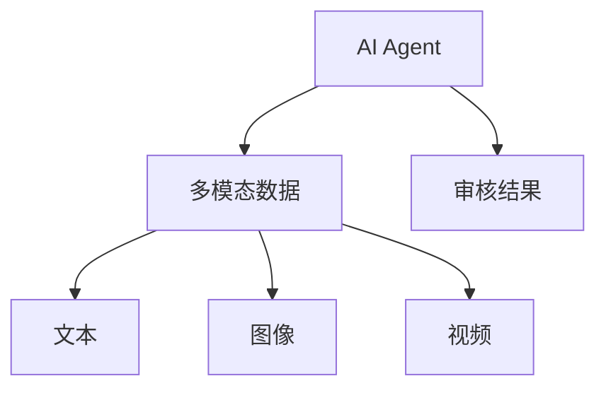
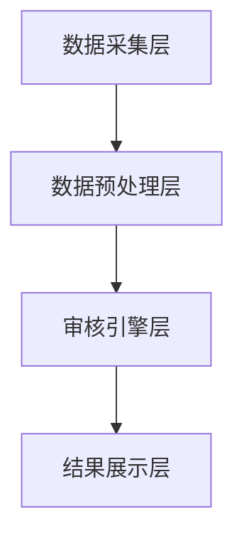
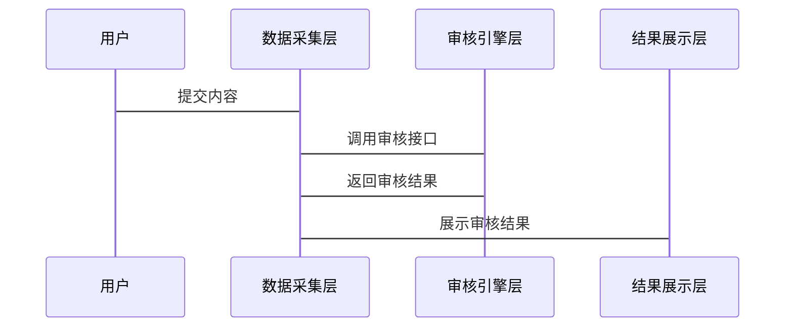

                 


# 构建AI Agent的实时多模态内容审核系统

> 关键词：AI Agent、实时多模态、内容审核、系统架构、算法原理

> 摘要：本文详细探讨了构建AI Agent的实时多模态内容审核系统的各个方面，从核心概念到算法原理，再到系统架构和项目实战，旨在为技术从业者提供深入的理论指导和实践参考。

---

## 第一部分: 背景介绍

### 第1章: 问题背景与核心概念

#### 1.1 问题背景
在当今互联网环境中，内容审核已成为一项至关重要的任务。随着多媒体内容的爆炸式增长，传统的单模态审核方法已难以应对复杂的审核需求。此外，实时性要求的不断提高，使得需要一种更高效、更智能的内容审核方式。

#### 1.2 核心概念与联系
在构建AI Agent的实时多模态内容审核系统中，有几个核心概念需要明确：

1. **AI Agent（人工智能代理）**：AI Agent是一种能够感知环境、执行任务并做出决策的智能实体。
2. **多模态数据处理**：涉及文本、图像、视频等多种数据形式的处理和融合。
3. **实时性**：系统需要在极短时间内完成内容审核，满足实时性要求。

以下是一个核心概念属性特征对比表：

| **概念**       | **定义**                                                                 | **特点**                                                                 |
|----------------|--------------------------------------------------------------------------|--------------------------------------------------------------------------|
| AI Agent       | 能够感知环境、执行任务并做出决策的智能实体                               | 具备自主性、反应性、社会性等特征                                     |
| 多模态数据处理 | 处理多种数据形式（文本、图像、视频等）的技术                               | 需要跨模态融合，复杂性高                                             |
| 实时性         | 系统在极短时间内完成任务的能力                                               | 对延迟要求严格，需优化算法和架构                                     |

以下是实体关系图（Mermaid流程图）：



---

## 第二部分: 核心概念与联系

### 第2章: 多模态数据处理与融合

#### 2.1 多模态数据处理原理
多模态数据处理是指将来自不同模态的数据进行融合，以提高信息提取的准确性和完整性。例如，文本和图像的融合可以提供更丰富的语境信息。

#### 2.2 多模态数据融合算法
- **基于神经网络的多模态融合**：使用深度学习模型（如Transformer）将不同模态的特征进行融合。
- **多模态数据融合的数学模型**：

```latex
$$
\text{融合函数} = f_{\text{融合}}(x_{\text{文本}}, x_{\text{图像}}) = y
$$
```

#### 2.3 实时多模态数据处理的挑战
- **实时性要求**：系统需要在极短时间内完成数据处理和融合。
- **数据同步与延迟优化**：确保多模态数据在处理过程中保持同步，减少延迟。

---

## 第三部分: AI Agent的实时性与响应机制

### 第3章: AI Agent的实时性与响应机制

#### 3.1 实时性要求
实时性要求系统能够在极短时间内完成任务，通常以毫秒级为单位。

#### 3.2 AI Agent的响应机制
- **基于事件驱动的响应**：系统根据特定事件触发审核过程。
- **基于规则的响应**：根据预定义规则进行内容审核。
- **基于模型预测的响应**：利用机器学习模型预测潜在风险。

#### 3.3 实时处理的算法优化
- **流处理技术**：使用流处理框架（如Apache Flink）进行实时数据处理。
- **分布式计算优化**：通过分布式计算减少处理延迟。

---

## 第四部分: 多模态内容审核的算法原理

### 第4章: 多模态内容审核的算法原理

#### 4.1 文本审核算法
- **基于自然语言处理的文本审核**：使用NLP技术（如BERT模型）进行文本分类和情感分析。

#### 4.2 图像审核算法
- **基于计算机视觉的图像审核**：使用目标检测和图像分类算法（如YOLO、ResNet）进行图像审核。

#### 4.3 视频审核算法
- **基于视频分析的审核**：结合图像审核和时间序列分析进行视频内容审核。

---

## 第五部分: 系统分析与架构设计

### 第5章: 系统分析与架构设计

#### 5.1 问题场景介绍
构建一个实时多模态内容审核系统，需要考虑数据来源、处理速度、算法精度等多方面因素。

#### 5.2 系统功能设计
- **用户管理**：管理用户权限和角色。
- **内容管理**：接收和处理多模态内容。
- **审核管理**：展示审核结果并提供反馈。

#### 5.3 系统架构设计
以下是系统架构图（Mermaid架构图）：



#### 5.4 系统接口设计
- **数据采集接口**：接收多模态数据。
- **审核引擎接口**：调用审核算法进行处理。
- **结果展示接口**：展示审核结果。

#### 5.5 系统交互流程
以下是系统交互流程图（Mermaid序列图）：



---

## 第六部分: 项目实战

### 第6章: 项目实战

#### 6.1 环境安装
- 安装必要的开发工具和框架，如Python、TensorFlow、Flink等。

#### 6.2 核心代码实现
以下是核心代码示例：

```python
import tensorflow as tf
from tensorflow.keras import layers

# 多模态数据融合模型
class MultiModalFusion(tf.keras.Model):
    def __init__(self):
        super(MultiModalFusion, self).__init__()
        self.text_encoder = layers.Dense(128)
        self.image_encoder = layers.Dense(128)
        self.fusion_layer = layers.Dense(256)
    
    def call(self, text_features, image_features):
        text_embed = self.text_encoder(text_features)
        image_embed = self.image_encoder(image_features)
        fused = tf.concat([text_embed, image_embed], axis=-1)
        output = self.fusion_layer(fused)
        return output
```

#### 6.3 代码功能解读
- **文本编码器**：将文本特征映射到128维空间。
- **图像编码器**：将图像特征映射到128维空间。
- **融合层**：将文本和图像特征融合为256维向量。

#### 6.4 案例分析
通过实际案例分析，展示系统的应用效果和优化空间。

---

## 第七部分: 最佳实践

### 第7章: 最佳实践

#### 7.1 小结
总结全文内容，强调AI Agent在实时多模态内容审核中的重要性。

#### 7.2 注意事项
- 确保数据隐私和安全。
- 定期更新审核模型以应对新内容。

#### 7.3 拓展阅读
推荐相关领域的书籍和论文，供读者深入学习。

---

## 作者

**作者：AI天才研究院/AI Genius Institute & 禅与计算机程序设计艺术 /Zen And The Art of Computer Programming**

---

**全文完**

