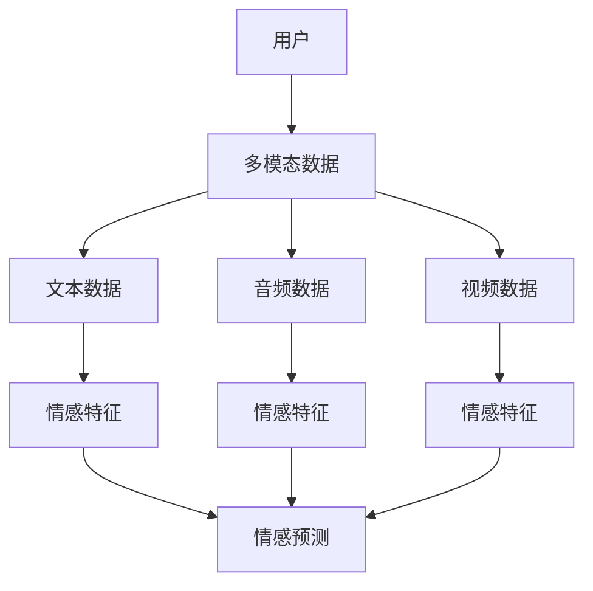
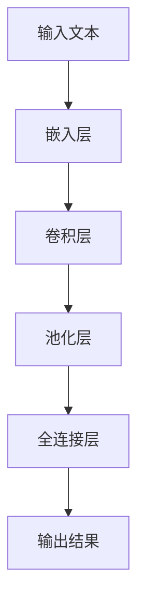
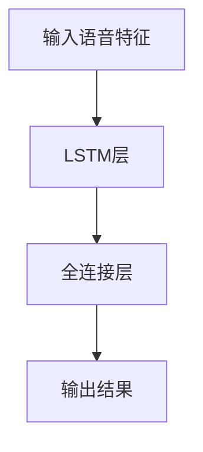
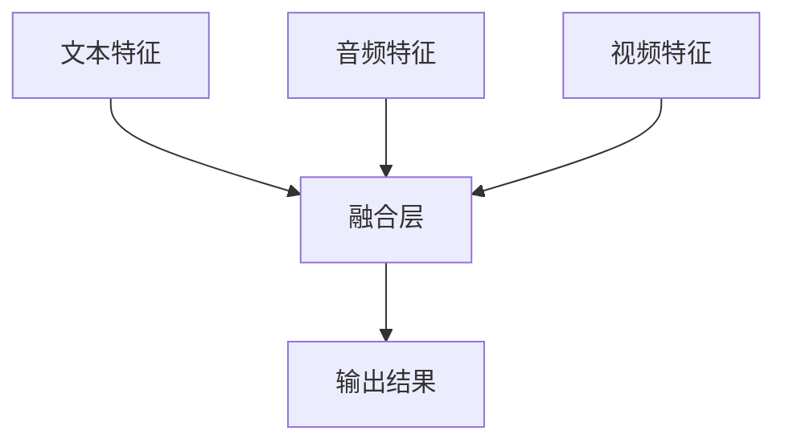
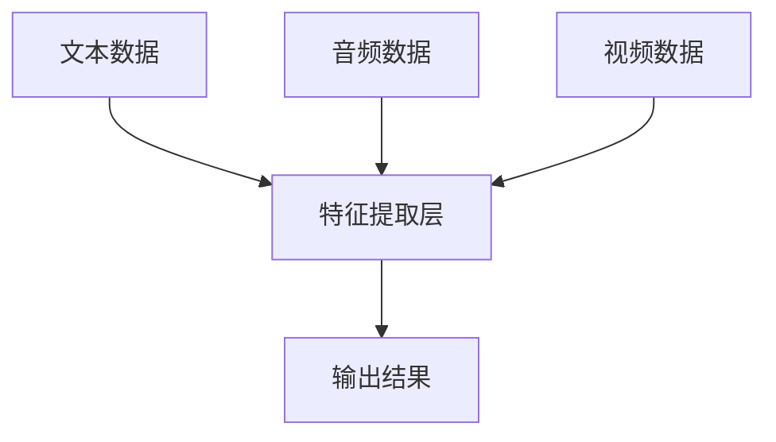
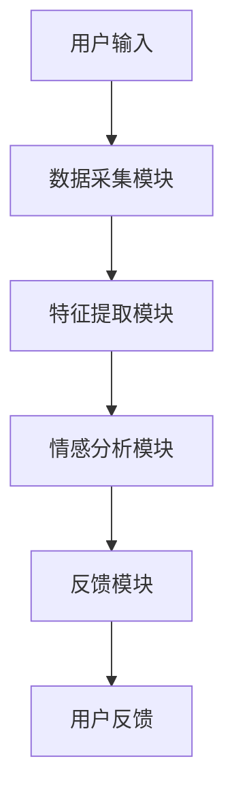
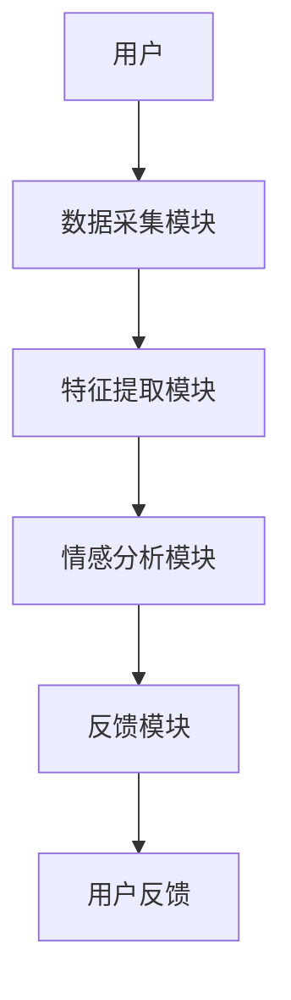

                 


# 构建AI Agent的实时多模态情感识别系统

## 关键词：AI Agent、多模态情感识别、实时处理、深度学习、系统架构

## 摘要：  
本文详细探讨了构建AI Agent的实时多模态情感识别系统的各个方面，包括背景介绍、核心概念、算法原理、系统架构设计、项目实战以及最佳实践。文章从多模态数据的特征分析开始，逐步深入到情感识别算法的实现，最终构建一个完整的实时情感识别系统，并通过实际案例分析和代码示例，帮助读者全面理解如何设计和实现这样一个系统。

---

# 第一部分: 多模态情感识别系统背景与核心概念

## 第1章: 多模态情感识别系统概述

### 1.1 问题背景与描述

#### 1.1.1 情感识别的定义与重要性  
情感识别是通过分析多模态数据（如文本、语音、视频）来识别和理解人类情感状态的技术。在人机交互、智能客服、教育等领域，情感识别能够提升用户体验，提供更个性化的服务。  

#### 1.1.2 多模态数据的引入  
单一模态的数据（如文本或语音）在情感识别中存在局限性。引入多模态数据可以提高识别的准确性和鲁棒性，例如通过结合语音语调和面部表情来更准确地判断情感状态。  

#### 1.1.3 实时处理的必要性  
实时处理能够使AI Agent在与用户的交互过程中快速响应，提供实时的情感反馈，提升用户体验。  

### 1.2 问题解决与边界

#### 1.2.1 情感识别的核心问题  
如何从多模态数据中提取有效特征，并准确识别情感状态。  

#### 1.2.2 多模态数据处理的边界  
数据采集、处理和分析的实时性要求，以及数据隐私和安全问题。  

#### 1.2.3 实时系统的性能要求  
系统需要在低延迟、高吞吐量的条件下完成情感识别任务。  

### 1.3 核心概念与系统架构

#### 1.3.1 多模态数据的融合方式  
- 数据级融合：将多种数据源直接融合后进行分析。  
- 特征级融合：分别提取各模态的特征后再进行融合。  
- 决策级融合：分别对各模态进行预测后再综合结果。  

#### 1.3.2 AI Agent的角色与功能  
AI Agent通过实时分析多模态数据，识别用户情感状态，并根据结果进行相应的反馈或行动。  

#### 1.3.3 系统的模块划分与交互流程  
- 数据采集模块：负责采集文本、语音、视频数据。  
- 特征提取模块：对各模态数据进行特征提取。  
- 情感分析模块：基于融合的特征进行情感识别。  
- 反馈模块：根据识别结果生成反馈。  

---

# 第二部分: 多模态情感识别的核心概念与联系

## 第2章: 多模态数据与情感识别

### 2.1 多模态数据的属性特征对比

| 数据类型 | 文本 | 音频 | 视频 |
|----------|------|------|------|
| 特征维度 | 语义、情感倾向 | 音调、节奏 | 面部表情、动作 |
| 优势 | 精确表达意图 | 传递情感色彩 | 丰富的情感信息 |
| 局限性 | 易受措辞影响 | 易受环境噪声影响 | 计算复杂度高 |

### 2.2 多模态数据的融合方式

#### 2.2.1 数据级融合  
- 示例：将文本和语音数据直接拼接，进行端到端的模型训练。  
- 优点：简单高效。  
- 缺点：特征利用率低。  

#### 2.2.2 特征级融合  
- 示例：分别提取文本的词向量和语音的频域特征，再进行融合。  
- 优点：特征利用率高。  
- 缺点：计算复杂度较高。  

#### 2.2.3 决策级融合  
- 示例：分别对文本和语音进行情感分类，再综合结果。  
- 优点：易于实现。  
- 缺点：结果可能不够精细。  

### 2.3 实体关系图（ER图）



### 2.4 本章小结  
多模态数据的融合方式直接影响情感识别的准确性和效率。通过对比不同融合方式的特点，可以选择最适合应用场景的方式。

---

# 第三部分: 多模态情感识别的算法原理

## 第3章: 情感分析算法原理

### 3.1 情感分析模型

#### 3.1.1 基于文本的CNN模型



- 嵌入层：将文本转换为词向量。  
- 卷积层：提取局部特征。  
- 池化层：降低维度，提取全局特征。  
- 全连接层：分类输出情感结果。  

#### 3.1.2 基于语音的LSTM模型



- LSTM层：捕捉时序特征。  
- 全连接层：分类输出情感结果。  

### 3.2 多模态融合算法

#### 3.2.1 晚期融合模型



- 优点：特征利用率高。  
- 缺点：计算复杂度较高。  

#### 3.2.2 早期融合模型



- 优点：计算复杂度较低。  
- 缺点：特征利用率可能不足。  

---

# 第四部分: 系统分析与架构设计

## 第4章: 系统分析与架构设计

### 4.1 项目场景介绍

- 系统目标：构建一个实时多模态情感识别系统。  
- 应用场景：智能客服、教育辅助、智能家居等。  

### 4.2 系统功能设计

#### 4.2.1 功能模块划分

- 数据采集模块：负责采集文本、语音、视频数据。  
- 特征提取模块：对各模态数据进行特征提取。  
- 情感分析模块：基于融合的特征进行情感识别。  
- 反馈模块：根据识别结果生成反馈。  

#### 4.2.2 系统功能流程



### 4.3 系统架构设计

#### 4.3.1 系统架构图



#### 4.3.2 接口设计

- 数据采集接口：负责接收用户输入。  
- 特征提取接口：负责提取各模态特征。  
- 情感分析接口：负责进行情感识别。  
- 反馈接口：负责生成反馈信息。  

### 4.4 本章小结  
通过模块化设计和合理的接口划分，可以实现系统的高效运行和扩展。

---

# 第五部分: 项目实战

## 第5章: 项目实战

### 5.1 环境安装

- 安装Python、深度学习框架（如TensorFlow、PyTorch）。  
- 安装语音处理库（如 librosa）和视频处理库（如 OpenCV）。  

### 5.2 核心实现

#### 5.2.1 文本特征提取

```python
import numpy as np
from tensorflow.keras.models import Model
from tensorflow.keras.layers import Dense, Input, Dropout, LSTM, TimeDistributed

# 文本特征提取模型
input_text = Input(shape=(None, 100,), dtype='int32')
x = LSTM(64, return_sequences=True)(input_text)
x = TimeDistributed(Dense(32, activation='relu'))(x)
model_text = Model(inputs=input_text, outputs=x)
```

#### 5.2.2 语音特征提取

```python
import librosa

# 语音特征提取
def extract_features(audio_path):
    audio_data, sample_rate = librosa.load(audio_path, sr=None)
    features = librosa.feature.mfcc(y=audio_data, sr=sample_rate, n_mfcc=13)
    return features
```

#### 5.2.3 多模态融合

```python
import numpy as np

# 多模态融合模型
def fuse_features(text_feats, audio_feats):
    fused_feats = np.concatenate([text_feats, audio_feats], axis=-1)
    return fused_feats
```

### 5.3 代码解读与分析

- 文本特征提取：使用LSTM提取文本特征。  
- 语音特征提取：使用 librosa 提取MFCC特征。  
- 多模态融合：将文本和语音特征拼接起来，形成融合特征。  

### 5.4 案例分析

- 输入：用户文本和语音数据。  
- 输出：系统识别的情感状态（如快乐、悲伤）。  

### 5.5 本章小结  
通过实际项目的实现，可以验证系统的可行性和有效性。

---

# 第六部分: 最佳实践与总结

## 第6章: 最佳实践

### 6.1 小结

- 多模态情感识别系统需要综合考虑数据采集、特征提取和模型融合。  
- 实时处理是系统设计的关键，需要优化算法和架构设计。  

### 6.2 注意事项

- 数据隐私和安全问题需要重视。  
- 模型的可解释性需要进一步研究。  
- 系统的鲁棒性需要通过大量测试来提升。  

### 6.3 拓展阅读

- 多模态数据融合的最新研究进展。  
- 基于Transformer的情感识别模型。  
- 实时处理技术的优化方法。  

---

# 作者：AI天才研究院 & 禅与计算机程序设计艺术  
# 结语：通过本文的详细讲解，我们希望读者能够掌握构建AI Agent实时多模态情感识别系统的核心技术和方法，并能够在实际项目中灵活应用这些知识。

