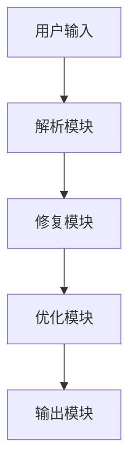
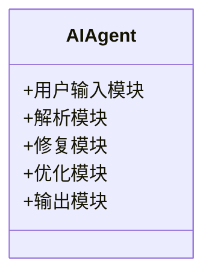
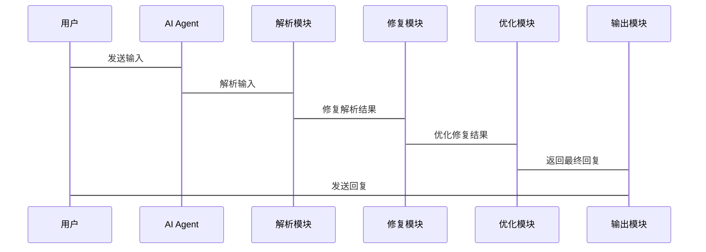

                 


# 构建AI Agent的实时对话修复与优化系统

## 关键词：
AI Agent，实时对话修复，对话优化，自然语言处理，深度学习

## 摘要：
本文详细探讨了构建AI Agent的实时对话修复与优化系统的各个方面。从问题背景到核心概念，从算法原理到系统架构，从项目实战到系统优化，全面解析了构建这样一个系统的必要性、实现方法和应用价值。文章还结合实际案例，给出了详细的代码实现和系统设计，为读者提供了一套完整的解决方案。

---

# 第一部分：背景介绍与问题背景

## 第1章：背景介绍与问题背景

### 1.1 问题背景

#### 1.1.1 当前对话系统面临的挑战
当前的对话系统在实际应用中面临以下问题：
1. 对话延迟高：实时对话系统需要快速响应，但复杂的模型推理过程会导致延迟。
2. 对话准确性低：对话系统在处理复杂语义和上下文时，容易出现错误。
3. 对话修复困难：当对话出现错误时，系统需要快速修复，但现有的修复机制不够完善。
4. 对话优化不足：对话系统在生成回复时，往往不够自然，缺乏上下文连贯性。

#### 1.1.2 实时对话修复与优化的必要性
实时对话修复与优化是解决上述问题的关键，具体体现在以下几个方面：
1. 提高用户体验：通过实时修复和优化对话内容，提升用户对AI Agent的满意度。
2. 增强系统 robustness：通过修复对话中的错误，提高系统的健壮性。
3. 提升系统效率：通过优化对话流程，减少不必要的计算，提高系统效率。

#### 1.1.3 问题解决的边界与外延
实时对话修复与优化的边界在于：
1. 修复范围：仅修复对话中的语法错误和语义错误。
2. 优化目标：优化对话的流畅性和自然性。
3. 系统限制：修复和优化的过程必须在实时对话中完成。

实时对话修复与优化的外延包括：
1. 多轮对话的支持。
2. 多语言对话的支持。
3. 多领域对话的支持。

---

## 第2章：AI Agent的基本原理

### 2.1 AI Agent的定义与分类

#### 2.1.1 AI Agent的定义
AI Agent（人工智能代理）是指能够感知环境并采取行动以实现目标的智能体。AI Agent可以通过与用户的交互，理解和生成自然语言文本，从而实现人机对话。

#### 2.1.2 基于规则的AI Agent
基于规则的AI Agent通过预定义的规则和逻辑来生成回复。其优点是实现简单，但灵活性较差，难以应对复杂场景。

#### 2.1.3 基于模型的AI Agent
基于模型的AI Agent通过深度学习模型（如Transformer、GPT等）生成回复。其优点是灵活性高，能够处理复杂场景，但实现复杂度较高。

#### 2.1.4 基于强化学习的AI Agent
基于强化学习的AI Agent通过与环境的交互，不断优化其行为策略。其优点是能够在复杂环境中自适应调整，但训练过程需要大量数据和计算资源。

### 2.2 对话系统的原理与流程

#### 2.2.1 对话系统的整体流程
1. 用户输入：用户向AI Agent发送输入。
2. 解析输入：AI Agent解析用户的输入，理解其意图和语义。
3. 生成回复：AI Agent基于解析结果生成回复。
4. 输出回复：AI Agent将回复返回给用户。

#### 2.2.2 对话系统的输入输出
- 输入：用户输入的文本或语音信号。
- 输出：AI Agent生成的回复文本或语音信号。

#### 2.2.3 对话系统的评价指标
1. 对话准确率：生成回复与用户意图的匹配程度。
2. 对话延迟：系统生成回复所需的时间。
3. 对话流畅度：回复的自然性和连贯性。

---

# 第二部分：对话修复与优化的核心算法

## 第3章：对话修复与优化的核心算法

### 3.1 对话修复与优化的基本原理

#### 3.1.1 对话修复的目标
对话修复的目标是将用户输入的不完整或错误的对话内容，修复为正确的对话内容。修复过程需要考虑上下文信息，确保修复后的对话内容连贯且符合语法规则。

#### 3.1.2 对话优化的目标
对话优化的目标是将AI Agent生成的回复进行优化，使其更自然、更流畅。优化过程需要考虑对话的上下文信息，确保优化后的回复符合用户的期望。

#### 3.1.3 对话修复与优化的流程
对话修复与优化的流程包括以下步骤：
1. 解析输入：解析用户的输入，理解其意图和语义。
2. 生成候选回复：基于解析结果生成多个候选回复。
3. 修复候选回复：对候选回复进行语法和语义修复。
4. 优化候选回复：对修复后的候选回复进行优化，生成最终回复。

### 3.2 基于生成模型的对话修复

#### 3.2.1 基于生成模型的修复原理
基于生成模型的对话修复通过生成模型（如GPT、Transformer等）生成正确的对话内容。生成模型能够捕捉对话中的上下文信息，生成连贯且自然的回复。

#### 3.2.2 常见的生成模型算法
1. GPT（Generative Pre-trained Transformer）：基于Transformer的生成模型，能够生成高质量的自然语言文本。
2. Transformer：基于Transformer架构的生成模型，具有强大的上下文捕捉能力。
3. BERT（Bidirectional Encoder Representations from Transformers）：基于Transformer的双向编码器，能够理解对话的上下文信息。

#### 3.2.3 生成模型的优缺点
- 优点：生成能力强，能够处理复杂场景。
- 缺点：生成过程可能引入错误，需要额外的修复步骤。

### 3.3 基于检索模型的对话优化

#### 3.3.1 基于检索模型的优化原理
基于检索模型的对话优化通过检索模型（如BM25、DPR等）从预定义的候选集合中检索最合适的回复。检索模型能够快速找到与用户输入最匹配的回复，减少生成错误。

#### 3.3.2 常见的检索模型算法
1. BM25：基于TF-IDF的检索算法，常用于文本检索。
2. DPR（Dense Passage Retrieval）：基于稠密向量的检索算法，能够捕捉文本的语义信息。
3. Hugging Face的Sentence-BERT：基于BERT模型的文本检索算法，能够生成语义向量。

#### 3.3.3 检索模型的优缺点
- 优点：检索速度快，准确率高。
- 缺点：生成能力有限，难以处理复杂场景。

---

## 第4章：系统架构与设计方案

### 4.1 系统架构设计

#### 4.1.1 系统模块划分
AI Agent的实时对话修复与优化系统主要包含以下几个模块：
1. 用户输入模块：接收用户的输入。
2. 解析模块：解析用户的输入，理解其意图和语义。
3. 修复模块：对解析结果进行修复。
4. 优化模块：对修复结果进行优化，生成最终回复。
5. 输出模块：将最终回复返回给用户。

#### 4.1.2 系统架构图


### 4.2 系统功能设计

#### 4.2.1 领域模型设计


#### 4.2.2 系统功能模块
1. 用户输入模块：接收用户的输入。
2. 解析模块：解析用户的输入，理解其意图和语义。
3. 修复模块：对解析结果进行修复。
4. 优化模块：对修复结果进行优化，生成最终回复。
5. 输出模块：将最终回复返回给用户。

### 4.3 系统接口设计

#### 4.3.1 系统接口定义
1. 输入接口：接收用户的输入。
2. 输出接口：返回AI Agent生成的回复。

#### 4.3.2 接口交互流程


---

## 第5章：项目实战与代码实现

### 5.1 环境安装与配置

#### 5.1.1 开发环境的选择
推荐使用Python 3.8及以上版本，安装必要的库，如：
- transformers
- numpy
- pandas
- scikit-learn

#### 5.1.2 必要库的安装
```bash
pip install transformers numpy pandas scikit-learn
```

### 5.2 系统核心实现

#### 5.2.1 对话修复模块的实现
```python
from transformers import AutoTokenizer, AutoModelForCausalLM
import torch

class DialogRepair:
    def __init__(self, model_name="gpt2"):
        self.tokenizer = AutoTokenizer.from_pretrained(model_name)
        self.model = AutoModelForCausalLM.from_pretrained(model_name)
    
    def repair(self, input_text):
        inputs = self.tokenizer(input_text, return_tensors="pt")
        outputs = self.model.generate(**inputs, max_length=50)
        return self.tokenizer.decode(outputs[0], skip_special_tokens=True)
```

#### 5.2.2 对话优化模块的实现
```python
from sentence_transformers import SentenceTransformer
import numpy as np

class DialogOptimization:
    def __init__(self, model_name="bert-base-nli"):
        self.encoder = SentenceTransformer(model_name)
    
    def optimize(self, candidate_responses):
        embeddings = self.encoder.encode(candidate_responses)
        similarity_matrix = np.dot(embeddings, embeddings.T)
        np.fill_diagonal(similarity_matrix, 0)
        best_idx = np.argmax(similarity_matrix, axis=1)
        return [candidate_responses[i] for i in best_idx]
```

---

## 第6章：系统优化与部署

### 6.1 系统优化

#### 6.1.1 性能优化
1. 使用更高效的模型：如较小的GPT模型（如gpt2-medium）。
2. 并行计算：利用多线程或分布式计算加速推理过程。

#### 6.1.2 模型压缩
1. 剪枝：去除模型中冗余的参数。
2. 知识蒸馏：将大模型的知识迁移到小模型中。

### 6.2 系统部署

#### 6.2.1 部署方案
1. 使用云服务：如AWS、Azure、Google Cloud等。
2. 使用容器化技术：如Docker，便于部署和管理。

#### 6.2.2 监控与维护
1. 监控系统性能：如响应时间、错误率等。
2. 定期更新模型：保持模型的性能和准确性。

---

## 第7章：总结与展望

### 7.1 总结
本文详细介绍了构建AI Agent的实时对话修复与优化系统的各个方面，包括问题背景、算法原理、系统架构、项目实战等。通过对生成模型和检索模型的对比分析，提出了一个基于生成模型的对话修复与优化系统，并给出了具体的实现方案。

### 7.2 展望
未来的研究方向包括：
1. 提高系统的实时性：通过优化算法和硬件加速，降低对话延迟。
2. 提升系统的健壮性：通过引入错误检测和自适应机制，增强系统的 robustness。
3. 拓展系统的应用场景：将实时对话修复与优化技术应用于更多领域，如教育、医疗、客服等。

---

## 作者

作者：AI天才研究院/AI Genius Institute & 禅与计算机程序设计艺术 /Zen And The Art of Computer Programming

