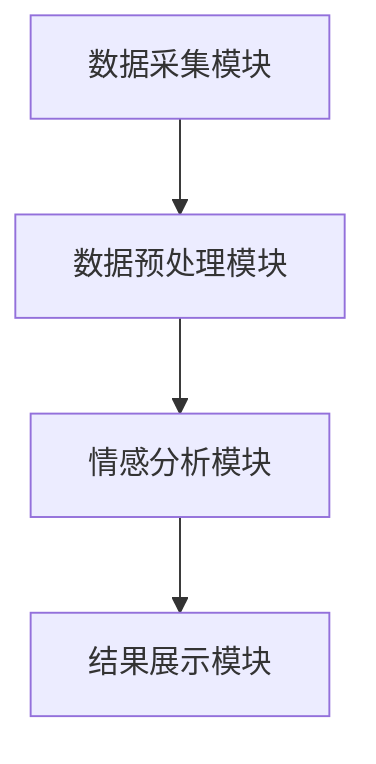

                 


# 构建AI Agent的实时情感分析引擎

> 关键词：AI Agent、情感分析、实时处理、自然语言处理、深度学习、机器学习

> 摘要：本文详细探讨了构建AI Agent实时情感分析引擎的核心技术与实现方法。从情感分析的基本概念到深度学习算法的应用，从系统架构设计到项目实战，全面解析了如何利用自然语言处理技术和机器学习算法，构建一个高效、准确的实时情感分析系统。

---

# 第一部分: AI Agent实时情感分析引擎概述

# 第1章: 情感分析与AI Agent概述

## 1.1 情感分析的定义与背景

### 1.1.1 情感分析的定义
情感分析（Sentiment Analysis）是一种自然语言处理（NLP）技术，旨在识别和分类文本中的情感倾向。情感分析可以将文本分为正面、负面或中性三类，或更细粒度的情绪类别。

### 1.1.2 情感分析的应用场景
情感分析广泛应用于多个领域：
- **社交媒体分析**：分析用户对某个品牌、产品或事件的情感倾向。
- **客户反馈分析**：帮助企业了解客户满意度。
- **金融领域**：分析市场情绪以辅助投资决策。
- **舆情监控**：实时监控网络上的舆论动态。

### 1.1.3 AI Agent与情感分析的关系
AI Agent（智能代理）是一种能够感知环境并采取行动以实现目标的实体。情感分析作为AI Agent的核心能力之一，使其能够理解并处理人类情感，从而提供更智能的服务。

---

## 1.2 AI Agent的核心概念

### 1.2.1 AI Agent的基本定义
AI Agent是一种智能实体，能够通过感知环境、理解输入信息、推理并采取行动来实现目标。AI Agent可以是软件程序、机器人或其他智能系统。

### 1.2.2 AI Agent的分类与特点
AI Agent可以分为以下几类：
- **简单反射型Agent**：基于预定义规则直接响应输入。
- **基于模型的反射型Agent**：利用内部模型理解和推理输入信息。
- **目标驱动型Agent**：根据目标选择最优行动。
- **学习型Agent**：通过机器学习不断优化自身行为。

### 1.2.3 AI Agent在情感分析中的作用
AI Agent通过情感分析能力，能够理解人类情感，从而提供更智能化的服务，例如智能客服、情感支持机器人等。

---

## 1.3 实时情感分析的挑战与意义

### 1.3.1 实时情感分析的挑战
- **数据流的实时性**：需要快速处理大量的实时数据。
- **模型的复杂性**：深度学习模型计算量大，实时推理需要优化。
- **情感表达的多样性**：情感表达方式多种多样，模型需要具备良好的泛化能力。

### 1.3.2 实时情感分析的意义
- **快速响应**：实时情感分析能够快速识别用户情感，提供即时反馈。
- **高效决策**：企业可以实时监控客户情感，及时调整策略。
- **提升用户体验**：通过实时情感分析，AI Agent能够提供更贴心的服务。

---

# 第2章: 情感分析的核心概念与技术

## 2.1 情感分析的分类

### 2.1.1 基于规则的情感分析
基于规则的情感分析通过预定义的规则和关键词来判断情感倾向。例如，检测文本中是否包含正面或负面关键词。

### 2.1.2 基于机器学习的情感分析
基于机器学习的情感分析利用训练好的模型，从文本中提取特征并进行分类。

### 2.1.3 基于深度学习的情感分析
基于深度学习的情感分析利用神经网络模型（如LSTM、Transformer）捕捉文本中的语义信息，实现更精确的情感分类。

---

## 2.2 情感分析的关键技术

### 2.2.1 自然语言处理技术
自然语言处理（NLP）技术是情感分析的核心，包括文本分词、句法分析、语义理解等。

### 2.2.2 机器学习算法
常用的机器学习算法包括支持向量机（SVM）、随机森林（Random Forest）、朴素贝叶斯（Naive Bayes）等。

### 2.2.3 深度学习模型
深度学习模型如LSTM、Transformer等在情感分析中表现出色，能够捕捉复杂的语义信息。

---

## 2.3 情感分析的评价指标

### 2.3.1 准确率与召回率
- **准确率**：正确分类的样本数占总样本数的比例。
- **召回率**：正确分类的正样本数占所有正样本的比例。

### 2.3.2 F1分数
F1分数是准确率和召回率的调和平均数，综合考虑了分类的精确性和召回性。

### 2.3.3 AUC曲线
AUC曲线是评估分类器性能的另一种指标，反映了分类器在不同阈值下的表现。

---

## 2.4 本章小结

---

# 第3章: 情感分析的算法原理

## 3.1 基于传统机器学习的情感分析算法

### 3.1.1 支持向量机（SVM）
SVM是一种常用的分类算法，通过构建超平面将数据分为两类。

### 3.1.2 随机森林（Random Forest）
随机森林是一种基于树的集成学习方法，通过多棵决策树的投票结果进行分类。

### 3.1.3 朴素贝叶斯（Naive Bayes）
朴素贝叶斯基于贝叶斯定理，假设特征之间相互独立，适用于文本分类任务。

---

## 3.2 基于深度学习的情感分析算法

### 3.2.1 循环神经网络（RNN）
RNN通过循环结构处理序列数据，适用于处理文本序列。

### 3.2.2 长短期记忆网络（LSTM）
LSTM通过引入记忆单元，能够更好地捕捉长距离依赖关系。

### 3.2.3 Transformer模型
Transformer模型通过自注意力机制，能够并行处理整个序列，性能优于RNN。

---

## 3.3 情感分析算法的优缺点对比

### 3.3.1 传统机器学习算法的优缺点
- **优点**：计算效率高，易于实现。
- **缺点**：特征工程复杂，难以捕捉语义信息。

### 3.3.2 深度学习算法的优缺点
- **优点**：能够捕捉复杂的语义信息，性能 superior。
- **缺点**：计算资源消耗大，训练时间长。

### 3.3.3 算法选择的依据
根据具体场景和数据特点选择合适的算法，深度学习模型在大数据场景下表现更优。

---

## 3.4 本章小结

---

# 第4章: 情感分析的数学模型与公式

## 4.1 传统机器学习模型的数学基础

### 4.1.1 朴素贝叶斯的数学公式
$$ P(y|x) = \frac{P(x|y)P(y)}{P(x)} $$

### 4.1.2 支持向量机的数学公式
目标是最小化 $||w||$，使得 $y_i(w \cdot x_i + b) \geq 1$。

### 4.1.3 随机森林的数学基础
随机森林通过 bootstrap 抽样和特征随机化构建多棵决策树，最终通过投票或加权的方式进行分类。

---

## 4.2 深度学习模型的数学基础

### 4.2.1 RNN的数学模型
$$ h_t = \tanh(W_{hh}h_{t-1} + W_{xh}x_t + b_h) $$
$$ y_t = W_{hy}h_t + b_y $$

### 4.2.2 LSTM的数学模型
LSTM通过输入门、遗忘门和输出门控制信息的流动。

### 4.2.3 Transformer的数学模型
Transformer通过自注意力机制捕捉文本中的长距离依赖关系。

---

## 4.3 情感分析的损失函数与优化方法

### 4.3.1 交叉熵损失函数
$$ \text{损失} = -\frac{1}{N}\sum_{i=1}^{N} y_i \log p_i + (1-y_i)\log(1-p_i) $$

### 4.3.2 梯度下降算法
常用随机梯度下降（SGD）或Adam优化器进行参数优化。

---

## 4.4 本章小结

---

# 第5章: AI Agent实时情感分析的系统架构设计

## 5.1 系统架构概述

### 5.1.1 数据采集模块
负责实时采集文本数据，例如社交媒体帖子、客户评论等。

### 5.1.2 数据预处理模块
对采集的数据进行清洗、分词、去停用词等处理。

### 5.1.3 情感分析模块
利用训练好的模型对文本进行情感分类。

### 5.1.4 结果展示模块
将情感分析结果可视化，例如生成情感趋势图。

---

## 5.2 系统架构的实现细节

### 5.2.1 数据流的实时处理
使用流处理框架（如Flink）进行实时数据处理。

### 5.2.2 模型的实时推理
优化模型以适应实时推理的需求，例如使用轻量级模型或分布式计算。

### 5.2.3 系统的可扩展性
通过容器化（如Docker）和微服务架构设计，提高系统的可扩展性。

---

## 5.3 系统架构的Mermaid图



---

## 5.4 本章小结

---

# 第6章: 项目实战——构建AI Agent实时情感分析引擎

## 6.1 项目背景与目标
本项目旨在构建一个基于深度学习的情感分析引擎，能够实时处理大规模文本数据。

## 6.2 项目环境与工具
- **编程语言**：Python
- **深度学习框架**：TensorFlow/PyTorch
- **实时数据处理**：Kafka、Flink
- **可视化工具**：Dash、Plotly

---

## 6.3 核心代码实现

### 6.3.1 数据预处理代码
```python
import pandas as pd
from sklearn.model_selection import train_test_split
from sklearn.feature_extraction.text import TfidfVectorizer
from sklearn.svm import SVC

# 加载数据
data = pd.read_csv('sentiment_data.csv')
X_train, X_test, y_train, y_test = train_test_split(data['text'], data['label'], test_size=0.2)

# 特征提取
vectorizer = TfidfVectorizer(max_features=5000)
X_train_vec = vectorizer.fit_transform(X_train)
X_test_vec = vectorizer.transform(X_test)

# 训练模型
model = SVC(C=1.0, gamma=0.001)
model.fit(X_train_vec, y_train)
```

### 6.3.2 深度学习模型实现
```python
import tensorflow as tf
from tensorflow.keras.models import Sequential
from tensorflow.keras.layers import Dense, LSTM, Embedding

model = Sequential()
model.add(Embedding(input_dim=词汇表大小, output_dim=嵌入维度, input_length=序列长度))
model.add(LSTM(units=128, return_sequences=False))
model.add(Dense(units=3, activation='softmax'))
model.compile(loss='sparse_categorical_crossentropy', optimizer='adam', metrics=['accuracy'])
model.fit(X_train, y_train, epochs=5, batch_size=32)
```

---

## 6.4 项目小结

---

# 第7章: 最佳实践与注意事项

## 7.1 最佳实践
- **数据预处理**：确保数据质量，去除噪音数据。
- **模型优化**：通过超参数调优和模型融合提升性能。
- **实时处理**：优化模型推理速度，减少延迟。

## 7.2 注意事项
- **数据隐私**：注意保护用户数据隐私。
- **模型鲁棒性**：确保模型在面对极端情况时仍能正常工作。
- **系统扩展性**：设计可扩展的架构，应对数据规模的增长。

---

# 第8章: 总结与展望

## 8.1 本章总结
本文详细探讨了构建AI Agent实时情感分析引擎的核心技术与实现方法，从情感分析的基本概念到深度学习算法的应用，从系统架构设计到项目实战，全面解析了如何利用自然语言处理技术和机器学习算法，构建一个高效、准确的实时情感分析系统。

## 8.2 未来展望
未来，随着深度学习技术的不断发展，情感分析将更加智能化和精细化。同时，实时情感分析将在更多领域得到应用，为企业和个人提供更智能的服务。

---

# 作者：AI天才研究院/AI Genius Institute & 禅与计算机程序设计艺术 /Zen And The Art of Computer Programming

