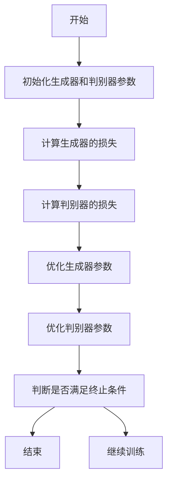
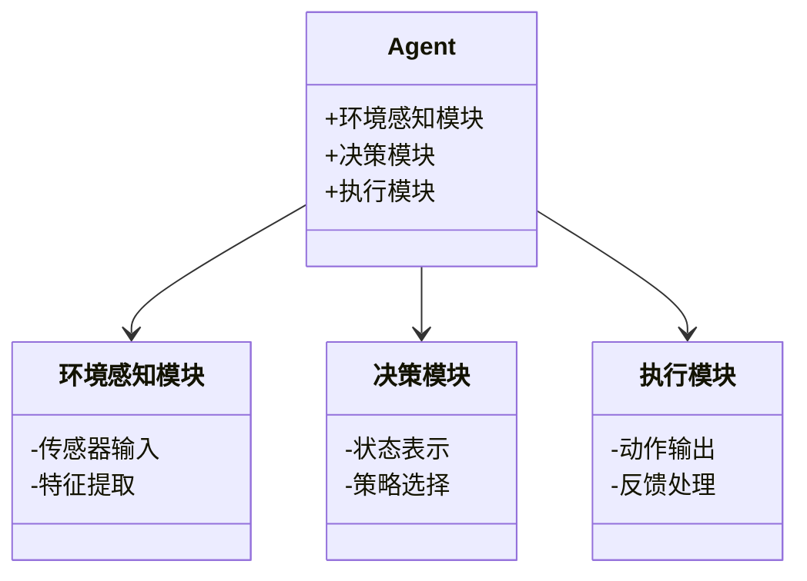
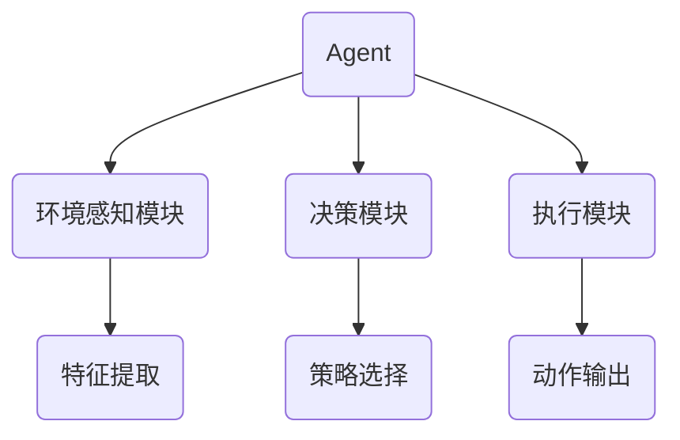

                 


# 构建AI Agent的对抗学习机制：提高鲁棒性

## 关键词：AI Agent, 对抗学习, 鲁棒性, 深度学习, 强化学习

## 摘要

在AI Agent的开发过程中，对抗学习机制是一种有效的策略，能够显著提高其鲁棒性。本文详细探讨了对抗学习的基本原理、在AI Agent中的应用场景，以及如何通过对抗训练提升模型的鲁棒性。文章从背景介绍到算法实现，再到项目实战，逐步引导读者理解对抗学习机制的重要性，并提供实践指导。

---

## 第一部分：对抗学习机制的背景与核心概念

### 第1章：对抗学习机制的背景与重要性

#### 1.1 对抗学习机制的定义与特点

**1.1.1 对抗学习机制的基本概念**

对抗学习（Adversarial Learning）是一种机器学习技术，通过两个或多个模型（生成器和判别器）之间的对抗训练，推动生成模型不断改进，使其生成的数据更接近真实数据分布。在AI Agent中，对抗学习机制可以用于增强其环境感知和决策能力，从而提高鲁棒性。

**1.1.2 对抗学习机制的核心特点**

- **零和博弈**：生成器和判别器在对抗过程中，生成器试图欺骗判别器，判别器则试图识别生成器生成的数据。
- **反馈机制**：通过不断迭代优化，生成器和判别器的能力逐步提升，形成正反馈循环。
- **鲁棒性提升**：通过对抗训练，模型在面对多样化的输入时表现更稳定。

**1.1.3 对抗学习机制在AI Agent中的重要性**

AI Agent需要在复杂的动态环境中做出决策，对抗学习机制能够帮助其更好地处理不确定性，提高其适应能力和鲁棒性。

---

#### 1.2 AI Agent的鲁棒性需求

**1.2.1 AI Agent的基本概念与应用场景**

AI Agent是一种智能体，能够在环境中感知、推理、规划并执行动作以实现目标。其应用场景包括自动驾驶、智能客服、机器人控制等。

**1.2.2 鲁棒性在AI Agent中的意义**

鲁棒性指AI Agent在面对环境变化、噪声干扰等情况时仍能正常工作的能力。对抗学习机制通过增强模型的泛化能力，提升其鲁棒性。

**1.2.3 对抗学习机制如何提升鲁棒性**

通过对抗训练，生成器能够生成多样化的输入数据，使得判别器在识别这些数据时，必须具备较高的判别能力。这一过程使得AI Agent能够更好地处理不同类型的输入，从而提高其鲁棒性。

---

#### 1.3 对抗学习机制的背景与问题背景

**1.3.1 当前AI Agent面临的挑战**

AI Agent在复杂环境中可能面临数据稀疏性、噪声干扰等问题，影响其决策能力。

**1.3.2 对抗学习机制的提出与目标**

为了解决这些问题，对抗学习机制被引入，其目标是通过生成器和判别器的对抗训练，提高模型的鲁棒性。

**1.3.3 对抗学习机制的应用场景与边界**

对抗学习机制适用于需要处理多样化和对抗性输入的场景，如图像识别、自然语言处理等。其边界包括数据质量和模型复杂度等因素。

---

## 第二部分：对抗学习机制的核心概念与原理

### 第2章：对抗学习机制的核心概念

#### 2.1 对抗学习机制的原理

**2.1.1 对抗训练的基本原理**

对抗训练通过优化两个目标函数（生成器和判别器）来实现模型的优化。生成器的目标是生成能够欺骗判别器的数据，而判别器的目标是区分真实数据和生成数据。

**2.1.2 生成器与判别器的对抗过程**

生成器和判别器在对抗训练中交替优化，生成器生成的数据逐渐接近真实数据分布，判别器的判别能力逐步提升。

**2.1.3 对抗网络的结构与功能**

对抗网络通常由生成器和判别器两部分组成，生成器负责生成数据，判别器负责判别数据的真伪。

---

#### 2.2 对抗学习机制的关键要素

**2.2.1 对抗目标函数**

对抗训练的目标函数通常包括生成器的损失函数和判别器的损失函数。

**2.2.2 生成器与判别器的优化方法**

通常使用梯度下降方法分别优化生成器和判别器的参数。

**2.2.3 对抗网络的结构与功能对比**

| 特性         | 生成器                          | 判别器                          |
|--------------|---------------------------------|---------------------------------|
| 目标         | 生成能够欺骗判别器的数据         | 区分真实数据和生成数据           |
| 输入         | 噪声或随机向量                  | 真实数据或生成数据               |
| 输出         | 生成数据                        | 判别结果（真实或生成）           |

---

#### 2.3 对抗学习机制与其他增强学习方法的对比

**2.3.1 对抗学习机制与强化学习的对比**

| 特性         | 对抗学习机制                   | 强化学习                       |
|--------------|--------------------------------|--------------------------------|
| 目标         | 生成器与判别器的对抗            | 剂量与环境的交互                |
| 反馈机制     | 判别器的输出                   | 奖励或惩罚信号                  |
| 应用场景     | 图像生成、语音合成             | 游戏AI、机器人控制              |

---

## 第三部分：对抗学习机制的算法原理

### 第3章：对抗学习机制的算法实现

#### 3.1 对抗训练的流程

**3.1.1 算法流程图**



---

#### 3.2 对抗训练的数学模型

**3.2.1 生成器的损失函数**

$$ \mathcal{L}_G = -\mathbb{E}_{z \sim p_z(z)} [\log(1 - D(G(z))) ] $$

**3.2.2 判别器的损失函数**

$$ \mathcal{L}_D = -\mathbb{E}_{x \sim p_data(x)} [\log(D(x))] - \mathbb{E}_{z \sim p_z(z)} [\log(1 - D(G(z))) ] $$

---

#### 3.3 对抗训练的优化过程

**3.3.1 Adam优化器**

使用Adam优化器分别优化生成器和判别器的参数，设置学习率和动量参数。

$$ \theta_{t+1} = \theta_t - \eta \nabla_{\theta} \mathcal{L}(\theta_t) $$

---

## 第四部分：AI Agent的系统分析与架构设计

### 第4章：AI Agent的系统架构设计

#### 4.1 系统功能设计

**4.1.1 领域模型**



---

#### 4.2 系统架构设计

**4.2.1 系统架构图**



---

## 第五部分：项目实战

### 第5章：对抗学习机制的项目实现

#### 5.1 环境安装

安装必要的Python库，如TensorFlow或PyTorch。

```bash
pip install numpy tensorflow matplotlib
```

---

#### 5.2 核心代码实现

**5.2.1 生成器代码**

```python
import tensorflow as tf

def generator(z, hidden_units=256, output_units=784):
    with tf.variable_scope('generator'):
        h1 = tf.layers.dense(z, hidden_units, activation=tf.nn.relu)
        output = tf.layers.dense(h1, output_units, activation=tf.nn.sigmoid)
        return output
```

**5.2.2 判别器代码**

```python
def discriminator(x, hidden_units=256):
    with tf.variable_scope('discriminator'):
        h1 = tf.layers.dense(x, hidden_units, activation=tf.nn.relu)
        output = tf.layers.dense(h1, 1, activation='sigmoid')
        return output
```

---

#### 5.3 实际案例分析

通过训练生成器和判别器，展示对抗学习机制在图像生成中的应用，并分析其对AI Agent鲁棒性提升的效果。

---

## 第六部分：总结与扩展

### 第6章：总结与未来展望

#### 6.1 最佳实践 tips

- 合理设置生成器和判别器的参数
- 使用合适的优化算法和学习率
- 定期评估模型的鲁棒性

---

## 作者

作者：AI天才研究院/AI Genius Institute & 禅与计算机程序设计艺术 /Zen And The Art of Computer Programming

---

希望这篇文章能够帮助读者深入理解对抗学习机制在AI Agent中的应用，并提升其鲁棒性。

