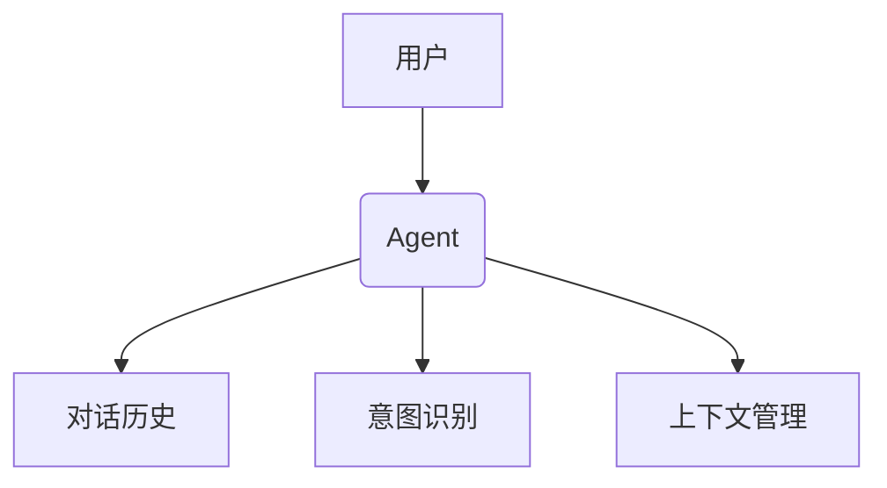
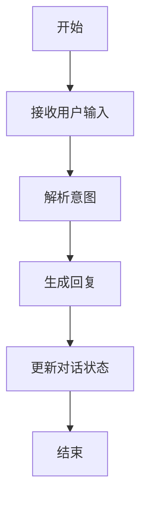
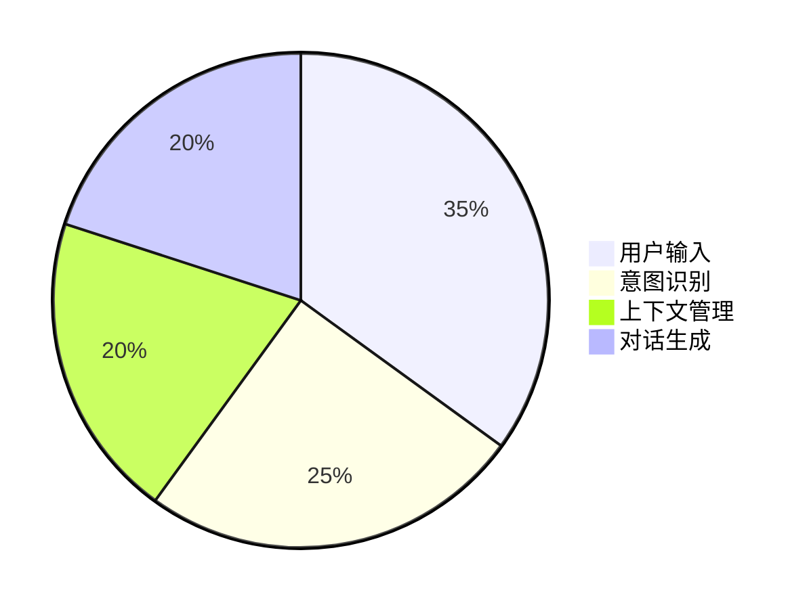

                 


# 《构建AI Agent的对话流管理系统：提升交互流畅度》

## 关键词：AI Agent, 对话流管理, 交互流畅度, 自然语言处理, 系统架构设计, 算法原理

## 摘要：本文详细探讨了AI Agent对话流管理系统的构建方法，从核心概念、算法原理到系统架构设计，结合实际案例，分析如何提升对话交互的流畅度。文章深入解析了对话流管理的理论基础，详细阐述了其实现过程，并提供了实践指导和优化建议。

---

## 第1章：AI Agent对话流管理概述

### 1.1 问题背景与挑战
#### 1.1.1 对话流畅性问题的背景
随着AI Agent在客服、教育、医疗等领域的广泛应用，对话流畅性成为提升用户体验的关键。当前系统中，对话中断、意图识别错误等问题频发，严重影响了交互体验。

#### 1.1.2 当前对话系统的主要挑战
- **意图识别误差**：用户输入多样，系统难以准确捕捉意图。
- **对话上下文管理不足**：无法有效维护对话历史，导致回复缺乏连贯性。
- **对话状态跟踪不准确**：系统对对话进展的监控不够细致，影响回复策略。

#### 1.1.3 对话流畅性的定义与度量
对话流畅性指对话过程的自然、连贯和高效。度量指标包括用户满意度、任务完成率、对话轮数等。

### 1.2 对话流管理的核心概念
#### 1.2.1 对话流管理的定义
对话流管理是对对话过程的监控和调控，确保对话按预期进行，提升交互体验。

#### 1.2.2 对话流管理的关键要素
- **对话历史记录**：存储用户和系统的交互记录。
- **意图识别**：准确解析用户的输入意图。
- **上下文管理**：维护对话中的上下文信息。
- **对话策略**：制定对话的引导和推进策略。

#### 1.2.3 对话流管理的边界与外延
对话流管理专注于对话过程的优化，边界包括用户输入处理和系统反馈生成，外延涉及自然语言处理、机器学习等技术。

---

## 第2章：对话流管理的核心概念与联系

### 2.1 核心概念原理
#### 2.1.1 对话流管理的原理
通过分析对话历史和上下文，系统实时调整对话策略，确保对话流畅。

#### 2.1.2 对话流管理的特征分析
- **实时性**：快速响应用户输入。
- **上下文依赖性**：依赖对话历史信息。
- **动态调整能力**：根据对话进展实时优化策略。

#### 2.1.3 对话流管理的实现机制
- **事件驱动**：用户输入触发系统处理。
- **状态跟踪**：维护对话状态，指导后续处理。

### 2.2 实体关系图


---

## 第3章：对话流管理的算法原理

### 3.1 算法流程


### 3.2 数学模型与公式
#### 3.2.1 概率模型
$$ P(\text{intent} | \text{input}) = \frac{P(\text{input} | \text{intent})P(\text{intent})}{\sum_{i} P(\text{input} | i)P(i)} $$

#### 3.2.2 基于马尔可夫链的对话状态转移
$$ S_{t+1} = \text{f}(S_t, U_t) $$

### 3.3 示例与解释
- 示例：用户输入“我饿了”，系统解析意图“寻找餐馆”，生成回复“您想吃什么类型的餐馆？”

---

## 第4章：系统分析与架构设计

### 4.1 问题场景介绍
#### 4.1.1 对话流管理的应用场景
- **智能客服**：处理用户咨询。
- **教育助手**：提供学习指导。
- **医疗咨询**：辅助用户与医生沟通。

### 4.2 系统功能设计
#### 4.2.1 用户交互界面
- 支持文本输入和语音输入。
- 提供实时反馈和修正选项。

#### 4.2.2 对话历史记录
- 存储所有对话内容。
- 提供历史查询功能。

#### 4.2.3 意图识别模块
- 使用NLP技术分析用户输入。
- 输出意图标签和置信度。

#### 4.2.4 上下文管理模块
- 维护对话中的上下文信息。
- 提供信息检索功能。

### 4.3 系统架构设计


### 4.4 系统接口设计
#### 4.4.1 输入接口
- RESTful API：支持JSON格式请求。
- WebSocket：实时通信。

#### 4.4.2 输出接口
- 文本回复：JSON格式。
- 语音回复：支持多种格式。

---

## 第5章：项目实战

### 5.1 环境安装
- 安装Python 3.8及以上。
- 安装必要的库：TensorFlow、NLTK、Flask。

### 5.2 系统核心实现源代码
```python
from flask import Flask, request, jsonify

app = Flask(__name__)

@app.route('/api/agent', methods=['POST'])
def process_request():
    data = request.json
    user_input = data['message']
    # 模拟意图识别
    intent = identify_intent(user_input)
    # 生成回复
    response = generate_response(intent)
    return jsonify({'message': response})

if __name__ == '__main__':
    app.run(debug=True)
```

### 5.3 代码应用解读与分析
- **identify_intent**函数：使用训练好的模型识别用户意图。
- **generate_response**函数：根据意图生成回复，考虑上下文信息。

### 5.4 实际案例分析
- 案例：用户咨询产品信息，系统识别意图“查询产品详情”，并提供详细信息。

---

## 第6章：总结与展望

### 6.1 最佳实践 tips
- 定期更新模型，保持意图识别的准确性。
- 维护良好的对话历史记录，提升回复的连贯性。

### 6.2 小结
对话流管理是提升AI Agent交互流畅度的关键，通过优化算法和架构设计，可以显著提升用户体验。

### 6.3 注意事项
- 注意保护用户隐私，确保数据安全。
- 及时处理异常情况，防止对话中断。

### 6.4 拓展阅读
- 推荐书籍：《自然语言处理实战》、《深度学习》。
- 推荐课程：Coursera上的相关课程。

---

## 作者：AI天才研究院/AI Genius Institute & 禅与计算机程序设计艺术 /Zen And The Art of Computer Programming

