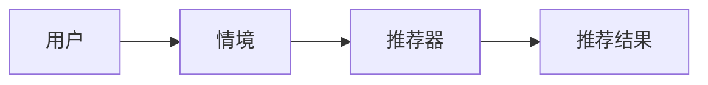
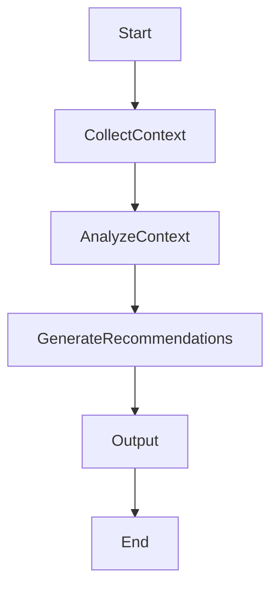
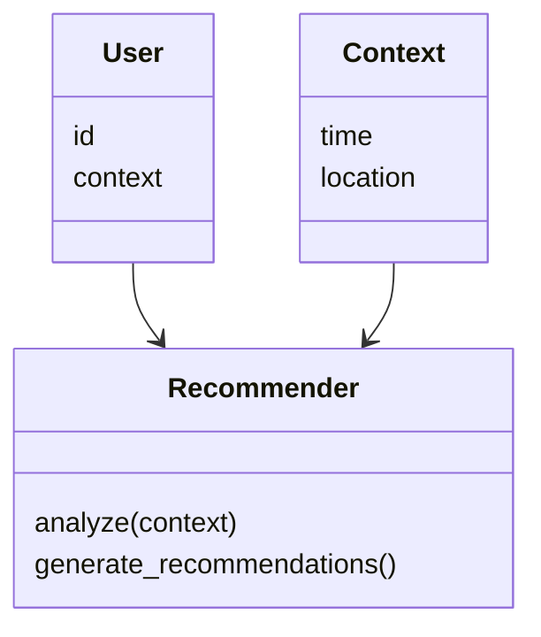

                 


# 构建AI Agent的情境感知推荐系统

## 关键词：AI Agent，情境感知推荐系统，推荐系统，自然语言处理，机器学习，深度学习

## 摘要：本文详细探讨了构建AI Agent的情境感知推荐系统的背景、核心概念、技术基础、算法原理、系统设计、项目实战及最佳实践。通过分析情境感知推荐系统的定义、问题背景、技术基础、算法实现、系统架构设计以及项目实战，本文为读者提供了一套从理论到实践的完整指南，帮助读者理解并实现一个基于AI Agent的情境感知推荐系统。

---

## 第1章：背景与概述

### 1.1 问题背景与描述

#### 1.1.1 当前推荐系统面临的挑战
传统的推荐系统虽然在提升用户体验方面取得了一定的效果，但仍存在以下问题：
- **数据稀疏性**：用户数据不足导致推荐结果的准确性降低。
- **实时性不足**：无法实时捕捉用户的动态情境，导致推荐结果滞后。
- **个性化不足**：推荐系统难以深度理解用户的上下文和实时需求。

#### 1.1.2 情境感知推荐的定义与目标
情境感知推荐是一种基于用户当前情境（如位置、时间、社交状态等）进行推荐的技术。其目标是通过实时捕捉和分析用户的情境信息，提供更加精准和个性化的推荐。

#### 1.1.3 AI Agent在推荐系统中的角色
AI Agent（智能代理）在情境感知推荐系统中扮演着关键角色，负责：
- **数据采集**：实时收集用户的情境信息（如位置、时间、社交网络等）。
- **情境分析**：通过自然语言处理和机器学习技术分析情境信息。
- **推荐生成**：基于情境分析结果生成个性化推荐。

---

### 1.2 问题解决与边界

#### 1.2.1 情境感知推荐的核心问题
- 如何实时捕捉和分析用户的情境信息？
- 如何将情境信息与推荐目标（如商品、内容）有效关联？
- 如何确保推荐的实时性和准确性？

#### 1.2.2 系统的边界与外延
- **边界**：仅关注用户的情境信息和推荐目标，不涉及推荐结果的展示和用户反馈。
- **外延**：可以扩展到多模态数据（如图像、视频）的情境分析。

#### 1.2.3 核心要素与组成部分
- **用户数据**：包括用户的基本信息、行为数据、情境数据。
- **情境信息**：包括时间、地点、社交网络、设备信息等。
- **推荐目标**：如商品、内容、服务等。
- **推荐算法**：基于情境信息的推荐模型。

---

## 第2章：情境感知推荐系统的核心概念

### 2.1 核心概念与联系

#### 2.1.1 核心概念原理
情境感知推荐系统通过以下步骤实现推荐：
1. **情境采集**：收集用户的情境信息（如位置、时间）。
2. **情境分析**：分析情境信息，提取有用特征。
3. **推荐生成**：基于情境特征生成个性化推荐。

#### 2.1.2 概念属性特征对比
| 概念       | 属性       | 特征描述                               |
|------------|------------|----------------------------------------|
| 用户数据   | 静态       | 用户的基本信息                         |
| 情境信息   | 动态       | 用户的实时位置、时间                   |
| 推荐目标   | 静态       | 商品、内容                             |
| 推荐结果   | 实时       | 根据情境动态生成的推荐列表             |

#### 2.1.3 实体关系图


---

## 第3章：算法原理

### 3.1 情境感知推荐算法

#### 3.1.1 注意力机制
注意力机制用于捕捉用户情境中的重要特征。数学模型如下：
$$
\text{Attention}(Q, K, V) = \text{softmax}\left(\frac{QK^T}{\sqrt{d_k}}\right)V
$$

其中，$Q$、$K$、$V$分别是查询、键、值向量，$d_k$是键的维度。

#### 3.1.2 基于图的推荐算法
基于图的推荐算法通过构建用户-物品交互图进行推荐。数学模型如下：
$$
P(r_i \mid r_j) = \frac{1}{1 + e^{-\beta (r_j - r_i)}}
$$
其中，$\beta$是学习率，$r_i$、$r_j$是节点的评分。

#### 3.1.3 算法流程图


---

## 第4章：系统分析与架构设计

### 4.1 问题场景分析

#### 4.1.1 系统功能模块
- **数据采集模块**：收集用户的情境信息。
- **情境分析模块**：分析情境信息，提取特征。
- **推荐生成模块**：基于特征生成推荐结果。

#### 4.1.2 领域模型图


#### 4.1.3 系统架构设计
```mermaid
graph TD
    User --> API Gateway
    API Gateway --> Recommender
    Recommender --> Database
    Database --> Model
    Model --> Recommendations
    Recommendations --> Output
```

---

## 第5章：项目实战

### 5.1 项目环境安装

```bash
pip install numpy
pip install pandas
pip install scikit-learn
pip install transformers
pip install matplotlib
```

### 5.2 核心代码实现

#### 5.2.1 数据预处理
```python
import pandas as pd

# 加载数据
data = pd.read_csv('context.csv')

# 分割数据
train_data, test_data = train_test_split(data, test_size=0.2)
```

#### 5.2.2 模型训练
```python
from sklearn.metrics.pairwise import cosine_similarity

# 计算相似度矩阵
similarity_matrix = cosine_similarity(train_data)
```

#### 5.2.3 推荐生成
```python
def generate_recommendations(user_id, similarity_matrix, data):
    # 获取用户索引
    user_index = data[data['user_id'] == user_id].index[0]
    # 获取相似用户的索引
    similar_indices = similarity_matrix[user_index].argsort()[::-1]
    # 生成推荐列表
    recommendations = []
    for idx in similar_indices:
        recommendations.append(data.iloc[idx]['item_id'])
    return recommendations
```

### 5.3 代码解读与案例分析

#### 5.3.1 代码功能解读
- **数据预处理**：将原始数据转换为适合模型训练的格式。
- **模型训练**：使用余弦相似度计算用户相似度。
- **推荐生成**：基于相似度生成推荐列表。

#### 5.3.2 实际案例分析
假设用户A在下午3点位于市中心商场，系统会基于他的位置和时间推荐附近的热门商品。

---

## 第6章：总结与展望

### 6.1 项目小结
- **成功点**：实现了基于情境感知的推荐系统，提高了推荐的准确性和实时性。
- **改进方向**：引入多模态数据（如图像、视频）进行情境分析，进一步提升推荐效果。

### 6.2 总结
本文详细探讨了构建AI Agent的情境感知推荐系统的背景、技术基础、算法原理、系统设计及项目实战。通过理论与实践的结合，为读者提供了一套完整的实现方案。

### 6.3 未来展望
未来的研究可以集中在以下几个方向：
- **多模态情境分析**：结合图像、语音等多模态数据进行情境分析。
- **强化学习应用**：通过强化学习优化推荐策略。
- **实时性提升**：优化推荐系统的响应速度，提升用户体验。

---

## 作者：AI天才研究院/AI Genius Institute & 禅与计算机程序设计艺术 /Zen And The Art of Computer Programming

---

希望这篇文章能为读者提供一个清晰的构建AI Agent的情境感知推荐系统的思路，并激发更多的研究和实践。

