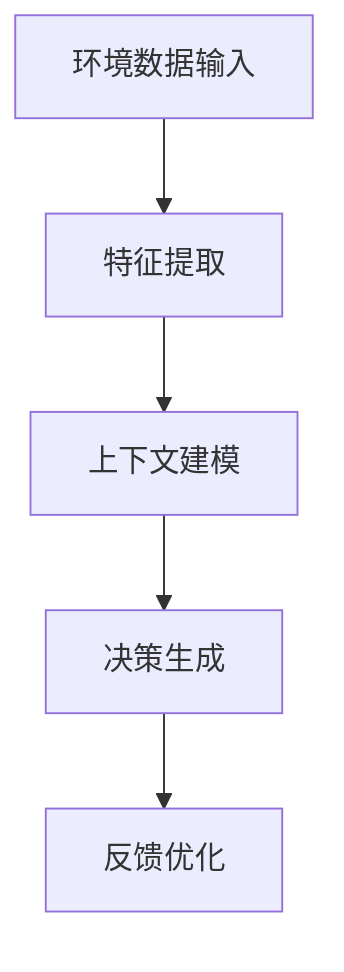
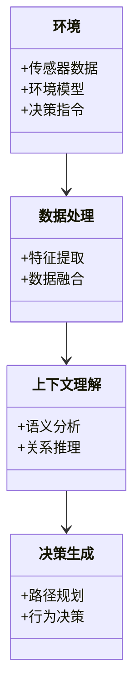

                 


# 构建AI Agent的情境感知能力：环境适应性

> 关键词：AI Agent，情境感知能力，环境适应性，算法原理，系统架构，项目实战

> 摘要：本文详细探讨了构建AI Agent的情境感知能力，重点分析了环境适应性的实现方法。通过背景介绍、核心概念解析、算法原理、系统架构设计、项目实战以及最佳实践等多方面内容，深入剖析了AI Agent在复杂环境中的感知与适应能力。文章结合实际案例，详细讲解了从理论到实践的全过程，为读者提供了一套系统性的解决方案。

---

# 第一部分: 情境感知能力的背景与问题描述

## 第1章: 问题背景与核心概念

### 1.1 问题背景

#### 1.1.1 AI Agent的基本概念
AI Agent（人工智能代理）是一种能够感知环境、自主决策并执行任务的智能实体。它广泛应用于自动驾驶、智能助手、机器人等领域，其核心能力在于与环境的交互和适应。

#### 1.1.2 情境感知能力的重要性
在动态和不确定的环境中，AI Agent需要具备情境感知能力，以便准确理解当前环境的状态、目标和潜在风险。这种能力是实现自主决策和高效任务执行的基础。

#### 1.1.3 当前技术的局限性
尽管AI技术取得了显著进展，但许多AI Agent在复杂环境中的适应性仍然有限。主要问题包括对动态环境的理解不足、多模态数据的融合能力较弱以及实时决策的准确性问题。

### 1.2 问题描述

#### 1.2.1 情境感知的核心目标
情境感知的核心目标是通过多模态数据的融合，理解环境中的关键要素（如物体、人物、场景等）及其关系，从而为决策提供支持。

#### 1.2.2 情境感知的挑战与难点
- 动态环境的实时感知与建模
- 多模态数据的高效融合与处理
- 不确定性环境下的决策优化

#### 1.2.3 情境感知的应用场景
- 自动驾驶：实时感知交通环境，做出安全决策。
- 智能助手：理解用户意图，提供个性化服务。
- 智能机器人：在复杂环境中执行任务。

### 1.3 问题解决思路

#### 1.3.1 多模态数据融合
通过整合来自不同传感器（如摄像头、激光雷达、麦克风等）的数据，构建全面的环境模型。

#### 1.3.2 动态环境适应
利用实时感知数据，动态更新环境模型，确保决策的及时性和准确性。

#### 1.3.3 实时决策优化
结合感知结果和任务目标，优化决策策略，提高任务执行效率。

---

# 第二部分: 情境感知能力的核心概念与联系

## 第2章: 核心概念与原理

### 2.1 核心概念原理

#### 2.1.1 环境模型构建
环境模型是AI Agent理解环境的基础，通常包括几何模型、语义模型和动态模型。

#### 2.1.2 传感器数据处理
传感器数据是情境感知的主要来源，需要进行预处理、融合和特征提取。

#### 2.1.3 上下文理解机制
通过分析环境中的上下文信息，理解物体之间的关系、场景的语义以及潜在的意图。

### 2.2 核心概念对比表

| 概念 | 特征1：数据来源 | 特征2：处理方式 | 特征3：目标 |
|------|----------------|----------------|------------|
| 单一传感器感知 | 单一数据源 | 单一处理 | 单一目标 |
| 多模态数据融合 | 多数据源 | 融合处理 | 综合目标 |

### 2.3 实体关系图


---

# 第三部分: 情境感知能力的算法原理

## 第3章: 算法流程与实现

### 3.1 算法流程



### 3.2 算法实现

```python
def感知算法(环境数据):
    特征 = 提取特征(环境数据)
    上下文 = 建模上下文(特征)
    决策 = 生成决策(上下文)
    return 决策
```

### 3.3 数学模型

#### 3.3.1 感知模型
$$ P(\text{物体}| \text{特征}) = \frac{P(\text{特征}|\text{物体})P(\text{物体})}{P(\text{特征})} $$

---

# 第四部分: 情境感知能力的系统架构设计

## 第4章: 系统分析与架构设计

### 4.1 项目场景介绍
以自动驾驶为例，构建一个具备情境感知能力的AI Agent，实现对交通环境的实时感知与决策。

### 4.2 系统功能设计

#### 4.2.1 领域模型


### 4.3 系统架构设计

#### 4.3.1 架构图


---

# 第五部分: 情境感知能力的项目实战

## 第5章: 项目实现与案例分析

### 5.1 环境安装
安装必要的开发环境和库：
```bash
pip install numpy matplotlib scikit-learn
```

### 5.2 核心代码实现

#### 5.2.1 特征提取
```python
def extract_features(data):
    # 特征提取逻辑
    return features
```

#### 5.2.2 上下文建模
```python
def model_context(features):
    # 上下文建模逻辑
    return context
```

#### 5.2.3 决策生成
```python
def generate_decision(context):
    # 决策生成逻辑
    return decision
```

### 5.3 实际案例分析
以自动驾驶场景为例，分析感知算法在不同环境下的表现，并总结经验教训。

### 5.4 项目小结
总结项目实施过程中的关键点，分析成功与失败的原因，为后续优化提供参考。

---

# 第六部分: 最佳实践与总结

## 第6章: 最佳实践与总结

### 6.1 小结
情境感知能力是AI Agent实现环境适应性的核心，通过多模态数据融合和动态模型优化，可以显著提升感知的准确性和决策的效率。

### 6.2 注意事项
- 数据质量对感知结果影响重大，需确保传感器数据的准确性和完整性。
- 算法优化需结合实际场景，避免过度复杂化。
- 系统设计需考虑实时性和可扩展性。

### 6.3 拓展阅读
推荐相关领域的经典论文和书籍，帮助读者深入理解情境感知的核心技术。

---

# 作者：AI天才研究院/AI Genius Institute & 禅与计算机程序设计艺术 /Zen And The Art of Computer Programming

