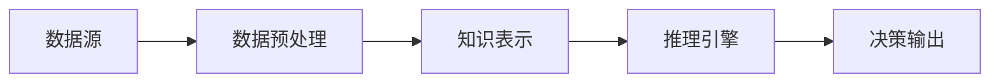

                 


# 《构建AI Agent的持续学习与知识更新机制》

---

## 关键词：AI Agent、持续学习、知识更新、机器学习、在线学习、终身学习

---

## 摘要：  
AI Agent（人工智能代理）需要具备持续学习和知识更新的能力，以适应动态变化的环境和任务需求。本文从理论基础、机制设计、系统架构、算法实现和实战案例等多个角度，详细探讨构建AI Agent持续学习与知识更新机制的关键技术与方法。通过分析在线学习、终身学习的核心原理，结合知识表示与更新的数学模型，提出了一种高效的AI Agent知识更新框架，并通过实际案例展示了其应用与优化方法。

---

## 第1章：AI Agent与持续学习概述

### 1.1 AI Agent的基本概念  
AI Agent是一种能够感知环境、自主决策并执行任务的智能实体。根据功能和应用场景，AI Agent可以分为两类：  
- **反应式AI Agent**：基于当前感知做出实时反应，适用于实时交互场景。  
- **认知式AI Agent**：具备复杂推理和规划能力，适用于需要策略制定和长期任务的场景。  

持续学习是AI Agent适应动态环境的核心能力，通过不断更新知识和技能，AI Agent能够更好地应对新任务和新挑战。  

### 1.2 持续学习的定义与特点  
- **持续学习**：指AI Agent在动态环境中，通过不断接收新数据或任务，逐步优化自身模型和知识库的过程。  
- **在线学习**：实时更新模型，适用于数据流场景。  
- **离线学习**：定期批量更新模型，适用于资源有限的场景。  
- **终身学习**：AI Agent在整个生命周期中持续学习和进化，支持多任务和跨领域的知识积累。  

### 1.3 知识更新机制的重要性  
知识更新机制确保AI Agent能够：  
1. 适应新任务和环境变化。  
2. 解决动态环境中的不确定性问题。  
3. 提高长期任务的稳定性和可靠性。  

---

## 第2章：持续学习的理论基础

### 2.1 机器学习基础  
- **在线学习与批量学习对比**：  
  | 对比维度 | 在线学习 | 批量学习 |  
  |----------|----------|----------|  
  | 数据输入 | 流式数据 | 批量数据 |  
  | 训练时间 | 实时更新 | 离线训练 |  
  | 资源消耗 | 较低 | 较高 |  

- **终身学习的核心原理**：通过元学习（Meta-Learning）和模型蒸馏（Model Distillation）等技术，实现跨任务的知识复用与迁移。  

### 2.2 知识表示与更新机制  
- **知识表示方法**：  
  - 符号表示法：通过逻辑规则和语义网络表示知识。  
  - 神经网络表示法：利用深度学习模型（如BERT、GPT）捕捉知识的语义关系。  

- **知识图谱与知识库**：通过构建知识图谱，AI Agent可以更高效地管理和更新知识。  

- **知识版本控制**：通过版本控制系统（如Git）对知识更新进行管理，确保知识的可追溯性和一致性。  

### 2.3 持续学习的核心原理  
- **知识遗忘与知识巩固**：通过遗忘曲线理论，设计模型遗忘策略，避免知识过载。  
- **知识迁移与知识融合**：利用迁移学习技术，将新知识融入现有知识体系。  
- **知识更新的数学模型**：通过概率论和统计学习方法，建立知识更新的动态模型。  

---

## 第3章：知识更新机制的设计与实现

### 3.1 在线更新与离线更新  
- **在线更新**：实时接收数据，逐步优化模型。  
  ```mermaid
  graph LR
    A[数据输入] --> B[模型更新]
    B --> C[结果输出]
  ```

- **离线更新**：定期批量处理数据，适合资源受限场景。  

### 3.2 知识遗忘与巩固策略  
- **渐进式遗忘**：按时间或任务重要性，逐步遗忘过时知识。  
- **选择性遗忘**：基于模型性能，有选择性地遗忘低价值数据。  

### 3.3 模型评估与优化  
- **评估指标**：准确率、召回率、F1值等。  
- **优化策略**：通过超参数调整和模型剪枝，提升模型性能。  

---

## 第4章：系统架构设计

### 4.1 系统功能设计  
- **感知层**：数据采集与预处理。  
- **推理层**：知识表示与推理。  
- **执行层**：决策与行动。  

### 4.2 系统架构图  


---

## 第5章：算法实现

### 5.1 模型蒸馏算法  
- **模型蒸馏**：通过教师模型指导学生模型学习，减少计算开销。  
  ```python
  def distillation_loss(student_logits, teacher_logits, temperature):
      loss = F.kl_div(student_logits / temperature, teacher_logits / temperature)
      return loss.mean()
  ```

### 5.2 在线学习算法  
- **在线梯度下降**：  
  $$ w_{t+1} = w_t - \eta (x_t - w_t^T x_t) $$  

---

## 第6章：实战项目

### 6.1 项目背景  
构建一个实时对话AI Agent，支持用户实时提问和知识更新。  

### 6.2 核心实现  
- 数据预处理：NLP分词与语义分析。  
- 模型训练：使用Transformer模型进行对话生成。  
- 知识更新：通过增量学习优化模型参数。  

### 6.3 代码示例  
```python
def update_model(new_data):
    model.train()
    for batch in new_data:
        outputs = model(batch.inputs)
        loss = criterion(outputs, batch.labels)
        optimizer.zero_grad()
        loss.backward()
        optimizer.step()
```

---

## 第7章：研究热点与未来展望

### 7.1 研究热点  
- **自适应学习**：动态调整学习策略。  
- **多模态学习**：结合视觉、听觉等多模态信息。  

### 7.2 未来发展趋势  
- **强化学习与持续学习结合**：提升决策能力。  
- **分布式知识图谱**：支持大规模知识更新与共享。  

---

## 附录：参考资料与工具推荐

### 1. 书籍推荐  
- 《机器学习实战》  
- 《深度学习》  

### 2. 开源工具  
- TensorFlow  
- PyTorch  

---

## 作者：AI天才研究院 & 禅与计算机程序设计艺术

---

希望这篇文章能为构建AI Agent的持续学习与知识更新机制提供清晰的思路和实用的技术指导。

