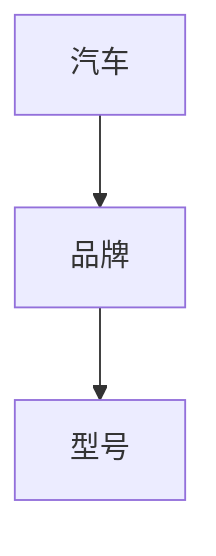
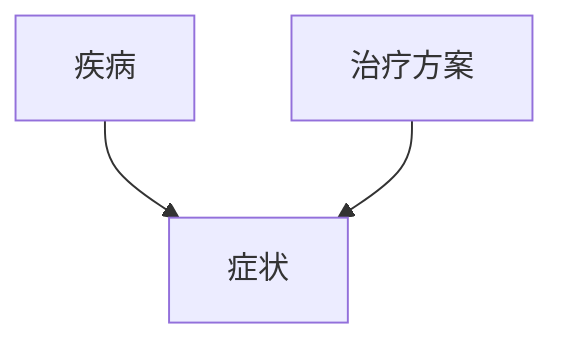
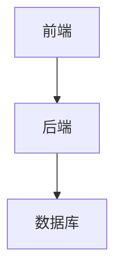

                 


# 构建AI Agent的知识图谱因果推理引擎

## 关键词：知识图谱，因果推理，AI Agent，因果网络，因果学习，系统设计

## 摘要：  
本文深入探讨了构建AI Agent的知识图谱因果推理引擎的关键技术与方法。首先，我们介绍了知识图谱和因果推理的基本概念及其在AI Agent中的应用。然后，详细讲解了知识图谱的构建与管理，包括数据预处理、知识抽取与融合、存储与更新等。接着，我们分析了因果推理的理论基础和常见算法，重点探讨了因果网络的构建与分析。在此基础上，我们详细阐述了知识图谱与因果推理的结合，提出了构建知识图谱因果推理引擎的设计方法，包括系统架构设计、接口设计和交互流程。最后，通过项目实战，我们展示了如何在实际场景中构建知识图谱因果推理引擎，并总结了最佳实践和优化建议。

---

## 第一章: 知识图谱与因果推理引擎的背景与概念

### 1.1 知识图谱的定义与特点
知识图谱是一种以图结构形式表示知识的语义网络，由节点（实体）和边（关系）组成，具有语义丰富、结构化、可扩展性强的特点。知识图谱的构建需要经过数据预处理、知识抽取、知识融合、知识存储等步骤。

**知识图谱的特点：**
- **语义性**：节点和边都带有语义信息，能够表示复杂的关系。
- **结构化**：以图的形式组织知识，便于计算机理解和推理。
- **可扩展性**：支持动态更新和扩展。

**知识图谱与传统知识表示的区别：**
- 传统知识表示（如本体论）注重形式化描述，而知识图谱更注重语义的连通性和可计算性。
- 知识图谱通过实体间的关系建立全局知识网络，能够支持复杂的推理任务。

### 1.2 因果推理的基本概念
因果推理是指从数据中识别因果关系，并基于因果关系进行推理和预测。因果推理的核心在于区分相关关系和因果关系，能够回答“如果改变某个因素，结果会如何变化”的问题。

**因果关系与相关关系的区别：**
- **相关关系**：变量之间的统计关联性，无法直接推断因果关系。
- **因果关系**：变量之间的因果联系，能够解释变量变化的根本原因。

**因果推理在AI Agent中的作用：**
- **决策支持**：通过因果推理，AI Agent能够做出基于因果关系的决策。
- **因果网络构建**：因果推理帮助AI Agent构建因果网络，支持复杂的因果推理任务。

### 1.3 AI Agent的知识图谱因果推理引擎
AI Agent是一种智能体，能够感知环境、自主决策并执行任务。知识图谱因果推理引擎是AI Agent的核心模块，负责基于知识图谱进行因果推理，支持智能决策和问题解决。

**AI Agent的知识图谱因果推理引擎的特点：**
- **知识表示**：利用知识图谱表示知识，支持语义理解和推理。
- **因果推理**：基于因果网络进行推理，能够回答因果关系相关的问题。
- **动态更新**：能够动态更新知识图谱，适应环境变化。

---

## 第二章: 知识图谱的构建与管理

### 2.1 知识图谱的构建流程
知识图谱的构建是一个复杂的过程，包括数据预处理、知识抽取、知识融合、知识存储等步骤。

**数据预处理：**
- 数据清洗：去除噪声数据，确保数据质量。
- 数据标注：对数据进行标注，便于后续处理。

**知识抽取与表示：**
- 实体识别：从文本中提取实体。
- 关系抽取：从文本中提取实体间的关系。
- 知识表示：将实体和关系表示为图结构。

**知识融合与冲突处理：**
- 知识融合：将多个来源的知识合并，消除冲突。
- 冲突处理：通过规则或算法解决知识冲突。

**示例：**
假设我们有一个关于汽车的知识图谱，实体包括“汽车”、“品牌”、“型号”等，关系包括“属于品牌”、“具有型号”等。

**mermaid图：**


### 2.2 知识图谱的存储与管理
知识图谱的存储和管理是构建知识图谱的重要环节。

**知识图谱的存储方式：**
- 图数据库：如Neo4j、AllegroGraph等，支持高效的图查询。
- 关系型数据库：将图结构转化为关系型表，适用于复杂查询。

**知识图谱的查询与检索：**
- 图遍历：通过遍历图结构进行查询。
- SPARQL查询：使用SPARQL语句进行查询。

**知识图谱的动态更新：**
- 实时更新：支持实时更新，确保知识图谱的准确性。
- 批量更新：定期批量更新，适用于大规模数据。

**示例：**
使用Neo4j存储知识图谱，查询“汽车属于哪个品牌”可以通过图遍历实现。

**代码示例：**
```python
# 使用Neo4j查询
from neo4j import GraphDatabase

def query_brand(tx):
    result = tx.run("MATCH (a:汽车)-[:属于]->(b:品牌) RETURN b.name")
    return [record["b.name"] for record in result]

driver = GraphDatabase.driver("neo4j://localhost:7687", auth=("user", "password"))
with driver.session() as session:
    brands = session.read_transaction(query_brand)
    print(brands)
```

### 2.3 知识图谱的可视化与分析
知识图谱的可视化和分析有助于理解知识结构和发现潜在问题。

**知识图谱的可视化方法：**
- 使用图可视化工具（如Gephi、Cytoscape）进行可视化。
- 使用前端库（如D3.js、Vis.js）进行动态可视化。

**知识图谱的分析工具：**
- 社会网络分析：分析实体之间的关系密度。
- 主题分析：分析知识图谱的主题分布。

**知识图谱的可解释性：**
- 可视化图谱：通过图形化展示知识图谱，帮助理解。
- 属性分析：分析实体和关系的属性，提高可解释性。

---

## 第三章: 因果推理的理论与算法

### 3.1 因果推理的基本理论
因果推理的核心在于区分相关关系和因果关系，建立因果网络。

**因果关系的数学定义：**
因果关系可以用图结构表示，节点代表变量，边代表因果关系。

**因果图的构建与分析：**
- 构建因果图：通过领域知识或数据构建因果图。
- 分析因果图：通过因果图分析变量之间的因果关系。

**因果推理的基本假设：**
- 条件独立性假设：在给定条件下，变量之间相互独立。
- 无隐藏变量假设：不存在未观测的变量影响因果关系。

### 3.2 常见的因果推理算法
因果推理算法用于从数据中识别因果关系，并进行因果推断。

**随机化平均处理效应（R-MTE）：**
- 定义：在随机化实验中，处理对结果的影响。
- 应用：用于评估干预效果。

**因果森林（Causal Forest）：**
- 定义：一种基于随机森林的因果推断方法。
- 应用：处理高维数据和非线性关系。

**隐马尔可夫模型（HMM）在因果推理中的应用：**
- 定义：HMM是一种统计模型，用于时间序列数据的建模。
- 应用：在因果推理中用于处理时间依赖关系。

### 3.3 因果推理的数学模型
因果推理的数学模型是因果推理算法的基础。

**因果图的数学表示：**
- 使用图论中的符号表示因果图。
- 通过概率论描述因果关系。

**因果效应的公式化表达：**
- 平均处理效应（ATE）：$ATE = E[Y_{do(X)}]$
- 平均倾向得分加权效应（ATTE）：$ATTE = \sum_{x} E[Y_{do(x)}] \cdot P(X=x)$

**公式推导：**
通过构建因果图，使用概率论公式推导因果效应。

### 3.4 本章小结

---

## 第四章: 知识图谱与因果推理的结合

### 4.1 知识图谱因果网络的构建
知识图谱因果网络是知识图谱与因果推理的结合，用于支持复杂的因果推理任务。

**知识图谱因果网络的定义：**
- 知识图谱因果网络是在知识图谱的基础上，加入因果关系信息，构建的因果网络。

**知识图谱因果网络的构建方法：**
- 基于领域知识构建因果网络。
- 基于数据构建因果网络。

**示例：**
假设我们有一个关于医疗的知识图谱，实体包括“疾病”、“症状”、“治疗方案”，关系包括“由症状引起”、“由治疗方案缓解”等。

**mermaid图：**


### 4.2 知识图谱因果推理引擎的设计
知识图谱因果推理引擎是AI Agent的核心模块，负责基于知识图谱进行因果推理。

**因果学习模型的设计：**
- 设计因果学习模型，用于从知识图谱中学习因果关系。
- 使用因果图表示因果关系。

**因果推理算法的实现：**
- 实现常见的因果推理算法，如R-MTE、Causal Forest等。
- 在知识图谱中应用这些算法，进行因果推理。

**知识图谱因果推理引擎的优化：**
- 优化知识图谱的存储和查询效率。
- 优化因果推理算法的效率。

### 4.3 本章小结

---

## 第五章: 系统设计与实现

### 5.1 系统架构设计
知识图谱因果推理引擎的系统架构设计包括模块划分、功能设计、接口设计等。

**系统架构设计：**
- 前端：负责用户交互和可视化展示。
- 后端：负责知识图谱的存储和管理，因果推理算法的实现。
- 数据库：存储知识图谱和推理结果。

**mermaid图：**


**系统功能设计：**
- 知识图谱管理：包括知识图谱的构建、存储、查询等。
- 因果推理：包括因果网络构建、因果效应计算等。
- 结果展示：包括推理结果的可视化展示。

### 5.2 系统实现
系统实现包括环境配置、核心代码实现、系统测试等。

**环境配置：**
- 安装必要的软件和库，如Python、Neo4j、TensorFlow等。

**核心代码实现：**
- 实现知识图谱的构建和管理。
- 实现因果推理算法。
- 实现结果展示。

**系统测试：**
- 测试系统的功能是否正常。
- 测试系统的性能是否满足要求。

### 5.3 本章小结

---

## 第六章: 项目实战

### 6.1 项目背景与目标
项目实战部分通过一个具体项目展示知识图谱因果推理引擎的构建过程。

**项目背景：**
- 项目目标：构建一个医疗领域的知识图谱因果推理引擎。
- 项目需求：支持因果推理，辅助医生进行诊断和治疗方案选择。

### 6.2 项目实现
项目实现包括数据采集、知识图谱构建、因果推理引擎开发等。

**数据采集：**
- 数据来源：医疗领域的公开数据集。
- 数据预处理：清洗数据，提取实体和关系。

**知识图谱构建：**
- 使用知识图谱构建工具，构建医疗领域的知识图谱。

**因果推理引擎开发：**
- 实现因果推理算法，构建因果网络。
- 应用因果推理算法进行推理。

### 6.3 项目小结

---

## 第七章: 最佳实践与未来展望

### 7.1 最佳实践
最佳实践部分总结了在构建知识图谱因果推理引擎过程中的一些经验和建议。

**系统设计：**
- 系统架构设计要合理，模块划分清晰。
- 接口设计要规范，便于扩展和维护。

**数据管理：**
- 数据预处理要仔细，确保数据质量。
- 知识图谱的动态更新要实时或定期进行。

**算法优化：**
- 根据具体场景选择合适的算法。
- 优化算法性能，提高推理效率。

### 7.2 未来展望
未来展望部分探讨了知识图谱因果推理引擎的发展方向。

**技术发展：**
- 知识图谱与因果推理的结合将更加紧密。
- 因果推理算法将更加智能化和自动化。

**应用场景：**
- 知识图谱因果推理引擎将在更多领域得到应用，如医疗、金融、教育等。

### 7.3 本章小结

---

## 作者：AI天才研究院/AI Genius Institute & 禅与计算机程序设计艺术 /Zen And The Art of Computer Programming

