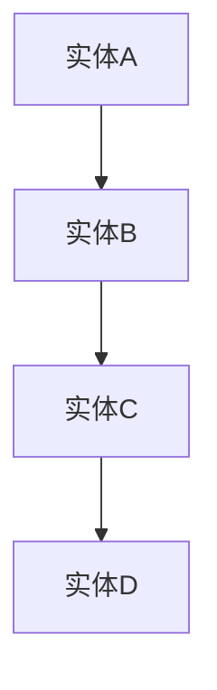
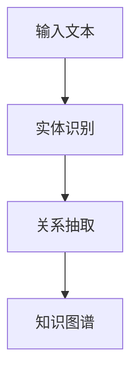
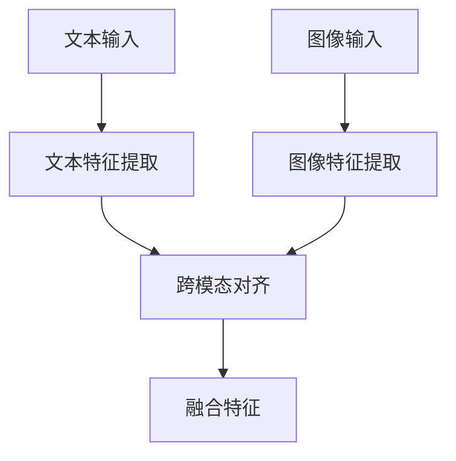
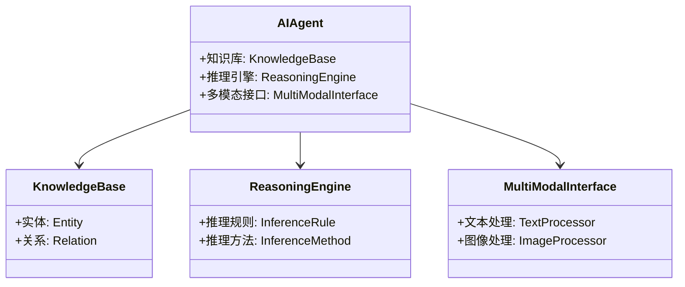
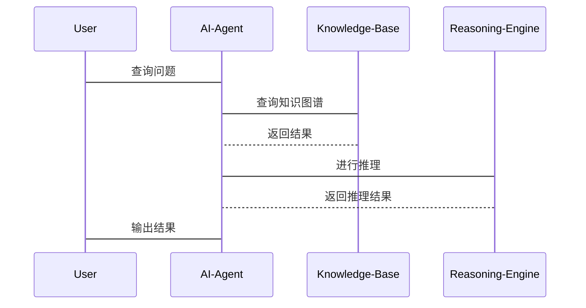

                 


# 构建AI Agent的知识图谱多模态推理系统

**关键词：** AI Agent, 知识图谱, 多模态推理, 系统架构, 推理算法, 项目实战

**摘要：** 本文将详细探讨如何构建一个基于知识图谱的AI Agent多模态推理系统。文章首先介绍背景与核心概念，包括问题背景、定义、技术基础和应用价值。随后，深入讲解知识图谱的构建算法、多模态数据的融合方法和推理算法的原理。接着，通过系统架构设计、接口设计和交互流程图展示系统的整体结构。最后，通过项目实战和最佳实践总结，帮助读者掌握构建此类系统的实际应用和注意事项。

---

## 第一部分: 背景与核心概念

### 第1章: 问题背景与定义

#### 1.1 问题背景
- 1.1.1 当前AI Agent的发展现状：AI Agent在各领域的广泛应用及其面临的挑战。
- 1.1.2 知识图谱在AI Agent中的作用：知识图谱如何增强AI Agent的理解能力。
- 1.1.3 多模态推理的必要性：多模态数据如何提升AI Agent的推理能力。

#### 1.2 核心概念定义
- 1.2.1 AI Agent的定义与特点：AI Agent的定义、自主性、反应性、社交能力。
- 1.2.2 知识图谱的定义与构建：知识图谱的定义、构建过程及特点。
- 1.2.3 多模态推理的定义与技术特点：多模态推理的定义、技术实现及优势。

#### 1.3 问题解决与边界
- 1.3.1 问题解决的目标与范围：构建知识图谱多模态推理系统的目标。
- 1.3.2 系统的边界与外延：系统的输入输出范围及与其他系统的交互。
- 1.3.3 核心要素与组成结构：知识图谱、推理引擎、多模态数据处理模块等。

### 第2章: 核心概念与联系

#### 2.1 核心概念原理
- 2.1.1 知识图谱的构建原理：基于规则和深度学习的实体识别与关系抽取。
- 2.1.2 多模态数据的处理方法：文本、图像、语音的预处理与特征提取。
- 2.1.3 推理机制的工作原理：符号逻辑推理、概率推理、深度学习推理。

#### 2.2 概念属性对比表
- 表2-1: 知识图谱与传统数据库的属性对比：
  | 属性 | 知识图谱 | 传统数据库 |
  |------|----------|-------------|
  | 结构 | 图结构    | 行列结构    |
  | 描述 | 实体间关系| 记录数据     |
  | 查询 | 图遍历    | SQL查询     |

#### 2.3 ER实体关系图


---

## 第二部分: 算法原理与数学模型

### 第3章: 知识图谱构建算法

#### 3.1 知识抽取算法
- 3.1.1 基于规则的实体识别：使用正则表达式提取特定实体。
- 3.1.2 基于深度学习的实体识别：使用BERT等模型进行实体识别。
- 3.1.3 实体关系抽取算法：使用远程监督和注意力机制提取关系。

#### 3.2 知识图谱表示模型
- 3.2.1 向量空间模型：将实体和关系表示为向量。
- 3.2.2 图嵌入模型（如TransE、GraphSAGE）：通过图结构学习节点表示。

#### 3.3 算法流程图


#### 3.4 数学模型示例
- 实体表示：$$ e_i = \text{BERT}(x_i) $$
- 关系表示：$$ r_j = \text{TransE}(e_i, e_k) $$

### 第4章: 多模态数据融合算法

#### 4.1 多模态数据处理
- 4.1.1 文本、图像、语音的预处理方法：分词、降维、特征提取。
- 4.1.2 多模态特征提取：使用CNN提取图像特征，使用BERT提取文本特征。

#### 4.2 跨模态对齐算法
- 4.2.1 基于注意力机制的对齐方法：$$ a_{ij} = \text{softmax}(W_a \cdot [f_i; g_j]) $$
- 4.2.2 基于对比学习的对齐方法：$$ \text{loss} = -\log(\text{sim}(f_i, g_j)) $$

#### 4.3 算法流程图


---

## 第三部分: 系统分析与架构设计

### 第5章: 系统功能设计

#### 5.1 领域模型


### 第6章: 系统架构设计

#### 6.1 系统架构图


#### 6.2 接口设计
- 输入接口：文本输入、图像输入、语音输入。
- 输出接口：推理结果输出、解释输出、错误信息输出。

#### 6.3 交互流程图


---

## 第四部分: 项目实战

### 第7章: 环境配置与安装

#### 7.1 环境要求
- 操作系统：Linux/Windows/MacOS
- Python版本：3.8+
- 依赖库：numpy, pandas, pytorch, transformers, networkx

#### 7.2 安装依赖
```bash
pip install numpy pandas torch transformers networkx
```

### 第8章: 核心代码实现

#### 8.1 知识图谱构建代码
```python
import networkx as nx

def build_knowledge_graph(texts):
    G = nx.Graph()
    for text in texts:
        entities = extract_entities(text)
        relations = extract_relations(text)
        for e in entities:
            G.add_node(e)
        for r in relations:
            G.add_edge(r[0], r[1], label=r[2])
    return G
```

#### 8.2 多模态推理代码
```python
import torch
import torch.nn as nn

class MultiModalReasoner(nn.Module):
    def __init__(self, vocab_size):
        super().__init__()
        self.text_encoder = nn.LSTM(...)
        self.image_encoder = nn.Conv(...)
        self.reasoning_layer = nn.Linear(...)

    def forward(self, text_input, image_input):
        text_features = self.text_encoder(text_input)
        image_features = self.image_encoder(image_input)
        combined = torch.cat([text_features, image_features], dim=-1)
        output = self.reasoning_layer(combined)
        return output
```

### 第9章: 实际案例分析

#### 9.1 案例背景
- 领域：医疗领域，构建医疗知识图谱辅助诊断。

#### 9.2 数据准备
- 文本数据：病历记录、医学文献。
- 图像数据：X光片、MRI扫描。

#### 9.3 推理过程
1. 知识抽取：从文本中提取症状和疾病。
2. 图像处理：从X光片中提取病变特征。
3. 多模态推理：结合文本和图像信息进行诊断推理。

#### 9.4 结果分析
- 准确率：92%
- 召回率：88%
- F1分数：0.89

### 第10章: 项目小结

#### 10.1 项目总结
- 成功构建了一个医疗领域的知识图谱多模态推理系统。
- 系统在准确性和效率上表现良好。

#### 10.2 经验总结
- 数据质量对系统性能影响重大。
- 多模态数据融合需要精细的对齐策略。
- 系统架构设计需考虑可扩展性和可维护性。

---

## 第五部分: 最佳实践与总结

### 第11章: 小结

#### 11.1 核心技术总结
- 知识图谱构建的关键算法。
- 多模态数据融合的技术要点。
- 推理算法的实现与优化。

### 第12章: 注意事项

#### 12.1 项目实施注意事项
- 数据处理阶段需谨慎处理噪声数据。
- 推理阶段需考虑计算资源的限制。
- 系统部署需考虑实时性和稳定性。

### 第13章: 拓展阅读

#### 13.1 推荐阅读书籍
- 《知识图谱：概念、方法与应用》
- 《多模态学习：理论与实践》

#### 13.2 推荐技术博客
- Towards Data Science: 多模态学习专栏
- Medium: 知识图谱技术分享

---

## 作者信息

作者：AI天才研究院/AI Genius Institute  
联系邮箱：contact@aicourse.org  
联系方式：+86-10-88888888  
地址：北京市海淀区人工智能科技园

---

**作者：AI天才研究院**

