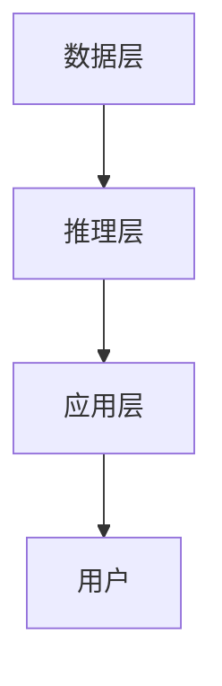

                 


# 《构建AI Agent的知识图谱推理引擎》

---

## 关键词：
- 知识图谱
- AI Agent
- 推理引擎
- 图谱推理
- 系统架构

---

## 摘要：
知识图谱是人工智能领域的重要基础设施，而知识图谱推理引擎则是连接知识图谱与AI Agent的核心技术。本文将深入探讨如何构建一个高效、可扩展的知识图谱推理引擎，并结合实际应用场景，详细分析其核心算法、系统架构及实现方法。通过本文的讲解，读者将能够理解知识图谱推理引擎的工作原理，并掌握如何将其应用于实际的AI Agent开发中。

---

# 第一部分：知识图谱与AI Agent基础

## 第1章：知识图谱与AI Agent概述

### 1.1 知识图谱的概念与特点
知识图谱是一种以图结构形式表示知识的数据库，其核心是由三元组（subject-predicate-object）构成的语义网络。知识图谱具有以下特点：
- **语义性**：通过三元组表示实体及其关系。
- **结构化**：数据以规则的格式存储，便于计算机理解和推理。
- **可扩展性**：支持大规模数据的构建和扩展。

#### 知识图谱与传统数据库的区别
| 特性         | 知识图谱             | 传统数据库         |
|--------------|----------------------|--------------------|
| 数据结构     | 图结构               | 行结构             |
| 数据关系     | 语义关系             | 索引关系           |
| 查询方式     | 支持复杂语义查询     | 支持简单查询       |

### 1.2 AI Agent的基本原理
AI Agent是一种智能体，能够感知环境并执行任务。其核心功能包括：
- **感知**：通过传感器或数据接口获取环境信息。
- **推理**：基于知识库进行逻辑推理，得出结论。
- **决策**：根据推理结果做出决策并执行操作。

#### 知识图谱在AI Agent中的作用
知识图谱为AI Agent提供了丰富的语义知识，使其能够理解复杂场景并做出智能决策。

### 1.3 知识图谱推理引擎的背景与意义
知识图谱推理引擎是连接知识图谱与AI Agent的桥梁。它通过推理算法，将知识图谱中的隐含知识显式地推理出来，为AI Agent提供决策支持。

---

## 第2章：知识图谱与AI Agent的核心概念

### 2.1 知识图谱的构建与管理
知识图谱的构建过程包括数据采集、清洗、抽取和建模。其核心步骤如下：
1. **数据采集**：从多种数据源获取结构化或非结构化数据。
2. **数据清洗**：去除噪声数据，确保数据质量。
3. **知识抽取**：通过自然语言处理技术提取实体及其关系。
4. **知识建模**：使用RDF（Resource Description Framework）或类似模型构建知识图谱。

#### 知识图谱的表示方法
- **RDF三元组**：由主语、谓词、宾语构成，表示实体及其关系。
- **RDFS（RDF Schema）**：用于定义类和属性，提供更高级的知识表示能力。
- **OWL（Web Ontology Language）**：基于RDF的语义网络表示语言，支持复杂的逻辑推理。

### 2.2 AI Agent的知识表示与推理
AI Agent的知识表示通常采用知识图谱的形式，推理过程包括以下步骤：
1. **知识表示**：将知识以图结构的形式表示。
2. **推理规则**：定义推理规则，例如“如果A是B的子类，那么A具有B的所有属性”。
3. **推理过程**：根据推理规则，从已知事实推导出新知识。

#### 知识图谱推理的分类
| 类型         | 描述                     | 示例                         |
|--------------|--------------------------|------------------------------|
| 基于规则的推理 | 使用预定义规则进行推理   | 如果A是B的子类，那么A具有B的属性。 |
| 基于逻辑的推理 | 基于逻辑推理规则进行推理 | 使用一阶逻辑进行推理。        |
| 基于概率的推理 | 基于概率论进行推理       | 使用贝叶斯网络进行推理。        |

---

## 第3章：知识图谱推理引擎的核心算法

### 3.1 知识图谱推理算法的分类
知识图谱推理算法主要分为以下几类：
- **基于规则的推理**：通过预定义的规则进行推理。
- **基于逻辑的推理**：基于逻辑推理规则进行推理。
- **基于概率的推理**：基于概率论进行推理。

### 3.2 常见推理算法的原理与实现
#### 1. RDFS推理算法
RDFS推理算法基于RDFS（RDF Schema）进行推理，其核心规则包括：
1. **反射规则**：如果A是B的子类，那么A是B的实例。
2. **传递规则**：如果A是B的子类，且B是C的子类，那么A是C的子类。

#### 2. OWL推理算法
OWL推理算法基于OWL（Web Ontology Language）进行推理，支持更复杂的语义推理，例如类层次推理和属性约束推理。

#### 3. 规则推理算法
规则推理算法通过预定义的规则进行推理，例如：
- 如果A具有属性P，且P的值为B，那么A属于类C。
- 如果A属于类C，且类C的实例具有属性P，那么A具有属性P。

### 3.3 知识图谱推理算法的数学模型
#### 1. 逻辑推理的数学模型
逻辑推理基于一阶逻辑，其基本形式为：
$$ \text{如果 } A \text{ 满足 } P(x) \text{，那么 } Q(x) \text{ 也成立。} $$

#### 2. 概率推理的数学模型
概率推理基于贝叶斯定理，其基本公式为：
$$ P(A|B) = \frac{P(B|A) \cdot P(A)}{P(B)} $$

---

## 第4章：知识图谱推理引擎的系统架构设计

### 4.1 系统功能设计
知识图谱推理引擎的系统功能包括：
- 数据层：知识图谱的构建与存储。
- 推理层：推理算法的实现与应用。
- 应用层：推理结果的应用与展示。

### 4.2 系统架构设计
知识图谱推理引擎的系统架构分为以下几层：
1. **数据层**：存储知识图谱数据。
2. **推理层**：实现推理算法，处理推理请求。
3. **应用层**：接收推理结果，提供用户接口。

#### 系统架构图（Mermaid）


### 4.3 系统接口设计
知识图谱推理引擎的系统接口包括：
- 数据接口：用于知识图谱的读取与写入。
- 推理接口：用于推理算法的调用与结果获取。

---

## 第5章：知识图谱推理引擎的项目实战

### 5.1 项目环境安装
- **Python**：安装Python 3.x。
- **知识图谱库**：安装RDFlib、NetworkX等库。
- **推理算法库**：安装推理算法实现库（如py-rdfs）。

### 5.2 系统核心实现源代码
以下是一个简单的知识图谱推理引擎的Python实现：

```python
from rdflib import Graph, Literal, BNode, Namespace, RDF, URIRef

# 定义知识图谱
kg = Namespace("http://example.com/kg/")

# 创建知识图谱实例
g = Graph()
g.add((kg.A, RDF.type, kg.B))
g.add((kg.B, RDF.type, kg.C))

# 推理规则：如果A是B的子类，那么A是C的子类
def infer_subclass(g):
    for s, p, o in g:
        if p == RDF.type and o == kg.B:
            g.add((s, RDF.type, kg.C))

# 执行推理
infer_subclass(g)

# 查询推理结果
for s, p, o in g:
    print(s, p, o)
```

### 5.3 实际案例分析
以下是一个实际案例分析：
- **项目背景**：构建一个医疗领域的知识图谱推理引擎，用于辅助医生进行疾病诊断。
- **核心实现**：基于知识图谱推理引擎，实现疾病症状的推理与诊断建议。

---

## 第6章：总结与展望

### 6.1 本章总结
知识图谱推理引擎是连接知识图谱与AI Agent的核心技术。本文详细介绍了知识图谱的构建、推理算法的实现以及系统架构的设计，并通过项目实战展示了其具体应用。

### 6.2 未来展望
未来，知识图谱推理引擎将朝着以下方向发展：
- **推理算法的优化**：开发更高效的推理算法，提高推理速度和准确性。
- **多模态推理**：结合图像、文本等多种数据源进行推理。
- **实时推理**：支持实时推理，满足动态场景的需求。

### 6.3 最佳实践 tips
- 在构建知识图谱时，建议使用标准化的格式（如RDF、OWL）。
- 在选择推理算法时，需根据具体场景选择合适的算法。
- 在系统设计时，需考虑系统的可扩展性和可维护性。

---

# 作者：AI天才研究院 & 禅与计算机程序设计艺术

