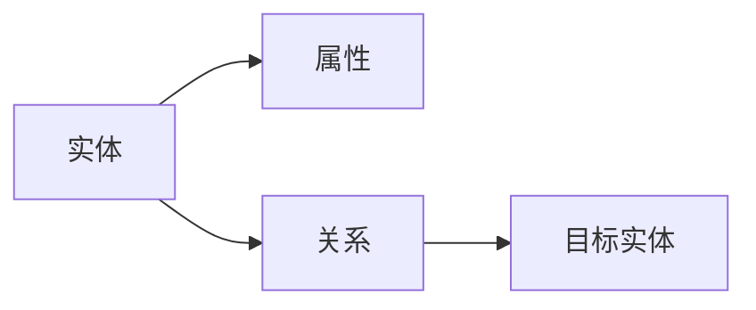
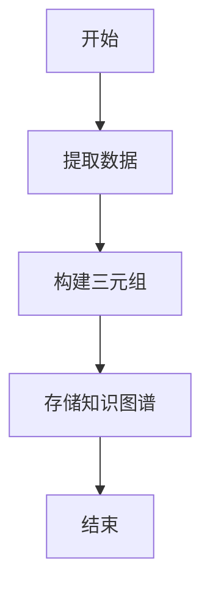
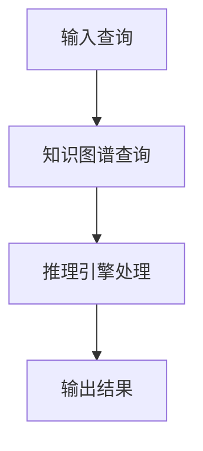
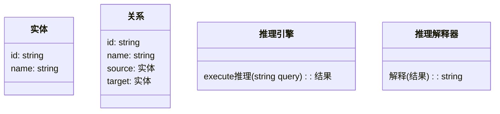
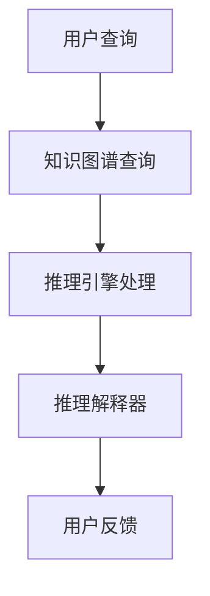

                 


# 构建AI Agent的知识图谱推理解释器

> 关键词：AI Agent，知识图谱，推理解释器，推理引擎，知识表示

> 摘要：本文详细探讨了如何构建AI Agent的知识图谱推理解释器。通过分析知识图谱的构建、推理引擎的工作原理以及解释器的设计，本文为读者提供了从理论到实践的全面指导。结合实际案例和代码实现，本文深入剖析了系统架构、功能设计和算法实现的细节，帮助读者理解并掌握构建AI Agent的知识图谱推理解释器的核心技术。

---

## 第一部分: 背景与核心概念

### 第1章: 问题背景与描述

#### 1.1 问题背景

- **AI Agent的定义与特点**  
  AI Agent（人工智能代理）是一种能够感知环境、自主决策并执行任务的智能系统。它具备自主性、反应性、目标导向性和社交能力等特点，广泛应用于智能问答、推荐系统、自动驾驶等领域。

- **知识图谱的定义与作用**  
  知识图谱是一种以结构化方式表示知识的图数据库，由实体、关系和属性构成。它能够帮助AI Agent理解和推理复杂的信息，是实现智能决策的核心基础。

- **推理解释器的核心意义**  
  推理解释器负责根据知识图谱进行推理，并将推理结果以人类可理解的方式解释出来。它是连接AI Agent与用户的桥梁，确保用户能够理解AI的决策过程。

#### 1.2 问题描述

- **AI Agent面临的挑战**  
  AI Agent需要处理复杂多变的环境信息，同时需要具备快速推理和决策的能力。然而，传统基于规则的推理方法难以应对复杂场景，且缺乏可解释性。

- **知识图谱在AI Agent中的应用需求**  
  知识图谱为AI Agent提供了丰富的语义信息，能够支持复杂的推理任务。然而，如何高效地构建和应用知识图谱是当前面临的主要挑战。

- **推理解释器的必要性**  
  推理解释器不仅需要准确地进行推理，还需要将推理结果以直观、可理解的方式呈现给用户。这要求推理解释器具备高效的推理能力和强大的解释能力。

### 第2章: 核心概念与联系

#### 2.1 核心概念原理

- **知识图谱的构建原理**  
  知识图谱的构建过程包括数据采集、实体识别、关系抽取和知识融合等步骤。通过这些步骤，能够将分散的知识整合成一个统一的知识图谱。

- **推理引擎的工作机制**  
  推理引擎通过逻辑推理算法，根据知识图谱中的关系和属性，推导出新的事实或结论。常见的推理算法包括基于规则的推理和基于学习的推理。

- **解释器的实现逻辑**  
  解释器负责将推理结果转化为人类可理解的语言或可视化形式。它需要结合上下文信息，提供清晰、准确的解释，确保用户能够理解AI的决策过程。

#### 2.2 核心概念对比

| **核心概念** | **定义** | **特点** | **应用场景** |
|--------------|----------|----------|--------------|
| 知识图谱     | 结构化的知识库 | 支持复杂推理、语义丰富 | 智能问答、推荐系统 |
| 推理引擎     | 执行推理的算法 | 高效、准确 | 知识图谱推理 |
| 解释器       | 转化推理结果 | 可解释、用户友好 | 用户交互、结果呈现 |

#### 2.3 实体关系图



---

## 第二部分: 算法原理与数学模型

### 第3章: 知识图谱构建算法

#### 3.1 算法原理

- **基于规则的构建算法**  
  通过预定义的规则，从文本数据中提取实体、关系和属性。这种方法适用于规则明确、数据结构化的场景。

- **基于学习的构建算法**  
  使用机器学习模型，从大量标注数据中学习知识图谱的构建规则。这种方法能够处理复杂场景，但需要大量的标注数据。

- **混合构建算法**  
  结合基于规则和基于学习的方法，利用规则提取基础结构，再通过学习模型进行优化和补充。

#### 3.2 算法流程图



#### 3.3 数学模型

- **知识图谱表示的数学模型**  
  实体和关系可以用三元组表示：
  $$
  \text{实体} = (e_1, e_2, \ldots, e_n)
  $$
  $$
  \text{关系} = (r_1, r_2, \ldots, r_m)
  $$

---

### 第4章: 推理引擎算法

#### 4.1 推理算法

- **基于规则的推理**  
  根据预定义的逻辑规则，从知识图谱中推导出新的事实。例如，如果A是B的父亲，且B是C的父亲，则A是C的祖父。

- **基于概率的推理**  
  使用概率论方法，根据知识图谱中的关系概率进行推理。例如，贝叶斯网络可以用于计算条件概率。

- **基于深度学习的推理**  
  利用神经网络模型（如图神经网络）进行推理，能够处理复杂的非结构化数据。

#### 4.2 推理流程图



#### 4.3 数学模型

- **推理路径表示**  
  推理路径可以用图中的路径表示，例如：
  $$
  A \rightarrow B \rightarrow C
  $$

---

## 第三部分: 系统分析与架构设计

### 第5章: 系统功能设计

#### 5.1 项目背景

- **项目目标**  
  构建一个支持知识图谱推理的AI Agent系统，实现高效、可解释的推理能力。

- **项目范围**  
  本项目聚焦于知识图谱的构建、推理引擎的设计和推理解释器的实现。

#### 5.2 系统功能设计

- **领域模型类图**



- **系统架构设计**


- **系统接口设计**

| **接口名称** | **输入** | **输出** |
|--------------|----------|----------|
| 查询接口     | 查询语句 | 查询结果 |
| 推理接口     | 查询结果 | 推理结果 |
| 解释接口     | 推理结果 | 解释文本 |

- **系统交互流程图**



---

## 第四部分: 项目实战

### 第6章: 项目实战

#### 6.1 环境安装

```bash
pip install python-knowledge-graph
pip install spacy
pip install networkx
```

#### 6.2 系统核心实现

- **知识图谱构建**

```python
from knowledge_graph import KnowledgeGraph

kg = KnowledgeGraph()
kg.add_entity("A", "Person")
kg.add_entity("B", "Person")
kg.add_relation("A", "parent", "B")
```

- **推理引擎实现**

```python
from reasoning_engine import ReasoningEngine

reasoner = ReasoningEngine(kg)
result = reasoner.execute_reasoning("A的父亲是谁?")
```

- **推理解释器实现**

```python
from explanation_engine import ExplanationEngine

explainer = ExplanationEngine()
explanation = explainer.explain(result)
```

#### 6.3 实际案例分析

- **案例描述**  
  假设知识图谱包含“A是B的父亲，B是C的父亲”，推理引擎需要推断出“C的祖父是谁”。

- **推理过程**  
  推理引擎通过遍历知识图谱，找到A -> B -> C的关系路径，得出A是C的祖父。

- **解释结果**  
  推理解释器将推理结果解释为“C的祖父是A”。

---

## 第五部分: 最佳实践

### 第7章: 最佳实践

#### 7.1 小结

- 本文详细探讨了构建AI Agent的知识图谱推理解释器的核心技术，包括知识图谱的构建、推理引擎的设计和推理解释器的实现。

#### 7.2 注意事项

- **数据质量**  
  知识图谱的质量直接影响推理结果的准确性，需要确保数据的完整性和准确性。

- **模型调优**  
  推理引擎的性能和准确性需要通过大量数据进行调优，确保推理结果的高效性和准确性。

- **可解释性**  
  推理解释器的解释能力是用户信任AI Agent的关键，需要确保解释的清晰性和准确性。

#### 7.3 拓展阅读

- **推荐书籍**  
  - 《知识图谱：从概念到实现》
- **推荐论文**  
  - “A Survey on Knowledge Graphs: Construction, Representation, and Applications”

---

## 结语

构建AI Agent的知识图谱推理解释器是一项复杂而有趣的任务，它结合了知识图谱、推理引擎和解释器的核心技术。通过本文的详细讲解，读者可以掌握从理论到实践的完整流程，为实际应用打下坚实的基础。

---

作者：AI天才研究院/AI Genius Institute & 禅与计算机程序设计艺术 /Zen And The Art of Computer Programming

