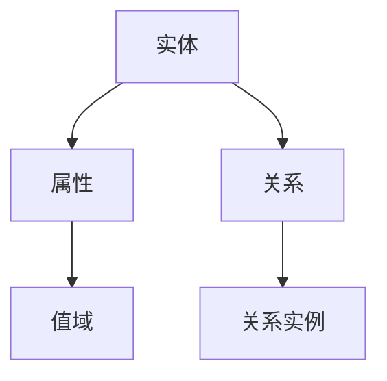
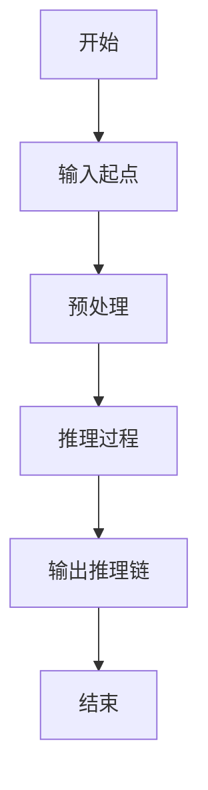
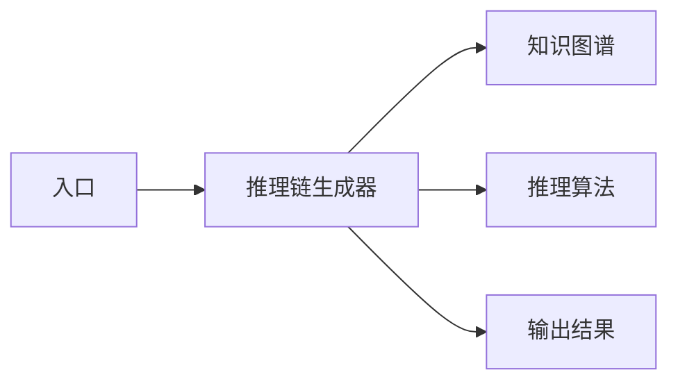

                 


# 构建AI Agent的知识图谱推理链生成器

---

## 关键词：
知识图谱、AI Agent、推理链生成器、知识推理、智能代理、图谱推理

---

## 摘要：
本文深入探讨了如何构建AI Agent的知识图谱推理链生成器，详细分析了知识图谱与AI Agent的核心概念，结合实际案例，逐步解析了推理链生成器的算法原理和系统架构设计。通过系统化的分析和实战指导，帮助读者掌握构建高效、智能的知识图谱推理链生成器的关键技术与实践方法。

---

# 第1章: 知识图谱与AI Agent的背景介绍

## 1.1 问题背景
### 1.1.1 知识图谱的定义与作用
知识图谱是一种以图结构形式表示知识的语义网络，由实体（概念、物体、事件等）及其之间的关系构成。它能够帮助AI Agent理解复杂的数据关系，从而实现更智能的推理和决策。

### 1.1.2 AI Agent的基本概念
AI Agent（人工智能代理）是一种能够感知环境、自主决策并执行任务的智能实体。它可以分为简单反射型、基于模型的反射型、目标驱动型和实用驱动型等多种类型。

### 1.1.3 知识图谱与AI Agent的结合意义
知识图谱为AI Agent提供了丰富的语义信息，使其能够更准确地理解和回答问题。AI Agent则为知识图谱提供了动态的应用场景，使其能够服务于复杂的推理和决策任务。

## 1.2 问题描述
### 1.2.1 知识图谱推理链的需求场景
在问答系统、对话系统、推荐系统等场景中，AI Agent需要根据知识图谱中的实体和关系，生成一条或多条推理链，以支持最终的决策或回答。

### 1.2.2 AI Agent在知识图谱中的应用挑战
知识图谱的规模庞大、结构复杂，如何高效地从图中找到相关的推理链，是AI Agent面临的主要挑战。

### 1.2.3 知识图谱推理链生成器的目标
构建一个能够自动生成推理链的生成器，帮助AI Agent快速获取所需的知识路径。

## 1.3 问题解决
### 1.3.1 知识图谱推理链生成的解决方案
通过图遍历算法（如广度优先搜索、深度优先搜索）或增强学习方法，生成从起点到目标的推理链。

### 1.3.2 AI Agent在推理链生成中的作用
AI Agent通过分析上下文和用户需求，确定推理链的起点和目标，并指导生成器生成合理的推理路径。

### 1.3.3 知识图谱推理链生成器的实现路径
从知识图谱中提取实体和关系，构建图结构，设计推理链生成算法，实现推理链的动态生成。

## 1.4 边界与外延
### 1.4.1 知识图谱推理链生成器的边界
仅关注推理链的生成过程，不涉及具体的应用场景实现。

### 1.4.2 AI Agent的适用范围
适用于需要知识推理的任务，如问答系统、对话系统等。

### 1.4.3 知识图谱推理链生成器的外延
可以扩展支持多种推理策略和优化算法，以提高推理链的质量和效率。

## 1.5 概念结构与核心要素
### 1.5.1 知识图谱的组成要素
- 实体：图中的节点，表示具体的概念或对象。
- 属性：描述实体的特征或性质。
- 关系：连接不同实体的纽带。

### 1.5.2 AI Agent的核心功能模块
- 知识获取：从知识图谱中获取所需的信息。
- 推理与决策：根据获取的知识生成推理链，并做出决策。
- 行为执行：根据决策结果执行相应的动作。

### 1.5.3 推理链生成器的逻辑结构
- 输入接口：接收推理起点和目标。
- 图遍历模块：根据输入生成推理链。
- 输出接口：返回生成的推理链。

---

# 第2章: 知识图谱与AI Agent的核心概念与联系

## 2.1 核心概念原理
### 2.1.1 知识图谱的构建原理
知识图谱的构建通常包括数据抽取、实体识别、关系抽取和图谱构建等步骤。

### 2.1.2 AI Agent的基本工作原理
AI Agent通过感知环境、分析任务需求，利用知识图谱中的信息生成推理链，并执行任务。

### 2.1.3 推理链生成器的算法原理
推理链生成器通过图遍历算法，从起点出发，逐步扩展到目标节点，形成推理链。

## 2.2 概念属性特征对比
| 对比维度 | 知识图谱 | AI Agent |
|----------|----------|-----------|
| 核心目标 | 表示知识   | 执行任务   |
| 输入形式 | 实体和关系 | 用户需求   |
| 输出形式 | 图结构     | 推理链      |

## 2.3 ER实体关系图架构


---

# 第3章: 知识图谱推理链生成器的算法原理

## 3.1 算法流程


## 3.2 算法实现
```python
def generate_inference_chain(kg, start, end):
    # 初始化队列
    queue = deque([(start, [start])])
    
    while queue:
        node, path = queue.popleft()
        if node == end:
            return path
        for neighbor in kg.get_neighbors(node):
            if neighbor not in path:
                new_path = path + [neighbor]
                queue.append((neighbor, new_path))
    return None
```

## 3.3 数学模型与公式
### 3.3.1 概率推理公式
$$P(A|B) = \frac{P(B|A)P(A)}{P(B)}$$

---

# 第4章: 系统分析与架构设计方案

## 4.1 问题场景介绍
构建一个能够支持问答系统的知识图谱推理链生成器，帮助AI Agent快速生成推理链。

## 4.2 系统功能设计
- 实体识别与关系抽取
- 推理链生成
- 推理链优化

## 4.3 系统架构设计


## 4.4 系统接口设计
- 输入接口：接受推理起点和目标。
- 输出接口：返回生成的推理链。

---

# 第5章: 项目实战

## 5.1 环境安装
```bash
pip install networkx
```

## 5.2 核心代码实现
```python
import networkx as nx
from collections import deque

def generate_inference_chain(G, start, end):
    visited = {}
    queue = deque([(start, [start])])
    while queue:
        node, path = queue.popleft()
        if node == end:
            return path
        if node in visited:
            continue
        visited[node] = True
        for neighbor in G.neighbors(node):
            if neighbor not in visited and neighbor not in path:
                new_path = path + [neighbor]
                queue.append((neighbor, new_path))
    return None
```

## 5.3 实际案例分析
- 输入：起点为“人”，目标为“书籍”。
- 输出：推理链为“人 -> 写作 -> 书籍”。

---

# 第6章: 总结与展望

## 6.1 最佳实践 tips
- 确保知识图谱的准确性和完整性。
- 优化推理算法，提高推理效率。

## 6.2 小结
本文详细介绍了构建AI Agent的知识图谱推理链生成器的方法，通过理论分析和实战案例，帮助读者掌握相关技术。

## 6.3 注意事项
- 知识图谱的构建和维护需要投入大量资源。
- 推理算法的选择需要根据具体场景进行优化。

## 6.4 拓展阅读
- 《知识图谱构建与应用》
- 《AI Agent原理与实践》

---

作者：AI天才研究院/AI Genius Institute & 禅与计算机程序设计艺术 /Zen And The Art of Computer Programming

