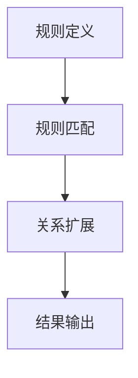
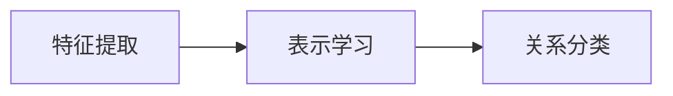
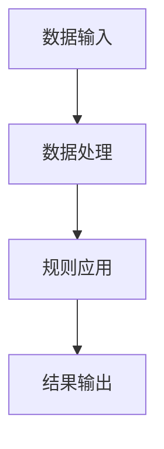
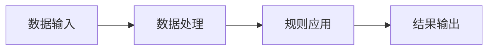

                 


# 构建AI Agent的知识图谱自动扩展与验证框架

> 关键词：知识图谱、AI Agent、自动扩展、验证框架、图神经网络、机器学习

> 摘要：本文将详细介绍如何构建AI Agent的知识图谱自动扩展与验证框架。首先，我们从知识图谱的基本概念出发，分析其在AI Agent中的重要性。接着，我们将探讨知识图谱自动扩展的核心算法，包括基于规则、机器学习和图神经网络的方法。随后，我们详细设计知识图谱验证框架的系统架构，并通过实际案例展示其应用。最后，我们将总结构建知识图谱自动扩展与验证框架的关键点和未来发展方向。

---

## 第1章: 知识图谱的基本概念与构建过程

### 1.1 知识图谱的定义与特点

知识图谱是一种以图结构形式表示知识的语义网络，节点表示实体或概念，边表示实体之间的关系。其特点包括：

- **语义性**：节点和边都具有明确的语义定义。
- **可扩展性**：支持大规模数据的扩展。
- **结构化**：以图结构组织知识，便于计算机理解和推理。

### 1.2 知识图谱的构建过程

知识图谱的构建通常包括以下几个步骤：

1. **数据获取**：从多种数据源（如文本、数据库、知识库）获取原始数据。
2. **数据清洗**：对数据进行预处理，去除噪声和冗余信息。
3. **实体识别**：识别文本中的实体并建立实体库。
4. **关系抽取**：从文本中抽取实体之间的关系。
5. **知识融合**：将多个数据源中的知识进行整合，解决冲突和冗余。

### 1.3 AI Agent与知识图谱的关系

AI Agent需要依赖知识图谱来实现智能推理和决策。知识图谱为AI Agent提供了丰富的知识表示和推理能力，使其能够理解和处理复杂的问题。

---

## 第2章: 知识图谱自动扩展的核心算法

### 2.1 基于规则的扩展算法

基于规则的扩展方法通过定义一系列规则来自动扩展知识图谱。例如，可以定义规则来推导新的关系或属性。

#### 2.1.1 规则定义与实现



规则匹配的过程包括以下步骤：

1. **规则匹配**：将规则应用于知识图谱中的实体，匹配符合条件的实体对。
2. **关系扩展**：根据匹配结果，推导新的关系或属性，并将结果添加到知识图谱中。

### 2.2 基于机器学习的扩展算法

基于机器学习的扩展方法通过训练模型来自动识别和扩展知识图谱中的关系。

#### 2.2.1 特征提取与表示学习



特征提取包括将实体和关系转化为向量表示，常用的方法包括Word2Vec和GloVe。

#### 2.2.2 分类与回归模型

在关系分类任务中，可以使用支持向量机（SVM）或随机森林（Random Forest）模型。例如：

$$
\text{预测概率} = \frac{1}{1 + e^{- (w \cdot x + b)}}
$$

其中，\( w \) 是权重向量，\( x \) 是输入向量，\( b \) 是偏置项。

---

## 第3章: 知识图谱验证框架的设计

### 3.1 验证框架的目标与模块划分

知识图谱验证框架的目标是确保知识图谱的质量和一致性。其模块划分如下：

1. **数据输入与处理模块**：接收输入数据并进行预处理。
2. **扩展规则与模型模块**：定义和管理扩展规则及模型。
3. **验证与评估模块**：对扩展后的知识图谱进行验证和评估。

#### 3.1.1 验证指标

常用的验证指标包括：

- 准确率（Precision）
- 召回率（Recall）
- F1分数（F1 Score）

### 3.2 系统架构设计

#### 3.2.1 分层架构设计



分层架构包括数据输入层、数据处理层、规则应用层和结果输出层。

#### 3.2.2 模块交互关系

模块之间的交互关系如下：



---

## 第4章: 项目实战与案例分析

### 4.1 项目环境搭建

#### 4.1.1 开发工具安装

安装必要的开发工具，如Python、Jupyter Notebook、TensorFlow等。

#### 4.1.2 数据集准备

选择合适的数据集，如Freebase、Wikidata等。

### 4.2 核心代码实现

#### 4.2.1 规则扩展模块实现

```python
def apply_rules(kg, rules):
    for rule in rules:
        for edge in kg.get_edges():
            if rule匹配(edge):
                kg.add_new_edge(推导出的新关系)
    return kg
```

#### 4.2.2 机器学习模型训练

使用监督学习模型训练关系抽取任务：

```python
from sklearn.svm import SVC
model = SVC()
model.fit(X_train, y_train)
```

### 4.3 实际案例分析

以一个简单的知识图谱扩展案例为例：

- 数据输入：书籍《1984》的作者是乔治·奥威尔。
- 规则应用：如果一本书的作者是乔治·奥威尔，那么这本书属于文学类。
- 结果输出：《1984》属于文学类。

---

## 第5章: 最佳实践与总结

### 5.1 最佳实践

1. 在实际应用中，建议结合多种扩展方法（规则、机器学习、图神经网络）来提高扩展效果。
2. 验证框架的设计应注重模块化和可扩展性，便于后续的优化和扩展。

### 5.2 小结

本文详细介绍了构建AI Agent的知识图谱自动扩展与验证框架的核心概念、算法原理和系统设计。通过实际案例分析，展示了如何将理论应用于实践。未来的研究方向包括更高效的知识图谱扩展算法和更智能的验证框架设计。

---

## 作者：AI天才研究院/AI Genius Institute & 禅与计算机程序设计艺术 /Zen And The Art of Computer Programming

---

这篇文章通过逐步分析和详细讲解，帮助读者全面理解构建AI Agent的知识图谱自动扩展与验证框架的核心内容和实现方法。

