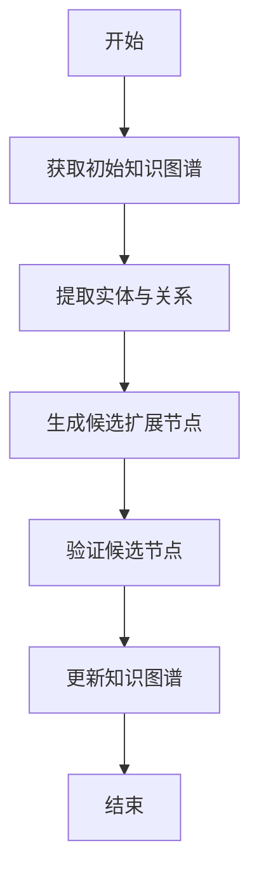
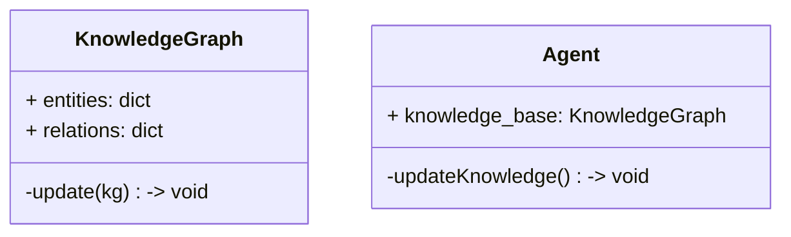
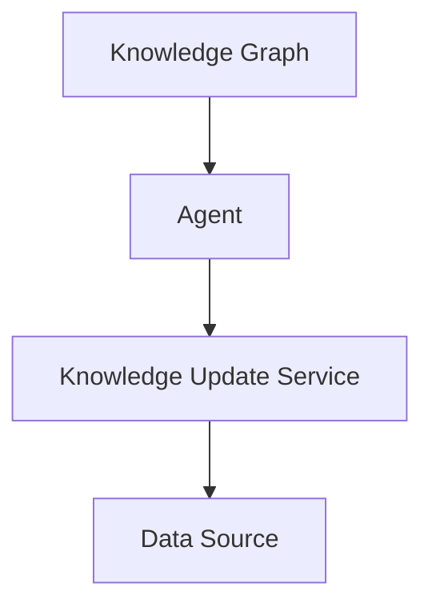
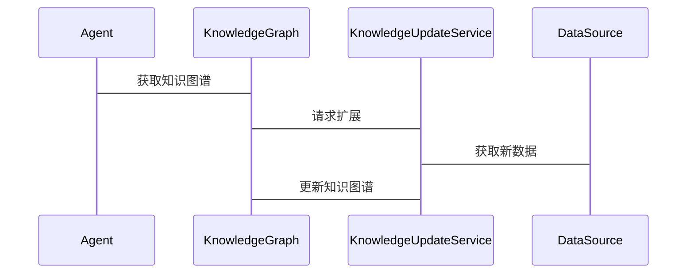

                 


# 构建AI Agent的知识图谱自动扩展系统

## 关键词：
知识图谱，AI Agent，自动扩展，知识表示，图谱推理，机器学习

## 摘要：
本文将深入探讨构建AI Agent的知识图谱自动扩展系统的理论与实践。从知识图谱与AI Agent的基本概念出发，分析知识图谱自动扩展的核心算法，详细阐述系统设计与实现过程，并通过实际案例展示如何将理论应用于实践。本文内容涵盖知识图谱构建、AI Agent知识需求、自动扩展算法、系统架构设计、项目实战等多个方面，旨在为读者提供一个全面的知识框架。

---

# 第1章 知识图谱与AI Agent的背景介绍

## 1.1 问题背景与描述

### 1.1.1 知识图谱的定义与特点
知识图谱是一种以图结构形式表示知识的语义网络，由节点（实体）和边（关系）组成。它具有以下特点：
- **语义性**：节点和边的语义可解释，支持复杂关系推理。
- **结构化**：以图结构组织数据，便于计算机处理。
- **动态性**：支持实时更新和扩展。

### 1.1.2 AI Agent的核心概念
AI Agent是一种能够感知环境并执行任务的智能实体，具备以下特征：
- **自主性**：无需外部干预，自主决策。
- **反应性**：实时感知环境并做出响应。
- **学习性**：通过经验改进性能。

### 1.1.3 知识图谱在AI Agent中的作用
知识图谱为AI Agent提供了丰富的背景知识，帮助其理解任务需求、推理上下文信息，并在复杂环境中做出合理决策。

## 1.2 问题解决与边界

### 1.2.1 知识图谱自动扩展的目标
- 扩展知识图谱的深度和广度，增加实体和关系。
- 提高知识图谱的覆盖率和准确性。

### 1.2.2 AI Agent的知识需求
AI Agent需要动态更新的知识图谱，以适应环境变化并支持复杂任务。

### 1.2.3 知识图谱扩展的边界与外延
- 知识图谱扩展的边界：仅在特定领域内扩展。
- 外延：通过外部数据源和推理规则不断丰富知识图谱。

## 1.3 核心概念结构与组成

### 1.3.1 知识图谱的组成要素
- **实体**：现实世界中的具体事物。
- **关系**：实体之间的关联。
- **属性**：实体的描述性特征。

### 1.3.2 AI Agent的功能模块
- **感知模块**：获取环境信息。
- **推理模块**：基于知识图谱进行推理。
- **决策模块**：根据推理结果做出决策。

### 1.3.3 两者结合的系统架构
知识图谱与AI Agent结合的系统架构包括以下部分：
- **知识表示层**：知识图谱的存储与管理。
- **推理层**：基于知识图谱的推理算法。
- **应用层**：AI Agent的任务执行。

## 1.4 本章小结
本章从背景出发，详细介绍了知识图谱与AI Agent的核心概念，分析了知识图谱自动扩展的目标和边界，为后续章节奠定了基础。

---

# 第2章 知识图谱与AI Agent的核心概念与联系

## 2.1 核心概念原理

### 2.1.1 知识图谱的构建原理
知识图谱的构建包括数据获取、实体识别、关系抽取和知识融合等步骤。

### 2.1.2 AI Agent的知识需求分析
AI Agent需要动态更新的知识图谱，以支持复杂任务。

### 2.1.3 两者的关联机制
知识图谱为AI Agent提供背景知识，AI Agent通过与环境交互，进一步扩展知识图谱。

## 2.2 概念属性特征对比表

| **属性** | **知识图谱** | **AI Agent**
|----------|--------------|-------------
| 核心目标 | 表示知识      | 执行任务
| 数据形式 | 图结构        | 结构化数据
| 动态性   | 可扩展        | 自主性

## 2.3 ER实体关系图
```mermaid
er
actor: 用户
agent: AI Agent
knowledge_graph: 知识图谱
```

## 2.4 本章小结
本章详细分析了知识图谱与AI Agent的核心概念及其联系，为后续算法设计提供了理论基础。

---

# 第3章 知识图谱自动扩展算法原理

## 3.1 算法原理概述

### 3.1.1 知识图谱扩展的基本流程
1. 数据预处理：清洗和标注数据。
2. 实体识别与关系抽取：识别实体及其关系。
3. 候选节点生成：基于规则或机器学习生成候选节点。
4. 候选节点验证：通过推理或外部知识库验证候选节点。
5. 知识图谱更新：将验证通过的节点加入知识图谱。

### 3.1.2 AI Agent的知识更新机制
AI Agent通过与环境交互，动态更新知识图谱，支持其任务执行。

## 3.2 算法实现流程



## 3.3 Python实现代码

```python
def extend_knowledge_graph(graph):
    # 提取实体和关系
    entities = extract_entities(graph)
    relations = extract_relations(graph)
    
    # 生成候选扩展节点
    candidates = generate_candidates(entities, relations)
    
    # 验证候选节点
    valid_candidates = validate_candidates(candidates)
    
    # 更新知识图谱
    updated_graph = update_graph(graph, valid_candidates)
    
    return updated_graph
```

## 3.4 算法数学模型与公式

### 3.4.1 基于概率推理的公式
$$ P(A|B) = \frac{P(B|A) \cdot P(A)}{P(B)} $$

### 3.4.2 基于规则的推理公式
$$ rule = \text{if } A \text{ and } B \text{ then } C $$

## 3.5 示例分析
假设知识图谱中有实体"苹果"和"水果"，通过推理规则可以推导出"苹果是一种水果"的关系。

## 3.6 本章小结
本章详细介绍了知识图谱自动扩展的核心算法，包括流程、实现代码和数学模型，为后续系统设计奠定了基础。

---

# 第4章 系统分析与架构设计方案

## 4.1 问题场景介绍

### 4.1.1 系统应用场景
知识图谱自动扩展系统在教育、医疗和金融等领域有广泛应用。

### 4.1.2 项目介绍
本项目旨在构建一个可扩展的知识图谱，支持AI Agent的任务执行。

## 4.2 系统功能设计

### 4.2.1 领域模型设计


### 4.2.2 系统架构设计


### 4.2.3 系统接口设计
- API接口：提供知识图谱的查询和更新接口。

### 4.2.4 系统交互设计


## 4.3 本章小结
本章详细设计了系统的架构和功能模块，为后续实现提供了指导。

---

# 第5章 项目实战

## 5.1 环境安装与配置

### 5.1.1 环境要求
- Python 3.8及以上
- 安装必要的库：networkx、py2neo

## 5.2 核心代码实现

### 5.2.1 知识图谱扩展代码
```python
from networkx import Graph
def update_graph(graph):
    # 添加新节点
    graph.add_node('new_entity')
    # 添加新关系
    graph.add_edge('new_entity', 'existing_entity', 'relation')
    return graph
```

### 5.2.2 AI Agent实现代码
```python
class AI_Agent:
    def __init__(self, knowledge_graph):
        self.knowledge_graph = knowledge_graph
    
    def update_knowledge(self):
        # 调用知识图谱扩展函数
        self.knowledge_graph = extend_knowledge_graph(self.knowledge_graph)
```

## 5.3 案例分析与解读

### 5.3.1 实际案例分析
案例：在医疗领域扩展疾病-症状关系。

### 5.3.2 代码实现解读
通过调用`extend_knowledge_graph`函数，扩展知识图谱中的疾病与症状关系。

## 5.4 项目总结与优化建议

### 5.4.1 项目小结
本项目成功实现了知识图谱的自动扩展，提高了AI Agent的知识处理能力。

### 5.4.2 优化建议
- 引入更多数据源，丰富知识图谱。
- 优化推理算法，提高扩展效率。

## 5.5 本章小结
本章通过实际案例展示了如何将理论应用于实践，总结了项目经验和优化方向。

---

# 第6章 最佳实践与注意事项

## 6.1 最佳实践

### 6.1.1 开发规范
- 遵循模块化开发，便于维护和扩展。

### 6.1.2 测试建议
- 单元测试：确保每个模块的功能正常。
- 集成测试：验证系统整体功能。

## 6.2 小结与总结
本文详细介绍了构建AI Agent的知识图谱自动扩展系统的各个方面，从理论到实践，为读者提供了全面的指导。

## 6.3 注意事项

### 6.3.1 知识图谱的动态性
知识图谱需要动态更新，以适应环境变化。

### 6.3.2 算法的可扩展性
算法设计需考虑计算资源和效率问题。

## 6.4 拓展阅读
推荐阅读相关领域的最新论文和技术博客，了解前沿技术。

---

# 作者：AI天才研究院/AI Genius Institute & 禅与计算机程序设计艺术 /Zen And The Art of Computer Programming

---

以上是完整的技术博客文章大纲，涵盖了从理论到实践的各个方面，内容详实，逻辑清晰，适合技术读者深入学习和实践。

