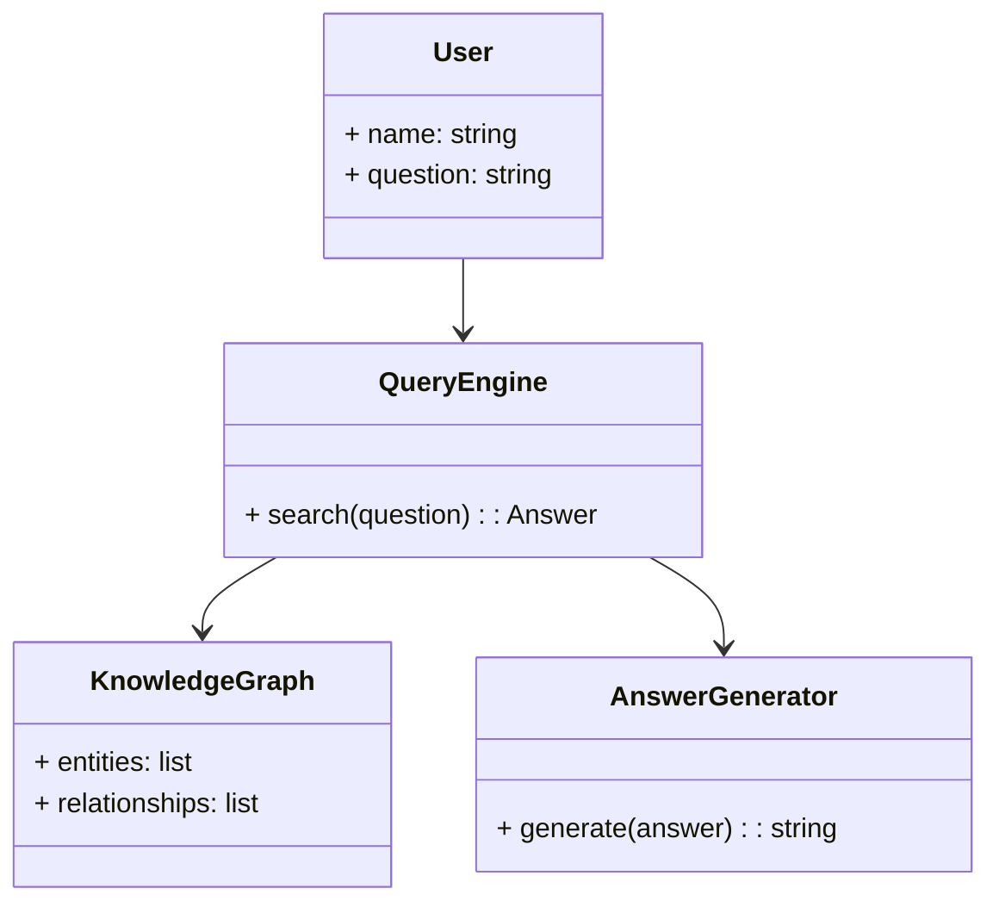
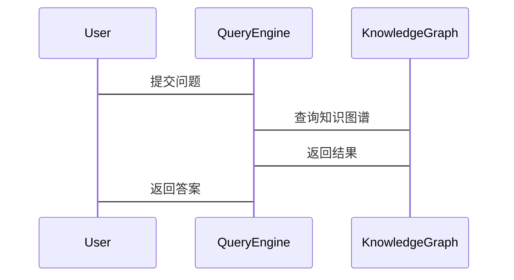

                 


# 构建AI Agent的知识图谱自动问答系统

## 关键词
知识图谱，AI Agent，自动问答系统，自然语言处理，问答系统，问答系统架构

## 摘要
本文详细介绍了如何构建一个基于知识图谱的AI Agent自动问答系统。文章从知识图谱的基本概念出发，分析了其在问答系统中的应用，探讨了AI Agent的核心功能及其在问答系统中的作用。通过详细讲解知识图谱的构建与表示、自动问答系统的实现原理、知识图谱与问答系统的结合，以及系统架构设计，本文为读者提供了从理论到实践的全面指导。最后，通过实际案例分析和项目实战，帮助读者掌握如何构建一个高效、准确的知识图谱问答系统。

---

# 第1章 知识图谱与问答系统概述

## 1.1 知识图谱的概念与特点
### 1.1.1 知识图谱的定义
知识图谱是一种结构化的数据表示方法，通过实体和关系的网络描述现实世界中的知识。它通常以图的形式存储，节点表示实体，边表示实体之间的关系。

### 1.1.2 知识图谱的核心特点
1. **结构化**：知识图谱通过图结构组织数据，支持复杂的语义查询。
2. **可扩展性**：可以不断扩展新的实体和关系，适应不同领域的需求。
3. **语义丰富**：通过关系和属性描述，提供比传统数据库更丰富的语义信息。

### 1.1.3 知识图谱与传统数据库的区别
| 特性       | 知识图谱             | 传统数据库       |
|------------|--------------------|------------------|
| 数据结构   | 图结构（节点和边）   | 行列式结构       |
| 查询能力   | 支持复杂语义查询     | 支持简单条件查询 |
| 数据规模   | 可扩展性高          | 数据规模有限     |
| 应用场景   | 智能问答、知识挖掘   | 事务处理         |

## 1.2 AI Agent 的概念与作用
### 1.2.1 AI Agent 的定义
AI Agent（智能体）是指在计算机系统中，能够感知环境并采取行动以实现目标的实体。它可以理解用户需求、执行任务并提供服务。

### 1.2.2 AI Agent 的核心功能
1. **感知环境**：通过传感器或接口获取环境信息。
2. **决策与推理**：基于知识库或算法做出决策。
3. **执行操作**：根据决策结果执行具体操作。
4. **学习与优化**：通过反馈机制不断优化自身性能。

### 1.2.3 AI Agent 在问答系统中的应用
AI Agent作为问答系统的主体，负责接收用户查询、解析问题、检索知识图谱并生成答案。它能够理解用户的意图，提供精准的知识服务。

## 1.3 知识图谱问答系统的核心概念
### 1.3.1 知识图谱问答系统的定义
知识图谱问答系统是一种基于知识图谱的问答系统，利用知识图谱的结构化数据，通过自然语言处理技术，实现智能问答。

### 1.3.2 系统的核心功能模块
1. **问题理解**：解析用户的问题，提取关键信息。
2. **知识检索**：在知识图谱中找到与问题相关的实体和关系。
3. **答案生成**：根据检索结果生成自然语言答案。

### 1.3.3 系统的实现流程
1. **用户输入问题**：用户提出问题。
2. **问题解析**：系统理解问题的语义。
3. **知识检索**：在知识图谱中找到相关实体和关系。
4. **答案生成**：系统生成自然语言答案并返回给用户。

## 1.4 知识图谱问答系统的应用场景
### 1.4.1 智能客服
知识图谱问答系统可以应用于智能客服，帮助用户快速解决问题。

### 1.4.2 智能助手
通过集成知识图谱，智能助手可以提供更智能的服务，例如语音助手。

### 1.4.3 教育领域
知识图谱问答系统可以用于教育领域，帮助学生解答学习中的问题。

## 1.5 本章小结
本章介绍了知识图谱和AI Agent的基本概念，分析了知识图谱问答系统的核心功能和应用场景，为后续章节的深入探讨奠定了基础。

---

# 第2章 知识图谱的构建与表示

## 2.1 知识图谱的构建过程
### 2.1.1 数据收集与预处理
数据收集是知识图谱构建的第一步，通常包括爬取网页、获取结构化数据等。

### 2.1.2 实体识别与关系抽取
实体识别是指从文本中提取出实体（如人名、地名等），关系抽取是指识别出实体之间的关系。

### 2.1.3 知识融合与优化
知识融合是指将多个来源的数据整合到一个知识图谱中，优化过程包括去除冗余信息、消除冲突等。

## 2.2 知识图谱的表示方法
### 2.2.1 图结构表示
知识图谱通常使用图结构表示，节点表示实体，边表示关系。

### 2.2.2 实体与关系的表示形式
1. **实体表示**：使用字符串或概念唯一标识实体。
2. **关系表示**：使用关系类型和属性描述实体之间的联系。

### 2.2.3 知识图谱的存储与管理
知识图谱的存储可以采用图数据库（如Neo4j）或关系型数据库。

## 2.3 知识图谱的可视化
### 2.3.1 知识图谱的可视化工具
常用的可视化工具包括Gephi、Cytoscape等。

### 2.3.2 知识图谱的可视化方法
1. **节点与边的布局**：采用树状图、网络图等形式。
2. **交互式可视化**：支持用户交互式查询和导航。

## 2.4 本章小结
本章详细介绍了知识图谱的构建过程和表示方法，为后续章节的实现提供了基础。

---

# 第3章 自动问答系统的实现原理

## 3.1 自动问答系统的核心原理
### 3.1.1 问题理解与解析
问题理解是问答系统的关键步骤，需要将自然语言问题转换为计算机可以理解的形式。

### 3.1.2 知识图谱中的信息检索
通过匹配问题中的关键词和知识图谱中的实体，找到相关的信息。

### 3.1.3 答案生成与优化
根据检索到的信息，生成自然语言答案，并优化答案的表达。

## 3.2 基于知识图谱的问答系统实现
### 3.2.1 系统的输入输出流程
1. **输入**：用户提出问题。
2. **输出**：系统返回答案。

### 3.2.2 知识图谱的查询与匹配
通过查询引擎在知识图谱中找到匹配的实体和关系。

### 3.2.3 答案的生成与评价
答案生成可以基于模板或使用自然语言处理技术生成。

## 3.3 常见的问答系统算法
### 3.3.1 基于规则的问答系统
通过预定义的规则匹配问题。

### 3.3.2 基于统计的问答系统
利用统计学习方法训练模型。

### 3.3.3 基于深度学习的问答系统
使用神经网络模型（如BERT）进行问答。

## 3.4 本章小结
本章分析了自动问答系统的实现原理，介绍了几种常见的问答系统算法。

---

# 第4章 知识图谱与问答系统的结合

## 4.1 知识图谱在问答系统中的作用
### 4.1.1 提供结构化的知识库
知识图谱为问答系统提供了结构化的知识库，支持复杂问题的解答。

### 4.1.2 支持复杂问题的解答
知识图谱能够处理复杂的关系和属性，支持多步推理。

### 4.1.3 提高问答系统的准确率
通过知识图谱的结构化数据，问答系统可以更准确地理解问题并生成答案。

## 4.2 知识图谱问答系统的实现
### 4.2.1 系统的输入输出流程
1. **输入**：用户提出问题。
2. **输出**：系统返回准确的答案。

### 4.2.2 知识图谱的查询与匹配
通过查询引擎在知识图谱中找到匹配的实体和关系。

### 4.2.3 答案的生成与优化
根据检索到的信息，生成自然语言答案并优化表达。

## 4.3 本章小结
本章探讨了知识图谱与问答系统的结合，分析了知识图谱在问答系统中的作用和实现方法。

---

# 第5章 系统分析与架构设计

## 5.1 系统功能设计
### 5.1.1 领域模型设计
通过Mermaid类图展示系统的功能模块。



### 5.1.2 系统架构设计
通过Mermaid架构图展示系统的整体架构。


### 5.1.3 系统接口设计
系统接口包括用户输入接口、知识图谱查询接口和答案生成接口。

### 5.1.4 系统交互流程
通过Mermaid序列图展示系统交互流程。



## 5.2 系统性能优化
### 5.2.1 知识图谱的索引优化
通过建立索引提高查询效率。

### 5.2.2 问答系统的缓存机制
使用缓存技术减少重复查询，提高系统性能。

## 5.3 本章小结
本章通过系统分析和架构设计，为知识图谱问答系统的实现提供了理论支持。

---

# 第6章 项目实战

## 6.1 环境安装
### 6.1.1 安装Python
使用Anaconda安装Python环境。

### 6.1.2 安装依赖库
安装必要的Python库，如`networkx`、`py2neo`等。

## 6.2 核心代码实现
### 6.2.1 知识图谱构建代码
```python
from py2neo import Graph, Node, Relationship

graph = Graph("http://localhost:7474", auth=("neo4j", "password"))
# 创建节点
node1 = Node("Person", name="Alice")
node2 = Node("Person", name="Bob")
# 创建关系
relationship = Relationship(node1, "KNOWS", node2)
graph.create(relationship)
```

### 6.2.2 问答系统实现代码
```python
from py2neo import Graph, Node, Relationship

graph = Graph("http://localhost:7474", auth=("neo4j", "password"))

def query_knowledge_graph(question):
    # 简单的查询实现
    # 这里可以根据具体需求实现更复杂的查询逻辑
    pass

def generate_answer(answer):
    # 生成自然语言答案
    return "The answer is {}".format(answer)

user_question = "What is the relationship between Alice and Bob?"
system_answer = generate_answer(query_knowledge_graph(user_question))
print(system_answer)
```

## 6.3 案例分析
### 6.3.1 知识图谱构建案例
构建一个简单的知识图谱，包含人物关系。

### 6.3.2 问答系统应用案例
用户提问“Who knows Alice?”，系统返回“Bob”。

## 6.4 项目总结
通过本章的实战，读者可以掌握知识图谱问答系统的实现方法。

---

# 第7章 最佳实践与小结

## 7.1 最佳实践
### 7.1.1 知识图谱的优化
定期更新知识图谱，保持数据的准确性和及时性。

### 7.1.2 问答系统的优化
优化问答系统的算法，提高回答的准确率和响应速度。

## 7.2 小结
本文详细介绍了知识图谱问答系统的构建过程，从理论到实践，为读者提供了全面的指导。

## 7.3 注意事项
1. 知识图谱的构建需要大量数据和时间。
2. 问答系统的性能优化需要考虑算法和数据结构。

## 7.4 拓展阅读
推荐阅读相关领域的书籍和论文，深入学习知识图谱和问答系统的最新技术。

---

# 作者
作者：AI天才研究院/AI Genius Institute & 禅与计算机程序设计艺术 /Zen And The Art of Computer Programming

---

以上是《构建AI Agent的知识图谱自动问答系统》的技术博客文章的完整内容，涵盖了从理论到实践的各个方面，确保读者能够全面理解并掌握相关知识。

