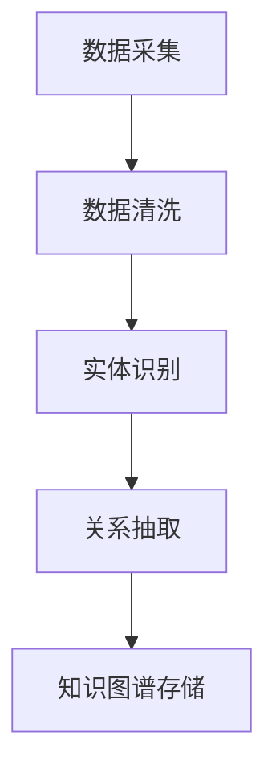
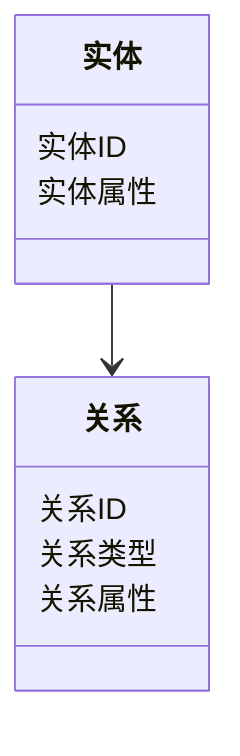
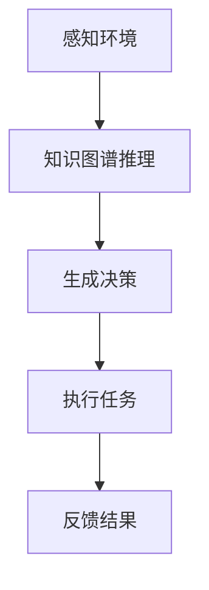
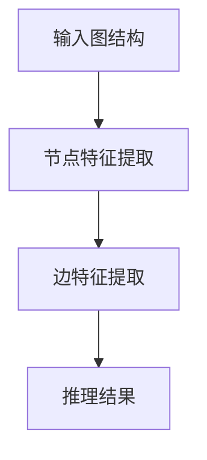
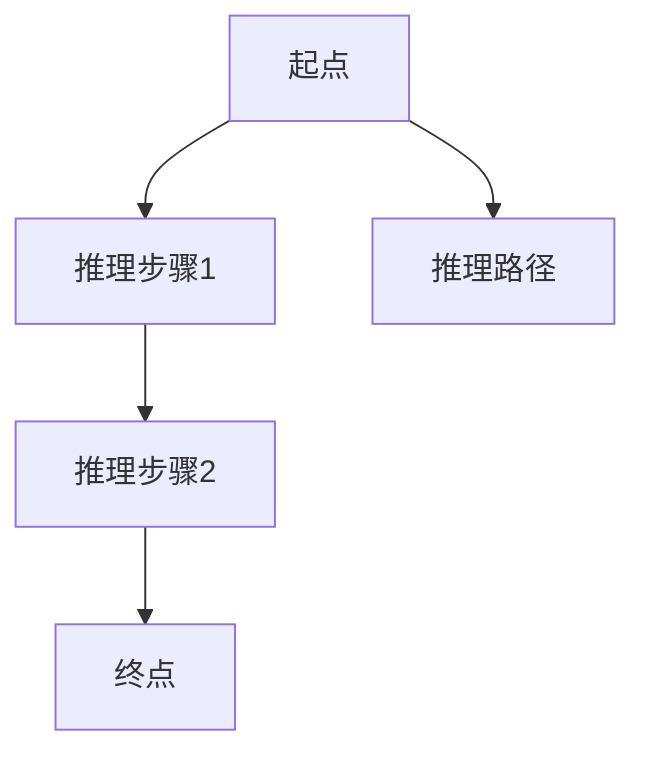
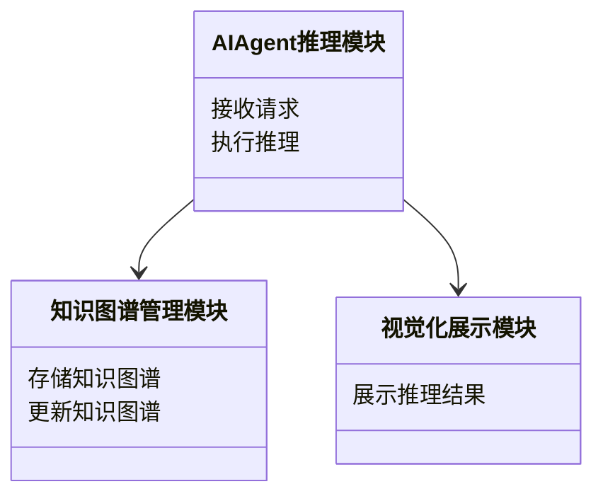
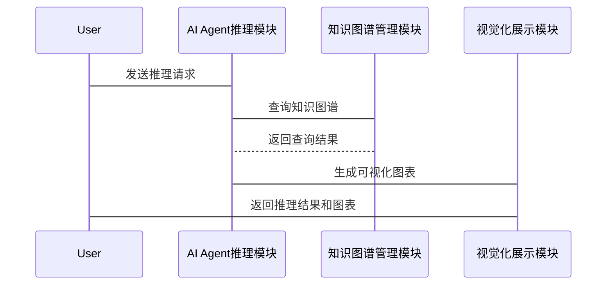
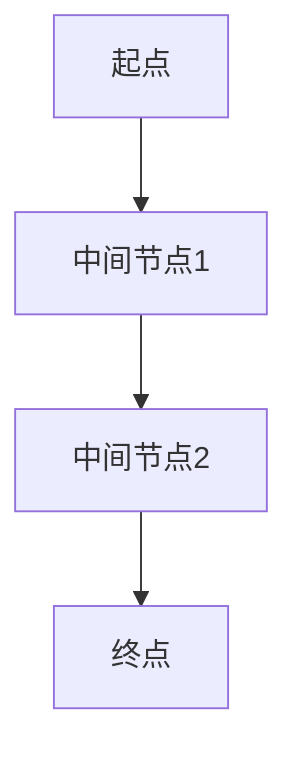

                 


# 构建AI Agent的知识图谱视觉化推理系统

## 关键词：AI Agent，知识图谱，视觉化推理，系统架构，项目实战，算法原理

## 摘要：  
本文旨在探讨如何构建一个基于知识图谱的AI Agent视觉化推理系统。通过对知识图谱的构建、AI Agent的原理以及视觉化推理方法的详细分析，结合实际项目案例，从系统架构设计到算法实现，逐步展示如何打造一个高效、智能的AI Agent推理系统。本文将帮助读者理解知识图谱与AI Agent的结合，掌握视觉化推理的核心算法，并通过实际项目实战，提升构建类似系统的实战能力。

---

## 第1章: 背景介绍与核心概念

### 1.1 AI Agent与知识图谱的背景  
AI Agent（人工智能代理）是一种能够感知环境、自主决策并执行任务的智能实体。知识图谱是一种以图结构表示实体及其关系的语义网络，广泛应用于搜索引擎、智能问答和推荐系统等领域。  

**问题背景：**  
传统的AI Agent依赖于规则或预定义数据，难以应对复杂多变的环境。而知识图谱的语义表示能力和强大的关联性为AI Agent提供了更丰富的上下文信息，使其能够更好地理解用户需求并做出智能决策。  

**问题解决：**  
通过构建知识图谱，AI Agent可以实现基于知识的推理和决策，从而提高系统的智能性和适应性。  

### 1.2 核心概念与术语  
- **知识图谱（Knowledge Graph）**：由实体（node）和关系（edge）构成的图结构，用于表示知识的语义网络。  
- **AI Agent**：能够感知环境、自主决策并执行任务的智能实体。  
- **视觉化推理（Visualized Reasoning）**：将知识图谱中的推理过程以可视化的方式呈现，便于理解和分析。  

**核心要素对比表：**  

| 比较项       | 知识图谱                | AI Agent               | 视觉化推理             |
|--------------|-----------------------|-------------------------|-----------------------|
| 核心目标     | 表示知识的语义网络       | 执行智能任务             | 可视化推理过程         |
| 主要组件     | 实体、关系、属性        | 感知器、决策器、执行器   | 图形化界面、推理引擎   |
| 应用场景     | 搜索引擎、问答系统       | 自动化控制、智能助手     | 可视化分析、教育辅助   |

### 1.3 知识图谱与AI Agent的关系  
- 知识图谱为AI Agent提供知识库，支持其进行语义理解与推理。  
- AI Agent通过知识图谱的关联性，实现上下文感知和智能决策。  
- 视觉化推理系统将知识图谱的推理过程可视化，提升系统的透明度和可解释性。  

**本章小结：**  
本章介绍了AI Agent和知识图谱的基本概念，并分析了它们在构建视觉化推理系统中的作用和关系。

---

## 第2章: 知识图谱的构建与管理

### 2.1 知识图谱的构建流程  
**2.1.1 数据采集与预处理**  
- 数据来源：结构化数据（数据库）、半结构化数据（网页、文档）、非结构化数据（文本、图像）。  
- 数据清洗：去重、标准化、缺失值处理。  

**2.1.2 实体识别与抽取**  
- 实体识别：通过NLP技术从文本中提取实体（如人名、地名、组织名）。  
- 实体属性：为实体添加属性（如“人名”属性为“年龄”、“职业”）。  

**2.1.3 关系抽取与构建**  
- 关系抽取：识别实体之间的关系（如“人A是公司B的CEO”）。  
- 关系属性：为关系添加时间、地点等附加信息。  

**知识图谱构建流程图（Mermaid）：**  



### 2.2 知识图谱的存储与管理  
**2.2.1 图数据库的选择与使用**  
- 常用图数据库：Neo4j、Apache Jena、OrientDB。  
- 数据存储：支持实体-关系-属性的存储结构。  

**2.2.2 知识图谱的管理与优化**  
- 数据索引：优化查询性能。  
- 数据版本控制：管理知识图谱的更新与维护。  

**知识图谱存储结构示意图（Mermaid）：**  



**本章小结：**  
本章详细介绍了知识图谱的构建流程和存储管理方法，为后续的AI Agent设计奠定了基础。

---

## 第3章: AI Agent的核心原理与算法

### 3.1 AI Agent的核心原理  
**3.1.1 感知与决策机制**  
- 感知器：通过传感器或数据接口获取环境信息。  
- 决策器：基于知识图谱进行推理，生成决策指令。  

**3.1.2 执行与反馈机制**  
- 执行器：根据决策指令执行任务。  
- 反馈机制：收集执行结果，更新知识图谱。  

**AI Agent核心流程图（Mermaid）：**  



### 3.2 AI Agent的推理算法  
**3.2.1 基于知识图谱的推理方法**  
- 前向推理：从已知事实出发，推导新的事实。  
- 后向推理：从目标出发，寻找支持目标的事实。  

**3.2.2 基于图嵌入的推理算法**  
- 图嵌入算法：将实体和关系映射到低维向量空间，支持相似性计算和语义推理。  

**图嵌入算法实现代码示例：**  

```python
import numpy as np

def compute_embeddings(nodes, edges):
    # 假设nodes和edges是图的节点和边
    # 这里简化为随机初始化向量
    embedding_dim = 100
    embeddings = {}
    for node in nodes:
        embeddings[node] = np.random.randn(embedding_dim)
    return embeddings
```

**本章小结：**  
本章分析了AI Agent的核心原理，并介绍了基于知识图谱的推理算法，为后续系统设计提供了理论基础。

---

## 第4章: 视觉化推理系统的算法实现

### 4.1 视觉化推理的核心算法  
**4.1.1 基于规则的推理算法**  
- 规则定义：通过预定义的规则进行推理。  
- 实现步骤：将规则映射为图结构的遍历操作。  

**4.1.2 基于深度学习的推理算法**  
- 深度学习模型：使用图神经网络（Graph Neural Networks, GNN）进行推理。  
- 模型实现：通过神经网络对图结构进行特征提取和关系推理。  

**基于GNN的推理算法示意图（Mermaid）：**  



### 4.2 视觉化推理的实现步骤  
**4.2.1 推理过程的可视化**  
- 可视化工具：使用Gephi或D3.js进行图结构展示。  
- 推理路径的高亮显示：标记关键推理步骤。  

**4.2.2 推理结果的解释与反馈**  
- 结果解释：将推理结果转化为易于理解的自然语言描述。  
- 用户反馈：收集用户反馈，优化推理算法。  

**推理过程可视化示例（Mermaid）：**  



**本章小结：**  
本章详细介绍了视觉化推理的核心算法及其实现步骤，展示了如何将推理过程可视化。

---

## 第5章: 系统架构设计与实现

### 5.1 系统架构设计  
**5.1.1 系统功能模块**  
- 知识图谱管理模块：负责知识图谱的存储与更新。  
- AI Agent推理模块：负责接收请求并执行推理。  
- 视觉化展示模块：将推理过程以图形化方式展示。  

**系统架构图（Mermaid）：**  



### 5.2 系统接口设计  
**5.2.1 API接口定义**  
- 输入接口：接收推理请求（如查询语句）。  
- 输出接口：返回推理结果及可视化图表。  

**5.2.2 接口实现**  
- 使用RESTful API设计接口。  
- 接口示例：`POST /api/reasoning`，返回JSON格式结果。  

**系统交互流程图（Mermaid）：**  



### 5.3 本章小结  
本章详细设计了系统的架构和接口，展示了如何实现一个高效的AI Agent推理系统。

---

## 第6章: 项目实战与案例分析

### 6.1 环境搭建与配置  
**6.1.1 安装必要的库**  
- 图数据库：Neo4j、NetworkX  
- 可视化工具：Matplotlib、D3.js  
- 深度学习框架：TensorFlow、PyTorch  

**6.1.2 环境配置示例**  

```bash
pip install neo4j networkx matplotlib tensorflow
```

### 6.2 知识图谱构建与推理实现  
**6.2.1 数据预处理**  
- 数据清洗：去除重复数据、填充缺失值。  
- 数据格式转换：将数据转换为图结构（如边列表）。  

**6.2.2 推理算法实现**  
- 基于规则的推理：实现简单的前向推理算法。  
- 基于深度学习的推理：使用GNN进行复杂推理。  

**推理算法实现代码示例：**  

```python
import networkx as nx

def forward_reasoning(G, start_node):
    visited = set()
    queue = [start_node]
    while queue:
        node = queue.pop(0)
        if node not in visited:
            visited.add(node)
            for neighbor in G.neighbors(node):
                if neighbor not in visited:
                    queue.append(neighbor)
    return visited
```

### 6.3 可视化展示与结果分析  
**6.3.1 可视化图表生成**  
- 使用Matplotlib或D3.js生成推理路径图。  
- 示例：绘制推理过程中各节点的连接关系。  

**6.3.2 推理结果分析**  
- 通过可视化图表分析推理过程的正确性。  
- 根据用户反馈优化推理算法。  

**推理结果可视化示例（Mermaid）：**  



### 6.4 案例分析  
**6.4.1 实际应用场景**  
- 智能问答系统：基于知识图谱回答用户问题。  
- 自动化控制系统：AI Agent根据推理结果执行操作。  

**6.4.2 案例实现与解读**  
- 实现一个简单的智能问答系统，展示知识图谱的构建、推理和可视化过程。  

### 6.5 本章小结  
本章通过实际项目案例，展示了如何构建一个完整的AI Agent知识图谱推理系统，并通过可视化展示推理过程。

---

## 第7章: 总结与展望

### 7.1 核心总结  
- 知识图谱为AI Agent提供了丰富的知识库，支持智能推理与决策。  
- 视觉化推理系统提升了系统的透明度和用户体验。  
- 系统架构设计与算法实现是构建高效推理系统的关键。  

### 7.2 实践中的注意事项  
- 数据质量：知识图谱的准确性直接影响推理结果。  
- 算法优化：选择合适的推理算法以提升性能。  
- 系统扩展：设计可扩展的架构以应对未来需求。  

### 7.3 未来展望  
- 更智能的推理算法：结合强化学习和图神经网络，提升推理能力。  
- 更强大的知识图谱：支持多模态数据，如图像和视频。  
- 更广泛的应用场景：将知识图谱推理应用于教育、医疗、金融等领域。  

### 7.4 本章小结  
本章总结了构建AI Agent知识图谱推理系统的核心要点，并展望了未来的发展方向。

---

## 作者：AI天才研究院/AI Genius Institute & 禅与计算机程序设计艺术 /Zen And The Art of Computer Programming

---

**至此，文章已完整呈现。**

