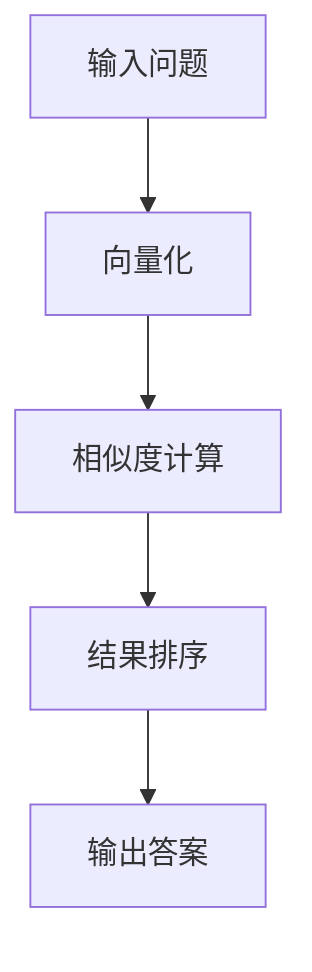
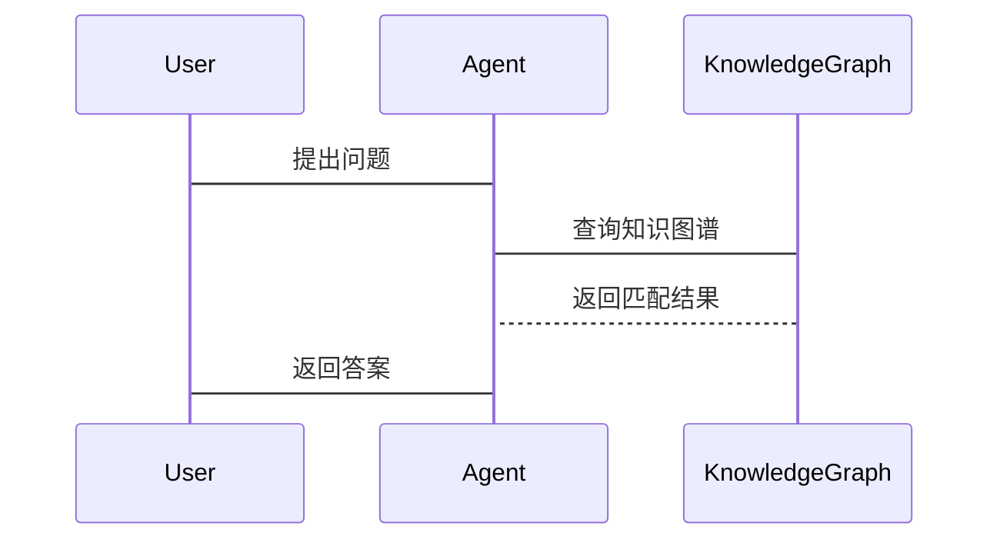

                 


# 构建AI Agent的知识图谱问答系统

> 关键词：AI Agent，知识图谱，问答系统，自然语言处理，智能问答

> 摘要：本文详细探讨了如何构建一个基于知识图谱的AI Agent问答系统。文章首先介绍了AI Agent和知识图谱的基本概念，然后分析了知识图谱问答系统的原理与算法，重点讲解了基于向量的语义匹配算法和数学模型。接着，文章从系统架构设计、项目实战、系统优化等方面详细阐述了构建该系统的具体步骤，最后给出了系统的总结与展望。

---

## 第1章: 背景介绍

### 1.1 AI Agent的基本概念

AI Agent（人工智能代理）是指能够感知环境并采取行动以实现目标的智能实体。它可以是一个软件程序，也可以是一个物理设备，通过与用户或环境交互来完成特定任务。AI Agent的核心能力包括：

1. **感知能力**：通过传感器或数据输入接口获取环境信息。
2. **推理能力**：基于获取的信息进行逻辑推理和决策。
3. **行动能力**：根据推理结果执行具体操作。

### 1.2 知识图谱的基本概念

知识图谱是一种以结构化方式表示知识的网络，由实体（概念、对象）和关系（属性、联系）组成。知识图谱通过将实体和关系连接起来，构建一个语义丰富的网络，能够帮助AI Agent更好地理解和回答复杂问题。

### 1.3 问答系统的发展历程

问答系统是一种能够理解用户问题并提供准确答案的人工智能系统。从简单的关键词匹配到基于知识图谱的语义理解，问答系统经历了以下几个阶段：

1. **基于关键词匹配的问答系统**：通过简单的字符串匹配来回答问题。
2. **基于规则的问答系统**：通过预定义的规则和模板来回答问题。
3. **基于统计的问答系统**：利用大数据和统计方法来分析问题并生成答案。
4. **基于深度学习的问答系统**：通过神经网络模型（如BERT、GPT）来理解和生成答案。

---

## 第2章: 知识图谱与问答系统的核心概念

### 2.1 知识图谱的构建原理

#### 2.1.1 知识抽取与表示

知识抽取是从文本中提取实体、关系和属性的过程。常用的知识抽取方法包括：

1. **分词与词性标注**：将文本分割成词语，并标注每个词语的词性。
2. **实体识别**：识别文本中的实体（如人名、地名、组织名）。
3. **关系抽取**：识别实体之间的关系（如“是”、“属于”、“位于”）。
4. **知识表示**：将抽取到的实体和关系表示为结构化的形式，如三元组（头实体，关系，尾实体）。

#### 2.1.2 实体识别与关系抽取

实体识别是通过自然语言处理技术从文本中识别出具体实体的过程。关系抽取则是识别实体之间的关系。例如，在文本“张三在北京工作”中，实体识别可以提取出“张三”和“北京”，关系抽取可以提取出“工作地点”。

#### 2.1.3 知识图谱的存储与管理

知识图谱通常以图结构的形式存储，每个节点表示一个实体，边表示实体之间的关系。知识图谱的存储和管理需要考虑以下几点：

1. **数据存储**：使用图数据库（如Neo4j）或关系型数据库来存储知识图谱。
2. **数据查询**：通过图遍历算法（如DFS、BFS）来查询知识图谱。
3. **数据更新**：根据新的数据不断更新知识图谱。

### 2.2 问答系统的原理与流程

#### 2.2.1 问题理解与预处理

问题理解是问答系统的核心任务之一。为了更好地理解用户的问题，需要对问题进行预处理，包括：

1. **分词与词性标注**：将问题分割成词语，并标注词性。
2. **实体识别**：识别问题中的实体。
3. **语义分析**：通过语法分析和语义理解来确定问题的含义。

#### 2.2.2 知识图谱中的语义匹配

语义匹配是将用户的问题与知识图谱中的实体和关系进行匹配的过程。常用的语义匹配方法包括：

1. **基于向量的语义匹配**：将问题和知识图谱中的实体/关系表示为向量，计算它们的相似度。
2. **基于规则的语义匹配**：通过预定义的规则来匹配问题和知识图谱中的实体/关系。

#### 2.2.3 答案生成与优化

答案生成是根据匹配到的实体和关系生成回答的过程。生成的答案需要满足以下要求：

1. **准确性**：答案必须准确无误。
2. **简洁性**：答案应该简洁明了。
3. **可理解性**：答案应该易于理解。

---

## 第3章: AI Agent在问答系统中的角色

### 3.1 AI Agent的智能决策机制

AI Agent在问答系统中的角色是通过智能决策机制来实现问题理解和答案生成。智能决策机制包括以下几个步骤：

1. **问题分析**：分析用户的问题，确定问题类型和关键词。
2. **知识检索**：根据问题关键词在知识图谱中检索相关实体和关系。
3. **答案生成**：根据检索到的结果生成回答。
4. **结果优化**：对生成的回答进行优化，确保答案准确、简洁、易懂。

### 3.2 AI Agent与知识图谱的交互方式

AI Agent与知识图谱的交互方式包括：

1. **主动交互**：AI Agent主动检索知识图谱中的实体和关系。
2. **被动交互**：用户通过提问，AI Agent根据问题检索知识图谱。

### 3.3 AI Agent的自适应学习能力

AI Agent需要具备自适应学习能力，能够根据用户反馈不断优化自己的问答能力。自适应学习能力包括：

1. **用户反馈收集**：收集用户对回答的反馈。
2. **模型优化**：根据反馈优化问答模型。
3. **知识更新**：根据反馈更新知识图谱。

---

## 第4章: 知识图谱问答系统的算法原理

### 4.1 基于向量的语义匹配算法

#### 4.1.1 算法流程图



#### 4.1.2 Python实现示例

```python
import numpy as np

def vector_similarity(q, a):
    # 计算问题q和答案a的向量相似度
    return np.dot(q, a) / (np.linalg.norm(q) * np.linalg.norm(a))
```

#### 4.1.3 数学模型与公式

语义匹配的相似度计算公式：

$$
\text{similarity} = \frac{\mathbf{q} \cdot \mathbf{a}}{\|\mathbf{q}\| \cdot \|\mathbf{a}\|}
$$

其中，$\mathbf{q}$是问题的向量表示，$\mathbf{a}$是答案的向量表示。

---

## 第5章: 系统分析与架构设计

### 5.1 系统功能设计

知识图谱问答系统的功能模块包括：

1. **知识抽取模块**：从文本中抽取实体和关系。
2. **知识存储模块**：存储抽取到的实体和关系。
3. **问题理解模块**：理解用户的问题并生成查询。
4. **语义匹配模块**：匹配问题与知识图谱中的实体和关系。
5. **答案生成模块**：根据匹配结果生成答案。

### 5.2 系统架构设计

知识图谱问答系统的架构设计包括以下几个部分：

1. **数据层**：存储知识图谱和用户数据。
2. **服务层**：提供知识检索和问答服务。
3. **应用层**：实现用户界面和API接口。

### 5.3 系统交互流程图



---

## 第6章: 项目实战

### 6.1 环境安装

构建知识图谱问答系统需要以下环境：

1. **Python 3.8+**
2. **TensorFlow 2.0+**
3. **自然语言处理库（如spaCy、NLTK）**
4. **图数据库（如Neo4j）**

### 6.2 核心代码实现

#### 6.2.1 知识抽取模块

```python
import spacy

nlp = spacy.load("zh_core_web_sm")

def extract_entities(text):
    doc = nlp(text)
    entities = []
    for ent in doc.ents:
        entities.append((ent.text, ent.label_))
    return entities
```

#### 6.2.2 语义匹配模块

```python
from sentence_transformers import SentenceTransformer

model = SentenceTransformer('bert-base-nli-mean-tokens')

def compute_similarity(q, a):
    q_embedding = model.encode(q)
    a_embedding = model.encode(a)
    similarity = np.dot(q_embedding, a_embedding)
    return similarity
```

### 6.3 实际案例分析

以用户提问“张三在哪里工作？”为例，系统会首先在知识图谱中检索“张三”和“工作地点”的关系，找到匹配的结果后生成答案“张三在北京工作”。

---

## 第7章: 总结与展望

### 7.1 总结

本文详细探讨了如何构建一个基于知识图谱的AI Agent问答系统。文章从AI Agent和知识图谱的基本概念出发，分析了知识图谱问答系统的原理与算法，重点讲解了基于向量的语义匹配算法和数学模型，并通过系统架构设计和项目实战展示了如何实现一个完整的问答系统。

### 7.2 展望

未来，随着自然语言处理技术的不断发展，知识图谱问答系统将更加智能化和个性化。AI Agent将具备更强的自适应学习能力和智能决策能力，能够更好地满足用户的需求。

---

作者：AI天才研究院/AI Genius Institute & 禅与计算机程序设计艺术 /Zen And The Art of Computer Programming

