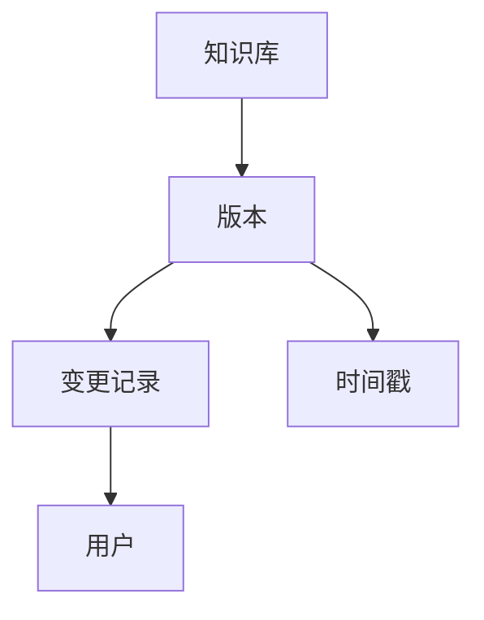
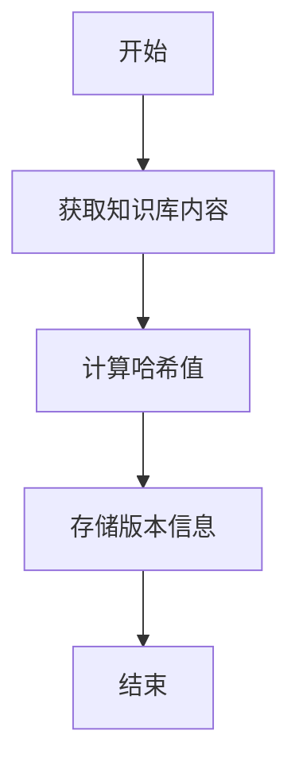
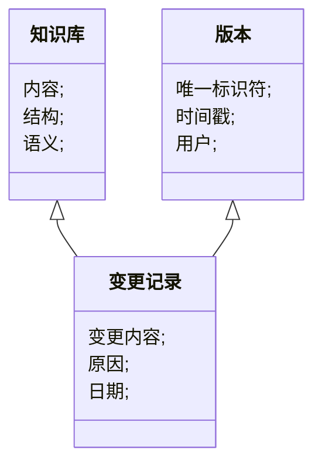
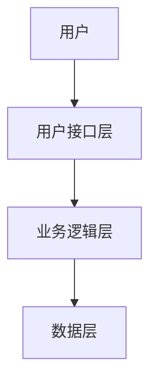

                 


# 构建AI Agent的知识库版本控制系统

> **关键词**：AI Agent，知识库，版本控制，分布式系统，区块链，哈希函数

> **摘要**：本文详细探讨了构建AI Agent的知识库版本控制系统的关键技术与实现方法。通过分析知识库版本控制的背景、核心概念、算法原理、系统架构设计及项目实战，本文为读者提供了从理论到实践的全面指导。文章结合具体案例和代码示例，深入解析了如何在AI Agent中高效管理和维护知识库的版本，确保系统的可靠性和可扩展性。

---

# 第1章 知识库版本控制的背景与问题

## 1.1 知识库版本控制的背景

### 1.1.1 AI Agent与知识库的关系

AI Agent（人工智能代理）是一种能够感知环境并执行任务的智能实体。它依赖于知识库来存储和处理信息，以便做出决策和执行操作。知识库作为AI Agent的核心组件，决定了其智能水平和任务执行能力。

### 1.1.2 知识库在AI Agent中的作用

知识库为AI Agent提供决策所需的知识和数据。例如，在自然语言处理任务中，知识库可能包含词典、句法规则和上下文信息。在推荐系统中，知识库可能包含用户偏好和物品属性。

### 1.1.3 知识库版本控制的必要性

随着AI Agent的学习和进化，知识库会不断更新。版本控制在知识库管理中至关重要，它可以帮助AI Agent回溯到之前的状态，修复错误，或者在不同版本之间切换。

## 1.2 问题背景与描述

### 1.2.1 知识库管理的挑战

知识库的规模和复杂性使其管理面临诸多挑战。例如，知识库可能包含结构化数据、半结构化数据和非结构化数据，这些数据的更新和维护需要高效的版本控制机制。

### 1.2.2 版本控制在知识库管理中的意义

版本控制确保了知识库的可追溯性和可恢复性。在AI Agent开发过程中，版本控制可以帮助开发者快速定位问题，理解知识库的变更历史，并进行有效的团队协作。

### 1.2.3 知识库版本控制的目标与边界

知识库版本控制的目标是记录知识库的变更历史，确保每个版本的完整性和一致性。其边界包括知识库的结构、内容和语义，但不涉及与知识库无关的外部系统。

## 1.3 问题解决与核心概念

### 1.3.1 知识库版本控制的核心要素

知识库版本控制的核心要素包括变更记录、版本标识、变更日志和版本依赖关系。这些要素共同构成了版本控制的完整体系。

### 1.3.2 知识库版本控制的实现原理

知识库版本控制通过记录每个版本的变更日志和差异，实现版本的回滚和切换。常见的版本控制方法包括基于区块链的版本控制和分布式版本控制。

### 1.3.3 核心概念的结构与关系

知识库版本控制涉及多个核心概念，例如知识库、版本、变更记录和用户。这些概念之间的关系可以通过ER图和流程图清晰表达。

---

# 第2章 知识库版本控制的核心概念与联系

## 2.1 核心概念原理

### 2.1.1 知识库的基本结构

知识库通常由数据结构、数据关系和数据语义三部分组成。例如，知识图谱中的实体和关系构成了知识库的基本结构。

### 2.1.2 版本控制的基本原理

版本控制通过记录每个版本的变更历史，实现版本的回滚和切换。常见的版本控制方法包括基于哈希的版本控制和基于区块链的版本控制。

### 2.1.3 AI Agent与知识库版本控制的结合

AI Agent通过调用版本控制系统，实现知识库的更新和维护。版本控制为AI Agent提供了可靠的知识库管理机制，确保其智能水平的持续提升。

## 2.2 核心概念属性对比表

| 比较维度 | 知识库 | 传统数据库 |
|----------|--------|------------|
| 数据结构 | 图结构 | 行列结构 |
| 数据关系 | 关系型 | 关系型 |
| 数据语义 | 高语义 | 低语义 |

## 2.3 ER实体关系图



---

# 第3章 知识库版本控制的算法原理

## 3.1 算法原理概述

### 3.1.1 基于区块链的版本控制

区块链通过去中心化和不可篡改的特性，为知识库版本控制提供了安全保障。每个版本的变更记录都被记录在区块链上，确保其真实性和不可篡改性。

### 3.1.2 基于分布式存储的版本控制

分布式存储通过将知识库分散存储在多个节点上，提高了系统的可靠性和可扩展性。版本控制可以通过分布式一致性算法实现。

### 3.1.3 基于哈希函数的版本控制

哈希函数通过将知识库内容映射为唯一的哈希值，实现版本的唯一标识。每个版本的哈希值可以作为版本的唯一标识符。

## 3.2 算法流程图



## 3.3 算法实现代码

```python
def compute_hash(content):
    import hashlib
    return hashlib.sha256(content.encode()).hexdigest()

def save_version(content, version_number):
    hash_value = compute_hash(content)
    with open(f'version_{version_number}.txt', 'w') as f:
        f.write(content)
    return hash_value
```

## 3.4 数学模型与公式

### 哈希函数

$$ hash(x) = H(x) $$

其中，$H$是哈希函数，$x$是输入内容。

---

# 第4章 知识库版本控制的系统架构设计

## 4.1 问题场景介绍

### 4.1.1 知识库版本控制的场景

知识库版本控制在AI Agent的开发和维护中至关重要。例如，在自然语言处理任务中，知识库的更新可能需要回滚到之前的版本。

### 4.1.2 系统功能需求

系统需要支持版本的创建、回滚、比较和切换功能。此外，系统还需要支持多用户协作和版本历史查询。

## 4.2 系统功能设计

### 4.2.1 领域模型设计

知识库版本控制系统的核心领域模型包括知识库、版本、变更记录和用户。



### 4.2.2 系统架构设计

知识库版本控制系统采用分层架构，包括数据层、业务逻辑层和用户接口层。



### 4.2.3 系统接口设计

系统接口包括创建版本、获取版本、回滚版本和切换版本。

### 4.2.4 系统交互设计

知识库版本控制系统的交互流程包括用户请求、系统处理和结果返回。

---

# 第5章 知识库版本控制的项目实战

## 5.1 环境安装

### 5.1.1 系统环境

建议使用Python 3.8及以上版本。

### 5.1.2 工具安装

安装必要的Python库，例如`hashlib`和`argparse`。

## 5.2 核心实现

### 5.2.1 知识库版本控制的代码实现

```python
import hashlib
import argparse

def compute_hash(content):
    return hashlib.sha256(content.encode()).hexdigest()

def save_version(content, version_number):
    hash_value = compute_hash(content)
    with open(f'version_{version_number}.txt', 'w') as f:
        f.write(content)
    return hash_value

def main():
    parser = argparse.ArgumentParser(description='知识库版本控制示例')
    parser.add_argument('-c', '--content', type=str, required=True, help='知识库内容')
    parser.add_argument('-v', '--version', type=int, required=True, help='版本号')
    args = parser.parse_args()
    save_version(args.content, args.version)

if __name__ == '__main__':
    main()
```

### 5.2.2 功能扩展

可以添加版本回滚和版本比较功能。

## 5.3 项目实战

### 5.3.1 知识库版本控制的案例分析

例如，在自然语言处理任务中，知识库的更新可能需要回滚到之前的版本。

### 5.3.2 代码实现与分析

结合具体案例，详细分析代码实现和功能。

---

# 第6章 总结与展望

## 6.1 总结

本文详细探讨了构建AI Agent的知识库版本控制系统的关键技术与实现方法。通过分析知识库版本控制的背景、核心概念、算法原理、系统架构设计及项目实战，本文为读者提供了从理论到实践的全面指导。

## 6.2 注意事项

在实际应用中，需要特别注意版本控制的安全性和一致性问题。

## 6.3 未来展望

未来的研究方向可以包括更高效的版本控制算法和更智能的版本管理策略。

---

# 作者

**作者：AI天才研究院/AI Genius Institute & 禅与计算机程序设计艺术 /Zen And The Art of Computer Programming**

