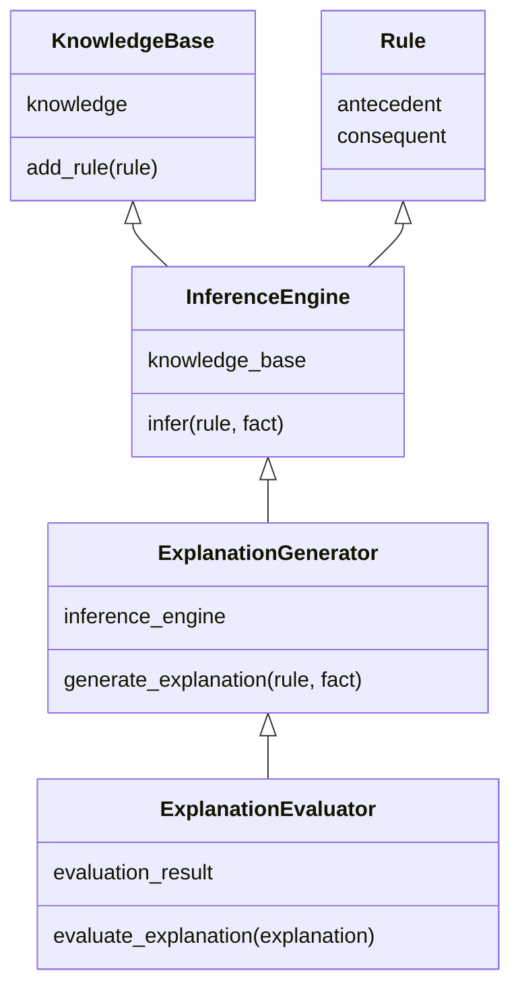

                 


# 构建AI Agent的知识推理可解释性框架

> 关键词：AI Agent、知识推理、可解释性框架、系统架构、算法原理、项目实战

> 摘要：本文系统地探讨了构建AI Agent的知识推理可解释性框架的关键问题，从背景介绍到核心概念，从算法原理到系统架构，再到项目实战，全面分析了如何设计一个具有可解释性的知识推理框架。本文结合实际案例，深入讲解了知识推理与可解释性框架的结合，为AI Agent的开发提供了理论和实践指导。

---

## 第一部分: 背景介绍

### 第1章: 问题背景与概念结构

#### 1.1 问题背景
在AI Agent的开发中，知识推理是核心能力之一。然而，现有的知识推理方法往往缺乏可解释性，导致AI Agent在实际应用中难以被用户信任和接受。本文旨在探讨如何构建一个具有可解释性的知识推理框架，从而提升AI Agent的透明度和可信度。

#### 1.2 问题描述
知识推理是指AI Agent通过已有的知识库，推导出新的结论或理解未知信息的过程。然而，现有的知识推理方法通常依赖复杂的算法，导致其推理过程难以被人类理解。这种不可解释性限制了AI Agent的应用场景，特别是在需要透明性和信任度的领域（如医疗、法律等）。

#### 1.3 问题解决思路
本文提出的知识推理可解释性框架旨在通过以下方式解决上述问题：
1. **知识表示**：采用易于解释的知识表示方法，如语义网络或规则表示。
2. **推理过程记录**：记录推理过程中的每一步，确保用户可以追溯和理解。
3. **可解释性评估**：设计评估指标，衡量框架的可解释性程度。

#### 1.4 边界与外延
知识推理可解释性框架的设计需要明确其边界：
- **边界**：仅关注知识推理的可解释性问题，不涉及感知、学习等其他AI能力。
- **外延**：可扩展至其他AI系统，如机器人、智能助手等。

#### 1.5 概念结构与核心要素
知识推理可解释性框架的核心要素包括：
1. **知识库**：存储AI Agent所需的知识。
2. **推理引擎**：执行推理操作。
3. **解释生成器**：将推理过程转化为可解释的形式。
4. **解释评估模块**：评估解释的质量和可理解性。

---

## 第二部分: 核心概念与联系

### 第2章: 核心概念原理

#### 2.1 知识推理的原理
知识推理是AI Agent的核心能力之一，其主要原理包括：
1. **符号逻辑推理**：基于符号逻辑的推理方法，如逻辑演绎和归纳。
2. **概率推理**：基于概率论的推理方法，如贝叶斯网络。
3. **图结构推理**：基于图结构（如知识图谱）的推理方法。

#### 2.2 可解释性框架的原理
可解释性框架的设计原则包括：
1. **透明性**：确保用户能够理解推理过程。
2. **简洁性**：解释应简洁明了，避免冗余信息。
3. **一致性**：解释应与推理过程一致，避免矛盾。

#### 2.3 核心概念对比
以下是知识推理与可解释性框架的核心概念对比：

| 概念 | 知识推理 | 可解释性框架 |
|------|----------|--------------|
| 核心目标 | 推导新结论 | 提供推理过程的解释 |
| 方法 | 符号逻辑、概率推理 | 语义网络、规则表示 |
| 优缺点 | 高准确性，但缺乏解释性 | 解释性强，但可能牺牲部分准确性 |

#### 2.4 ER实体关系图
以下是知识推理可解释性框架的ER实体关系图：

```mermaid
graph TD
    KnowledgeBase --> Rule: 知识库与规则的关系
    Rule --> InferenceEngine: 规则与推理引擎的关系
    InferenceEngine --> ExplanationGenerator: 推理引擎与解释生成器的关系
    ExplanationGenerator --> ExplanationEvaluator: 解释生成器与解释评估模块的关系
```

---

## 第三部分: 算法原理

### 第3章: 算法原理讲解

#### 3.1 知识推理算法
以下是基于符号逻辑的知识推理算法流程图：

```mermaid
graph TD
    Start --> KnowledgeBase: 获取知识库
    KnowledgeBase --> Rule: 应用规则
    Rule --> Fact: 推导事实
    Fact --> Result: 输出结果
    Result --> End: 结束
```

#### 3.2 可解释性框架算法
以下是可解释性框架的算法流程图：

```mermaid
graph TD
    Start --> InferenceEngine: 获取推理引擎
    InferenceEngine --> ExplanationGenerator: 生成解释
    ExplanationGenerator --> ExplanationEvaluator: 评估解释
    ExplanationEvaluator --> Result: 输出结果
    Result --> End: 结束
```

#### 3.3 算法实现
以下是知识推理可解释性框架的Python实现代码示例：

```python
class KnowledgeBase:
    def __init__(self):
        self.knowledge = {}

    def add_rule(self, rule):
        self.knowledge[rule] = True

class Rule:
    def __init__(self, antecedent, consequent):
        self.antecedent = antecedent
        self.consequent = consequent

class InferenceEngine:
    def __init__(self, knowledge_base):
        self.knowledge_base = knowledge_base

    def infer(self, rule, fact):
        if self.knowledge_base.knowledge.get(rule):
            return fact
        else:
            return None

class ExplanationGenerator:
    def __init__(self, inference_engine):
        self.inference_engine = inference_engine

    def generate_explanation(self, rule, fact):
        if self.inference_engine.knowledge_base.knowledge.get(rule):
            return f"根据规则{rule}，推导出事实{fact}"
        else:
            return "推理失败"

class ExplanationEvaluator:
    def __init__(self, explanation_generator):
        self.explanation_generator = explanation_generator

    def evaluate_explanation(self, explanation):
        return len(explanation.split()) > 10
```

---

## 第四部分: 系统分析与架构设计

### 第4章: 系统架构设计

#### 4.1 系统功能设计
以下是系统功能的类图：



#### 4.2 系统架构图
以下是系统架构图：

```mermaid
graph TD
    KnowledgeBase --> InferenceEngine: 知识库与推理引擎的关系
    InferenceEngine --> ExplanationGenerator: 推理引擎与解释生成器的关系
    ExplanationGenerator --> ExplanationEvaluator: 解释生成器与解释评估模块的关系
```

---

## 第五部分: 项目实战

### 第5章: 项目实战

#### 5.1 环境安装
以下是环境安装步骤：
1. 安装Python 3.8或更高版本。
2. 安装Mermaid和相关依赖。

#### 5.2 核心代码实现
以下是核心代码实现：

```python
kb = KnowledgeBase()
kb.add_rule("如果A，则B")
rule = Rule("A", "B")
engine = InferenceEngine(kb)
explanation_generator = ExplanationGenerator(engine)
evaluator = ExplanationEvaluator(explanation_generator)
explanation = explanation_generator.generate_explanation(rule, "B")
evaluation = evaluator.evaluate_explanation(explanation)
print(evaluation)
```

#### 5.3 案例分析
以下是一个实际案例分析：

假设知识库包含规则“如果下雨，则地湿”，推理引擎可以推导出“如果下雨，则地湿”的事实。解释生成器会生成解释：“根据规则‘如果下雨，则地湿’，推导出事实‘地湿’”。解释评估模块会评估该解释的可理解性。

---

## 第六部分: 总结与展望

### 第6章: 总结与展望

#### 6.1 最佳实践
- 在设计知识推理可解释性框架时，应优先考虑解释的简洁性和一致性。
- 可以结合领域知识，进一步优化解释生成器的性能。

#### 6.2 项目小结
本文通过理论分析和实际案例，详细探讨了构建AI Agent的知识推理可解释性框架的关键问题，提出了可行的解决方案，并提供了具体的实现方法。

#### 6.3 注意事项
- 解释生成器的设计需要兼顾准确性和可理解性。
- 在实际应用中，应根据具体需求调整系统架构。

#### 6.4 拓展阅读
建议读者进一步阅读相关领域的最新研究成果，如可解释性AI（XAI）和知识图谱。

---

# 作者

**作者：AI天才研究院/AI Genius Institute & 禅与计算机程序设计艺术 /Zen And The Art of Computer Programming**

