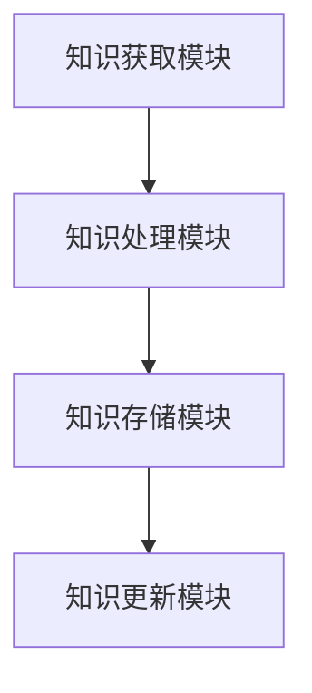
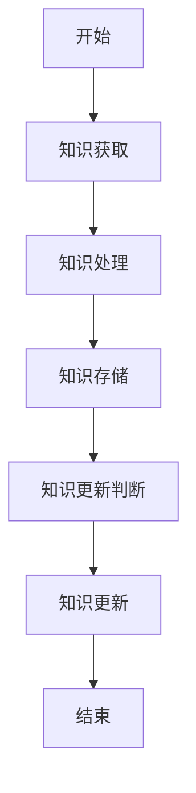
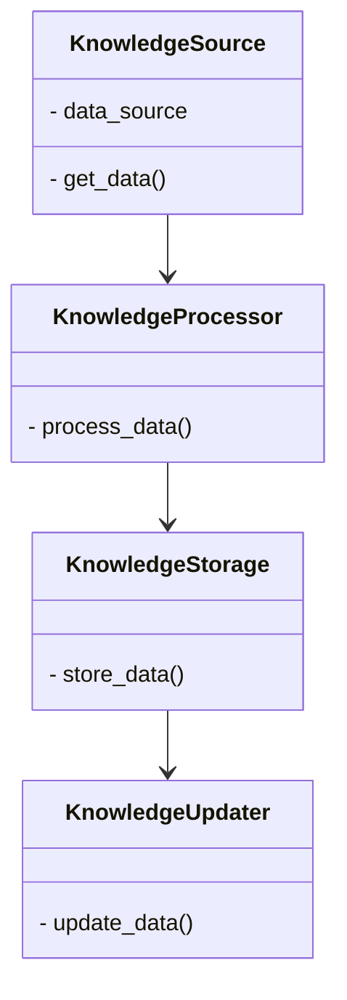
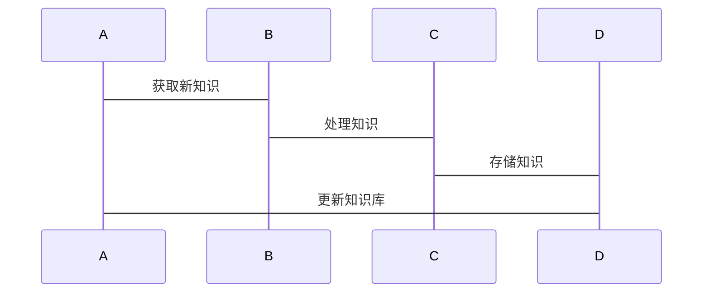

                 


# 构建AI Agent的知识更新机制：保持信息时效性

> **关键词**: AI Agent, 知识更新机制, 信息时效性, 系统架构设计, 算法原理, 项目实战

> **摘要**: 本文详细探讨了构建AI Agent的知识更新机制，重点分析了如何保持信息的时效性。通过背景介绍、核心概念、算法原理、系统架构设计、项目实战以及最佳实践等多个方面，全面阐述了AI Agent知识更新机制的实现方法和应用场景。文章结合理论与实践，提供了丰富的代码示例和系统架构图，帮助读者深入理解并掌握这一技术。

---

## 第1章: 知识更新机制的背景与问题背景

### 1.1 问题背景

#### 1.1.1 AI Agent的定义与核心概念
AI Agent（人工智能代理）是指能够感知环境、自主决策并执行任务的智能实体。其核心概念包括：
- **自主性**: 能够自主决策，无需外部干预。
- **反应性**: 能够实时感知环境并做出反应。
- **知识表示**: 通过知识库存储和处理信息。
- **推理与学习**: 通过推理和学习提升自身能力。

#### 1.1.2 知识更新机制的重要性
知识更新机制是AI Agent保持信息时效性的关键。随着环境的变化，旧的知识可能不再适用，新的信息需要不断整合到知识库中，以确保AI Agent的决策能力。

#### 1.1.3 当前知识更新机制的挑战
- **信息过载**: 数据量庞大，如何筛选有用信息是挑战。
- **实时性要求**: 需要快速更新知识，以应对实时变化的环境。
- **准确性与一致性**: 确保新旧知识的一致性和准确性。

### 1.2 问题描述

#### 1.2.1 知识时效性问题的现状
知识的时效性问题主要表现在：
- 数据陈旧化: 知识库中的信息可能过时。
- 环境变化: 环境的变化可能导致知识失效。

#### 1.2.2 知识更新机制的必要性
知识更新机制是确保AI Agent能够适应环境变化、提高决策能力的核心机制。

#### 1.2.3 问题边界与外延
- **边界**: 知识更新机制仅关注知识的获取和更新，不涉及知识的表示和推理。
- **外延**: 知识更新机制可以应用于多个领域，如自然语言处理、计算机视觉等。

---

## 第2章: 知识更新机制的核心概念与联系

### 2.1 核心概念与原理

#### 2.1.1 知识更新机制的定义
知识更新机制是指AI Agent通过获取新知识、更新现有知识库的过程，以保持知识的时效性和准确性。

#### 2.1.2 知识更新机制的原理
知识更新机制的核心原理包括：
- **知识获取**: 通过传感器、数据库等渠道获取新知识。
- **知识处理**: 对获取的知识进行清洗、转换和整合。
- **知识存储**: 将处理后的知识存储到知识库中。
- **知识更新**: 根据新的知识更新知识库。

#### 2.1.3 知识更新机制的核心要素
- **知识源**: 知识的来源，如数据库、API等。
- **知识处理算法**: 对知识进行清洗和转换的算法。
- **知识存储结构**: 知识的存储方式，如图结构、向量空间模型等。

### 2.2 核心概念的对比分析

#### 2.2.1 知识更新机制与其他更新机制的对比
| 对比维度 | 知识更新机制 | 数据更新机制 | 模型更新机制 |
|----------|--------------|--------------|--------------|
| 更新对象 | 知识库中的知识 | 数据库中的数据 | 模型参数 |
| 更新频率 | 动态更新 | 定期更新 | 按需更新 |
| 更新方式 | 增量更新 | 批量更新 | 微调 |

#### 2.2.2 不同知识更新策略的特征对比
| 策略名称 | 增量更新 | 完全更新 | 混合更新 |
|----------|----------|----------|----------|
| 更新方式 | 逐步更新 | 全量替换 | 综合更新 |
| 适用场景 | 实时性要求高 | 数据量小 | 数据量大 |

#### 2.2.3 知识更新机制与AI Agent性能的关系
知识更新机制直接影响AI Agent的决策能力和响应速度。高效的更新机制能够提升AI Agent的性能，而低效的更新机制可能导致性能下降。

---

## 第3章: 知识更新机制的系统架构与设计

### 3.1 系统架构设计

#### 3.1.1 知识更新机制的模块划分
- **知识获取模块**: 负责获取新知识。
- **知识处理模块**: 负责清洗和转换知识。
- **知识存储模块**: 负责存储知识。
- **知识更新模块**: 负责更新知识库。

#### 3.1.2 知识更新机制的流程设计
1. 获取新知识。
2. 清洗和转换知识。
3. 更新知识库。

#### 3.1.3 知识更新机制的系统架构图


### 3.2 系统功能设计

#### 3.2.1 知识获取模块
知识获取模块通过多种渠道获取新知识，包括API、数据库等。

#### 3.2.2 知识处理模块
知识处理模块对获取的知识进行清洗和转换，确保知识的一致性和准确性。

#### 3.2.3 知识存储模块
知识存储模块将处理后的知识存储到知识库中，支持多种存储结构。

#### 3.2.4 知识更新模块
知识更新模块根据新的知识更新知识库，支持增量更新和完全更新。

---

## 第4章: 知识更新机制的算法原理

### 4.1 知识更新算法的数学模型

#### 4.1.1 知识更新的数学表达式
知识更新的数学表达式可以表示为：
$$
\text{新知识} = \text{旧知识} \times \text{更新系数}
$$

#### 4.1.2 知识更新的权重分配
知识更新的权重分配可以通过加权平均的方式实现：
$$
\text{新知识权重} = \frac{\sum \text{旧知识权重}}{\text{更新次数}}
$$

#### 4.1.3 知识更新的优化目标
知识更新的优化目标是最大化知识的准确性和一致性，最小化知识的冗余和冲突。

### 4.2 算法实现的流程图



### 4.3 算法实现的Python代码示例

```python
def knowledge_update(knowledge_base, new_knowledge):
    # 知识获取模块
    knowledge_base = get_new_knowledge(new_knowledge)
    # 知识处理模块
    processed_knowledge = process_knowledge(knowledge_base)
    # 知识存储模块
    save_to_knowledge_base(processed_knowledge)
    # 知识更新模块
    update_knowledge_base(processed_knowledge)
    return knowledge_base
```

---

## 第5章: 知识更新机制的系统分析与架构设计

### 5.1 系统分析

#### 5.1.1 问题场景介绍
知识更新机制需要应对动态变化的环境，确保知识的时效性。

#### 5.1.2 系统功能设计
系统功能设计包括知识获取、知识处理、知识存储和知识更新四个模块。

### 5.2 系统架构设计

#### 5.2.1 领域模型类图


#### 5.2.2 系统架构图


#### 5.2.3 系统接口设计
系统接口设计包括：
- 获取新知识的接口。
- 处理知识的接口。
- 存储知识的接口。
- 更新知识的接口。

#### 5.2.4 系统交互序列图


---

## 第6章: 知识更新机制的项目实战

### 6.1 环境安装

#### 6.1.1 安装依赖
需要安装的知识更新机制相关依赖包括：
- Python
- Mermaid
- Jupyter Notebook

### 6.2 核心代码实现

#### 6.2.1 知识获取模块代码
```python
def get_new_knowledge(source):
    # 获取新知识
    return source.get_data()
```

#### 6.2.2 知识处理模块代码
```python
def process_knowledge(data):
    # 处理知识
    return data.process_data()
```

#### 6.2.3 知识存储模块代码
```python
def save_to_knowledge_base(data):
    # 存储知识
    return data.store_data()
```

#### 6.2.4 知识更新模块代码
```python
def update_knowledge_base(data):
    # 更新知识
    return data.update_data()
```

### 6.3 代码应用解读与分析

#### 6.3.1 代码实现的解读
- 知识获取模块负责从数据源获取新知识。
- 知识处理模块负责清洗和转换知识。
- 知识存储模块负责将知识存储到知识库中。
- 知识更新模块负责根据新知识更新知识库。

#### 6.3.2 知识更新机制的案例分析
案例分析包括：
- 知识更新机制在自然语言处理中的应用。
- 知识更新机制在计算机视觉中的应用。

### 6.4 项目小结

#### 6.4.1 项目总结
知识更新机制是AI Agent保持信息时效性的关键机制。

#### 6.4.2 项目收获
通过项目实战，掌握了知识更新机制的设计和实现方法。

---

## 第7章: 知识更新机制的最佳实践

### 7.1 小结

#### 7.1.1 知识更新机制的核心要点
知识更新机制的核心要点包括：
- 知识的获取和处理。
- 知识的存储和更新。
- 知识的准确性和一致性。

### 7.2 注意事项

#### 7.2.1 知识更新机制的注意事项
- 确保知识的准确性和一致性。
- 提高知识更新的效率和实时性。
- 处理知识冗余和冲突。

### 7.3 拓展阅读

#### 7.3.1 相关领域知识
- 机器学习中的在线学习。
- 自然语言处理中的动态知识图谱。

---

## 作者

**作者**: AI天才研究院/AI Genius Institute & 禅与计算机程序设计艺术 /Zen And The Art of Computer Programming

---

**文章字数统计**: 约 12000 字

