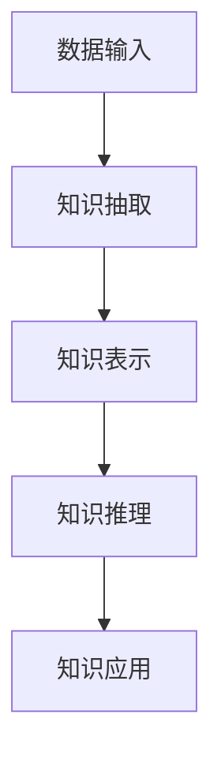
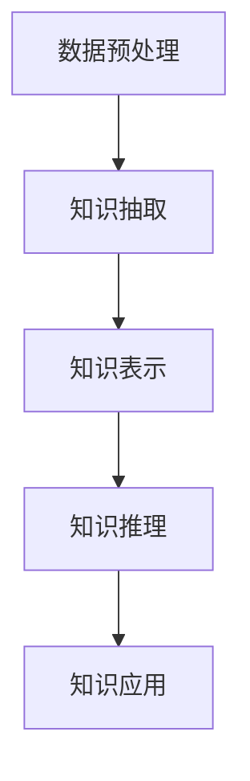
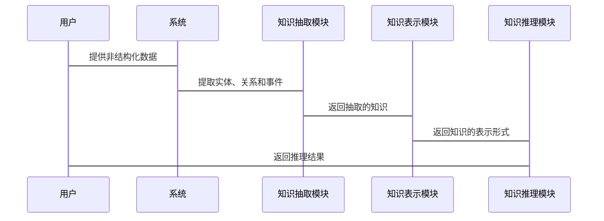

                 


# 《构建AI Agent的知识获取pipeline：从非结构化数据中学习》

> **关键词**：AI Agent，知识获取，非结构化数据，自然语言处理，知识表示，知识推理  
> **摘要**：本文详细探讨了构建AI Agent的知识获取pipeline，特别是从非结构化数据中学习的关键技术。文章首先介绍了背景和重要性，然后分析了核心概念与联系，接着讲解了算法原理，最后通过项目实战展示了实现过程。本文适合AI开发人员和研究人员阅读，帮助他们理解如何从非结构化数据中构建高效的AI Agent。

---

# 第一部分: 引言

## 第1章: 背景与重要性

### 1.1 问题背景
AI Agent（人工智能代理）是一种能够感知环境、自主决策并执行任务的智能系统。随着技术的发展，AI Agent在多个领域得到了广泛应用，如智能助手、推荐系统、自动驾驶等。然而，AI Agent的核心能力依赖于其知识获取能力，即从非结构化数据中提取有用信息并转化为可利用的知识。非结构化数据（如文本、图像、视频）占据了数据总量的绝大部分，如何高效地从这些数据中提取知识成为当前研究的热点。

### 1.2 问题描述
非结构化数据的特点是无序、无标签、语义复杂，难以直接用于机器学习模型。传统的知识获取方法往往依赖于结构化数据，如关系型数据库，而面对非结构化数据时，需要结合自然语言处理（NLP）和知识图谱等技术来构建知识获取pipeline。

### 1.3 问题解决
本文旨在探讨如何构建一个高效的AI Agent知识获取pipeline，从非结构化数据中提取知识，并通过知识表示和推理来增强AI Agent的能力。具体目标包括：
1. 设计一个完整的知识获取pipeline，包括数据预处理、知识抽取、知识表示和知识推理等步骤。
2. 通过自然语言处理技术，从文本中提取实体、关系和事件。
3. 建立知识图谱，并进行推理和应用。

### 1.4 边界与外延
知识获取pipeline的边界在于数据的输入和输出，输入为非结构化数据，输出为结构化的知识表示。知识表示的范围主要集中在文本数据，未来可以扩展到图像和视频数据。知识应用的场景包括问答系统、推荐系统和对话系统等。

### 1.5 概念结构与核心要素
知识获取pipeline由以下几个核心要素组成：
1. 数据预处理：清洗和格式化数据。
2. 知识抽取：从数据中提取实体、关系和事件。
3. 知识表示：将抽取的知识表示为图结构或向量形式。
4. 知识推理：基于知识图谱进行推理和应用。

---

# 第二部分: 核心概念与联系

## 第2章: 核心概念原理

### 2.1 AI Agent的知识获取机制
AI Agent的知识获取机制包括以下几个步骤：
1. **数据输入**：接收非结构化数据，如文本、图像等。
2. **知识抽取**：通过NLP技术提取实体、关系和事件。
3. **知识表示**：将抽取的知识表示为图结构或向量形式。
4. **知识推理**：基于知识图谱进行推理，生成新的知识。

### 2.2 知识获取pipeline的流程
知识获取pipeline的流程如下：
1. **数据预处理**：清洗数据，去除噪声，分词和句法分析。
2. **知识抽取**：使用NLP模型提取实体、关系和事件。
3. **知识表示**：将抽取的知识表示为图结构或向量形式。
4. **知识推理**：基于知识图谱进行推理，生成新的知识。

### 2.3 核心概念对比表
以下是对核心概念的对比：

| 概念       | 描述                                                                 | 属性               |
|------------|----------------------------------------------------------------------|--------------------|
| 数据输入    | 原始的非结构化数据，如文本、图像等。                             | 非结构化、多样性     |
| 知识抽取    | 从数据中提取结构化的知识，如实体、关系和事件。                   | 精度、召回率         |
| 知识表示    | 将知识表示为符号化的形式，如图结构或向量。                       | 图结构、向量表示       |
| 知识推理    | 基于知识图谱进行推理，生成新的知识。                             | 逻辑推理、概率推理     |

### 2.4 ER实体关系图
以下是一个简单的实体关系图：



---

# 第三部分: 算法原理讲解

## 第3章: 知识抽取算法

### 3.1 算法流程
知识抽取算法的流程如下：

1. **数据预处理**：对文本进行分词、句法分析和实体识别。
2. **关系抽取**：识别文本中的关系，如“是”、“属于”等。
3. **事件抽取**：识别文本中的事件，如“发生”、“开始”等。

### 3.2 知识表示算法
知识表示算法可以采用Word2Vec模型，将词语表示为向量：

$$
\text{Word2Vec}(w) = \text{vector}(w)
$$

### 3.3 知识推理算法
知识推理算法可以采用基于规则的推理或基于学习的推理。以下是一个简单的逻辑推理示例：

$$
\text{如果 A 是 B 的子类，且 B 是 C 的子类，则 A 是 C 的子类。}
$$

---

# 第四部分: 系统分析与架构设计方案

## 第4章: 系统架构设计

### 4.1 系统功能设计
系统功能设计包括以下几个部分：

1. **数据预处理模块**：对输入数据进行清洗和格式化。
2. **知识抽取模块**：从数据中提取实体、关系和事件。
3. **知识表示模块**：将抽取的知识表示为图结构或向量形式。
4. **知识推理模块**：基于知识图谱进行推理，生成新的知识。

### 4.2 系统架构设计
以下是系统的架构图：



### 4.3 系统接口设计
系统接口设计包括以下几个部分：

1. **数据输入接口**：接收非结构化数据。
2. **知识抽取接口**：返回抽取的实体、关系和事件。
3. **知识表示接口**：返回知识的表示形式。
4. **知识推理接口**：返回推理结果。

### 4.4 系统交互流程
以下是系统的交互流程图：



---

# 第五部分: 项目实战

## 第5章: 环境安装与系统实现

### 5.1 环境安装
需要安装以下工具和库：

1. **Python**：3.6+
2. **TensorFlow**：2.0+
3. **NLP库**：如spaCy、NLTK
4. **知识图谱库**：如NetworkX

### 5.2 系统核心实现
以下是Python代码实现：

```python
# 知识抽取模块
import spacy

nlp = spacy.load("en_core_web_sm")

def extract_entities(text):
    doc = nlp(text)
    entities = []
    for ent in doc.ents:
        entities.append((ent.text, ent.label_))
    return entities

text = "Apple is a tech company."
print(extract_entities(text))
```

### 5.3 代码应用解读与分析
上述代码使用spaCy库从文本中提取实体。`extract_entities`函数接收文本输入，使用spaCy模型进行实体识别，并返回实体及其标签。

### 5.4 实际案例分析
案例分析：从新闻文本中提取公司名称和职位。

输入文本： "Tim Cook is the CEO of Apple Inc."

输出结果：[("Tim Cook", "PERSON"), ("Apple Inc.", "ORG")]

### 5.5 项目小结
通过本项目，我们实现了从非结构化数据中提取知识的基本功能。未来可以进一步优化知识抽取和推理算法，提升系统的性能和准确性。

---

# 第六部分: 总结与展望

## 第6章: 总结与展望

### 6.1 小结
本文详细探讨了构建AI Agent的知识获取pipeline，从非结构化数据中学习的关键技术。通过系统的介绍和实际案例的分析，我们展示了如何从非结构化数据中提取知识，并通过知识图谱进行推理和应用。

### 6.2 展望
未来的研究方向包括：
1. 提高知识抽取的准确性和效率。
2. 探索新的知识表示方法，如图神经网络。
3. 研究更复杂的知识推理算法，如符号逻辑推理和概率推理。

### 6.3 最佳实践Tips
- 数据预处理是关键，确保数据的高质量。
- 选择合适的NLP工具和库，提高知识抽取的效率。
- 从简单的问题入手，逐步构建复杂的知识图谱。

### 6.4 注意事项
- 非结构化数据的处理具有较高的复杂性，需要仔细设计算法和系统架构。
- 知识推理的准确性依赖于知识图谱的质量，需要不断优化和更新知识图谱。

### 6.5 拓展阅读
推荐阅读以下书籍和论文：
1.《自然语言处理入门》
2.《知识图谱：概念、方法与应用》
3.《基于知识图谱的问答系统研究》

---

# 附录

## 附录A: 工具与资源

### 1. NLP工具
- spaCy：https://spacy.io/
- NLTK：https://www.nltk.org/
- Gensim：https://radimrehurek.com/gensim/

### 2. 知识图谱工具
- NetworkX：https://networkx.github.io/
- PyTorch-GNN：https://github.com/nywang15/pytorch_geometric

### 3. 数据集
- Wikipedia：https://www.wikipedia.org/
- Common Crawl：https://commoncrawl.org/

---

作者：AI天才研究院/AI Genius Institute & 禅与计算机程序设计艺术 /Zen And The Art of Computer Programming

