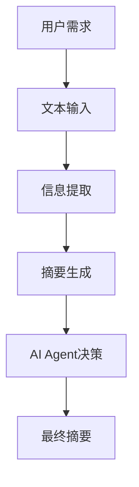
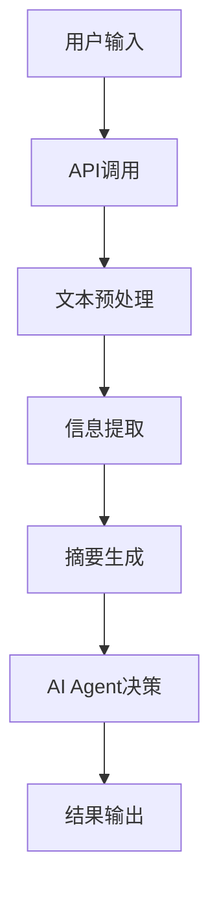
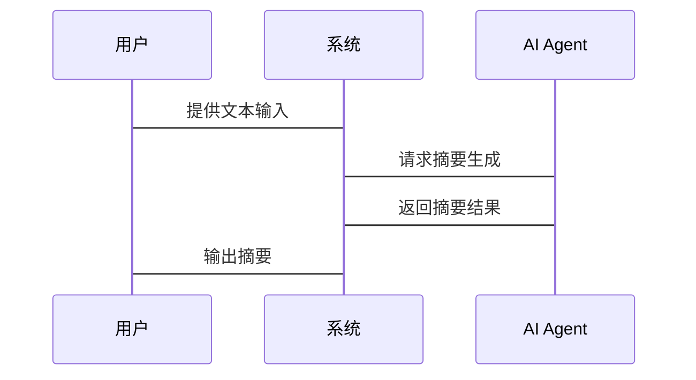

                 


# 构建AI Agent的自动摘要生成系统

> 关键词：AI Agent，自动摘要，文本摘要，自然语言处理，深度学习

> 摘要：本文详细探讨了构建AI Agent驱动的自动摘要生成系统的各个方面，包括背景、核心概念、算法原理、系统设计与实现、项目实战以及优化与扩展。通过结合文本理解、信息提取和自然语言生成等技术，本文提出了基于AI Agent的自动摘要生成系统的设计思路，并通过具体案例展示了系统的实现过程和优化方法。

---

## 第一部分: AI Agent与自动摘要生成系统基础

### 第1章: AI Agent与自动摘要生成系统概述

#### 1.1 AI Agent的基本概念
- **1.1.1 AI Agent的定义**  
  AI Agent（人工智能代理）是指能够感知环境并采取行动以实现目标的智能实体。它通常具备自主性、反应性、目标导向性和社交能力等特征。

- **1.1.2 AI Agent的核心特征**  
  - 自主性：能够在没有外部干预的情况下独立运作。  
  - 反应性：能够根据环境的变化调整自身的行为。  
  - 目标导向性：所有行动都围绕特定目标展开。  
  - 社交能力：能够与其他AI Agent或人类进行交互。

- **1.1.3 AI Agent的应用场景**  
  - 智能助手（如Siri、Alexa）。  
  - 自动交易系统。  
  - 智能客服。  
  - 自动驾驶系统。

#### 1.2 自动摘要生成系统的基本概念
- **1.2.1 自动摘要的定义**  
  自动摘要是指利用计算机技术从大量文本中自动生成简短、准确的摘要，以帮助用户快速获取关键信息。

- **1.2.2 自动摘要的关键技术**  
  - 文本理解：通过自然语言处理技术理解文本内容。  
  - 信息提取：从文本中提取关键信息。  
  - 摘要生成：基于提取的信息生成摘要。

- **1.2.3 自动摘要的应用领域**  
  - 新闻速览。  
  - 学术论文摘要。  
  - 会议记录。  
  - 企业文档管理。

#### 1.3 AI Agent与自动摘要生成系统的结合
- **1.3.1 AI Agent驱动自动摘要的必要性**  
  AI Agent能够通过上下文理解和用户需求，动态生成摘要，满足不同场景的需求。

- **1.3.2 自动摘要在AI Agent中的作用**  
  自动摘要技术是AI Agent实现智能信息处理的重要组成部分，能够帮助用户快速获取所需信息。

- **1.3.3 系统的整体架构**  
  通过AI Agent与自动摘要生成系统的结合，构建一个能够理解上下文、动态调整摘要策略的智能系统。

---

### 第2章: 自动摘要生成系统的背景与问题分析

#### 2.1 自动摘要生成的背景
- **2.1.1 信息爆炸时代的挑战**  
  在信息爆炸的时代，用户需要快速获取关键信息，自动摘要技术应运而生。

- **2.1.2 自动摘要技术的发展历程**  
  从基于规则的提取式摘要到深度学习驱动的生成式摘要，技术不断进步。

- **2.1.3 AI技术在摘要生成中的应用**  
  AI技术的引入，使得摘要生成更加智能化和个性化。

#### 2.2 当前存在的问题与挑战
- **2.2.1 摘要生成的准确性问题**  
  如何保证摘要的准确性和完整性是当前的技术难点。

- **2.2.2 摘要生成的效率问题**  
  高效生成摘要对实时性要求较高的场景至关重要。

- **2.2.3 多语言摘要的难点**  
  不同语言的语法结构和文化差异增加了多语言摘要的复杂性。

#### 2.3 问题解决的思路与方法
- **2.3.1 基于AI Agent的解决方案**  
  AI Agent能够根据用户需求动态调整摘要策略。

- **2.3.2 多模态摘要的探索**  
  结合图像、语音等多种模态信息，提升摘要的准确性和丰富性。

- **2.3.3 智能摘要系统的优化方向**  
  通过深度学习和强化学习技术，不断提升摘要生成的质量和效率。

---

### 第3章: 自动摘要生成的核心概念与联系

#### 3.1 核心概念原理
- **3.1.1 文本理解与信息提取**  
  通过自然语言处理技术，理解文本内容并提取关键信息。

- **3.1.2 摘要生成的策略选择**  
  根据文本内容和用户需求，选择合适的摘要生成策略。

- **3.1.3 AI Agent的决策机制**  
  AI Agent根据上下文和用户需求，动态调整摘要生成策略。

#### 3.2 核心概念对比表
| 对比维度 | 提取式摘要 | 生成式摘要 |
|----------|------------|------------|
| 技术原理 | 基于关键词或短语提取 | 基于生成模型生成新文本 |
| 优势 | 简洁准确 | 更符合语境 |
| 劣势 | 可能遗漏重要信息 | 生成质量不稳定 |

#### 3.3 ER实体关系图


---

## 第二部分: 自动摘要生成系统的算法原理

### 第4章: 文本摘要生成算法

#### 4.1 提取式摘要算法
- **4.1.1 基于关键词提取的方法**  
  使用TF-IDF（Term Frequency-Inverse Document Frequency）算法提取关键词。

- **4.1.2 基于文本排名的方法**  
  使用TextRank算法，通过计算文本中关键词的排名生成摘要。

- **4.1.3 基于位置权重的方法**  
  根据关键词在文本中的位置权重进行摘要生成。

#### 4.2 生成式摘要算法
- **4.2.1 基于RNN的生成模型**  
  使用循环神经网络（RNN）生成摘要，但存在训练速度慢和长序列处理能力差的问题。

- **4.2.2 基于Transformer的生成模型**  
  使用Transformer模型，通过自注意力机制提升生成摘要的质量。

- **4.2.3 基于预训练语言模型的生成方法**  
  使用如BERT、GPT等预训练语言模型，生成高质量的摘要。

#### 4.3 算法对比与优化
- **4.3.1 不同算法的优缺点分析**  
  提取式摘要简单高效，但生成式摘要更具语境适应性。

- **4.3.2 基于AI Agent的算法优化策略**  
  综合使用多种算法，根据具体场景动态调整生成策略。

- **4.3.3 混合式摘要算法的提出**  
  结合提取式和生成式摘要的优点，提出一种混合式摘要算法。

---

### 第5章: AI Agent的构建与优化

#### 5.1 AI Agent的构建过程
- **5.1.1 自然语言处理基础**  
  通过NLP技术实现文本的理解和生成。

- **5.1.2 对话系统设计**  
  构建基于摘要生成的对话系统，提升用户体验。

#### 5.2 AI Agent的优化方向
- **5.2.1 模型优化**  
  使用深度学习和强化学习技术，优化AI Agent的决策能力。

- **5.2.2 系统效率提升**  
  通过并行计算和分布式系统设计，提升摘要生成的效率。

- **5.2.3 多模态信息处理**  
  结合图像、语音等多种模态信息，提升摘要生成的准确性和丰富性。

---

## 第三部分: 系统设计与实现

### 第6章: 系统架构与设计

#### 6.1 系统架构设计


#### 6.2 接口设计
- **6.2.1 输入接口**  
  提供文本输入接口，接收用户提供的文本内容。

- **6.2.2 输出接口**  
  提供摘要输出接口，返回生成的摘要结果。

#### 6.3 交互流程设计


---

### 第7章: 项目实战

#### 7.1 环境配置
- 安装Python、TensorFlow、Keras等必要的开发工具和库。

#### 7.2 核心代码实现
```python
import tensorflow as tf
from tensorflow.keras import layers

# 模型定义
def build_model(vocab_size, embedding_dim, lstm_units):
    model = tf.keras.Sequential()
    model.add(layers.Embedding(vocab_size, embedding_dim))
    model.add(layers.LSTM(lstm_units, return_sequences=True))
    model.add(layers.Dense(1, activation='sigmoid'))
    return model

# 训练过程
def train_model(model, optimizer, loss_function, epochs):
    model.compile(optimizer=optimizer, loss=loss_function, metrics=['accuracy'])
    model.fit(x_train, y_train, epochs=epochs, validation_data=(x_val, y_val))
```

#### 7.3 案例分析与解读
- 通过具体案例展示系统在新闻摘要生成中的应用，并进行详细解读。

#### 7.4 项目总结
- 总结项目实现的关键点和遇到的问题，提出改进建议。

---

## 第四部分: 优化与扩展

### 第8章: 系统优化

#### 8.1 系统优化方法
- **8.1.1 模型优化**  
  使用更先进的深度学习模型（如Transformer）提升摘要质量。

- **8.1.2 系统效率提升**  
  通过优化算法和架构设计，提升系统的运行效率。

#### 8.2 前沿技术探索
- **8.2.1 多模态摘要**  
  结合图像、语音等多种模态信息，提升摘要的准确性和丰富性。

- **8.2.2 可解释性增强**  
  提升系统透明度，使用户更好地理解生成摘要的依据。

---

## 第五部分: 结语与展望

### 第9章: 最佳实践与小结
- **9.1 最佳实践**  
  - 合理选择摘要算法，根据具体场景进行调整。  
  - 结合AI Agent的决策能力，动态优化摘要生成策略。  
  - 注重系统的可扩展性和可维护性。

- **9.2 小结**  
  本文详细探讨了构建AI Agent驱动的自动摘要生成系统的各个方面，从理论基础到实际实现，为读者提供了全面的技术指导。

---

## 参考文献
- 文章末尾可以列出相关的参考文献和技术资料。

---

**作者：AI天才研究院/AI Genius Institute & 禅与计算机程序设计艺术 /Zen And The Art of Computer Programming**

---

通过以上详细的目录和内容安排，可以确保文章结构清晰、内容详实，涵盖从背景到实现的各个方面，为读者提供一个全面的技术指南。

