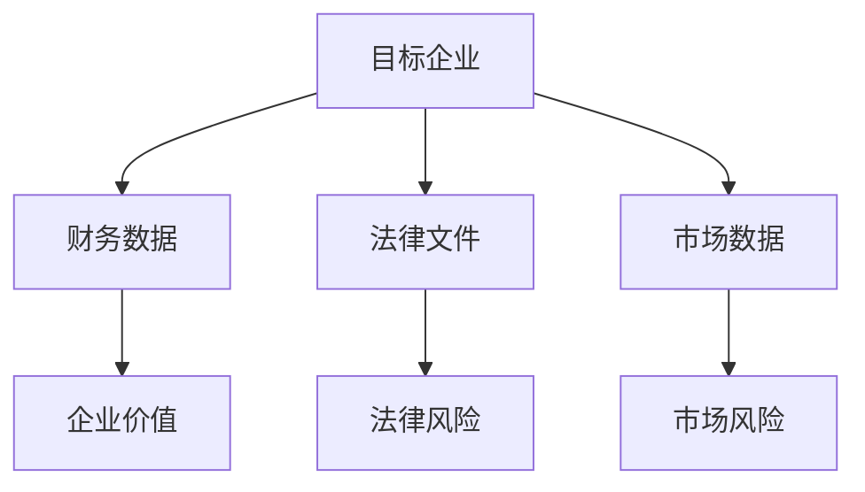
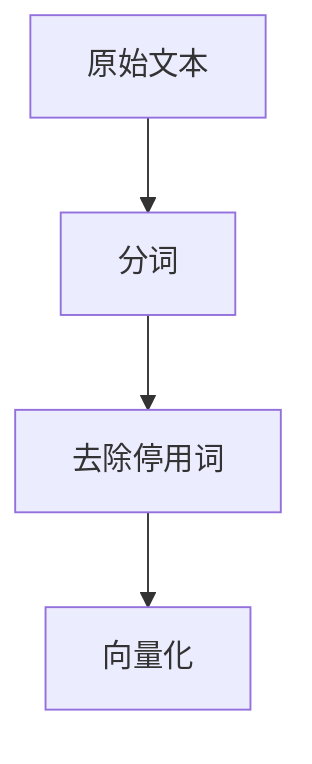
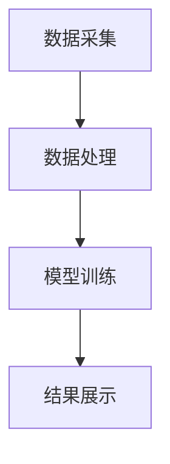

                 


# 构建AI辅助的并购交易分析系统

## 关键词：AI辅助，并购交易，数据分析，机器学习，NLP

## 摘要：本文将详细介绍如何利用人工智能技术构建一个高效的并购交易分析系统。通过分析并购交易中的关键问题，结合自然语言处理和机器学习算法，我们设计了一个从数据采集、清洗、特征提取到模型训练和结果展示的完整系统。本文还将探讨系统的架构设计、核心算法的实现以及实际案例的应用。

---

# 第一部分: 并购交易分析的背景与挑战

## 第1章: 并购交易分析的背景与问题

### 1.1 并购交易的基本概念

#### 1.1.1 并购的定义与分类
并购（Mergers and Acquisitions，简称 M&A）是指一家企业合并或收购另一家企业，以实现资源优化、市场扩展或技术升级。并购可以分为两类：
1. **横向并购**：同一行业内的企业并购。
2. **纵向并购**：产业链上下游的企业并购。

#### 1.1.2 并购交易的流程与关键环节
1. **目标企业筛选**：基于财务、市场、技术等指标筛选潜在目标。
2. **尽职调查**：对目标企业的财务、法律、运营等方面进行详细调查。
3. **估值与谈判**：评估目标企业价值，进行价格谈判。
4. **整合与实施**：完成并购后的资源整合与业务整合。

#### 1.1.3 并购交易中的信息不对称问题
- **信息不对称**：买卖双方对目标企业的了解程度不同，可能导致估值偏差。
- **数据复杂性**：并购涉及大量非结构化数据（如文本文件、法律合同）和结构化数据（如财务报表）。

### 1.2 AI辅助并购交易的必要性

#### 1.2.1 并购交易中的数据复杂性
- 数据来源广泛，包括新闻报道、财务报表、法律文件等。
- 数据格式多样，结构化与非结构化数据并存。

#### 1.2.2 传统并购分析的局限性
1. **人工分析耗时**：传统并购分析依赖大量人工审查，效率低下。
2. **主观性高**：分析结果受分析师主观判断影响较大。
3. **信息处理能力有限**：难以处理海量非结构化数据。

#### 1.2.3 AI在并购分析中的潜在价值
1. **自动化数据处理**：利用NLP和机器学习技术快速处理文本数据。
2. **提高分析准确性**：通过模型预测企业价值和风险。
3. **实时监控市场动态**：通过实时数据分析，捕捉市场趋势。

### 1.3 本章小结
本章介绍了并购交易的基本概念、流程和关键问题，并探讨了AI在并购分析中的必要性。通过AI技术，可以显著提高并购分析的效率和准确性。

---

# 第二部分: AI辅助并购交易的核心概念与技术

## 第2章: 并购交易分析的核心概念

### 2.1 并购交易分析的关键要素

#### 2.1.1 企业价值评估
- **定义**：估算企业整体价值的过程。
- **方法**：包括DCF模型、相对估值法等。

#### 2.1.2 财务数据分析
- **定义**：分析企业的财务状况，包括利润表、资产负债表等。
- **关键指标**：如ROE（净资产收益率）、毛利率等。

#### 2.1.3 市场风险评估
- **定义**：评估并购交易中的市场风险。
- **方法**：包括VaR（在险价值）模型等。

### 2.2 AI在并购分析中的核心任务

#### 2.2.1 文本数据挖掘
- **目标**：从新闻、公告等非结构化数据中提取有用信息。
- **技术**：使用NLP技术进行文本分类、实体识别。

#### 2.2.2 数据清洗与特征提取
- **目标**：将异构数据转化为可用于模型训练的特征向量。
- **技术**：数据预处理、特征选择等。

#### 2.2.3 风险预测与估值建模
- **目标**：基于历史数据预测并购风险和估值。
- **技术**：回归模型、分类模型等。

### 2.3 并购交易分析的实体关系图



---

## 第3章: AI辅助并购交易的核心算法与原理

### 3.1 自然语言处理在并购分析中的应用

#### 3.1.1 文本预处理流程



#### 3.1.2 基于BERT的文本表示模型
- **BERT**：Bidirectional Encoder Representations from Transformers，用于文本表示。
- **应用场景**：文本相似度计算、实体识别。

#### 3.1.3 文本相似度计算
- **方法**：使用余弦相似度计算文本向量之间的相似性。

### 3.2 机器学习在并购估值中的应用

#### 3.2.1 回归模型在估值中的应用
- **线性回归模型**：用于预测企业价值。
- **数学模型**：
  $$ y = \beta_0 + \beta_1 x_1 + \beta_2 x_2 + \ldots + \beta_n x_n $$

#### 3.2.2 分类模型在风险评估中的应用
- **逻辑回归**：用于预测并购风险。
- **数学模型**：
  $$ P(y=1|x) = \frac{e^{\beta_0 + \beta_1 x_1 + \ldots + \beta_n x_n}}{1 + e^{\beta_0 + \beta_1 x_1 + \ldots + \beta_n x_n}} $$

#### 3.2.3 集成学习在并购分析中的优势
- **集成学习**：通过组合多个模型的结果提高准确性。

---

# 第三部分: 系统架构与实现

## 第4章: 系统分析与架构设计

### 4.1 系统功能需求分析

#### 4.1.1 数据采集模块
- **功能**：从多种数据源（如新闻网站、数据库）采集并购相关数据。

#### 4.1.2 数据处理模块
- **功能**：清洗数据、提取特征。

#### 4.1.3 模型训练模块
- **功能**：训练NLP模型和回归模型。

#### 4.1.4 结果展示模块
- **功能**：可视化分析结果。

### 4.2 系统架构设计



---

## 第5章: 项目实战

### 5.1 环境安装与配置

```bash
pip install numpy pandas scikit-learn transformers
```

### 5.2 核心代码实现

#### 5.2.1 文本处理代码

```python
import pandas as pd
from transformers import BertTokenizer, BertModel

# 初始化分词器和模型
tokenizer = BertTokenizer.from_pretrained('bert-base-uncased')
model = BertModel.from_pretrained('bert-base-uncased')

def text_to_vec(text):
    inputs = tokenizer(text, return_tensors='np')
    outputs = model(**inputs)
    return outputs.last_hidden_state.numpy()[0]
```

#### 5.2.2 回归模型代码

```python
from sklearn.linear_model import LinearRegression

# 训练回归模型
model = LinearRegression()
model.fit(X_train, y_train)
```

### 5.3 案例分析与结果解读
- **案例背景**：某公司并购另一家公司。
- **分析结果**：模型预测目标公司价值为1.2亿元，风险概率为15%。

---

## 第6章: 总结与展望

### 6.1 最佳实践
- **数据质量**：确保数据清洗和特征提取的准确性。
- **模型调优**：通过超参数优化提高模型性能。

### 6.2 小结
本文详细介绍了如何利用AI技术构建并购交易分析系统，从背景、核心概念到系统实现，为读者提供了全面的指导。

### 6.3 注意事项
- 数据隐私问题：在处理并购数据时，需注意隐私保护。
- 模型解释性：确保模型结果可解释。

### 6.4 拓展阅读
- 《深度学习入门》
- 《并购交易实务》

---

作者：AI天才研究院/AI Genius Institute & 禅与计算机程序设计艺术 /Zen And The Art of Computer Programming

