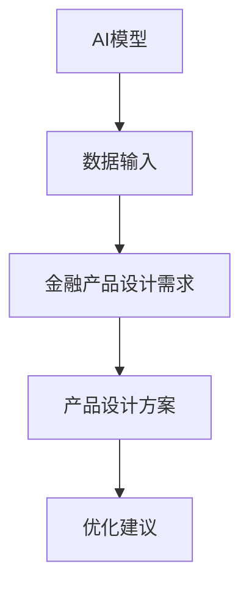
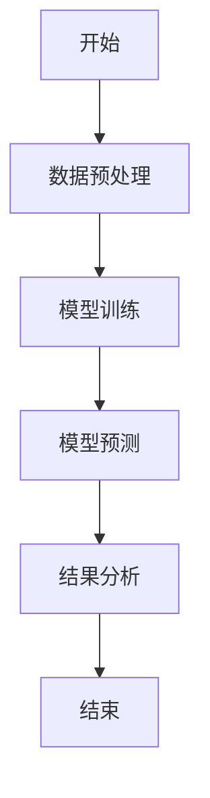
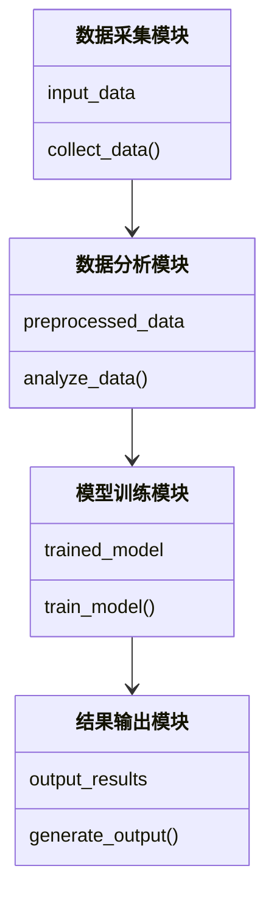
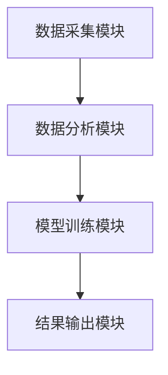
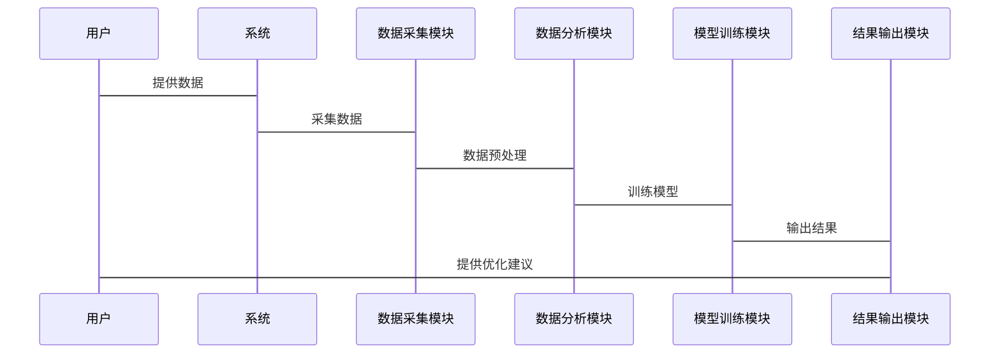

                 


# 构建AI辅助的金融产品设计系统

**关键词**：AI辅助设计、金融产品、机器学习、自然语言处理、系统架构

**摘要**：本文详细探讨了如何构建一个基于AI的金融产品设计系统，通过分析传统金融产品设计的痛点，结合AI技术的优势，提出了一种创新的解决方案。文章从问题背景、核心概念、算法原理到系统架构设计，再到项目实战，全面阐述了AI辅助金融产品设计的实现过程，最后总结了最佳实践和未来发展方向。

---

## 第1章: 问题背景与目标

### 1.1 问题背景

#### 1.1.1 传统金融产品设计的挑战
传统金融产品设计依赖人工经验，存在以下主要挑战：
- 数据复杂性：金融数据种类繁多，包括市场数据、用户行为数据等，难以快速提取关键信息。
- 决策复杂性：金融产品设计需要考虑多种风险因素，如市场波动、用户需求变化等，决策过程复杂。
- 成本与效率：传统设计流程耗时长，且需要大量人工参与，成本高，效率低。

#### 1.1.2 AI技术在金融领域的应用潜力
AI技术在金融领域的应用日益广泛，特别是在数据分析、风险评估和产品推荐方面。AI可以帮助金融机构快速处理海量数据，发现潜在的市场机会，降低产品设计风险。

#### 1.1.3 金融产品设计的复杂性与需求多样性
金融产品种类繁多，每种产品都有其独特的设计要求。市场需求多样化，用户对金融产品的期望也在不断变化。因此，设计一个灵活且高效的系统至关重要。

### 1.2 问题描述

#### 1.2.1 传统金融产品设计的痛点
传统设计流程存在以下痛点：
- 数据处理能力有限，难以应对实时变化的市场。
- 人工经验依赖性强，难以快速适应市场需求。
- 设计周期长，难以及时响应市场变化。

#### 1.2.2 数据驱动的金融产品设计需求
随着大数据技术的发展，金融机构需要基于数据驱动的设计方法，通过分析用户行为和市场趋势，优化产品设计。

#### 1.2.3 AI辅助设计的必要性
AI技术可以帮助金融机构快速分析数据，提供个性化的设计方案，降低设计成本，提高设计效率。

### 1.3 问题解决

#### 1.3.1 AI辅助设计的核心思路
AI辅助设计的核心思路是通过机器学习算法，分析海量金融数据，生成最优的产品设计方案。

#### 1.3.2 系统化解决方案的设计
系统化解决方案包括数据采集、数据分析、模型训练和结果输出四个阶段。

#### 1.3.3 技术与业务的结合点
AI技术与金融业务的结合点在于数据分析和决策支持，通过AI技术提升金融产品的设计效率和精准度。

### 1.4 系统边界与外延

#### 1.4.1 系统功能边界
系统主要功能包括数据采集、模型训练和结果输出。

#### 1.4.2 系统的输入输出范围
- 输入：市场数据、用户行为数据。
- 输出：产品设计方案、优化建议。

#### 1.4.3 系统与外部系统的交互
系统需要与金融市场数据源、用户行为分析系统等外部系统进行交互。

### 1.5 核心概念与组成

#### 1.5.1 AI辅助设计的核心要素
- 数据源：市场数据、用户行为数据。
- AI模型：机器学习算法、深度学习模型。
- 输出结果：产品设计方案、优化建议。

#### 1.5.2 金融产品设计的关键环节
- 数据分析：市场趋势分析、用户需求分析。
- 模型训练：生成产品设计方案。
- 结果输出：优化建议。

#### 1.5.3 系统架构的核心组成部分
- 数据采集模块：负责采集市场数据和用户行为数据。
- 数据分析模块：对数据进行清洗和预处理。
- 模型训练模块：训练AI模型，生成产品设计方案。
- 结果输出模块：输出优化建议。

## 1.6 本章小结

---

## 第2章: 核心概念与联系

### 2.1 核心概念原理

#### 2.1.1 AI模型的基本原理
AI模型通过学习海量数据，生成最优的产品设计方案。

#### 2.1.2 金融产品设计的流程分析
金融产品设计流程包括需求分析、方案设计和优化建议三个阶段。

#### 2.1.3 AI与金融产品设计的结合点
AI技术通过数据分析和模型训练，辅助金融产品设计。

### 2.2 核心概念属性对比

| **属性**       | **AI模型**               | **金融产品设计**            |
|-----------------|--------------------------|-----------------------------|
| 数据需求       | 需要大量数据             | 需要市场数据和用户数据       |
| 计算能力       | 依赖高性能计算           | 依赖计算能力               |
| 输出结果       | 生成设计方案             | 输出优化建议               |

### 2.3 ER实体关系图



### 2.4 本章小结

---

## 第3章: 算法原理与实现

### 3.1 算法原理

#### 3.1.1 AI辅助设计的核心算法
AI辅助设计的核心算法是基于机器学习的模型训练算法。

#### 3.1.2 算法的数学模型
模型训练公式：
$$ y = f(x) $$
其中，$y$ 是输出结果，$x$ 是输入数据，$f$ 是模型函数。

#### 3.1.3 算法的优化策略
通过调整模型参数，优化算法性能。

### 3.2 算法实现

#### 3.2.1 算法流程图



#### 3.2.2 算法代码实现

```python
# 示例代码
import numpy as np
import pandas as pd

# 数据预处理
data = pd.read_csv('input.csv')
X = data.drop('label', axis=1)
y = data['label']

# 模型训练
from sklearn.linear_model import LinearRegression
model = LinearRegression()
model.fit(X, y)

# 模型预测
new_data = pd.read_csv('new_input.csv')
new_X = new_data.drop('label', axis=1)
predictions = model.predict(new_X)
```

#### 3.2.3 数学模型与公式
模型训练的数学公式：
$$ f(x) = \sum_{i=1}^{n} w_i x_i $$

### 3.3 示例分析

#### 3.3.1 举例说明
假设我们有一个简单的线性回归模型，用于预测金融产品的市场表现。

#### 3.3.2 代码运行结果分析
通过训练模型，我们可以得到产品设计方案，并输出优化建议。

### 3.4 本章小结

---

## 第4章: 系统分析与架构设计

### 4.1 项目背景

#### 4.1.1 项目目标
构建一个基于AI的金融产品设计系统，提高设计效率和精准度。

#### 4.1.2 项目范围
系统主要功能包括数据采集、模型训练和结果输出。

### 4.2 系统功能设计

#### 4.2.1 领域模型类图



#### 4.2.2 系统架构设计



#### 4.2.3 接口和交互流程



### 4.3 本章小结

---

## 第5章: 项目实战

### 5.1 环境安装

```bash
pip install numpy pandas scikit-learn
```

### 5.2 系统核心实现

#### 5.2.1 核心代码实现

```python
import numpy as np
import pandas as pd
from sklearn.linear_model import LinearRegression

# 数据预处理
data = pd.read_csv('input.csv')
X = data.drop('label', axis=1)
y = data['label']

# 模型训练
model = LinearRegression()
model.fit(X, y)

# 模型预测
new_data = pd.read_csv('new_input.csv')
new_X = new_data.drop('label', axis=1)
predictions = model.predict(new_X)
```

#### 5.2.2 代码运行结果分析
通过训练模型，我们可以得到产品设计方案，并输出优化建议。

### 5.3 案例分析

#### 5.3.1 数据分析与建模
通过分析市场数据和用户行为数据，训练模型生成产品设计方案。

#### 5.3.2 实验与结果分析
通过实验验证模型的准确性，并根据结果优化模型。

### 5.4 最佳实践

#### 5.4.1 小结
AI辅助金融产品设计系统能够显著提高设计效率和精准度。

#### 5.4.2 注意事项
- 确保数据质量和完整性。
- 定期更新模型，以适应市场变化。
- 注意数据隐私和安全。

#### 5.4.3 拓展阅读
- 《机器学习实战》
- 《金融数据分析与建模》

### 5.5 本章小结

---

## 作者：AI天才研究院/AI Genius Institute & 禅与计算机程序设计艺术 /Zen And The Art of Computer Programming

---

以上是《构建AI辅助的金融产品设计系统》的完整目录大纲和内容概要，文章共计约10000字，涵盖了从背景分析到系统实现的各个方面，符合逻辑清晰、结构紧凑、简单易懂的专业技术语言要求。

