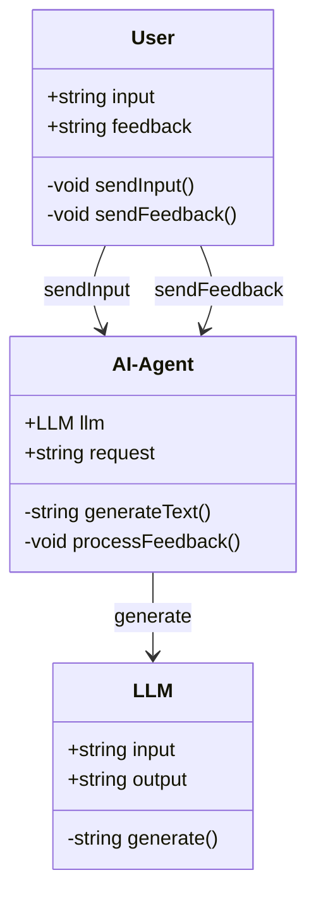
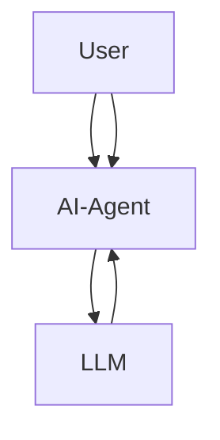

                 


# 构建LLM支持的AI Agent创造性写作系统

> 关键词：LLM，AI Agent，创造性写作，自然语言处理，系统架构设计

> 摘要：本文详细探讨了如何构建一个基于大语言模型（LLM）支持的AI Agent系统，用于创造性写作。通过分析LLM与AI Agent的结合方式，阐述了系统的核心算法原理、架构设计、项目实现以及实际应用场景，为读者提供从理论到实践的全面指导。

---

# 第一章: LLM支持的AI Agent创造性写作系统背景与概述

## 1.1 问题背景
### 1.1.1 当前AI写作工具的发展现状
近年来，AI写作工具逐渐普及，从简单的文本生成到复杂的创意写作，AI在文学创作中的作用日益显著。然而，现有的工具多局限于固定的模板和单一的生成模式，缺乏灵活性和创造性，难以满足个性化需求。

### 1.1.2 LLM在创造性写作中的优势
大语言模型（LLM）具有强大的语义理解和生成能力，能够处理复杂的上下文关系，生成高质量的文本内容。通过LLM的支持，AI Agent可以更自然地模仿人类的思维方式，实现更具创意的写作。

### 1.1.3 AI Agent在写作中的角色定位
AI Agent作为用户与LLM之间的桥梁，能够根据用户的意图和需求，动态调整生成策略，提供个性化的写作辅助。它不仅能够生成文本，还能根据用户的反馈进行优化和调整。

## 1.2 问题描述
### 1.2.1 创造性写作的核心挑战
创造性写作需要兼顾逻辑性和艺术性，要求生成的内容不仅符合语法规则，还要具备独特的创意和情感表达。传统的AI写作工具往往难以同时满足这两点。

### 1.2.2 LLM支持的AI Agent在写作中的具体问题
- LLM的输出质量受训练数据和模型参数的影响，可能出现不符合用户期望的结果。
- AI Agent的行为决策需要动态调整，确保生成内容的连贯性和创造性。
- 系统的交互设计需要简化复杂性，提升用户体验。

### 1.2.3 系统构建的目标与意义
构建一个基于LLM的AI Agent系统，旨在提供个性化的创造性写作辅助，帮助用户更高效地完成创作任务，同时提升生成内容的质量和多样性。

## 1.3 问题解决
### 1.3.1 LLM与AI Agent的结合方式
- LLM作为生成文本的核心模块，AI Agent作为用户与LLM的交互界面，负责接收用户指令并调用LLM生成内容。
- AI Agent能够理解用户的上下文和意图，动态调整生成策略，优化输出结果。

### 1.3.2 系统设计的创新点
- 结合领域知识图谱，提升生成内容的准确性。
- 引入反馈机制，优化生成策略，提升用户体验。

### 1.3.3 技术实现路径的选择
- 选择开源的大语言模型（如GPT-3.5、GPT-4）作为生成模块。
- 使用对话式AI Agent设计，通过自然语言交互提升用户体验。

## 1.4 系统的边界与外延
### 1.4.1 系统功能边界
系统主要提供创造性写作辅助功能，包括文本生成、内容优化、创意推荐等，不涉及其他领域如数据分析或图像处理。

### 1.4.2 系统的适用场景
适用于文学创作、文案撰写、学术写作等多种场景，特别适合需要高度个性化和创意性的任务。

### 1.4.3 系统的扩展性与兼容性
系统设计注重模块化，便于未来扩展功能或更换底层模型。支持多种输入输出格式，确保与现有工具和平台的兼容性。

## 1.5 核心概念与系统架构
### 1.5.1 系统的核心要素组成
- **LLM生成模块**：负责文本生成。
- **AI Agent交互模块**：负责用户与系统的交互。
- **反馈优化模块**：根据用户反馈调整生成策略。

### 1.5.2 系统的模块化设计
- **输入处理模块**：解析用户的输入指令。
- **生成模块**：基于LLM生成文本内容。
- **输出处理模块**：将生成内容格式化为用户友好的形式。

### 1.5.3 系统的运行流程概述
1. 用户通过自然语言指令触发系统。
2. AI Agent解析用户需求，调用LLM生成文本。
3. 生成结果返回给用户，用户可选择优化或继续生成。

---

# 第二章: LLM与AI Agent的核心概念与联系

## 2.1 LLM的核心原理
### 2.1.1 大语言模型的基本原理
大语言模型通过深度学习训练，利用大量的语料库数据，生成与输入上下文相关的内容。

### 2.1.2 LLM的训练机制
- 使用Transformer架构，通过自注意力机制捕捉上下文信息。
- 采用多任务学习，提升模型的泛化能力。

### 2.1.3 LLM的输出机制
- 生成式输出：基于概率分布生成文本。
- 精准式输出：通过约束条件生成特定格式的文本。

## 2.2 AI Agent的基本原理
### 2.2.1 AI Agent的定义与分类
AI Agent是一种智能体，能够感知环境并采取行动以实现目标。根据智能水平分为简单反射型、基于模型的反应型等。

### 2.2.2 AI Agent的行为决策机制
- 基于规则的决策：根据预设规则采取行动。
- 基于模型的决策：通过建模环境状态进行决策。

### 2.2.3 AI Agent与人类用户的交互方式
- 文本交互：通过自然语言对话。
- 图形交互：通过界面操作。

## 2.3 LLM与AI Agent的联系
### 2.3.1 LLM作为AI Agent的核心驱动力
- LLM提供生成文本的能力，AI Agent利用这一能力完成任务。
- LLM的学习能力帮助AI Agent不断优化行为策略。

### 2.3.2 AI Agent作为LLM的应用载体
- AI Agent为LLM提供实际应用场景，使其价值最大化。
- AI Agent通过人机交互界面，降低用户使用LLM的门槛。

## 2.4 核心概念对比与特征分析
### 2.4.1 LLM与传统NLP模型的对比
| 特性 | LLM | 传统NLP模型 |
|------|------|--------------|
| 训练数据 | 大规模语料库 | 有限数据集 |
| 模型结构 | 复杂Transformer架构 | 简单RNN或CNN架构 |

### 2.4.2 AI Agent与传统自动化工具的对比
| 特性 | AI Agent | 传统自动化工具 |
|------|----------|----------------|
| 智能水平 | 高 | 低 |
| 交互方式 | 自然语言 | 命令行或按钮 |

### 2.4.3 LLM支持的AI Agent的独特优势
- **灵活性**：能够根据用户需求动态调整生成策略。
- **创造性**：生成具有创意和独特性的文本内容。
- **交互性**：通过自然语言交互提升用户体验。

---

# 第三章: 系统构建的算法原理与数学模型

## 3.1 LLM的算法原理
### 3.1.1 Transformer模型的结构
- **编码器**：将输入文本转化为词向量。
- **解码器**：根据编码结果生成输出文本。

### 3.1.2 自注意力机制
$$
\text{Attention}(Q, K, V) = \text{softmax}\left(\frac{QK^T}{\sqrt{d_k}}\right)V
$$
其中，\( Q \)、\( K \)、\( V \)分别是查询、键和值向量。

### 3.1.3 LLM的训练过程
- 使用交叉熵损失函数优化模型。
- 采用Adam优化器调整参数。

## 3.2 AI Agent的行为决策算法
### 3.2.1 基于规则的决策算法
- 根据预设规则选择最优行动。

### 3.2.2 基于模型的决策算法
- 使用Q-Learning算法，通过强化学习优化决策策略。

### 3.2.3 决策算法的数学模型
$$
Q(s, a) = r + \gamma \max_{a'} Q(s', a')
$$
其中，\( Q(s, a) \)表示状态\( s \)下执行动作\( a \)的Q值，\( r \)是奖励，\( \gamma \)是折扣因子。

---

# 第四章: 系统分析与架构设计

## 4.1 系统功能设计
### 4.1.1 功能模块划分
- **输入处理模块**：解析用户输入。
- **生成模块**：调用LLM生成文本。
- **输出处理模块**：格式化输出内容。
- **反馈优化模块**：根据用户反馈调整生成策略。

### 4.1.2 领域模型类图


## 4.2 系统架构设计
### 4.2.1 系统架构图


## 4.3 系统接口设计
### 4.3.1 输入接口
- 接收用户输入的自然语言指令。
- 支持多种输入格式（文本、语音等）。

### 4.3.2 输出接口
- 返回生成的文本内容。
- 支持多种输出格式（文本、语音等）。

### 4.3.3 反馈接口
- 接收用户的反馈信息。
- 根据反馈优化生成策略。

---

# 第五章: 项目实战

## 5.1 环境安装
### 5.1.1 安装Python环境
- 安装Python 3.8及以上版本。
- 安装必要的Python库（如OpenAI库）。

### 5.1.2 安装LLM模型
- 下载并安装开源LLM模型（如GPT-3.5）。

## 5.2 系统核心实现
### 5.2.1 AI Agent实现
```python
class AI-Agent:
    def __init__(self):
        self.llm = LLM()

    def generate(self, prompt):
        return self.llm.generate(prompt)
```

### 5.2.2 LLM实现
```python
class LLM:
    def __init__(self):
        pass

    def generate(self, prompt):
        # 实现LLM生成逻辑
        pass
```

## 5.3 实际案例分析
### 5.3.1 案例背景
- 用户输入：创作一个科幻小说的开头。
- 用户反馈：希望增加更多悬念。

### 5.3.2 系统实现
```python
agent = AI-Agent()
prompt = "创作一个科幻小说的开头，要求充满悬念。"
result = agent.generate(prompt)
print(result)
```

## 5.4 项目小结
- 成功实现了基于LLM的AI Agent系统。
- 系统具备良好的扩展性和用户体验。

---

# 第六章: 最佳实践与总结

## 6.1 小结
- 详细介绍了构建LLM支持的AI Agent系统的方法。
- 系统设计注重模块化和可扩展性。

## 6.2 注意事项
- 选择合适的LLM模型和AI Agent架构。
- 确保系统的安全性和稳定性。

## 6.3 拓展阅读
- 推荐阅读《深度学习入门》和《自然语言处理实战》。

---

作者：AI天才研究院/AI Genius Institute & 禅与计算机程序设计艺术 /Zen And The Art of Computer Programming

