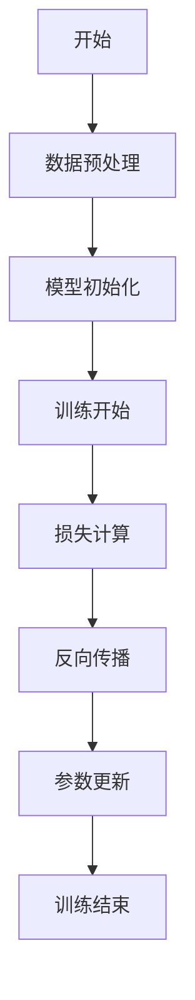
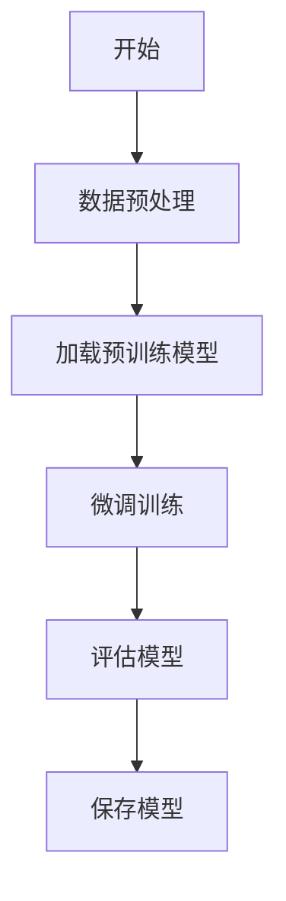
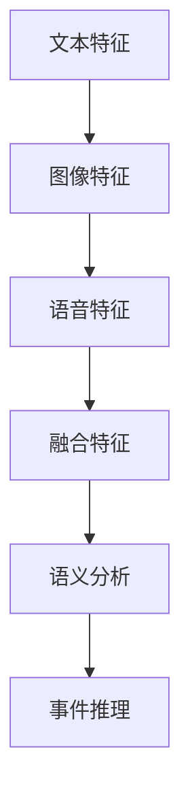
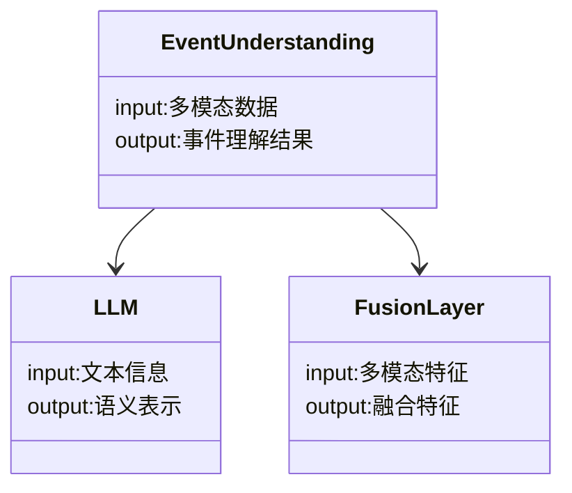
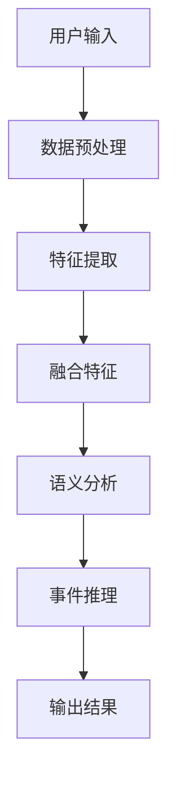
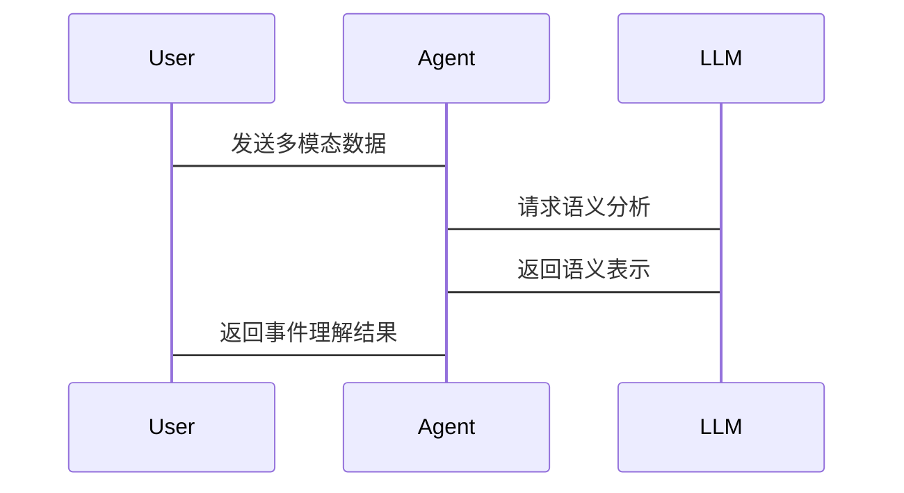

                 


# 构建LLM支持的AI Agent多模态事件理解

> 关键词：LLM, AI Agent, 多模态事件理解, 多模态数据, 事件推理

> 摘要：本文详细探讨了构建基于大语言模型（LLM）的AI Agent多模态事件理解的方法。通过分析多模态数据与事件理解的关系，结合LLM的文本处理能力，提出了一种多模态事件理解的新思路，并通过系统架构设计和项目实战，展示了如何将理论应用于实际场景。本文还提供了详细的算法原理和数学模型，帮助读者深入理解技术细节。

---

## 正文

### 第1章: 多模态AI Agent与LLM背景介绍

#### 1.1 多模态AI Agent的概念与背景

##### 1.1.1 多模态AI Agent的定义

多模态AI Agent是一种能够处理和理解多种数据形式（如文本、图像、语音等）的智能体。它能够通过整合不同模态的信息，实现更全面的感知和决策能力。

##### 1.1.2 多模态事件理解的必要性

在现实场景中，事件往往涉及多种数据形式。例如，一个视频监控系统需要理解视频中的动作、场景描述以及相关的语音指令。单一模态的信息往往不足以捕捉事件的全貌，因此多模态事件理解是必要的。

##### 1.1.3 LLM在AI Agent中的作用

大语言模型（LLM）具有强大的文本理解和生成能力，能够帮助AI Agent处理复杂的语义信息。通过将LLM与多模态数据结合，AI Agent可以更准确地理解和推理事件。

#### 1.2 LLM支持的AI Agent概述

##### 1.2.1 LLM的基本概念

LLM是一种基于深度学习的自然语言处理模型，能够理解和生成人类语言。它通过大量数据的预训练，掌握了语言的语义结构和上下文关系。

##### 1.2.2 LLM与AI Agent的结合

AI Agent通过调用LLM，可以将多模态数据中的文本信息转化为可理解的语义表示。这种结合使得AI Agent能够处理复杂的语义任务，如对话生成、文本摘要等。

##### 1.2.3 多模态事件理解的实现路径

多模态事件理解需要将不同模态的数据进行融合，利用LLM进行语义分析，最终生成对事件的全面理解。

#### 1.3 问题背景与目标

##### 1.3.1 当前AI Agent的局限性

现有的AI Agent大多基于单一模态数据，缺乏对复杂场景的理解能力。这限制了它们在实际应用中的表现。

##### 1.3.2 多模态事件理解的挑战

多模态数据的异构性和复杂性使得事件理解变得困难。如何有效地融合不同模态的信息是当前研究的热点。

##### 1.3.3 本书的研究目标

本书旨在探讨如何利用LLM支持AI Agent的多模态事件理解，提出一种新的实现方法，并通过实际案例验证其有效性。

### 第2章: 多模态事件理解的核心概念

#### 2.1 多模态数据与事件理解

##### 2.1.1 多模态数据的类型

多模态数据包括文本、图像、语音、视频等多种形式。每种模态都有其独特的信息表达方式。

##### 2.1.2 事件理解的基本流程

事件理解通常包括数据采集、特征提取、融合、语义分析和推理等步骤。

##### 2.1.3 多模态数据的融合方法

多模态数据的融合可以通过早期融合和晚期融合两种方式实现。早期融合将不同模态的数据在特征级别进行融合，晚期融合则在高层语义级别进行。

#### 2.2 LLM在事件理解中的应用

##### 2.2.1 LLM的文本处理能力

LLM能够进行文本生成、翻译、问答等多种任务，这些能力可以为多模态事件理解提供强大的语义支持。

##### 2.2.2 LLM与多模态数据的结合

通过将多模态数据中的文本信息输入LLM，可以提取其语义特征，并与其他模态的数据特征进行融合。

##### 2.2.3 LLM驱动的事件推理

LLM可以基于多模态数据中的语义信息进行事件推理，生成对事件的全面理解。

#### 2.3 核心概念对比与ER图分析

##### 2.3.1 单模态与多模态的特征对比

| 特征       | 单模态            | 多模态            |
|------------|-------------------|-------------------|
| 信息来源   | 单一             | 多种             |
| 复杂性     | 较低             | 较高             |
| 理解能力   | 有限             | 更强             |

##### 2.3.2 多模态事件理解的ER实体关系图

```mermaid
er
    Entity: Event
    Entity: Text
    Entity: Image
    Entity: Audio
    Relationship: Event-Text
    Relationship: Event-Image
    Relationship: Event-Audio
```

### 第3章: 多模态事件理解的算法原理

#### 3.1 算法概述

多模态事件理解的算法通常包括数据预处理、特征提取、融合、语义分析和推理等步骤。

#### 3.2 预训练与微调

##### 3.2.1 预训练过程



##### 3.2.2 微调过程



#### 3.3 多模态模型的融合方法

##### 3.3.1 多模态融合的流程



### 第4章: 多模态事件理解的系统架构

#### 4.1 系统功能设计

##### 4.1.1 功能模块



#### 4.2 系统架构设计

##### 4.2.1 系统架构图



#### 4.3 系统接口设计

##### 4.3.1 接口设计



### 第5章: 项目实战

#### 5.1 环境安装

安装必要的库：

```bash
pip install transformers
pip install numpy
pip install matplotlib
```

#### 5.2 核心代码实现

##### 5.2.1 数据预处理

```python
import numpy as np
import torch
from transformers import AutoTokenizer, AutoModel

class DataPreprocessor:
    def __init__(self, model_name):
        self.tokenizer = AutoTokenizer.from_pretrained(model_name)
        self.model = AutoModel.from_pretrained(model_name)
    
    def process(self, text):
        inputs = self.tokenizer(text, return_tensors="np")
        outputs = self.model(**inputs)
        return np.array(outputs.last_hidden_state)
```

##### 5.2.2 模型融合

```python
class FusionLayer(torch.nn.Module):
    def __init__(self, input_dim, output_dim):
        super(FusionLayer, self).__init__()
        self.fc = torch.nn.Linear(input_dim, output_dim)
    
    def forward(self, x):
        return torch.relu(self.fc(x))
```

#### 5.3 实际案例分析

以一个视频监控场景为例，展示如何利用上述代码实现多模态事件理解。

### 第6章: 最佳实践与总结

#### 6.1 总结与回顾

本文详细探讨了构建基于LLM的AI Agent多模态事件理解的方法，从理论到实践，提供了完整的解决方案。

#### 6.2 注意事项

在实际应用中，需要注意数据的多样性和模型的可解释性，同时要处理好多模态数据的融合问题。

#### 6.3 拓展阅读

推荐读者进一步阅读关于多模态学习和大语言模型的最新研究，以深入了解更先进的技术。

---

### 作者

作者：AI天才研究院/AI Genius Institute & 禅与计算机程序设计艺术 /Zen And The Art of Computer Programming

---

本文通过系统化的分析和实践，全面探讨了构建LLM支持的AI Agent多模态事件理解的方法，为读者提供了深入的技术洞察和实践指导。

