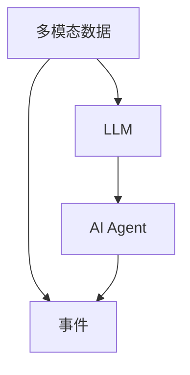
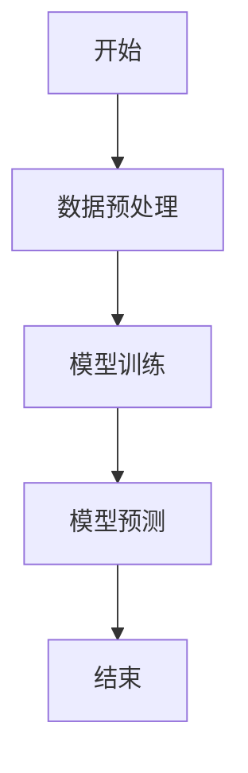
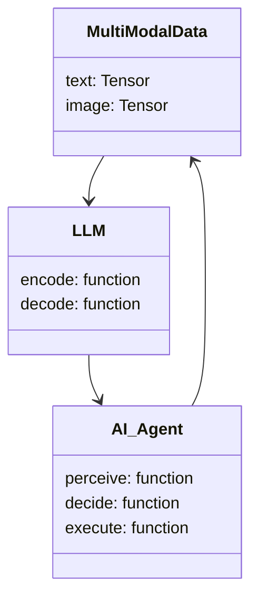
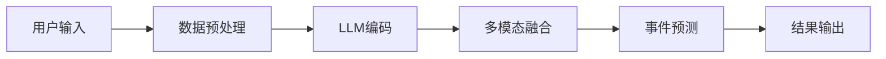

                 


# 构建LLM支持的AI Agent多模态事件预测

> **关键词**：LLM, AI Agent, 多模态事件预测, 人工智能, 大型语言模型

> **摘要**：  
> 本文系统地探讨了如何利用大型语言模型（LLM）构建支持多模态事件预测的AI Agent。文章从背景介绍、核心概念、算法原理、系统架构到项目实战，逐步分析了构建这一系统的各个方面。通过详细讲解LLM在多模态数据处理中的作用、AI Agent的行为特征，以及多模态事件预测的数学模型和系统架构，本文为读者提供了全面的技术指导。

---

# 第一部分: 背景介绍

## 第1章: 问题背景与描述

### 1.1 问题背景
#### 1.1.1 当前AI技术的发展现状
人工智能技术近年来取得了显著进展，尤其是大型语言模型（LLM）的崛起，为自然语言处理和生成任务提供了强大的支持。然而，AI技术的应用场景正在从单一模态扩展到多模态，这意味着AI系统需要能够处理和理解多种类型的数据，如文本、图像、语音和视频等。

#### 1.1.2 多模态事件预测的需求背景
在现实世界中，事件的发生往往涉及多种模态的数据。例如，在智能安防领域，异常事件的预测需要结合视频流、环境数据和实时文本信息。传统的单一模态预测方法难以捕捉事件的全貌，而多模态预测能够提供更全面的信息支持。

#### 1.1.3 LLM在AI Agent中的作用
LLM作为AI Agent的核心组件，能够理解和生成多种语言表达，同时通过与其他模态数据的结合，提升AI Agent的感知和决策能力。LLM的引入使得AI Agent能够更自然地与人类交互，并在多模态事件预测中发挥关键作用。

### 1.2 问题描述
#### 1.2.1 多模态事件预测的定义
多模态事件预测是指基于多种数据源（如文本、图像、语音等）预测未来可能发生事件的过程。与单一模态预测相比，多模态预测能够提供更丰富的信息，从而提高预测的准确性和可靠性。

#### 1.2.2 LLM支持的AI Agent的特点
LLM支持的AI Agent具有以下特点：
1. **多模态数据处理能力**：能够整合和分析多种类型的数据。
2. **强大的语言理解能力**：能够理解复杂的自然语言指令和上下文。
3. **实时预测能力**：能够快速响应并预测事件的发展趋势。

#### 1.2.3 问题解决的目标与意义
构建LLM支持的AI Agent多模态事件预测系统的目标是实现对复杂场景下事件的准确预测和实时响应。这不仅能够提升AI系统的实用性，还能为相关领域（如智能安防、自动驾驶等）提供技术支持。

### 1.3 问题解决方法
#### 1.3.1 LLM在事件预测中的应用
LLM通过处理多模态数据，能够提取事件的相关特征，并结合上下文信息进行预测。例如，在智能客服场景中，LLM可以根据用户的文本输入和历史对话记录，预测用户可能提出的下一个问题。

#### 1.3.2 多模态数据的处理与融合
多模态数据的处理需要将不同类型的数据进行标准化和融合。例如，将文本数据和图像数据进行联合编码，以便模型能够同时利用两种模态的信息。

#### 1.3.3 AI Agent的构建与优化
AI Agent的构建需要结合LLM和多模态数据处理技术，同时通过优化算法和模型调优，提升预测的准确性和系统的响应速度。

### 1.4 边界与外延
#### 1.4.1 多模态事件预测的边界
多模态事件预测的边界包括数据源的限制、模型的预测能力以及应用场景的局限性。例如，模型无法预测超出训练数据范围之外的事件。

#### 1.4.2 LLM支持的AI Agent的应用范围
LLM支持的AI Agent可以应用于智能安防、智能助手、自动驾驶等领域。其应用范围受限于模型的性能和数据的可用性。

#### 1.4.3 相关概念的外延与区别
多模态事件预测与单一模态预测的主要区别在于数据源的多样性和模型的复杂性。LLM支持的AI Agent则是将语言模型与事件预测结合，形成了一个闭环的智能系统。

### 1.5 核心概念组成
#### 1.5.1 多模态数据的组成
多模态数据通常包括文本、图像、语音、视频等多种类型的数据。不同模态的数据具有不同的特征和应用场景。

#### 1.5.2 LLM的核心功能
LLM的核心功能包括自然语言理解、生成、推理和对话管理。这些功能为AI Agent提供了强大的语言处理能力。

#### 1.5.3 AI Agent的结构与功能
AI Agent的结构通常包括感知层、决策层和执行层。感知层负责数据的采集和处理，决策层基于多模态数据进行事件预测，执行层负责输出预测结果或采取相应行动。

---

# 第二部分: 核心概念与联系

## 第2章: 核心概念原理

### 2.1 LLM与多模态事件预测的关系
#### 2.1.1 LLM在多模态数据处理中的作用
LLM通过编码和解码机制，能够将不同模态的数据转化为统一的表示形式，从而实现多模态数据的融合与分析。

#### 2.1.2 多模态事件预测的核心原理
多模态事件预测的核心原理是通过多模态数据的联合建模，提取事件的相关特征，并结合上下文信息进行预测。

#### 2.1.3 LLM与AI Agent的协同工作
LLM作为AI Agent的核心组件，负责处理和生成语言信息，同时与其他模态数据协同工作，提升预测的准确性和系统的智能性。

### 2.2 核心概念属性特征对比
| 概念       | 特性                     |
|------------|--------------------------|
| 多模态数据  | 多种类型，相互关联       |
| LLM        | 强大的语言理解和生成能力 |
| AI Agent    | 具备感知、决策和执行能力 |

### 2.3 ER实体关系图架构


---

# 第三部分: 算法原理讲解

## 第3章: 算法原理与实现

### 3.1 算法原理
#### 3.1.1 数据预处理
数据预处理包括数据清洗、特征提取和数据标准化。例如，将文本数据转化为词向量，将图像数据进行降维处理。

#### 3.1.2 模型训练
模型训练过程包括编码器-解码器结构的优化、多模态数据的联合建模以及模型的微调。训练目标是最小化预测误差。

#### 3.1.3 模型预测
模型预测阶段，AI Agent基于当前输入的多模态数据，生成预测事件及其概率分布。

### 3.2 算法流程图


### 3.3 算法实现代码
```python
import torch
import torch.nn as nn
import torch.optim as optim

class MultiModalPredictor(nn.Module):
    def __init__(self, text_embedding_dim, image_embedding_dim):
        super().__init__()
        self.text_encoder = nn.Linear(text_embedding_dim, 128)
        self.image_encoder = nn.Linear(image_embedding_dim, 128)
        self.predictor = nn.Linear(256, 1)

    def forward(self, text_embeddings, image_embeddings):
        text_features = self.text_encoder(text_embeddings)
        image_features = self.image_encoder(image_embeddings)
        combined_features = torch.cat((text_features, image_features), dim=1)
        prediction = self.predictor(combined_features)
        return prediction

# 示例训练代码
model = MultiModalPredictor(768, 2048)
criterion = nn.BCEWithLogitsLoss()
optimizer = optim.Adam(model.parameters(), lr=1e-4)

for epoch in range(num_epochs):
    for inputs, labels in dataloader:
        text_embeddings, image_embeddings = inputs
        outputs = model(text_embeddings, image_embeddings)
        loss = criterion(outputs, labels)
        optimizer.zero_grad()
        loss.backward()
        optimizer.step()
```

### 3.4 数学模型与公式
#### 3.4.1 编码器-解码器结构
$$
\text{编码器: } x \rightarrow z \\
\text{解码器: } z \rightarrow y
$$

#### 3.4.2 多模态融合
$$
z = f_{\text{multi-modal}}(z_{\text{text}}, z_{\text{image}})
$$

---

# 第四部分: 系统分析与架构设计

## 第4章: 系统分析与架构设计

### 4.1 系统功能设计
#### 4.1.1 领域模型设计


#### 4.1.2 系统架构设计


### 4.2 接口与交互设计
#### 4.2.1 系统接口
- 输入接口：多模态数据输入
- 输出接口：预测事件结果

#### 4.2.2 交互流程
1. 用户输入多模态数据。
2. 系统进行数据预处理。
3. LLM对数据进行编码和解码。
4. 多模态数据融合并预测事件。
5. 输出预测结果。

---

# 第五部分: 项目实战

## 第5章: 项目实战

### 5.1 环境安装与配置
```bash
pip install torch transformers mermaid4jupyter
```

### 5.2 核心代码实现
```python
def main():
    model = MultiModalPredictor(768, 2048)
    model.load_state_dict(torch.load('model.pth'))
    while True:
        text_input = input("请输入文本: ")
        image_input = input("请输入图像路径: ")
        # 处理输入数据
        prediction = model.predict(text_input, image_input)
        print(f"预测结果: {prediction}")

if __name__ == "__main__":
    main()
```

### 5.3 案例分析与解读
以智能安防为例，AI Agent可以实时预测异常事件的发生，如火灾、入侵等。通过多模态数据的融合，系统能够更准确地识别潜在风险。

---

# 第六部分: 最佳实践与总结

## 第6章: 最佳实践与总结

### 6.1 小结
本文详细介绍了构建LLM支持的AI Agent多模态事件预测系统的各个方面，包括背景、核心概念、算法原理、系统架构和项目实战。

### 6.2 注意事项
- 数据的质量和多样性对模型性能至关重要。
- 模型的训练需要考虑计算资源和时间成本。
- 系统的实时性和响应速度需要优化。

### 6.3 拓展阅读
建议读者进一步学习多模态数据处理技术、大型语言模型的优化方法以及AI Agent的高级应用。

---

# 作者信息

作者：AI天才研究院/AI Genius Institute & 禅与计算机程序设计艺术 /Zen And The Art of Computer Programming

