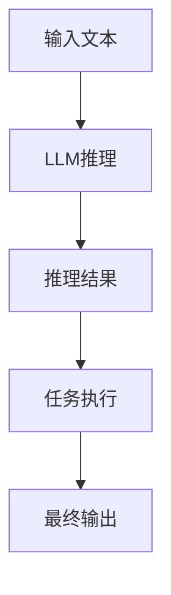
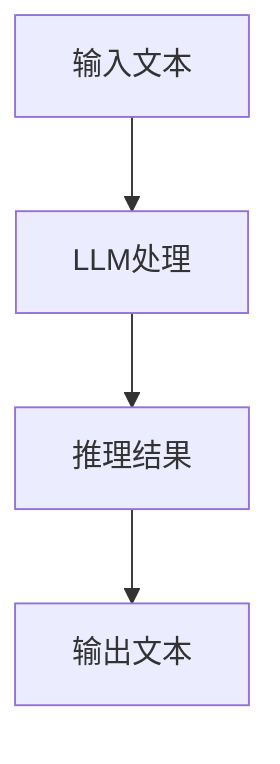
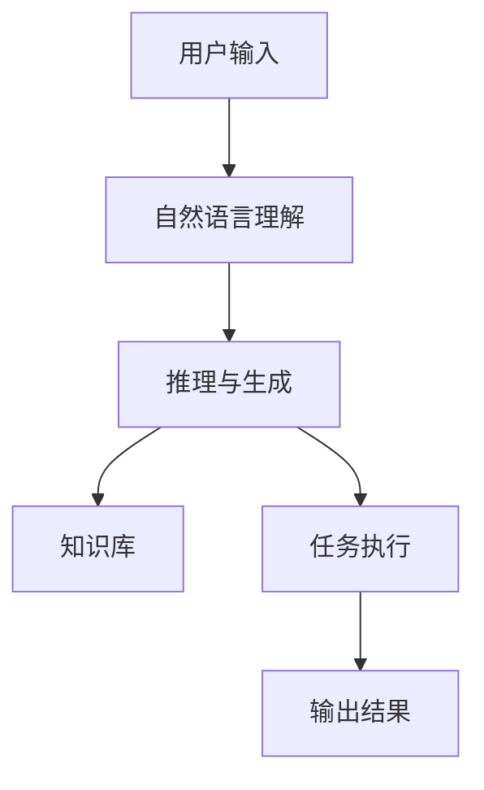
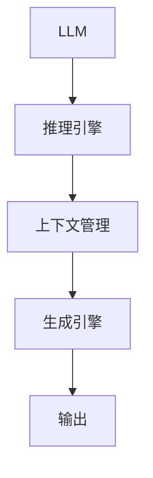
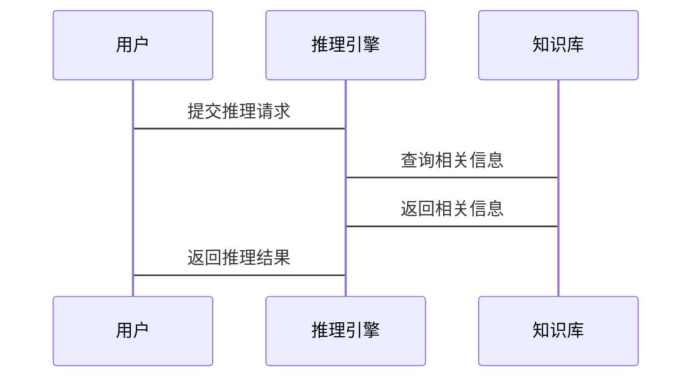

                 


# 构建LLM支持的AI Agent自然语言推理

> 关键词：自然语言推理，LLM，AI Agent，机器学习，人工智能

> 摘要：本文将详细探讨如何构建一个基于大语言模型（LLM）支持的AI Agent，实现自然语言推理的核心技术与应用。我们将从问题背景出发，深入分析自然语言推理的核心算法原理，结合系统架构设计与项目实战，为读者提供一个完整的构建方案。

---

# 第一部分: 构建LLM支持的AI Agent自然语言推理背景介绍

## 第1章: 自然语言推理与AI Agent概述

### 1.1 自然语言推理的背景与问题背景

#### 1.1.1 自然语言推理的定义与核心问题
自然语言推理（Natural Language Inference，NLI）是人工智能领域中的一个核心任务，旨在让计算机能够理解文本的含义，并根据上下文进行合理的推理和生成。NLI的核心问题包括：
- **文本理解**：准确理解输入文本的语义含义。
- **推理与生成**：基于理解生成符合逻辑的文本或做出正确的推理决策。
- **不确定性处理**：处理文本中的模糊性和不确定性。

#### 1.1.2 AI Agent的定义与应用场景
AI Agent（智能体）是指能够感知环境、自主决策并执行任务的智能系统。AI Agent在自然语言推理中的应用场景广泛，例如：
- **对话系统**：通过自然语言对话与用户交互。
- **智能助手**：帮助用户完成复杂任务，如行程安排、信息查询等。
- **智能客服**：自动处理客户咨询和问题。

#### 1.1.3 LLM在自然语言推理中的作用
大语言模型（LLM）如GPT-3、PaLM等，通过海量数据的预训练，具备强大的自然语言理解和生成能力。在AI Agent的自然语言推理中，LLM主要负责：
- **上下文理解**：通过上下文理解对话的含义。
- **推理与生成**：基于LLM的生成能力，进行合理的文本推理和生成。
- **动态调整**：根据实时反馈调整推理策略。

### 1.2 问题描述与解决方法

#### 1.2.1 自然语言推理中的常见问题
- **语义理解不足**：模型无法准确理解输入文本的深层含义。
- **推理能力有限**：模型在复杂场景下的推理能力不足。
- **上下文管理**：如何有效地管理和利用上下文信息。

#### 1.2.2 LLM支持的AI Agent如何解决问题
通过结合LLM的自然语言处理能力和AI Agent的任务执行能力，可以实现：
- **动态上下文理解**：根据对话历史和任务目标动态调整理解策略。
- **多轮推理与生成**：通过多轮对话逐步推理并生成符合逻辑的文本。
- **任务驱动的推理优化**：根据具体任务需求优化推理过程。

#### 1.2.3 边界与外延
- **边界**：专注于LLM支持的AI Agent在自然语言推理中的核心功能，暂不考虑多模态或多任务的复杂场景。
- **外延**：本文提出的方案可以扩展到多模态推理、实时反馈优化等更复杂场景。

### 1.3 核心概念与联系

#### 1.3.1 自然语言推理的核心要素
- **输入文本**：需要推理的原始文本。
- **上下文信息**：对话历史、任务目标等背景信息。
- **推理结果**：基于输入和上下文生成的推理输出。

#### 1.3.2 LLM与AI Agent的关系
- **LLM作为推理引擎**：AI Agent利用LLM进行自然语言理解和生成。
- **AI Agent作为任务执行者**：AI Agent通过LLM的推理结果执行具体任务。
- **交互式推理**：AI Agent与用户之间的交互驱动LLM的推理过程。

#### 1.3.3 ER实体关系图


---

# 第二部分: 核心概念与算法原理

## 第2章: 自然语言推理的核心算法原理

### 2.1 自然语言推理的算法原理

#### 2.1.1 基于LLM的自然语言推理流程


#### 2.1.2 分类、生成与解释的算法选择
- **分类算法**：如BERT-based模型，用于判断文本之间的关系（如矛盾、中立、蕴含）。
- **生成算法**：如GPT-3，用于生成符合逻辑的文本。
- **解释算法**：如LIME，用于解释推理过程。

#### 2.1.3 基于概率的推理模型
$$ P(A|B) = \frac{P(B|A)P(A)}{P(B)} $$

### 2.2 LLM支持的AI Agent推理算法

#### 2.2.1 基于Transformer的LLM推理过程
- **编码器-解码器结构**：编码器将输入文本转换为向量表示，解码器生成输出文本。
- **自注意力机制**：模型能够关注输入文本中的关键部分。

#### 2.2.2 基于图的推理模型
- **知识图谱表示**：将知识以图结构表示，便于推理。
- **图神经网络**：用于在图结构上进行推理。

#### 2.2.3 多模态推理的扩展
- **视觉推理**：结合图像信息进行推理。
- **多模态模型**：如CLIP，结合文本和图像信息。

### 2.3 算法原理的数学模型与公式

#### 2.3.1 概率推理公式
$$ P(A|B) = \frac{P(B|A)P(A)}{P(B)} $$

#### 2.3.2 LLM的损失函数
$$ \text{Loss} = -\sum_{i=1}^{n} \log P(w_i|w_{i-1},...,w_1) $$

---

# 第三部分: 系统分析与架构设计

## 第3章: LLM支持的AI Agent系统架构

### 3.1 系统功能设计

#### 3.1.1 自然语言理解模块
- **文本预处理**：分词、词性标注等。
- **上下文管理**：维护对话历史和任务目标。

#### 3.1.2 推理与生成模块
- **推理引擎**：基于LLM进行推理。
- **生成引擎**：生成符合逻辑的文本。

#### 3.1.3 知识库与上下文管理模块
- **知识库**：存储任务相关知识。
- **上下文管理**：动态更新和管理上下文信息。

### 3.2 系统架构设计

#### 3.2.1 分层架构设计


#### 3.2.2 微服务架构设计


#### 3.2.3 组件间交互关系


### 3.3 系统接口设计

#### 3.3.1 输入接口定义
```python
class Input:
    def __init__(self, text, context):
        self.text = text
        self.context = context
```

#### 3.3.2 输出接口定义
```python
class Output:
    def __init__(self, result, status):
        self.result = result
        self.status = status
```

#### 3.3.3 API交互流程


---

# 第四部分: 项目实战与实现

## 第4章: 项目实战与核心代码实现

### 4.1 环境安装与

---

作者：AI天才研究院/AI Genius Institute & 禅与计算机程序设计艺术 /Zen And The Art of Computer Programming

